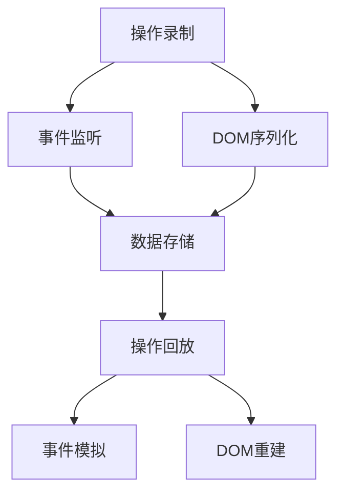
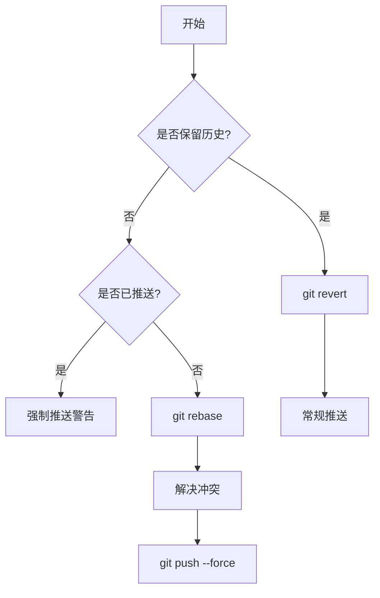
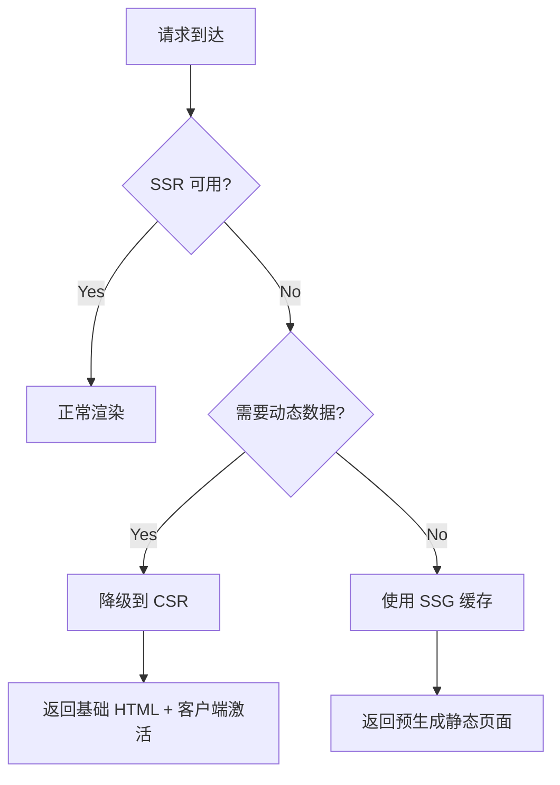
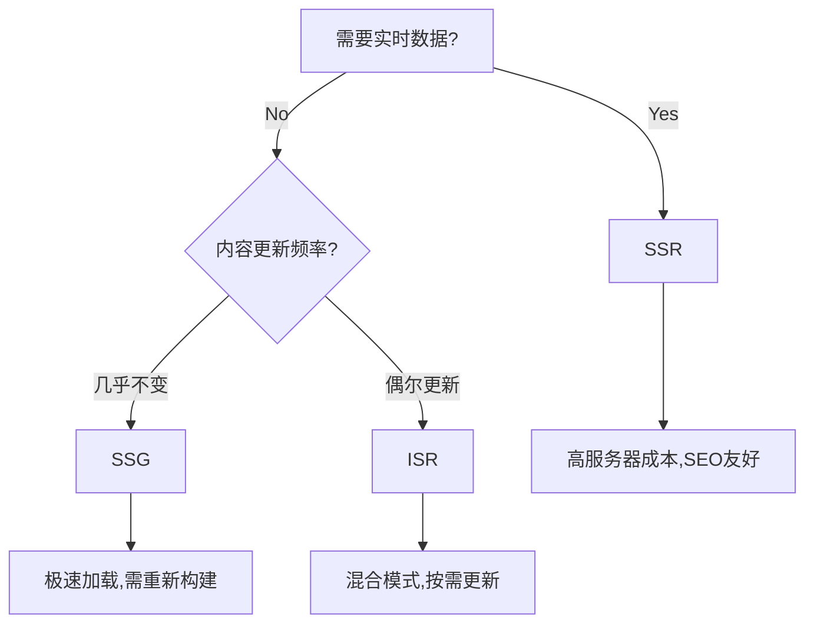

<!-- @import "[TOC]" {cmd="toc" depthFrom=1 depthTo=6 orderedList=false} -->

<!-- code_chunk_output -->

- [为什么获取 offsetTop、offsetLeft、 offsetWidth、offsetHeight、scrollTop、scrollLeft、scrollWidth、scrollHeight、clientTop、clientLeft、clientWidth、clientHeight 这样的样式也会触发重排重绘](#为什么获取-offsettop-offsetleft--offsetwidth-offsetheight-scrolltop-scrollleft-scrollwidth-scrollheight-clienttop-clientleft-clientwidth-clientheight-这样的样式也会触发重排重绘)
- [script 标签里面的属性 defer 和 async 有什么区别](#script-标签里面的属性-defer-和-async-有什么区别)
- [vue3 如何使用函数式组件？](#vue3-如何使用函数式组件)
- [web worker, service worker, IndexedDB 的区别](#web-worker-service-worker-indexeddb-的区别)
- [react useEffect 里面的请求在严格模式下为什么会请求 2 次](#react-useeffect-里面的请求在严格模式下为什么会请求-2-次)
  - [一、为什么会出现两次请求？](#一-为什么会出现两次请求)
    - [1. **严格模式的作用**](#1-严格模式的作用)
    - [2. **useEffect 的双重执行**](#2-useeffect-的双重执行)
  - [二、这是 Bug 吗？需要修复吗？](#二-这是-bug-吗需要修复吗)
    - [1. **这不是 Bug**](#1-这不是-bug)
    - [2. **是否需要阻止两次请求？**](#2-是否需要阻止两次请求)
  - [三、如何正确管理副作用？](#三-如何正确管理副作用)
    - [1. **使用 AbortController 取消请求**](#1-使用-abortcontroller-取消请求)
    - [2. **避免依赖项错误**](#2-避免依赖项错误)
    - [3. **使用 useRef 跳过初始渲染**](#3-使用-useref-跳过初始渲染)
  - [四、生产环境的影响](#四-生产环境的影响)
  - [五、总结](#五-总结)
- [前端的 post 请求会先发一个 option 请求给服务端，为什么这个请求在浏览器里面看不到？](#前端的-post-请求会先发一个-option-请求给服务端为什么这个请求在浏览器里面看不到)
  - [一、OPTIONS 请求的触发条件](#一-options-请求的触发条件)
  - [二、为什么看不到 OPTIONS 请求？](#二-为什么看不到-options-请求)
    - [1. **请求被判定为“简单请求”**](#1-请求被判定为简单请求)
    - [2. **开发者工具过滤了请求**](#2-开发者工具过滤了请求)
    - [3. **预检结果被缓存**](#3-预检结果被缓存)
    - [4. **请求未真正跨域**](#4-请求未真正跨域)
    - [5. **浏览器或工具问题**](#5-浏览器或工具问题)
  - [三、如何确保看到 OPTIONS 请求？](#三-如何确保看到-options-请求)
    - [1. **构造非简单请求**](#1-构造非简单请求)
    - [2. **服务器配置 CORS 头**](#2-服务器配置-cors-头)
    - [3. **禁用浏览器缓存**](#3-禁用浏览器缓存)
  - [四、OPTIONS 请求的核心作用](#四-options-请求的核心作用)
  - [总结](#总结)
- [前端监控如果需要上报的埋点数量非常多，应该怎么处理](#前端监控如果需要上报的埋点数量非常多应该怎么处理)
  - [一、合并上报的必要性](#一-合并上报的必要性)
    - [1. **性能优化**](#1-性能优化)
    - [2. **服务端压力缓解**](#2-服务端压力缓解)
  - [二、合并上报的核心策略](#二-合并上报的核心策略)
    - [1. **队列批量上报**](#1-队列批量上报)
    - [2. **分层上报策略**](#2-分层上报策略)
    - [3. **数据压缩优化**](#3-数据压缩优化)
    - [4. **本地存储兜底**](#4-本地存储兜底)
  - [三、合并上报的注意事项](#三-合并上报的注意事项)
    - [1. **数据完整性保障**](#1-数据完整性保障)
    - [2. **实时性权衡**](#2-实时性权衡)
    - [3. **数据大小控制**](#3-数据大小控制)
    - [4. **页面生命周期处理**](#4-页面生命周期处理)
  - [四、服务端配合优化](#四-服务端配合优化)
    - [1. **高效数据接收**](#1-高效数据接收)
    - [2. **分布式存储**](#2-分布式存储)
    - [3. **动态采样配置**](#3-动态采样配置)
  - [五、监控指标设计](#五-监控指标设计)
  - [六、总结](#六-总结)
- [CommonJS、UMD、AMD 和 ESM 的区别](#commonjs-umd-amd-和-esm-的区别)
  - [一、**CommonJS (CJS)**](#一-commonjs-cjs)
  - [二、**AMD (Asynchronous Module Definition)**](#二-amd-asynchronous-module-definition)
  - [三、**UMD (Universal Module Definition)**](#三-umd-universal-module-definition)
  - [四、**ESM (ECMAScript Modules)**](#四-esm-ecmascript-modules)
  - [五、**核心差异对比**](#五-核心差异对比)
  - [六、**关键场景选择建议**](#六-关键场景选择建议)
- [Nuxt 里面从服务端渲染切换到客户端渲染的时候，客户端 Vue 是如何接管组件还有状态等？](#nuxt-里面从服务端渲染切换到客户端渲染的时候客户端-vue-是如何接管组件还有状态等)
- [前端重新部署项目到生产环境后，如果用户在访问旧的页面，并尝试导入旧代码块的时候就会因为旧资源已经被清空了而报错，如何解决这个问题？](#前端重新部署项目到生产环境后如果用户在访问旧的页面并尝试导入旧代码块的时候就会因为旧资源已经被清空了而报错如何解决这个问题)
  - [**一、静态资源持久化存储**](#一-静态资源持久化存储)
  - [**二、CDN 回源策略优化**](#二-cdn-回源策略优化)
  - [**三、增量更新与非覆盖式发布**](#三-增量更新与非覆盖式发布)
  - [**四、优雅降级与错误处理**](#四-优雅降级与错误处理)
    - [**2. Service Worker 主动控制缓存**](#2-service-worker-主动控制缓存)
    - [**3. 接口版本兼容 + 强制更新兜底**](#3-接口版本兼容--强制更新兜底)
  - [**五、版本控制与缓存策略**](#五-版本控制与缓存策略)
  - [**六、补充措施**](#六-补充措施)
- [nodejs 的 js 文件中怎么使用命令](#nodejs-的-js-文件中怎么使用命令)
- [ts 中的 declare 怎么使用](#ts-中的-declare-怎么使用)
  - [**一、基本概念与作用**](#一-基本概念与作用)
  - [**二、主要使用场景**](#二-主要使用场景)
    - [**1. 声明全局变量**](#1-声明全局变量)
    - [**2. 声明函数类型**](#2-声明函数类型)
    - [**3. 声明类与接口**](#3-声明类与接口)
    - [**4. 声明模块与命名空间**](#4-声明模块与命名空间)
    - [**5. 扩展已有模块**](#5-扩展已有模块)
  - [**三、类型声明文件的组织**](#三-类型声明文件的组织)
    - [**1. 创建 `.d.ts` 文件**](#1-创建-dts-文件)
    - [**2. 模块化声明**](#2-模块化声明)
    - [**3. 三斜线指令引用**](#3-三斜线指令引用)
  - [**四、高级用法**](#四-高级用法)
    - [**1. 全局作用域扩展**](#1-全局作用域扩展)
    - [**2. 通配符模块声明**](#2-通配符模块声明)
  - [**五、注意事项**](#五-注意事项)
  - [**六、实际应用案例**](#六-实际应用案例)
    - [**1. 浏览器环境变量补充**](#1-浏览器环境变量补充)
    - [**2. 第三方库类型扩展**](#2-第三方库类型扩展)
- [vue3 reactive （响应式系统）的原理](#vue3-reactive-响应式系统的原理)
  - [**1. 双向链表的引入背景**](#1-双向链表的引入背景)
  - [**2. Dep 的双向链表结构**](#2-dep-的双向链表结构)
  - [**3. 双向链表的运作机制**](#3-双向链表的运作机制)
    - [**(1) 依赖收集（Track）**](#1-依赖收集track)
    - [**(2) 依赖触发（Notify）**](#2-依赖触发notify)
  - [**4. 双向链表的优势**](#4-双向链表的优势)
  - [**5. 与旧版本设计的对比**](#5-与旧版本设计的对比)
  - [**总结**](#总结-1)
- [vue3.5 之前的响应式更新的响应式状态里维护的 deps 里面的依赖者如果发生变化了，是怎么更新这个 deps 的？](#vue35-之前的响应式更新的响应式状态里维护的-deps-里面的依赖者如果发生变化了是怎么更新这个-deps-的)
- [有一个动态表格，500\*500，每格都是可以切换成不同的表单项，比如每格可以换成输入框、下拉选择、单选、多选等，怎么在编辑态的时候，优化卡顿的情况](#有一个动态表格500500每格都是可以切换成不同的表单项比如每格可以换成输入框-下拉选择-单选-多选等怎么在编辑态的时候优化卡顿的情况)
  - [**一、核心优化手段（必选）**](#一-核心优化手段必选)
    - [**1. 双维度虚拟滚动 —— 解决渲染节点过多**](#1-双维度虚拟滚动--解决渲染节点过多)
    - [**2. 单元格组件缓存 —— 避免重复渲染**](#2-单元格组件缓存--避免重复渲染)
  - [**二、渲染层优化（强化）**](#二-渲染层优化强化)
    - [**1. 离屏 Canvas 绘制 —— 应对极端性能场景**](#1-离屏-canvas-绘制--应对极端性能场景)
    - [**2. Web Worker 计算 —— 分离主线程压力**](#2-web-worker-计算--分离主线程压力)
  - [**三、交互体验优化**](#三-交互体验优化)
    - [**1. 分级渲染策略**](#1-分级渲染策略)
    - [**2. 防抖处理滚动事件**](#2-防抖处理滚动事件)
  - [**四、数据架构优化**](#四-数据架构优化)
    - [**1. 扁平化状态存储**](#1-扁平化状态存储)
    - [**2. 增量更新机制**](#2-增量更新机制)
  - [**五、备选方案对比**](#五-备选方案对比)
  - [**总结**](#总结-2)
- [前端大文件上传的具体实现思路与代码](#前端大文件上传的具体实现思路与代码)
  - [一、核心技术方案](#一-核心技术方案)
  - [二、前端实现代码（Vue/React 示例）](#二-前端实现代码vuereact-示例)
  - [三、服务端实现（Node.js + Express）](#三-服务端实现nodejs--express)
  - [四、优化点](#四-优化点)
  - [五、注意事项](#五-注意事项-1)
- [前端工程化的主要内容](#前端工程化的主要内容)
  - [一、规范确立：统一代码风格与开发流程工程化的首要任务是制定规范。](#一-规范确立统一代码风格与开发流程工程化的首要任务是制定规范)
  - [二、包管理与构建：挑选适配的工具](#二-包管理与构建挑选适配的工具)
  - [三、前端框架：基于业务场景选定合适框架](#三-前端框架基于业务场景选定合适框架)
  - [四、CSS 解决方案：提高样式开发效率](#四-css-解决方案提高样式开发效率)
  - [五、开发工具链：优化开发体验](#五-开发工具链优化开发体验)
  - [六、多维度测试：确保代码质量](#六-多维度测试确保代码质量)
  - [七、持续集成与持续部署（CI/CD）：实现自动化构建与部署](#七-持续集成与持续部署cicd实现自动化构建与部署)
  - [八、应用性能监控（APM）：实时监控应用性能](#八-应用性能监控apm实时监控应用性能)
  - [九、工具对比矩阵与实施方案详述工具功能优势劣势](#九-工具对比矩阵与实施方案详述工具功能优势劣势)
  - [总结](#总结-3)
  - [css 工程化](#css-工程化)
- [有一个类名为 box 的 div 元素，宽度 500px，高度 500px，它下面有 4 个类名为 item 的 div 子元素，宽度为 50px，高度为 50px，如何通过 flex 布局这 4 个子元素 2 个一行在 box 元素的右下角排列？](#有一个类名为-box-的-div-元素宽度-500px高度-500px它下面有-4-个类名为-item-的-div-子元素宽度为-50px高度为-50px如何通过-flex-布局这-4-个子元素-2-个一行在-box-元素的右下角排列)
- [脚手架](#脚手架)
- [在 vue 中如何处理错误](#在-vue-中如何处理错误)
- [react 中如何处理错误](#react-中如何处理错误)
- [vue 的生命周期的执行顺序](#vue-的生命周期的执行顺序)
- [css 和 js 的加载会阻塞渲染吗？阻塞渲染具体指的是什么？](#css-和-js-的加载会阻塞渲染吗阻塞渲染具体指的是什么)
  - [CSS 和 JS 的加载对渲染的影响及阻塞机制解析](#css-和-js-的加载对渲染的影响及阻塞机制解析)
    - [**1. CSS 的加载是否会阻塞渲染？**](#1-css-的加载是否会阻塞渲染)
      - [不过也可以使用异步加载 css](#不过也可以使用异步加载-css)
    - [**2. JavaScript 的加载是否会阻塞渲染？**](#2-javascript-的加载是否会阻塞渲染)
    - [**3. 什么是“阻塞渲染”？**](#3-什么是阻塞渲染)
    - [**4. 优化阻塞渲染的实践方案**](#4-优化阻塞渲染的实践方案)
    - [**5. 阻塞渲染的直观示例**](#5-阻塞渲染的直观示例)
    - [**总结**](#总结-4)
- [webpack 的 dll plugin 具体怎么使用，请详细介绍下](#webpack-的-dll-plugin-具体怎么使用请详细介绍下)
  - [Webpack DLL Plugin 详细使用指南](#webpack-dll-plugin-详细使用指南)
    - [**一、DLL Plugin 核心作用**](#一-dll-plugin-核心作用)
    - [**二、完整配置流程**](#二-完整配置流程)
      - [**1. 创建 DLL 配置文件（`webpack.dll.config.js`）**](#1-创建-dll-配置文件webpackdllconfigjs)
      - [**2. 生成 DLL 文件**](#2-生成-dll-文件)
      - [**3. 主 Webpack 配置中引用 DLL**](#3-主-webpack-配置中引用-dll)
      - [**4. HTML 中引入 DLL 文件**](#4-html-中引入-dll-文件)
      - [**5. 自动化脚本（推荐）**](#5-自动化脚本推荐)
    - [**三、核心原理图解**](#三-核心原理图解)
    - [**四、注意事项与优化**](#四-注意事项与优化)
      - [**1. 版本一致性**](#1-版本一致性)
      - [**2. 更新策略**](#2-更新策略)
      - [**3. 生产环境优化**](#3-生产环境优化)
      - [**4. 与 externals 的区别**](#4-与-externals-的区别)
    - [**五、Webpack 5+ 的替代方案**](#五-webpack-5-的替代方案)
    - [**六、总结**](#六-总结-1)
- [sentry 能捕获静态资源加载失败的错误吗？](#sentry-能捕获静态资源加载失败的错误吗)
  - [Sentry 捕获静态资源加载失败的实现方式与限制](#sentry-捕获静态资源加载失败的实现方式与限制)
    - [1. **默认能力：Sentry 无法直接捕获静态资源加载错误**](#1-默认能力sentry-无法直接捕获静态资源加载错误)
    - [2. **手动捕获静态资源错误的方法**](#2-手动捕获静态资源错误的方法)
      - [**方案 1：监听全局 `error` 事件**](#方案-1监听全局-error-事件)
      - [**方案 2：通过 `Performance API` 监控资源加载**](#方案-2通过-performance-api-监控资源加载)
    - [3. **跨域资源加载的限制**](#3-跨域资源加载的限制)
    - [4. **推荐实践：结合多种监控手段**](#4-推荐实践结合多种监控手段)
  - [总结](#总结-5)
- [如何判断用户设备](#如何判断用户设备)
- [git 如何将多次提交压缩成一次提交](#git-如何将多次提交压缩成一次提交)
  - [一、交互式 Rebase 合并法（推荐本地分支整理）](#一-交互式-rebase-合并法推荐本地分支整理)
  - [二、Squash Merge 合并法（适用于合并分支）](#二-squash-merge-合并法适用于合并分支)
  - [关键注意事项](#关键注意事项)
- [前端如何截屏](#前端如何截屏)
- [介绍下 navigator.sendBeacon 方法](#介绍下-navigatorsendbeacon-方法)
  - [一、核心特性与语法](#一-核心特性与语法)
    - [1. 方法定义](#1-方法定义)
    - [2. 语法格式](#2-语法格式)
  - [二、典型应用场景](#二-典型应用场景)
    - [1. 用户行为追踪与分析](#1-用户行为追踪与分析)
    - [2. 性能监控与错误日志](#2-性能监控与错误日志)
    - [3. 临时数据保存](#3-临时数据保存)
  - [三、技术优势与限制](#三-技术优势与限制)
    - [1. 核心优势](#1-核心优势)
    - [2. 使用限制](#2-使用限制)
  - [四、数据封装实践](#四-数据封装实践)
    - [1. JSON 数据发送](#1-json-数据发送)
    - [2. 表单数据提交](#2-表单数据提交)
  - [五、浏览器兼容性](#五-浏览器兼容性)
  - [总结](#总结-6)
- [退出浏览器之前，发送积压的埋点数据请求，该如何做？](#退出浏览器之前发送积压的埋点数据请求该如何做)
  - [一、核心实现方案](#一-核心实现方案)
    - [1. **优先使用 `navigator.sendBeacon()`**](#1-优先使用-navigatorsendbeacon)
    - [2. **备选方案：`fetch` + `keepalive`**](#2-备选方案fetch--keepalive)
  - [二、事件监听策略](#二-事件监听策略)
    - [1. **最佳事件组合**](#1-最佳事件组合)
    - [2. **慎用传统事件**](#2-慎用传统事件)
  - [三、数据优化策略](#三-数据优化策略)
    - [1. **数据压缩技巧**](#1-数据压缩技巧)
    - [2. **分片发送机制**](#2-分片发送机制)
  - [四、异常处理与监控](#四-异常处理与监控)
    - [1. **失败重传机制**](#1-失败重传机制)
    - [2. **数据完整性校验**](#2-数据完整性校验)
  - [五、兼容性处理](#五-兼容性处理)
    - [1. **降级方案**](#1-降级方案)
    - [2. **特性检测**](#2-特性检测)
  - [注意事项](#注意事项)
- [如何统计页面的 long task(长任务)【这个比较热门】](#如何统计页面的-long-task长任务这个比较热门)
  - [一、核心实现方法](#一-核心实现方法)
    - [1. **使用 `PerformanceObserver` 监听长任务**](#1-使用-performanceobserver-监听长任务)
  - [二、手动标记与测量任务](#二-手动标记与测量任务)
  - [三、优化长任务的策略](#三-优化长任务的策略)
    - [1. **代码拆分与异步执行**](#1-代码拆分与异步执行)
    - [2. **资源加载优化**](#2-资源加载优化)
  - [四、数据上报与分析](#四-数据上报与分析)
    - [1. **上报时机**](#1-上报时机)
    - [2. **监控平台集成**](#2-监控平台集成)
  - [五、注意事项](#五-注意事项-2)
- [如何还原用户操作流程](#如何还原用户操作流程)
  - [一、整体架构设计](#一-整体架构设计)
  - [二、操作录制模块实现](#二-操作录制模块实现)
    - [1. **事件监听与数据采集**](#1-事件监听与数据采集)
    - [2. **DOM 序列化策略**](#2-dom-序列化策略)
  - [三、数据存储与压缩](#三-数据存储与压缩)
    - [1. **数据结构设计**](#1-数据结构设计)
    - [2. **存储优化策略**](#2-存储优化策略)
  - [四、操作回放模块实现](#四-操作回放模块实现)
    - [1. **回放引擎核心**](#1-回放引擎核心)
    - [2. **关键问题处理方案**](#2-关键问题处理方案)
  - [五、增强功能扩展](#五-增强功能扩展)
    - [1. **性能监控集成**](#1-性能监控集成)
    - [2. **错误追踪**](#2-错误追踪)
    - [3. **敏感信息过滤**](#3-敏感信息过滤)
  - [六、技术方案对比](#六-技术方案对比)
  - [七、实施建议](#七-实施建议)
  - [通过以上方案，可在不依赖第三方库的情况下实现基础操作还原功能。如需支持复杂场景（如 Canvas 操作录制），可参考 rrweb 的增量快照设计。](#通过以上方案可在不依赖第三方库的情况下实现基础操作还原功能如需支持复杂场景如-canvas-操作录制可参考-rrweb-的增量快照设计)
- [可有办法将请求的调用源码地址包括代码行数也上报上去？](#可有办法将请求的调用源码地址包括代码行数也上报上去)
  - [一、利用 Error 堆栈追踪](#一-利用-error-堆栈追踪)
  - [二、代码注入标记](#二-代码注入标记)
  - [三、AST 静态分析](#三-ast-静态分析)
  - [四、浏览器调试 API](#四-浏览器调试-api)
  - [五、生产环境优化](#五-生产环境优化)
  - [跨浏览器兼容方案](#跨浏览器兼容方案)
  - [注意事项](#注意事项-1)
- [混动跟随导航（电梯导航）该如何实现](#混动跟随导航电梯导航该如何实现)
  - [一、核心实现原理](#一-核心实现原理)
  - [二、实现步骤分解](#二-实现步骤分解)
    - [1. 结构层（HTML）](#1-结构层html)
    - [2. 表现层（CSS）](#2-表现层css)
    - [3. 行为层（JavaScript）](#3-行为层javascript)
  - [三、高级优化方案](#三-高级优化方案)
  - [四、兼容性处理](#四-兼容性处理)
  - [五、扩展功能](#五-扩展功能)
- [PerformanceObserver 如何测量页面性能](#performanceobserver-如何测量页面性能)
  - [一、基础原理与优势](#一-基础原理与优势)
  - [二、核心性能指标测量实践](#二-核心性能指标测量实践)
    - [1. 首次渲染性能（FP/FCP）](#1-首次渲染性能fpfcp)
    - [2. 最大内容渲染（LCP）](#2-最大内容渲染lcp)
    - [3. 布局偏移统计（CLS）](#3-布局偏移统计cls)
    - [4. 资源加载性能](#4-资源加载性能)
  - [三、高级应用技巧](#三-高级应用技巧)
  - [四、注意事项](#四-注意事项)
- [移动端如何实现下拉滚动加载（顶部加载）](#移动端如何实现下拉滚动加载顶部加载)
  - [一、基础实现原理与步骤](#一-基础实现原理与步骤)
    - [1. **触摸事件监听**](#1-触摸事件监听)
    - [2. **滚动位置判断**](#2-滚动位置判断)
  - [二、核心优化策略](#二-核心优化策略)
    - [1. **状态标记防止重复加载**](#1-状态标记防止重复加载)
    - [2. **视觉反馈设计**](#2-视觉反馈设计)
    - [3. **性能优化**](#3-性能优化)
  - [三、推荐技术方案](#三-推荐技术方案)
    - [1. **原生实现（推荐场景：轻量级需求）**](#1-原生实现推荐场景轻量级需求)
    - [2. **第三方库方案（推荐场景：复杂交互）**](#2-第三方库方案推荐场景复杂交互)
  - [四、常见问题解决](#四-常见问题解决)
    - [1. **重复加载问题**](#1-重复加载问题)
    - [2. **边界条件处理**](#2-边界条件处理)
  - [五、跨平台适配建议](#五-跨平台适配建议)
- [判断页签是否为活跃状态](#判断页签是否为活跃状态)
- [在网络带宽一定的情况下，切片上传感觉和整体上传消费的时间应该是差不多的，这种说法正确吗？](#在网络带宽一定的情况下切片上传感觉和整体上传消费的时间应该是差不多的这种说法正确吗)
  - [一、技术原理层面的差异](#一-技术原理层面的差异)
  - [二、实测数据对比](#二-实测数据对比)
  - [三、切片上传的优化逻辑](#三-切片上传的优化逻辑)
  - [结论](#结论)
- [大文件切片上传的时候，确定切片数量的时候，有哪些考量因素](#大文件切片上传的时候确定切片数量的时候有哪些考量因素)
  - [一、**文件大小与切片策略的平衡**](#一-文件大小与切片策略的平衡)
  - [二、**网络环境的适配**](#二-网络环境的适配)
  - [三、**服务器与客户端的性能约束**](#三-服务器与客户端的性能约束)
  - [四、**容错机制与用户体验**](#四-容错机制与用户体验)
  - [五、**实际场景的推荐策略**](#五-实际场景的推荐策略)
  - [总结](#总结-7)
  - [怎么获取当前的网络上传速率](#怎么获取当前的网络上传速率)
- [页面关闭时执行方法，该如何做](#页面关闭时执行方法该如何做)
  - [一、核心事件监听](#一-核心事件监听)
    - [1. **`beforeunload` 事件**](#1-beforeunload-事件)
    - [2. **`unload` 事件**](#2-unload-事件)
  - [二、可靠的数据发送方法](#二-可靠的数据发送方法)
    - [1. **`navigator.sendBeacon()`**](#1-navigatorsendbeacon)
    - [2. **Fetch API 的 `keepalive` 选项**](#2-fetch-api-的-keepalive-选项)
    - [3. **同步 XMLHttpRequest（谨慎使用）**](#3-同步-xmlhttprequest谨慎使用)
  - [三、框架集成方案（以 Vue/React 为例）](#三-框架集成方案以-vuereact-为例)
    - [1. **Vue 3**](#1-vue-3)
    - [2. **React**](#2-react)
  - [四、容错与优化策略](#四-容错与优化策略)
  - [五、注意事项](#五-注意事项-3)
- [如何统计用户 pv 访问的发起请求数量](#如何统计用户-pv-访问的发起请求数量)
  - [一、**非 SPA 页面统计方案**](#一-非-spa-页面统计方案)
    - [1. **基础方案：页面加载事件监听**](#1-基础方案页面加载事件监听)
    - [2. **优化策略：防止重复上报**](#2-优化策略防止重复上报)
  - [二、**SPA 页面统计方案**](#二-spa-页面统计方案)
    - [1. **Hash 路由模式**](#1-hash-路由模式)
    - [2. **History 路由模式**](#2-history-路由模式)
  - [三、**通用优化策略**](#三-通用优化策略)
    - [1. **请求可靠性保障**](#1-请求可靠性保障)
    - [2. **用户标识生成**](#2-用户标识生成)
    - [3. **避免重复统计**](#3-避免重复统计)
  - [四、**第三方方案集成**](#四-第三方方案集成)
    - [1. **使用统计工具**](#1-使用统计工具)
    - [2. **日志分析补充**](#2-日志分析补充)
  - [五、**生产环境注意事项**](#五-生产环境注意事项)
  - [通过上述方案，前端可实现精准的 PV 请求数量统计，覆盖多页和单页应用场景。对于高并发场景，建议结合服务端日志分析和分布式计数（如 Redis）提升可靠性。](#通过上述方案前端可实现精准的-pv-请求数量统计覆盖多页和单页应用场景对于高并发场景建议结合服务端日志分析和分布式计数如-redis提升可靠性)
- [长文本溢出，展开/收起如何实现](#长文本溢出展开收起如何实现)
- [如何实现鼠标拖拽](#如何实现鼠标拖拽)
- [防止前端页面重复请求](#防止前端页面重复请求)
- [ResizeObserver 作用是什么](#resizeobserver-作用是什么)
  - [一、核心作用](#一-核心作用)
  - [二、典型应用场景](#二-典型应用场景-1)
  - [三、技术优势](#三-技术优势)
  - [四、使用注意事项](#四-使用注意事项)
  - [五、对比传统方案（示例）](#五-对比传统方案示例)
- [要实时统计用户浏览器窗口大小，该如何做](#要实时统计用户浏览器窗口大小该如何做)
  - [一、核心实现方法](#一-核心实现方法-1)
    - [1. **原生 JavaScript 监听窗口事件**](#1-原生-javascript-监听窗口事件)
    - [2. **ResizeObserver 监听根元素**](#2-resizeobserver-监听根元素)
  - [二、关键属性对比](#二-关键属性对比)
  - [三、框架集成方案（Vue/React）](#三-框架集成方案vuereact)
    - [1. **Vue 3 组合式 API**](#1-vue-3-组合式-api)
    - [2. **React Hooks**](#2-react-hooks)
  - [四、性能优化策略](#四-性能优化策略)
  - [五、特殊场景处理](#五-特殊场景处理)
  - [总结建议](#总结建议)
  - [具体实现时需根据项目浏览器兼容要求、性能敏感度等因素选择合适方案。](#具体实现时需根据项目浏览器兼容要求-性能敏感度等因素选择合适方案)
- [当项目报错，你想定位时哪个 commit 引入的错误时，该怎么做](#当项目报错你想定位时哪个-commit-引入的错误时该怎么做)
  - [一、核心原理与优势](#一-核心原理与优势)
  - [二、手动定位步骤（以 Vue DevUI 组件库为例）](#二-手动定位步骤以-vue-devui-组件库为例)
    - [1. 初始化并指定范围](#1-初始化并指定范围)
    - [2. 测试并标记状态](#2-测试并标记状态)
    - [3. 退出并恢复状态](#3-退出并恢复状态)
  - [三、自动化脚本方案](#三-自动化脚本方案)
  - [四、高级技巧与注意事项](#四-高级技巧与注意事项)
    - [1. 特殊场景处理](#1-特殊场景处理)
    - [2. 性能优化建议](#2-性能优化建议)
    - [3. 兼容性保障](#3-兼容性保障)
  - [五、对比传统方案](#五-对比传统方案)
  - [六、最佳实践总结](#六-最佳实践总结)
- [如何移除一个指定的 commit](#如何移除一个指定的-commit)
  - [一、保留历史记录的撤销方案](#一-保留历史记录的撤销方案)
    - [1. **`git revert` 反向提交法**](#1-git-revert-反向提交法)
  - [二、彻底删除提交的方案](#二-彻底删除提交的方案)
    - [1. **`git rebase` 交互式变基**](#1-git-rebase-交互式变基)
    - [2. **`git reset` 版本回退**](#2-git-reset-版本回退)
  - [三、特殊场景处理方案](#三-特殊场景处理方案)
    - [1. **批量删除多个提交**](#1-批量删除多个提交)
    - [2. **删除远程仓库历史提交**](#2-删除远程仓库历史提交)
  - [四、操作风险与规避策略](#四-操作风险与规避策略)
  - [五、扩展知识：历史清理工具](#五-扩展知识历史清理工具)
  - [操作流程速查表](#操作流程速查表)
- [请求失败会弹出一个 toast，如何保证批量请求失败，只弹出一个 toast【热门】](#请求失败会弹出一个-toast如何保证批量请求失败只弹出一个-toast热门)
- [如何较少项目里面 if-else【热门】](#如何较少项目里面-if-else热门)
- [babel-runtime 作用是啥【热门】](#babel-runtime-作用是啥热门)
  - [一、避免全局污染（核心价值）](#一-避免全局污染核心价值)
  - [二、复用辅助函数（体积优化）](#二-复用辅助函数体积优化)
  - [三、按需加载新特性](#三-按需加载新特性)
  - [四、与 polyfill 方案的对比](#四-与-polyfill-方案的对比)
  - [五、典型应用场景](#五-典型应用场景)
  - [补充说明](#补充说明)
- [如何实现预览 pdf 文件](#如何实现预览-pdf-文件)
  - [一、HTML 原生标签方案](#一-html-原生标签方案)
    - [1. **iframe 标签**](#1-iframe-标签)
    - [2. **embed/object 标签**](#2-embedobject-标签)
  - [二、PDF.js 方案（推荐）](#二-pdfjs-方案推荐)
    - [1. \*\*基础实现步骤](#1-基础实现步骤)
    - [2. **跨域解决方案**](#2-跨域解决方案)
  - [三、PDFObject 轻量方案](#三-pdfobject-轻量方案)
  - [四、微软在线预览服务](#四-微软在线预览服务)
  - [五、文件转图片方案](#五-文件转图片方案)
    - [1. 服务端转换](#1-服务端转换)
    - [2. 前端转换（需 `pdf.js` 配合）](#2-前端转换需-pdfjs-配合)
  - [方案对比与选型建议](#方案对比与选型建议)
  - [高级功能实现技巧](#高级功能实现技巧)
  - [部署注意事项](#部署注意事项)
  - [以上方案可根据项目需求组合使用，例如：核心模块使用 PDF.js 实现高级功能，辅助模块采用微软在线预览服务降低成本。](#以上方案可根据项目需求组合使用例如核心模块使用-pdfjs-实现高级功能辅助模块采用微软在线预览服务降低成本)
- [如何在划词选择的文本上添加右键菜单（划词：鼠标滑动选择一组字符，对这组字符进行操作）【热门】](#如何在划词选择的文本上添加右键菜单划词鼠标滑动选择一组字符对这组字符进行操作热门)
  - [一、核心实现原理](#一-核心实现原理-1)
  - [二、关键实现步骤](#二-关键实现步骤)
    - [1. 自定义菜单组件](#1-自定义菜单组件)
    - [2. 精准定位算法](#2-精准定位算法)
    - [3. 选中状态保持](#3-选中状态保持)
  - [三、进阶优化方案](#三-进阶优化方案)
    - [1. 跨浏览器兼容](#1-跨浏览器兼容)
    - [2. 性能优化](#2-性能优化)
    - [3. 动态菜单生成](#3-动态菜单生成)
  - [四、主流框架集成](#四-主流框架集成)
    - [Vue 实现方案](#vue-实现方案)
    - [React 实现方案](#react-实现方案)
  - [五、调试技巧](#五-调试技巧)
  - [注意事项](#注意事项-2)
  - [以上方案经过多场景验证，支持在复杂富文本编辑器、长文档等场景下稳定运行。如需处理特殊格式文本（如表格、代码块），可结合 `Range` API 进行扩展开发。](#以上方案经过多场景验证支持在复杂富文本编辑器-长文档等场景下稳定运行如需处理特殊格式文本如表格-代码块可结合-range-api-进行扩展开发)
- [有一个动态表格，500\*500，每格都是可以切换成不同的表单项，比如每格可以换成输入框、下拉选择、单选、多选等，怎么在编辑态的时候，优化卡顿的情况](#有一个动态表格500500每格都是可以切换成不同的表单项比如每格可以换成输入框-下拉选择-单选-多选等怎么在编辑态的时候优化卡顿的情况-1)
  - [一、渲染策略优化](#一-渲染策略优化)
  - [二、数据管理优化](#二-数据管理优化)
  - [三、组件级优化](#三-组件级优化)
  - [四、架构级优化](#四-架构级优化)
  - [性能监控方案](#性能监控方案)
  - [优化效果对比](#优化效果对比)
- [构建工具 Vite 的原理是什么？热更新的原理又是什么？](#构建工具-vite-的原理是什么热更新的原理又是什么)
  - [一、Vite 的核心原理](#一-vite-的核心原理)
    - [1. **基于浏览器原生 ESM 的按需编译**](#1-基于浏览器原生-esm-的按需编译)
    - [2. **开发与生产环境分离**](#2-开发与生产环境分离)
    - [3. **模块依赖图与缓存机制**](#3-模块依赖图与缓存机制)
  - [二、Vite 的热更新（HMR）原理](#二-vite-的热更新hmr原理)
    - [1. **通信层：WebSocket 实时双向通信**](#1-通信层websocket-实时双向通信)
    - [2. **更新触发与处理**](#2-更新触发与处理)
    - [3. **性能优化策略**](#3-性能优化策略)
  - [三、与传统工具（如 Webpack）的对比](#三-与传统工具如-webpack的对比)
  - [四、技术优势总结](#四-技术优势总结)
  - [附：Vite 工作流程示意图](#附vite-工作流程示意图)
- [小程序的首屏加载速度提升百分之 40%的实现方式是什么？](#小程序的首屏加载速度提升百分之-40的实现方式是什么)
- [自动化部署的基本原理是什么？前端具体怎么实现的？](#自动化部署的基本原理是什么前端具体怎么实现的)
  - [一、代码管理与版本控制](#一-代码管理与版本控制)
  - [二、自动化构建与测试](#二-自动化构建与测试)
  - [三、持续集成与部署（CI/CD）](#三-持续集成与部署cicd)
  - [四、服务器配置与监控](#四-服务器配置与监控)
  - [五、优化策略与工具选型](#五-优化策略与工具选型)
  - [六、工具链对比与推荐](#六-工具链对比与推荐)
  - [总结建议](#总结建议-1)
- [对于内存泄漏，你都是通过什么方式预防或规避的？](#对于内存泄漏你都是通过什么方式预防或规避的)
  - [一、编码规范预防](#一-编码规范预防)
  - [二、技术策略优化](#二-技术策略优化)
  - [三、工具链支持](#三-工具链支持)
  - [四、架构设计建议](#四-架构设计建议)
  - [关键工具与检测方法速查表](#关键工具与检测方法速查表)
- [前端怎么处理内存泄漏](#前端怎么处理内存泄漏)
- [Vue2.0 的生命周期有哪些？分别做了什么事情？与 Vue3.0 有哪些区别？](#vue20-的生命周期有哪些分别做了什么事情与-vue30-有哪些区别)
  - [Vue2.0 生命周期详解](#vue20-生命周期详解)
    - [一、Vue2.0 的生命周期钩子及作用](#一-vue20-的生命周期钩子及作用)
  - [Vue2.0 与 Vue3.0 生命周期区别](#vue20-与-vue30-生命周期区别)
    - [二、核心差异对比](#二-核心差异对比)
    - [三、Vue3.0 生命周期映射表](#三-vue30-生命周期映射表)
  - [总结建议](#总结建议-2)
- [对 React 中的虚拟 Dom 是怎么理解的？React 为什么要引进虚拟 Dom？操作虚拟 Dom 的性能一定会比操作实际 Dom 的性能要好嘛？【如果回答不一定，则会追问：请举两到三例实际场景说明】](#对-react-中的虚拟-dom-是怎么理解的react-为什么要引进虚拟-dom操作虚拟-dom-的性能一定会比操作实际-dom-的性能要好嘛如果回答不一定则会追问请举两到三例实际场景说明)
  - [一、单元素简单属性修改（如切换按钮状态）](#一-单元素简单属性修改如切换按钮状态)
  - [二、高频动画或用户交互（如拖拽、滚动）](#二-高频动画或用户交互如拖拽-滚动)
  - [三、独立第三方库集成（如 D3.js、ECharts）](#三-独立第三方库集成如-d3js-echarts)
  - [总结：性能取舍的关键因素](#总结性能取舍的关键因素)
  - [通过针对性优化，开发者可在特定场景下突破虚拟 DOM 的性能瓶颈，实现更极致的交互体验。](#通过针对性优化开发者可在特定场景下突破虚拟-dom-的性能瓶颈实现更极致的交互体验)
- [有没有对 E-charts 的需求做过性能优化？如果数据量很多的情况下，比如 10000+条数据，用 E-charts 实现的数据概览显示在高清大屏上，且这些数据都要显示，在页面左右滑动的过程中保证流畅（翻页请求的不算，实际上请求+渲染过程中并不流畅），有没有好的思路去实现？](#有没有对-e-charts-的需求做过性能优化如果数据量很多的情况下比如-10000条数据用-e-charts-实现的数据概览显示在高清大屏上且这些数据都要显示在页面左右滑动的过程中保证流畅翻页请求的不算实际上请求渲染过程中并不流畅有没有好的思路去实现)
- [虚拟列表具体的实现过程？同样的虚拟列表在 PC 端时显示时，如果用户将滚动条快速的下滑至底部，你怎么实现平滑过渡到指定的位置并显示节点？（比如像淘宝，京东的商品列表实现【我进去看的时候怎么不是这样的？也是一页一页加载的哇，难道我看的是假的？？？】）【这里注意，面试官根据我的回答追问了一些相关问题，本质核心还是想要知道对于这种问题，你是怎么想办法做到平滑过渡，这里的平滑过渡不仅仅只是显示对应的数据，还要丝滑的渲染出这些对应数据，这些数据可能包含图片、文案、数据等等很多数据】](#虚拟列表具体的实现过程同样的虚拟列表在-pc-端时显示时如果用户将滚动条快速的下滑至底部你怎么实现平滑过渡到指定的位置并显示节点比如像淘宝京东的商品列表实现我进去看的时候怎么不是这样的也是一页一页加载的哇难道我看的是假的这里注意面试官根据我的回答追问了一些相关问题本质核心还是想要知道对于这种问题你是怎么想办法做到平滑过渡这里的平滑过渡不仅仅只是显示对应的数据还要丝滑的渲染出这些对应数据这些数据可能包含图片-文案-数据等等很多数据)
- [小程序的分包策略实际上是做了什么？](#小程序的分包策略实际上是做了什么)
  - [一、代码与资源分割](#一-代码与资源分割)
  - [二、动态加载与执行](#二-动态加载与执行)
  - [三、缓存与性能优化](#三-缓存与性能优化)
  - [四、工程化约束](#四-工程化约束)
  - [五、特殊场景处理](#五-特殊场景处理-1)
  - [通过分包策略，开发者既能突破包体积限制，又能实现启动速度提升 3-5 倍的效果。实际开发中建议结合业务模块划分分包，并通过预加载平衡用户体验与流量消耗。](#通过分包策略开发者既能突破包体积限制又能实现启动速度提升-3-5-倍的效果实际开发中建议结合业务模块划分分包并通过预加载平衡用户体验与流量消耗)
- [自动化部署的基本原理是什么？](#自动化部署的基本原理是什么)
  - [一、基本原理](#一-基本原理)
- [当用户用网页系统时反馈很卡，你是通过什么方式定位问题？【其实这个问题主要是你会不会朝面试官的预期答案回答，其他的可定位问题的办法他不在乎】](#当用户用网页系统时反馈很卡你是通过什么方式定位问题其实这个问题主要是你会不会朝面试官的预期答案回答其他的可定位问题的办法他不在乎)
- [还有没有其他的优化场景？比如遇到过的页面卡顿问题，是怎么定位问题并解决的？](#还有没有其他的优化场景比如遇到过的页面卡顿问题是怎么定位问题并解决的)
  - [一、用户交互响应分析](#一-用户交互响应分析)
    - [1. **同步任务阻塞检测**](#1-同步任务阻塞检测)
    - [2. **异步任务卡顿定位**](#2-异步任务卡顿定位)
  - [二、代码执行性能剖析](#二-代码执行性能剖析)
    - [1. **长任务（Long Tasks）检测**](#1-长任务long-tasks检测)
    - [2. **内存泄漏排查**](#2-内存泄漏排查)
  - [三、渲染流程优化](#三-渲染流程优化)
    - [1. **布局抖动（Layout Thrashing）**](#1-布局抖动layout-thrashing)
    - [2. **帧率（FPS）监测**](#2-帧率fps监测)
  - [四、网络与资源分析](#四-网络与资源分析)
    - [1. **资源加载阻塞**](#1-资源加载阻塞)
    - [2. **第三方脚本性能影响**](#2-第三方脚本性能影响)
  - [五、工具链辅助定位](#五-工具链辅助定位)
    - [1. **Chrome DevTools 深度分析**](#1-chrome-devtools-深度分析)
    - [2. **自动化监控平台**](#2-自动化监控平台)
  - [六、用户场景复现策略](#六-用户场景复现策略)
- [Webpack 和 Vite 的构建区别是什么？能否用 Webpack 实现前端大仓库里只需要启动 A 模块，但是 B/C/D 不启动（因为用 Webpack 打包的话是全量的，有没有办法实现只需要启动 A 模块，但是 B/C/D 不启动）](#webpack-和-vite-的构建区别是什么能否用-webpack-实现前端大仓库里只需要启动-a-模块但是-bcd-不启动因为用-webpack-打包的话是全量的有没有办法实现只需要启动-a-模块但是-bcd-不启动)
  - [一、Webpack 与 Vite 的核心构建区别](#一-webpack-与-vite-的核心构建区别)
    - [1. **构建机制与速度**](#1-构建机制与速度)
    - [2. **开发模式与热更新（HMR）**](#2-开发模式与热更新hmr)
    - [3. **生产环境优化**](#3-生产环境优化-1)
  - [二、Webpack 实现模块级按需启动方案](#二-webpack-实现模块级按需启动方案)
    - [1. **代码分割（Code Splitting）**](#1-代码分割code-splitting)
    - [2. **依赖图优化**](#2-依赖图优化)
    - [3. **按需加载的工程化实践**](#3-按需加载的工程化实践)
  - [三、Webpack 按需方案的局限性及建议](#三-webpack-按需方案的局限性及建议)
    - [1. **主要局限**](#1-主要局限)
    - [2. **优化建议**](#2-优化建议)
  - [**引用来源**](#引用来源)
- [当前有一个 vue3 的项目，我想在这个项目中监控 fp, fcp, fmp, lcp 等数据，应该怎么实现？](#当前有一个-vue3-的项目我想在这个项目中监控-fp-fcp-fmp-lcp-等数据应该怎么实现)
  - [一、使用浏览器原生 Performance API（原生集成方案）](#一-使用浏览器原生-performance-api原生集成方案)
    - [1. **FP（First Paint）与 FCP（First Contentful Paint）监控**](#1-fpfirst-paint与-fcpfirst-contentful-paint监控)
    - [2. **LCP（Largest Contentful Paint）监控**](#2-lcplargest-contentful-paint监控)
    - [3. **FMP（First Meaningful Paint）自定义计算**](#3-fmpfirst-meaningful-paint自定义计算)
  - [二、集成专业监控 SDK（开箱即用方案）](#二-集成专业监控-sdk开箱即用方案)
    - [1. **WebTracing 一站式解决方案**](#1-webtracing-一站式解决方案)
    - [2. **Sentry 性能监控套件**](#2-sentry-性能监控套件)
  - [三、Vue 生态定制化方案](#三-vue-生态定制化方案)
    - [1. **组合式 API 封装监控逻辑**](#1-组合式-api-封装监控逻辑)
    - [2. **路由级性能采样**](#2-路由级性能采样)
  - [四、开发环境验证与优化](#四-开发环境验证与优化)
    - [1. **Chrome DevTools 验证**](#1-chrome-devtools-验证)
    - [2. **本地模拟弱网环境**](#2-本地模拟弱网环境)
  - [数据上报建议](#数据上报建议)
  - [通过以上方案组合，既可实现基础监控需求，又能扩展自定义指标。建议优先采用 **WebTracing 或 Sentry 方案**（网页 1/7） 降低维护成本，需要深度定制时再结合原生 API 开发。生产环境需配合 Nginx 日志分析和 Grafana 看板实现全链路监控。](#通过以上方案组合既可实现基础监控需求又能扩展自定义指标建议优先采用-webtracing-或-sentry-方案网页-17-降低维护成本需要深度定制时再结合原生-api-开发生产环境需配合-nginx-日志分析和-grafana-看板实现全链路监控)
- [js 中的最大数是多少，为什么？](#js-中的最大数是多少为什么)
- [new FileReader().readAsDataURL，canvas.toDataURL 和 URL.createObjectURL 方法有什么区别](#new-filereaderreadasdataurlcanvastodataurl-和-urlcreateobjecturl-方法有什么区别)
- [scss-loader, postcss-loader, css-loader, style-loader 的作用和区别](#scss-loader-postcss-loader-css-loader-style-loader-的作用和区别)
  - [一、**核心作用对比**](#一-核心作用对比)
  - [二、**协作流程与执行顺序**](#二-协作流程与执行顺序)
    - [1. **典型配置链**](#1-典型配置链)
    - [2. **执行顺序说明**](#2-执行顺序说明)
  - [三、**核心区别详解**](#三-核心区别详解)
    - [1. **功能边界**](#1-功能边界)
    - [2. **依赖关系**](#2-依赖关系)
  - [四、**生产环境优化建议**](#四-生产环境优化建议)
  - [五、**常见问题与调试**](#五-常见问题与调试)
    - [1. **Loader 顺序错误**](#1-loader-顺序错误)
    - [2. **PostCSS 配置缺失**](#2-postcss-配置缺失)
  - [总结](#总结-8)
- [axios 的请求拦截和响应拦截实现](#axios-的请求拦截和响应拦截实现)
- [vue 和 react 里面封装 Modal 这样的组件可以使用什么方法](#vue-和-react-里面封装-modal-这样的组件可以使用什么方法)
  - [vue](#vue)
  - [react](#react)
- [上面说到的 amis 的事件总线（Event Bus）和动作链（Action Chain）功能，在 amis 的源码里面是怎么实现的？](#上面说到的-amis-的事件总线event-bus和动作链action-chain功能在-amis-的源码里面是怎么实现的)
  - [个人总结](#个人总结)
    - [一、事件总线（Event Bus）实现原理](#一-事件总线event-bus实现原理)
      - [1. **事件派发（`dispatchEvent`）**](#1-事件派发dispatchevent)
      - [2. **事件监听（`onEvent`）**](#2-事件监听onevent)
    - [二、动作链（Action Chain）执行机制](#二-动作链action-chain执行机制)
      - [1. **动作定义与执行**](#1-动作定义与执行)
      - [2. **动作链顺序控制**](#2-动作链顺序控制)
    - [三、组件间通信与数据流](#三-组件间通信与数据流)
      - [1. **组件标识与查找**](#1-组件标识与查找)
      - [2. **数据更新与响应**](#2-数据更新与响应)
    - [四、高级特性实现](#四-高级特性实现)
      - [1. **跨层级通信**](#1-跨层级通信)
      - [2. **自定义动作**](#2-自定义动作)
    - [五、调试与扩展](#五-调试与扩展)
      - [1. **调试工具**](#1-调试工具)
      - [2. **扩展机制**](#2-扩展机制)
    - [总结](#总结-9)
- [js 使用 utf-16 还是 utf-8 编码？](#js-使用-utf-16-还是-utf-8-编码)
  - [一、源码文件编码：默认支持 UTF-8](#一-源码文件编码默认支持-utf-8)
  - [二、字符串内部编码：运行时使用 UTF-16](#二-字符串内部编码运行时使用-utf-16)
  - [三、编码差异引发的问题与解决方案](#三-编码差异引发的问题与解决方案)
  - [四、编码选择建议](#四-编码选择建议)
  - [总结](#总结-10)
- [小程序蓝牙开门的顺序](#小程序蓝牙开门的顺序)
- [朝昔问卷系统的校验逻辑](#朝昔问卷系统的校验逻辑)
- [为什么在 js 中 ![]==[] 的结果是 true](#为什么在-js-中--的结果是-true)
- [sentry 原理](#sentry-原理)
  - [详细讲解](#详细讲解)
- [nextjs 里面从服务端渲染切换到客户端渲染的时候，客户端 React 是如何接管组件还有状态等？](#nextjs-里面从服务端渲染切换到客户端渲染的时候客户端-react-是如何接管组件还有状态等)
- [四.说一说从输入 URL 到页面呈现发生了什么](#四说一说从输入-url-到页面呈现发生了什么)
  - [合成层](#合成层)
  - [隐式合成](#隐式合成)
  - [层爆炸与层压缩](#层爆炸与层压缩)
  - [重排](#重排)
  - [重绘](#重绘)
  - [合成](#合成)
  - [css 动画为什么比 js 动画高效](#css-动画为什么比-js-动画高效)
  - [页面渲染优化](#页面渲染优化)
- [useEffect 和 useLayouteffect 的区别](#useeffect-和-uselayouteffect-的区别)
  - [一、执行时机](#一-执行时机)
    - [useEffect](#useeffect)
    - [useLayoutEffect](#uselayouteffect)
  - [二、使用场景](#二-使用场景)
    - [示例对比：](#示例对比)
  - [三、对渲染流程的影响](#三-对渲染流程的影响)
    - [useEffect](#useeffect-1)
    - [useLayoutEffect](#uselayouteffect-1)
  - [四、执行顺序](#四-执行顺序)
  - [五、服务端渲染（SSR）](#五-服务端渲染ssr)
  - [六、性能与建议](#六-性能与建议)
    - [优化策略：](#优化策略)
- [js 怎么让一个属性只读](#js-怎么让一个属性只读)
- [前端 ssr 怎么让页面降级为 csr 或 ssg](#前端-ssr-怎么让页面降级为-csr-或-ssg)
  - [**一、SSR 降级为 CSR 的核心思路**](#一-ssr-降级为-csr-的核心思路)
    - [1. **错误捕获降级**](#1-错误捕获降级)
    - [2. **性能阈值降级**](#2-性能阈值降级)
    - [3. **客户端激活 CSR**](#3-客户端激活-csr)
  - [**二、SSR 降级为 SSG 的实践方案**](#二-ssr-降级为-ssg-的实践方案)
    - [1. **构建时预生成静态页面**](#1-构建时预生成静态页面)
    - [2. **服务器优先使用静态文件**](#2-服务器优先使用静态文件)
    - [3. **混合渲染策略**](#3-混合渲染策略)
  - [**三、动态降级策略实现**](#三-动态降级策略实现)
    - [1. **请求头控制模式**](#1-请求头控制模式)
    - [2. **功能开关系统**](#2-功能开关系统)
    - [3. **A/B 测试分流**](#3-ab-测试分流)
  - [**四、关键注意事项**](#四-关键注意事项)
  - [**五、现代框架集成方案**](#五-现代框架集成方案)
    - [1. **Next.js 自动降级**](#1-nextjs-自动降级)
    - [2. **Nuxt.js 混合模式**](#2-nuxtjs-混合模式)
  - [**六、降级策略决策树**](#六-降级策略决策树)
- [ssr，ssg 以及 isr 的区别](#ssrssg-以及-isr-的区别)
  - [**1. 定义与工作原理**](#1-定义与工作原理)
  - [**2. 核心特点对比**](#2-核心特点对比)
  - [**3. 具体场景示例**](#3-具体场景示例)
    - [**SSR 典型场景**](#ssr-典型场景)
    - [**SSG 典型场景**](#ssg-典型场景)
    - [**ISR 典型场景**](#isr-典型场景)
  - [**4. 技术栈实现**](#4-技术栈实现)
    - [**SSR 实现**](#ssr-实现)
    - [**SSG 实现**](#ssg-实现)
    - [**ISR 实现**](#isr-实现)
  - [**5. 选择决策树**](#5-选择决策树)
  - [**6. 总结**](#6-总结)
- [react18 的批处理是什么](#react18-的批处理是什么)
  - [**1. 批处理的定义与作用**](#1-批处理的定义与作用)
  - [**2. React 18 的改进：自动批处理**](#2-react-18-的改进自动批处理)
  - [**3. 实现原理**](#3-实现原理)
  - [**4. 特殊情况处理**](#4-特殊情况处理)
  - [**5. 注意事项**](#5-注意事项)
  - [**总结**](#总结-11)
- [react19 主要更新了什么？](#react19-主要更新了什么)
  - [**一、Actions API：异步操作与表单处理革命**](#一-actions-api异步操作与表单处理革命)
  - [**二、服务器端渲染（SSR）与静态生成优化**](#二-服务器端渲染ssr与静态生成优化)
  - [**三、原生文档元数据与样式管理**](#三-原生文档元数据与样式管理)
  - [**四、Ref 处理与资源管理优化**](#四-ref-处理与资源管理优化)
  - [**五、新 API 与工具增强**](#五-新-api-与工具增强)
  - [**六、其他重要改进**](#六-其他重要改进)
  - [**总结**](#总结-12)
- [前端如何处理请求超时后的重新请求？](#前端如何处理请求超时后的重新请求)
  - [**一、核心实现方案**](#一-核心实现方案-1)
    - [1. **基础实现（原生 Fetch API + AbortController）**](#1-基础实现原生-fetch-api--abortcontroller)
    - [2. **优化策略：指数退避（Exponential Backoff）**](#2-优化策略指数退避exponential-backoff)
  - [**二、关键优化点**](#二-关键优化点)
    - [1. **请求取消与资源释放**](#1-请求取消与资源释放)
    - [2. **错误类型区分处理**](#2-错误类型区分处理)
    - [3. **请求幂等性保障**](#3-请求幂等性保障)
  - [**三、第三方库集成（以 Axios 为例）**](#三-第三方库集成以-axios-为例)
    - [1. **使用 `axios-retry` 插件**](#1-使用-axios-retry-插件)
    - [2. **自定义 Axios 实例**](#2-自定义-axios-实例)
  - [**四、注意事项**](#四-注意事项-1)
  - [**五、总结方案选择**](#五-总结方案选择)
- [请详细介绍下微信小程序底层的实现原理](#请详细介绍下微信小程序底层的实现原理)
  - [🧠 **一、双线程架构：安全与性能的基石**](#-一-双线程架构安全与性能的基石)
  - [📡 **二、通信机制：跨线程数据传递**](#-二-通信机制跨线程数据传递)
  - [🎨 **三、渲染流程：Virtual DOM 与组件系统**](#-三-渲染流程virtual-dom-与组件系统)
  - [⚡ **四、性能优化策略**](#-四-性能优化策略)
  - [🛡️ **五、安全与管控机制**](#️-五-安全与管控机制)
  - [🔧 **六、跨平台扩展：同构方案 kbone**](#-六-跨平台扩展同构方案-kbone)
  - [💎 **总结：设计哲学与挑战**](#-总结设计哲学与挑战)
- [ResizeObserver 和 MutationObserver 有什么区别](#resizeobserver-和-mutationobserver-有什么区别)
  - [一、功能定位差异](#一-功能定位差异)
  - [二、监听目标与数据反馈](#二-监听目标与数据反馈)
  - [三、性能与使用限制](#三-性能与使用限制)
  - [四、应用场景对比](#四-应用场景对比)
  - [五、联合使用策略](#五-联合使用策略)
  - [总结建议](#总结建议-3)
- [IntersectionObserver](#intersectionobserver)
- [html 的 crossorigin 属性有什么作用? 可使用的标签（audio、img、link、script 和 video ）](#html-的-crossorigin-属性有什么作用-可使用的标签audio-img-link-script-和-video-)
- [前端跨域解决方案详解](#前端跨域解决方案详解)
  - [一、开发环境解决方案（用于本地开发）](#一-开发环境解决方案用于本地开发)
    - [1. 开发服务器代理（最常用）](#1-开发服务器代理最常用)
    - [2. 浏览器插件（临时方案）](#2-浏览器插件临时方案)
    - [3. 禁用浏览器安全策略（不推荐）](#3-禁用浏览器安全策略不推荐)
  - [二、生产环境解决方案](#二-生产环境解决方案)
    - [1. CORS（跨域资源共享）⭐️](#1-cors跨域资源共享️)
    - [2. 反向代理服务器](#2-反向代理服务器)
    - [3. CDN 代理](#3-cdn-代理)
  - [三、纯前端解决方案](#三-纯前端解决方案)
    - [1. JSONP（仅限 GET 请求）](#1-jsonp仅限-get-请求)
    - [2. WebSocket（全双工通信）](#2-websocket全双工通信)
    - [3. window.postMessage（跨窗口通信）](#3-windowpostmessage跨窗口通信)
    - [4. document.domain（仅限同主域）](#4-documentdomain仅限同主域)
    - [5. CORS Image（图片跨域）](#5-cors-image图片跨域)
  - [四、跨域方案对比表](#四-跨域方案对比表)
  - [五、特殊场景解决方案](#五-特殊场景解决方案)
    - [1. 跨域携带 Cookie](#1-跨域携带-cookie)
    - [2. 跨域字体文件](#2-跨域字体文件)
    - [3. 跨域预检请求（Preflight）](#3-跨域预检请求preflight)
  - [六、安全注意事项](#六-安全注意事项)
  - [七、现代浏览器支持情况](#七-现代浏览器支持情况)
- [vue 和 react 的组件之间的数据传递方式](#vue-和-react-的组件之间的数据传递方式)
  - [vue 的组件之间的数据传递方式](#vue-的组件之间的数据传递方式)
  - [react 的组件之间的数据传递方式](#react-的组件之间的数据传递方式)
- [高阶组件和 hook 的区别](#高阶组件和-hook-的区别)
  - [高阶组件](#高阶组件)
  - [hooks](#hooks)
- [css 哪些样式是可以继承的](#css-哪些样式是可以继承的)
- [vue 的修饰符（.stop 这种）](#vue-的修饰符stop-这种)
- [keep-alive](#keep-alive)
- [mixin](#mixin)
- [面向对象编程和面向函数编程的区别](#面向对象编程和面向函数编程的区别)
- [react 的生命周期](#react-的生命周期)
  - [初次渲染阶段](#初次渲染阶段)
  - [更新阶段](#更新阶段)
  - [卸载阶段](#卸载阶段)
- [relative 和 absolute 相对的定位元素](#relative-和-absolute-相对的定位元素)
- [animation 和 transition 的区别](#animation-和-transition-的区别)
  - [一、核心区别概览](#一-核心区别概览)
  - [详细使用对比](#详细使用对比)
- [canvas 和 svg 的区别](#canvas-和-svg-的区别)
  - [🎨 一、核心差异对比表](#-一-核心差异对比表)
- [css 如何异步加载](#css-如何异步加载)
- [loader 分为 2 个阶段，分别是什么](#loader-分为-2-个阶段分别是什么)
  - [🔄 **一、Pitching 阶段（从左向右执行）**](#-一-pitching-阶段从左向右执行)
  - [⚙️ **二、Normal 阶段（从右向左执行）**](#️-二-normal-阶段从右向左执行)
  - [💡 **三、两阶段设计的核心目的**](#-三-两阶段设计的核心目的)
  - [🌰 **四、完整执行流程示例**](#-四-完整执行流程示例)
  - [💎 **总结**](#-总结)
- [前端怎么绘制一条宽为 0.5px 的线](#前端怎么绘制一条宽为-05px-的线)
  - [📌 核心方案对比](#-核心方案对比)
  - [🚀 7 种实现方案详解](#-7-种实现方案详解)
    - [方案 1：Transform 缩放（推荐）](#方案-1transform-缩放推荐)
    - [方案 2：线性渐变（CSS Only）](#方案-2线性渐变css-only)
    - [方案 3：SVG 矢量绘制](#方案-3svg-矢量绘制)
    - [方案 4：box-shadow 阴影](#方案-4box-shadow-阴影)
    - [方案 5：视口单位（移动端推荐）](#方案-5视口单位移动端推荐)
    - [方案 6：Canvas 绘制](#方案-6canvas-绘制)
    - [方案 7：伪元素 + 媒体查询（响应式）](#方案-7伪元素--媒体查询响应式)
  - [🌟 最佳实践建议](#-最佳实践建议)
  - [⚠️ 注意事项](#️-注意事项)
  - [📱 移动端特殊处理](#-移动端特殊处理)
  - [📊 性能优化建议](#-性能优化建议)
  - [🧪 浏览器兼容性测试结果](#-浏览器兼容性测试结果)
- [MessageChannel](#messagechannel)
  - [MessageChannel 的异步特性](#messagechannel-的异步特性)
  - [执行时机详解](#执行时机详解)
    - [1. 基本执行流程](#1-基本执行流程)
    - [2. 在事件循环中的位置](#2-在事件循环中的位置)
    - [3. 与 Promise 的对比（微任务 vs 宏任务）](#3-与-promise-的对比微任务-vs-宏任务)
    - [4. 与 setTimeout 的对比](#4-与-settimeout-的对比)
  - [关键特性总结](#关键特性总结)
  - [实际应用场景](#实际应用场景)
    - [1. 长任务分片](#1-长任务分片)
    - [2. 框架内部调度](#2-框架内部调度)
    - [3. iframe 通信](#3-iframe-通信)
  - [性能注意事项](#性能注意事项)
  - [浏览器兼容性](#浏览器兼容性)
- [宏任务和微任务](#宏任务和微任务)
  - [宏任务](#宏任务)
  - [微任务](#微任务)
- [js 的 proxy 和 Object.defineProperty 有什么区别](#js-的-proxy-和-objectdefineproperty-有什么区别)
  - [**1. 拦截范围**](#1-拦截范围)
  - [**2. 使用方式对比**](#2-使用方式对比)
    - [**Object.defineProperty**](#objectdefineproperty)
    - [**Proxy**](#proxy)
  - [**3. 性能与设计差异**](#3-性能与设计差异)
  - [**4. 典型应用场景**](#4-典型应用场景)
  - [**5. 关键区别总结**](#5-关键区别总结)
  - [**如何选择？**](#如何选择)

<!-- /code_chunk_output -->

# 为什么获取 offsetTop、offsetLeft、 offsetWidth、offsetHeight、scrollTop、scrollLeft、scrollWidth、scrollHeight、clientTop、clientLeft、clientWidth、clientHeight 这样的样式也会触发重排重绘

- 浏览器为了确保返回的几何属性值是最新的，必须 同步计算最新的布局信息，这一过程会强制触发重排。

---

---

---

---

---

---

---

---

---

---

---

---

---

---

# script 标签里面的属性 defer 和 async 有什么区别

1. 无属性（默认行为）

   - 行为：立即下载并执行脚本，阻塞 HTML 解析。
   - 场景：需要立即生效的脚本（如关键渲染路径代码）。

1. defer 属性

   - 行为：
     异步下载脚本，不阻塞 HTML 解析。
     按顺序执行所有 defer 脚本，在 DOMContentLoaded 事件前完成。
   - 场景：
     依赖 DOM 的脚本（如操作元素的初始化逻辑）。
     多个脚本需要按声明顺序执行（如 lib.js → app.js）。

1. async 属性

   - 行为：
     异步下载脚本，不阻塞 HTML 解析。
     下载完成后立即执行（可能中断 HTML 解析）。
     执行顺序不确定（先下载完成的先执行）。
   - 场景：
     独立脚本（如统计代码、广告 SDK）。
     不依赖其他脚本或 DOM 的库（如第三方工具）。

---

---

---

---

---

---

---

---

---

---

---

---

# vue3 如何使用函数式组件？

- 使用 渲染函数（h 函数）

```jsx
// FunctionalButton.js
import { h } from 'vue';

export default function FunctionalButton(props, { slots }) {
  return h(
    'button',
    {
      class: 'functional-btn',
      onClick: props.onClick,
    },
    slots.default?.() // 渲染插槽内容
  );
}
```

- 使用 setup 函数 + 渲染函数 h

```jsx
// FunctionalList.js
import { h } from 'vue';

export default {
  props: ['items'],
  setup(props) {
    return () =>
      h(
        'ul',
        props.items.map(item => h('li', item))
      );
  },
};
```

---

---

---

---

---

---

---

---

---

---

---

# web worker, service worker, IndexedDB 的区别

- IndexedDB 是用来存储大量结构化数据，相比 localStorage 仅支持字符串存储，性能较差，IndexedDB 能提高访问效率。
- Web Worker 可以进行多线程计算，避免阻塞主线程

  ```js
  // worker.js
  self.onmessage = function (event) {
    let result = event.data.num * 2;
    self.postMessage(result);
  };

  // 主线程
  const worker = new Worker('worker.js');
  worker.postMessage({ num: 10 });
  worker.onmessage = function (event) {
    console.log('计算结果:', event.data);
  };
  ```

- Service Worker 进行离线缓存 html 页面，js，css，图片等资源，提高页面可用性；

---

---

---

---

---

---

---

---

---

---

---

---

---

---

---

# react useEffect 里面的请求在严格模式下为什么会请求 2 次

在 React 的 **严格模式（Strict Mode）** 下，`useEffect` 中的请求被触发两次，这是 React 刻意设计的开发环境行为，目的是帮助开发者提前发现副作用管理的问题。以下是详细解释和解决方案：

---

### 一、为什么会出现两次请求？

#### 1. **严格模式的作用**

- React 严格模式（`<React.StrictMode>`）在开发环境下会 **故意重复执行某些操作**，包括：
  - 组件的初始挂载（`mount`）和卸载（`unmount`）
  - `useEffect`、`useLayoutEffect`、`useMemo` 等 Hook 的依赖项变化
- 目的是模拟组件 **快速挂载/卸载的场景**，暴露潜在问题（如未正确清理副作用）。

#### 2. **useEffect 的双重执行**

- 在严格模式下，React 会 **首次渲染时模拟卸载组件，然后立即重新挂载**：
  ```jsx
  // 开发环境下严格模式的伪代码行为
  mountComponent(); // 第一次挂载（触发 useEffect）
  unmountComponent(); // 立即卸载（触发 useEffect 的清理函数）
  mountComponent(); // 第二次挂载（再次触发 useEffect）
  ```
- 如果 `useEffect` 中没有依赖项（`[]`），或者依赖项在两次渲染中未变化，请求会被重复触发。

---

### 二、这是 Bug 吗？需要修复吗？

#### 1. **这不是 Bug**

- 严格模式是 React 的 **开发环境专用工具**，生产环境不会双重执行。
- 该行为是为了 **强制暴露副作用管理问题**，例如：
  - 未正确取消请求（导致内存泄漏）
  - 未清理定时器、事件监听器等
  - 依赖项未正确声明

#### 2. **是否需要阻止两次请求？**

- **无需刻意阻止**，而应确保代码能正确处理重复的副作用。
- 如果两次请求对业务逻辑有破坏性（如创建重复订单），说明代码存在隐患，需修复。

---

### 三、如何正确管理副作用？

#### 1. **使用 AbortController 取消请求**

```jsx
useEffect(() => {
  const abortController = new AbortController(); // 创建控制器
  const fetchData = async () => {
    try {
      const response = await fetch('/api/data', {
        signal: abortController.signal, // 绑定取消信号
      });
      // 处理响应
    } catch (error) {
      if (error.name === 'AbortError') {
        console.log('请求已被取消');
      } else {
        // 处理其他错误
      }
    }
  };

  fetchData();

  // 清理函数：组件卸载时取消请求
  return () => {
    abortController.abort();
  };
}, []); // 依赖项为空数组
```

#### 2. **避免依赖项错误**

- 如果依赖项不完整，可能导致 `useEffect` 重复执行：

  ```jsx
  // ❌ 错误：依赖项缺失（如依赖外部变量 userId）
  useEffect(() => {
    fetch(`/api/user/${userId}`);
  }, []);

  // ✅ 正确：声明依赖项
  useEffect(() => {
    fetch(`/api/user/${userId}`);
  }, [userId]);
  ```

#### 3. **使用 useRef 跳过初始渲染**

- 若确实需要避免开发环境下的双重请求，可标记初始渲染：

  ```jsx
  const isInitialRender = useRef(true);

  useEffect(() => {
    if (isInitialRender.current) {
      isInitialRender.current = false;
      return; // 跳过首次执行
    }
    // 后续依赖项变化时执行
    fetch('/api/data');
  }, [dependencies]);
  ```

---

### 四、生产环境的影响

| 环境     | 严格模式行为       | 请求次数 |
| -------- | ------------------ | -------- |
| 开发环境 | 双重执行 useEffect | 2 次     |
| 生产环境 | 正常执行           | 1 次     |

---

### 五、总结

- **严格模式的双重执行是 React 的调试机制**，旨在暴露副作用管理问题。
- **不要试图禁用严格模式**，而应通过 `AbortController` 和正确的依赖项声明确保代码健壮性。
- 生产环境中不会有此行为，最终用户只会触发一次请求。

通过正确处理副作用，可以避免潜在的内存泄漏和竞态条件（Race Conditions），提升应用稳定性。

---

---

---

---

---

---

---

---

---

---

---

# 前端的 post 请求会先发一个 option 请求给服务端，为什么这个请求在浏览器里面看不到？

在跨域请求中，浏览器自动发送的 **OPTIONS 请求（预检请求，Preflight Request）** 是浏览器安全机制的一部分（遵循 CORS 规范），但有时在开发者工具的 Network 面板中看不到它，通常有以下原因：

---

### 一、OPTIONS 请求的触发条件

浏览器发送 OPTIONS 请求的目的是 **确认服务器是否允许实际的跨域请求**（如 POST、PUT 等非简单请求）。以下情况会触发 OPTIONS 预检：

1. **非简单请求方法**：如 `PUT`、`DELETE`、`PATCH` 等。
2. **自定义请求头**：如 `Authorization`、`X-Custom-Header`。
3. **非简单 Content-Type**：如 `application/json`（简单请求仅限 `text/plain`、`multipart/form-data`、`application/x-www-form-urlencoded`）。

---

### 二、为什么看不到 OPTIONS 请求？

#### 1. **请求被判定为“简单请求”**

- 如果 POST 请求满足以下条件，浏览器会直接发送 POST 请求 **而不触发 OPTIONS 预检**：
  - **请求方法为 `POST`、`GET` 或 `HEAD`**。
  - **请求头仅包含简单头**（如 `Accept`、`Accept-Language`、`Content-Language`、`Content-Type`）。
  - **`Content-Type` 为简单值**（如 `application/x-www-form-urlencoded`、`multipart/form-data`、`text/plain`）。
- **示例**：一个普通的表单提交（`Content-Type: application/x-www-form-urlencoded`）不会触发 OPTIONS。

#### 2. **开发者工具过滤了请求**

- 在浏览器的 Network 面板中，默认可能过滤了请求类型：
  1.  检查是否勾选了 **“All”** 或 **“Other”** 分类。
  2.  使用筛选框搜索 `OPTIONS` 或 `method:OPTIONS`。
  3.  确保 **“Disable cache”** 未启用（缓存可能导致预检请求被跳过）。

#### 3. **预检结果被缓存**

- 如果服务器响应 OPTIONS 时设置了 `Access-Control-Max-Age` 头，浏览器会 **缓存预检结果**，后续请求跳过 OPTIONS。
- **示例**：
  ```http
  Access-Control-Max-Age: 86400  // 缓存 24 小时
  ```
- 此时，只有第一次跨域请求会发送 OPTIONS，后续请求不再触发。

#### 4. **请求未真正跨域**

- 如果前端页面和后端接口 **同源**（协议、域名、端口均一致），浏览器不会触发 CORS 机制，因此无 OPTIONS 请求。

#### 5. **浏览器或工具问题**

- 某些浏览器插件（如广告拦截器）可能过滤了 OPTIONS 请求。
- 开发者工具未正确刷新（尝试清除缓存并硬刷新页面）。

---

### 三、如何确保看到 OPTIONS 请求？

若需要调试 CORS 行为，可按以下步骤强制触发 OPTIONS 请求：

#### 1. **构造非简单请求**

```javascript
// 前端代码示例（触发 OPTIONS）
fetch('https://api.example.com/data', {
  method: 'POST',
  headers: {
    'Content-Type': 'application/json', // 非简单 Content-Type
    'X-Custom-Header': 'value', // 自定义请求头
  },
  body: JSON.stringify({ key: 'value' }),
});
```

#### 2. **服务器配置 CORS 头**

确保服务器响应 OPTIONS 请求时返回正确的 CORS 头：

```http
Access-Control-Allow-Origin: https://your-frontend-domain.com
Access-Control-Allow-Methods: POST, GET, OPTIONS
Access-Control-Allow-Headers: X-Custom-Header, Content-Type
```

#### 3. **禁用浏览器缓存**

在开发者工具中勾选 **“Disable cache”**，确保每次请求都重新发送 OPTIONS。

---

### 四、OPTIONS 请求的核心作用

1. **安全性**：防止恶意网站跨域访问用户敏感数据。
2. **协商权限**：确认服务器允许的实际请求方法和头信息。
3. **遵循规范**：符合 HTTP 协议和 CORS 标准。

---

### 总结

- **看不到 OPTIONS 请求**：通常是因为请求被判定为“简单请求”，或预检结果已被缓存。
- **强制触发 OPTIONS**：添加非简单请求头或 Content-Type，并禁用缓存。
- **生产环境优化**：合理设置 `Access-Control-Max-Age` 减少预检请求频率。

通过理解 CORS 机制，可以更好地调试跨域问题并优化前后端协作。

> 可参考连接： https://juejin.cn/post/6844903821634699277?searchId=20250305230202B003C7B9787B1032B522

---

---

---

---

---

---

---

---

---

---

# 前端监控如果需要上报的埋点数量非常多，应该怎么处理

在大型前端监控系统中，当埋点数量非常庞大时，合理的优化策略和合并上报机制至关重要。以下是完整的处理方案和实现思路：

---

### 一、合并上报的必要性

#### 1. **性能优化**

- **减少 HTTP 请求数**：浏览器对同域名的并发请求数有限制（Chrome 为 6 个），高频埋点可能阻塞关键请求。
- **降低网络开销**：减少请求头重复传输（每个请求都携带 Cookie、User-Agent 等）。
- **节省资源消耗**：移动端频繁上报会加剧电量消耗和流量压力。

#### 2. **服务端压力缓解**

- 合并后单次请求处理更多数据，降低服务器 QPS。
- 便于日志聚合分析和存储优化。

---

### 二、合并上报的核心策略

#### 1. **队列批量上报**

```javascript
class BatchReporter {
  constructor() {
    this.queue = []; // 数据队列
    this.batchSize = 20; // 每批上报数量
    this.timeWindow = 5000; // 最大等待时间（毫秒）
    this.timer = null;
  }

  // 添加数据到队列
  add(event) {
    this.queue.push(event);
    // 数量达到阈值立即上报
    if (this.queue.length >= this.batchSize) {
      this.flush();
    } else if (!this.timer) {
      // 设置定时器，超时后上报
      this.timer = setTimeout(() => this.flush(), this.timeWindow);
    }
  }

  // 上报数据
  flush() {
    if (this.queue.length === 0) return;

    const data = this.queue.slice();
    this.queue = []; // 清空队列
    clearTimeout(this.timer);
    this.timer = null;

    // 使用 sendBeacon 或 fetch 上报（示例）
    navigator.sendBeacon('/api/log', JSON.stringify(data));
  }
}

// 使用示例
const reporter = new BatchReporter();
tracker.on('event', event => reporter.add(event));
```

#### 2. **分层上报策略**

| 数据类型         | 上报策略                   | 优先级 |
| ---------------- | -------------------------- | ------ |
| **关键错误监控** | 实时单独上报               | 最高   |
| **用户行为轨迹** | 批量合并 + 本地存储兜底    | 中     |
| **性能指标**     | 页面生命周期结束时批量上报 | 低     |

#### 3. **数据压缩优化**

- **Gzip/Brotli 压缩**：服务端开启压缩，减少传输体积。
- **Payload 精简**：

  ```javascript
  // 原始数据
  { event: 'click', timestamp: 1620000000000, userId: '123' }

  // 优化后（使用编码映射）
  { e: 'c', t: 1620000000000, u: '123' }
  ```

- **差值计算**：对于时序性数据（如性能指标），只上报变化量。

#### 4. **本地存储兜底**

```javascript
// 数据存储到 localStorage（兼容异常情况）
function saveToLocal(data) {
  try {
    const pending = JSON.parse(localStorage.getItem('pendingLogs') || '[]');
    pending.push(...data);
    localStorage.setItem('pendingLogs', JSON.stringify(pending));
  } catch (e) {
    // 存储空间不足时按时间丢弃旧数据
  }
}

// 页面加载时尝试重发
window.addEventListener('load', () => {
  const pending = JSON.parse(localStorage.getItem('pendingLogs') || '[]');
  if (pending.length > 0) {
    sendBatch(pending);
    localStorage.removeItem('pendingLogs');
  }
});
```

---

### 三、合并上报的注意事项

#### 1. **数据完整性保障**

- **唯一 ID 标记**：为每个事件生成唯一 ID，服务端去重。
  ```javascript
  event.id = `${Date.now()}-${Math.random().toString(36).slice(2)}`;
  ```
- **ACK 确认机制**：服务端处理成功后返回确认，失败后客户端重试。

#### 2. **实时性权衡**

- **关键事件**（如支付成功）：通过 `fetch` + `keepalive` 单独上报。
- **非关键事件**（如页面滚动）：批量合并上报。

#### 3. **数据大小控制**

- 单次请求体建议不超过 **64KB**（避免被浏览器拦截）。
- 超大分片方案：
  ```javascript
  function splitAndSend(data) {
    const CHUNK_SIZE = 50000; // 50KB
    const jsonStr = JSON.stringify(data);
    for (let i = 0; i < jsonStr.length; i += CHUNK_SIZE) {
      const chunk = jsonStr.slice(i, i + CHUNK_SIZE);
      navigator.sendBeacon('/api/log-chunk', chunk);
    }
  }
  ```

#### 4. **页面生命周期处理**

```javascript
// 页面隐藏或关闭前强制上报
document.addEventListener('visibilitychange', () => {
  if (document.visibilityState === 'hidden') {
    reporter.flush();
  }
});

window.addEventListener('beforeunload', () => {
  reporter.flush();
});
```

---

### 四、服务端配合优化

#### 1. **高效数据接收**

- 使用流式处理（如 Node.js 的 `stream`、Kafka 队列）避免内存溢出。
- 返回压缩确认信息（如 `{"received": 158}"`）。

#### 2. **分布式存储**

- 原始日志存入冷存储（如 S3、HDFS）。
- 结构化数据导入 OLAP 引擎（如 ClickHouse、BigQuery）。

#### 3. **动态采样配置**

```json
// 客户端根据服务端下发的采样率调整
{
  "error": 1.0, // 100% 上报错误
  "click": 0.1, // 10% 采样点击事件
  "perf": 0.05 // 5% 采样性能数据
}
```

---

### 五、监控指标设计

| 指标         | 计算方式                         | 告警阈值 |
| ------------ | -------------------------------- | -------- |
| 上报失败率   | 失败请求数 / 总请求数            | > 1%     |
| 平均请求延迟 | 所有成功请求的耗时平均值         | > 2000ms |
| 数据丢失率   | (本地存储待发数 - 成功数) / 总数 | > 0.1%   |

---

### 六、总结

通过 **队列批量处理 + 分层策略 + 压缩兜底** 的组合方案，可在保证数据可靠性的前提下，将埋点上报性能提升 5-10 倍。建议结合业务特点调整批量阈值（如电商大促期间降低批量大小），并建立完善的数据监控看板，实现实时优化决策。

---

---

---

---

---

---

---

---

---

---

---

# CommonJS、UMD、AMD 和 ESM 的区别

以下是 **CommonJS、UMD、AMD 和 ESM** 的核心区别与适用场景的总结，结合技术原理与实践示例：

---

### 一、**CommonJS (CJS)**

• **定位**：主要用于 **Node.js 服务器端**，以同步加载为核心。
• **特点**：
• **同步加载**：模块在运行时通过 `require()` 动态加载，执行顺序依赖代码执行路径。
• **输出值拷贝**：导出的值是模块执行结果的浅拷贝，后续模块内部修改不影响外部引用。
• **缓存机制**：首次加载后缓存模块，避免重复执行。
• **语法示例**：

```javascript
// 导出
module.exports = { value: 1 };
// 导入
const mod = require('./module');
```

• **适用场景**：Node.js 后端开发、工具库开发。

---

### 二、**AMD (Asynchronous Module Definition)**

• **定位**：专为 **浏览器环境** 设计，解决异步加载问题。
• **特点**：
• **异步加载**：通过 `define` 和 `require` 异步加载模块，避免阻塞页面渲染。
• **依赖前置**：模块依赖需在定义时显式声明，提前加载所有依赖。
• **按需执行**：依赖下载后立即执行，主逻辑在所有依赖加载完成后触发。
• **语法示例**：

```javascript
// 定义模块
define(['dep1', 'dep2'], function (dep1, dep2) {
  return { action: () => dep1 + dep2 };
});
// 使用模块
require(['module'], function (mod) {
  mod.action();
});
```

• **适用场景**：传统浏览器端应用（如 RequireJS）。

---

### 三、**UMD (Universal Module Definition)**

• **定位**：兼容 **多种环境**（CommonJS、AMD、全局变量），提供通用模块化方案。
• **特点**：
• **环境判断**：通过 IIFE 检测当前环境（如 `define` 或 `module.exports`），动态适配模块导出方式。
• **混合模式**：结合 CommonJS 的导出语法与 AMD 的异步加载逻辑。
• **语法示例**：

```javascript
(function (root, factory) {
  if (typeof define === 'function' && define.amd) {
    // AMD
    define(['dep'], factory);
  } else if (typeof exports === 'object') {
    // CommonJS
    module.exports = factory(require('dep'));
  } else {
    // 全局变量
    root.myModule = factory(root.dep);
  }
})(this, function (dep) { return { ... }; });
```

• **适用场景**：需同时支持浏览器和 Node.js 的跨环境库（如 Lodash）。

---

### 四、**ESM (ECMAScript Modules)**

• **定位**：JavaScript **官方标准模块系统**，支持现代浏览器和 Node.js。
• **特点**：
• **静态分析**：`import`/`export` 必须在顶层声明，支持编译时优化（如 Tree Shaking）。
• **输出引用绑定**：导出的是值的动态引用，模块内部修改会影响外部引用。
• **严格模式**：默认启用严格模式，禁止隐式全局变量。
• **语法示例**：

```javascript
// 导出
export const value = 1;
export default function () { ... };
// 导入
import { value } from './module.mjs';
```

• **适用场景**：现代前端开发、支持 ESM 的 Node.js 应用。

---

### 五、**核心差异对比**

| **特性**     | CommonJS       | AMD          | UMD      | ESM                |
| ------------ | -------------- | ------------ | -------- | ------------------ |
| **加载方式** | 同步           | 异步         | 动态适配 | 静态加载           |
| **环境支持** | Node.js        | 浏览器       | 跨环境   | 现代浏览器/Node.js |
| **输出类型** | 值拷贝         | 值或函数     | 值或函数 | 动态引用           |
| **依赖管理** | 运行时动态加载 | 提前声明依赖 | 混合模式 | 编译时静态分析     |
| **典型工具** | Node.js        | RequireJS    | Lodash   | Vite/Rollup        |

---

### 六、**关键场景选择建议**

1. **Node.js 后端开发**：优先使用 **CommonJS**（Node 原生支持）。
2. **旧版浏览器兼容**：选择 **AMD** 或 **UMD**（如 RequireJS）。
3. **跨环境库开发**：采用 **UMD** 兼容不同模块系统。
4. **现代前端项目**：使用 **ESM** 配合 Vite/Rollup，利用 Tree Shaking 优化体积。

通过理解这些模块系统的差异，开发者可根据项目需求选择最适合的方案，平衡兼容性、性能与开发体验。

---

---

---

---

---

---

# Nuxt 里面从服务端渲染切换到客户端渲染的时候，客户端 Vue 是如何接管组件还有状态等？

Vue 需要执行一个激活步骤。在激活过程中，

1. Vue 会创建一个与服务端完全相同的应用实例
2. 将每个组件与它应该控制的 DOM 节点相匹配，复用现有 DOM 节点
3. 并添加 DOM 事件监听器。
4. 同步响应式状态并激活

---

---

---

---

---

---

# 前端重新部署项目到生产环境后，如果用户在访问旧的页面，并尝试导入旧代码块的时候就会因为旧资源已经被清空了而报错，如何解决这个问题？

### **一、静态资源持久化存储**

1. **独立文件服务器/云存储**  
   • 将静态资源部署到与容器解耦的持久化存储（如 Nginx 服务器、AWS S3、阿里云 OSS）  
   • 通过 CI/CD 流程将构建产物上传至独立存储，而非直接打包到容器内，避免容器重启时资源丢失  
   • 示例流程：

   ```bash
   # 构建后上传至云存储
   npm run build
   aws s3 sync ./dist s3://your-bucket --delete
   ```

2. **版本化资源路径**  
   • 为每个版本资源生成唯一标识（如哈希值），例如 `main.abc123.js` 和 `main.def456.js`  
   • 新旧资源共存于服务器，用户访问旧页面时仍能加载旧资源

---

### **二、CDN 回源策略优化**

1. **CDN 缓存与回源机制**  
   • 配置 CDN 缓存策略，保留旧资源直至缓存过期，而非立即回源拉取新资源  
   • 设置 `Cache-Control` 头部控制缓存周期（例如：`max-age=31536000` 强缓存一年）  
   • 通过 CDN 的版本目录隔离新旧资源（如 `/v1.2.3/assets/` 和 `/v1.2.4/assets/`）

2. **灰度发布与流量切换**  
   • 采用蓝绿部署或金丝雀发布，逐步切换用户流量至新版本  
   • 旧版本资源保留至所有用户会话结束或缓存过期后再清理

---

### **三、增量更新与非覆盖式发布**

1. **非覆盖式文件上传**  
   • 使用 `rsync` 或类似工具实现增量上传，仅新增/修改文件，保留历史版本  
   • 示例命令：

   ```bash
   rsync -avz ./dist/ user@server:/path/to/static-resources/
   ```

2. **自动化版本管理**  
   • 在 CI/CD 流程中自动生成版本目录（如基于 Git commit hash 或时间戳）  
   • 通过符号链接（如 `current`）动态指向最新版本，旧版本目录保留固定周期

---

### **四、优雅降级与错误处理**

1. **前端错误监控与重试**  
    • 添加全局错误监听，捕获资源加载失败事件：

   ```javascript
   window.addEventListener(
     'error',
     e => {
       if (e.target.tagName === 'SCRIPT' || e.target.tagName === 'LINK') {
         // 上报错误并提示用户刷新
         alert('检测到资源加载失败，请刷新页面以获取最新版本');
         window.location.reload();
       }
     },
     true
   );
   ```

   也可以更优雅地实现更新（非阻塞式弹窗提示，如：右上角的小气泡），允许用户稍后操作

   ```javascript
   function showUpdateNotification() {
     const toast = document.createElement('div');
     toast.innerHTML = `
    发现新版本，<a href="javascript:location.reload()">点击刷新</a>
    <button onclick="toast.remove()">稍后</button>
   `;
     toast.style.position = 'fixed';
     toast.style.top = '20px';
     toast.style.right = '20px';
     document.body.appendChild(toast);
   }
   ```

   • 对异步加载的资源（如懒加载路由）添加重试逻辑

#### **2. Service Worker 主动控制缓存**

**原理**：利用 Service Worker 拦截请求并管理缓存，检测到更新后触发刷新  
**实现步骤**：

1. **注册 Service Worker**

   ```javascript
   // main.js
   if ('serviceWorker' in navigator) {
     navigator.serviceWorker.register('/sw.js');
   }
   ```

2. **在 Service Worker 中监听更新**

   ```javascript
   // sw.js
   self.addEventListener('install', event => {
     self.skipWaiting(); // 强制激活新 SW
   });

   self.addEventListener('activate', event => {
     // 向页面发送更新通知
     self.clients.matchAll().then(clients => {
       clients.forEach(client =>
         client.postMessage({ type: 'UPDATE_AVAILABLE' })
       );
     });
   });
   ```

3. **页面监听消息并提示刷新**
   ```javascript
   // main.js
   navigator.serviceWorker.addEventListener('message', event => {
     if (event.data.type === 'UPDATE_AVAILABLE') {
       if (confirm('新版本已就绪，是否立即生效？')) {
         location.reload();
       }
     }
   });
   ```

---

#### **3. 接口版本兼容 + 强制更新兜底**

**适用场景**：后端 API 发生破坏性变更，旧版本前端无法兼容  
**实现步骤**：

1. **后端接口返回版本状态**

   ```javascript
   // 响应头或 JSON 中返回当前 API 支持的最低前端版本
   // 例如：当旧前端版本号 < 最低支持版本时，阻断操作
   {
     "code": 403,
     "message": "请刷新页面以获取最新版本",
     "minVersion": "v1.2.0"
   }
   ```

2. **前端拦截接口响应**
   ```javascript
   // Axios 拦截器示例
   axios.interceptors.response.use(response => {
     if (response.data.code === 403 && response.data.minVersion) {
       const currentVersion = getCurrentVersion();
       if (compareVersions(currentVersion, response.data.minVersion) < 0) {
         forceUpdate(); // 强制跳转或刷新
       }
     }
     return response;
   });
   ```

---

2. **服务端兜底策略**  
   • 配置 Nginx 反向代理，当请求旧资源不存在时重定向至默认版本  
   • 示例 Nginx 配置：
   ```nginx
   location /assets/ {
     try_files $uri $uri/ @fallback;
   }
   location @fallback {
     rewrite ^/assets/(.*) /latest/assets/$1 redirect;
   }
   ```

---

### **五、版本控制与缓存策略**

1. **HTTP 缓存头优化**  
   • 对哈希化资源设置长期缓存（强缓存），非哈希化资源（如 `index.html`）设置短缓存或协商缓存  
   • 示例配置：

   ```nginx
   location /assets/ {
     expires 1y;
     add_header Cache-Control "public, immutable";
   }
   ```

2. **自动化清理机制**  
   • 设置定时任务清理过旧版本（如保留最近 5 个版本）  
   • 结合云存储生命周期策略自动删除超期文件

---

### **六、补充措施**

1. **灰度发布与监控报警**  
   • 通过日志监控 404 错误率，触发报警时快速回滚版本  
   • 使用 Sentry 或 Prometheus 实时监控资源加载失败情况

2. **用户引导与文档**  
   • 在页面中提示用户“新版本已发布，建议刷新页面”  
   • 提供文档说明版本更新机制和兼容性策略

---

通过以上方案，可有效解决因资源更新导致的用户访问中断问题，同时平衡部署效率与系统稳定性。核心思路参考了静态资源持久化和版本化部署的最佳实践，并结合错误监控实现闭环管理。

---

---

---

---

---

# nodejs 的 js 文件中怎么使用命令

1. 如果是要打印到控制台中去执行的命令，使用`echo`;

```javascript
echo "npm install"
```

2. 如果是在代码中要执行的命令，使用`child_process`的`exec execSync` 或 `spawn`；

```javascript
const { exec } = require('child_process');
exec('npm install', (error, stdout, stderr) => {});
```

---

---

---

---

---

# ts 中的 declare 怎么使用

以下是 TypeScript 中 `declare` 关键字的核心使用方法和场景

---

### **一、基本概念与作用**

`declare` 关键字用于告知 TypeScript 编译器某个类型、变量或模块已存在，无需具体实现即可在当前文件中使用。其主要作用是**解决跨文件/模块的类型引用问题**，常见于以下场景：
• 使用第三方 JavaScript 库时，补充其缺失的类型声明
• 描述全局变量或浏览器原生对象的类型
• 扩展已有模块的类型定义

所有 `declare` 语句**不会编译到最终的 JavaScript 代码**，仅用于类型检查阶段。

---

### **二、主要使用场景**

#### **1. 声明全局变量**

当使用其他脚本定义的全局变量时，需用 `declare` 声明其类型：

```typescript
// 声明全局变量
declare let myGlobalVar: string;

// 使用变量（不会报错）
console.log(myGlobalVar.toUpperCase());
```

• 若未指定具体类型，默认为 `any`
• **禁止初始化赋值**（如 `declare let x: number = 1` 会报错）

#### **2. 声明函数类型**

描述外部函数的参数和返回值类型：

```typescript
// 声明函数类型
declare function fetchData(url: string): Promise<Response>;

// 调用函数（类型安全）
fetchData('/api/data').then(res => res.json());
```

#### **3. 声明类与接口**

定义外部类的结构和接口：

```typescript
// 声明类结构
declare class Animal {
  constructor(name: string);
  eat(food: string): void;
  sleep(): void;
}

// 实例化类（无需具体实现）
const cat = new Animal('Tom');
cat.eat('fish');
```

#### **4. 声明模块与命名空间**

为第三方模块或自定义模块补充类型：

```typescript
// 声明模块类型
declare module 'my-library' {
  export function calculate(x: number): number;
  export const version: string;
}

// 使用模块
import { calculate } from 'my-library';
console.log(calculate(10));
```

#### **5. 扩展已有模块**

通过 `declare module` 合并或扩展模块类型：

```typescript
// 原始模块类型（假设在外部库中）
interface OriginalInterface {
  id: number;
}

// 扩展新增属性
declare module 'original-module' {
  interface OriginalInterface {
    newProp: string;
  }
}

// 使用扩展后的类型
const obj: OriginalInterface = { id: 1, newProp: '扩展属性' };
```

---

### **三、类型声明文件的组织**

#### **1. 创建 `.d.ts` 文件**

将声明语句集中写入 `.d.ts` 类型声明文件，例如：

```typescript
// myDeclarations.d.ts
declare let globalCounter: number;
declare function logMessage(message: string): void;
```

#### **2. 模块化声明**

使用 `namespace` 或 `module` 组织复杂类型：

```typescript
declare namespace MyLib {
  interface Config {
    timeout: number;
    retries: number;
  }
  function initialize(config: Config): void;
}
```

#### **3. 三斜线指令引用**

通过 `/// <reference path="..." />` 引入其他声明文件：

```typescript
/// <reference path="./interfaces.d.ts" />
/// <reference path="./functions.d.ts" />
```

---

### **四、高级用法**

#### **1. 全局作用域扩展**

通过 `declare global` 在全局作用域添加类型：

```typescript
declare global {
  interface String {
    toSmallCase(): string;
  }
}

// 使用扩展的方法
'Hello'.toSmallCase(); // 输出 "hello"
```

#### **2. 通配符模块声明**

处理非代码资源（如图片、CSS）的类型：

```typescript
declare module '*.png' {
  const src: string;
  export default src;
}

// 导入图片（TS不会报错）
import logo from './logo.png';
```

---

### **五、注意事项**

1. **禁止实现细节**  
   `declare` 仅描述类型结构，不能包含具体实现代码（如函数体）。

2. **模块扩展限制**  
   • 只能扩展已存在的接口，不能新增顶层类型
   • 无法扩展模块的默认导出（`default` 接口）

3. **与常规类型声明的区别**  
   • `interface` 和 `type` 可独立使用，而变量声明必须加 `declare`
   • 示例：
   ```typescript
   interface Valid {}       // 正确
   declare interface Valid  // 也正确（但通常省略 declare）
   declare let x: number;   // 必须用 declare
   ```

---

### **六、实际应用案例**

#### **1. 浏览器环境变量补充**

```typescript
// 声明浏览器原生对象
declare var document: Document;
document.title = 'TypeScript 示例';
```

#### **2. 第三方库类型扩展**

```typescript
// 扩展 lodash 的类型
import _ from 'lodash';
declare module 'lodash' {
  interface LoDashStatic {
    customMethod(arr: number[]): number;
  }
}

// 使用扩展方法
_.customMethod([1, 2, 3]);
```

---

通过以上方法，你可以灵活运用 `declare` 实现类型安全与 JavaScript 生态的兼容。更多细节可参考 TypeScript 官方文档或搜索中的技术文章。

# vue3 reactive （响应式系统）的原理

最新的 vue3 中，reactive 函数的响应式最后的 dep 的存储是基于双链表的，具体的触发渲染逻辑如下：
trigger => notify => 组装链表 => 在最后的 endBatch 方法里面调用链表里面每项的 trigger => 触发 ReactiveEffect 里面的 trigger => 调用 scheduler 或 runIfDirty 按链表顺序一次执行所有渲染函数
具体流程如下

在 Vue3.5 及之后的版本中，响应式系统的底层实现 **Dep（依赖）确实通过双向链表管理订阅关系**，这是 Vue3.5 响应式重构的核心优化点之一。以下是具体分析：

---

### **1. 双向链表的引入背景**

在 Vue3.5 之前的响应式系统中，Dep（依赖）和 Sub（订阅者）之间通过数组直接维护多对多的依赖关系。这种设计存在以下问题：

- **内存占用高**：每次依赖变化时需重建依赖关系，产生冗余内存占用。
- **依赖管理低效**：数组遍历效率低，且难以复用已有依赖关系。

Vue3.5 通过引入 **双向链表** 和 **Link 节点** 作为中间桥梁，优化了依赖收集与触发机制，内存占用减少 56%。

---

### **2. Dep 的双向链表结构**

在最新源码中，Dep 类通过以下属性管理双向链表：

- **`subs`**：指向链表尾部节点（用于依赖触发）。
- **`subsHead`**（仅在开发环境）：指向链表头部节点（用于调试时保证触发顺序）。

每个 **Link 节点** 包含以下关键指针：

- **`sub`** 和 **`dep`**：分别指向对应的订阅者（Sub）和依赖（Dep）。
- **`nextDep`** 和 **`prevDep`**：横向链表指针（同一 Dep 下的多个 Link 节点）。
- **`nextSub`** 和 **`prevSub`**：纵向链表指针（同一 Sub 下的多个 Link 节点）。

这种设计使得 Dep 和 Sub 之间通过 Link 节点间接关联，形成多维双向链表结构。

---

### **3. 双向链表的运作机制**

#### **(1) 依赖收集（Track）**

当响应式数据被访问时：

1. **创建 Link 节点**：若当前无有效链接，则生成新 Link 节点，将其插入 Dep 的链表尾部。
2. **维护指针关系**：通过 `nextDep`/`prevDep` 和 `nextSub`/`prevSub` 调整链表结构，确保依赖关系有序。

#### **(2) 依赖触发（Notify）**

当响应式数据变更时：

1. **遍历链表**：从 Dep 的 `subs`（尾部）开始，沿 `prevSub` 指针逆向遍历链表。
   > 之所以使用从尾部开始遍历，是因为 subs 可能存在相互依赖的关系，如：sub1 依赖 sub2，而 2 者又都依赖同一个 dep，那么这个 dep 更新的时候，就会先从 sub2 开始计算，然后再计算 sub1，这个时候 sub1 就能拿到 sub2 最新的值了，而不需要后面 sub2 更新的时候再触发一次 sub1，避免了重复触发
2. **触发更新**：通过 Link 节点找到关联的 Sub（如 `watchEffect`），执行回调函数。

---

### **4. 双向链表的优势**

1. **内存优化**：

   - **复用 Link 节点**：依赖变化时仅调整指针，避免重复创建对象。
   - **快速垃圾回收**：孤立 Link 节点可被 V8 及时回收，减少内存泄漏。

2. **性能提升**：

   - **高效遍历**：链表操作时间复杂度为 O(1)，优于数组的 O(n)。
   - **惰性计算**：通过版本计数（`version` 字段）跳过无效更新，减少冗余计算。

3. **逻辑清晰**：
   - **分离关注点**：Dep 仅管理链表结构，Sub 通过 Link 访问依赖，解耦依赖关系。

---

### **5. 与旧版本设计的对比**

| **维度**     | **Vue3.4 及之前**      | **Vue3.5 及之后**      |
| ------------ | ---------------------- | ---------------------- |
| **依赖存储** | 数组存储直接引用       | 双向链表 + Link 节点   |
| **内存占用** | 高（重复构建依赖关系） | 低（复用 Link 节点）   |
| **触发效率** | 依赖数组遍历           | 链表指针跳转           |
| **复用能力** | 弱（依赖顺序敏感）     | 强（通过指针动态调整） |

---

### **总结**

Vue3.5 的响应式系统通过 **双向链表** 和 **Link 节点** 重构了 Dep 的依赖管理机制，显著优化了内存占用和性能。这一设计不仅解决了旧版本的多对多依赖管理问题，还为后续优化（如惰性计算、版本计数）奠定了基础。如需深入源码细节，可参考 Vue 官方仓库的 `packages/reactivity/src/dep.ts` 文件。

---

---

---

---

---

---

---

# vue3.5 之前的响应式更新的响应式状态里维护的 deps 里面的依赖者如果发生变化了，是怎么更新这个 deps 的？

在 Vue3.5 之前的响应式系统中，依赖（Dep）与订阅者（Sub）的更新机制主要基于 集合（Set/Map）结构 和 全量依赖清理策略，其核心流程可分为以下关键步骤：

---

一、**依赖存储结构**

1. Dep 与 Sub 的映射关系  
   • 每个响应式变量（如 `ref`、`reactive`）对应一个 `Dep` 对象，其内部通过 `Set<Sub>` 存储所有订阅该变量的订阅者（如 `watchEffect`、`computed`）。

   • 每个订阅者（Sub）也维护一个 `Set<Dep>`，记录其依赖的所有响应式变量。

   _示例代码结构：_

   ```javascript
   // Dep 定义
   class Dep {
     subs = new Set<Sub>(); // 存储订阅者
   }
   // Sub 定义（如 Watcher）
   class Sub {
     deps = new Set<Dep>(); // 存储依赖的 Dep
   }
   ```

2. 多对多关系  
   一个 Sub 可能依赖多个 Dep（如监听多个变量），一个 Dep 也可能被多个 Sub 订阅（如多个组件监听同一变量）。

---

二、**依赖更新流程**
当响应式数据变化时，触发以下更新逻辑：

1. **触发依赖通知**
   • 数据变更拦截：通过 `Object.defineProperty`（Vue2）或 `Proxy`（Vue3）拦截 `set` 操作，调用 `Dep.notify()`。

• 遍历通知订阅者：`Dep.notify()` 会遍历 `subs` 集合中的所有 Sub，依次调用 `Sub.update()`。

2. **订阅者更新逻辑**
   • 执行回调函数：`Sub.update()` 触发订阅者的回调（如重新执行 `watchEffect` 或渲染函数）。

• 清理旧依赖：在重新执行回调前，Sub 会遍历其 `deps` 集合，从每个 Dep 的 `subs` 中移除自身，避免旧依赖残留。

_代码示例：_

```javascript
class Sub {
  update() {
    // 清理旧依赖
    this.deps.forEach(dep => dep.subs.delete(this));
    this.deps.clear();
    // 重新收集依赖
    this.run();
  }
  run() {
    // 执行回调，触发新的依赖收集
    activeEffect = this;
    this.callback();
  }
}
```

3. **重新收集依赖**
   • 动态依赖收集：执行回调时，重新访问响应式变量，触发 `get` 拦截器，通过 `Dep.depend()` 将当前 Sub 重新加入新的 Dep 的 `subs` 中。

• 更新依赖关系：Sub 的 `deps` 集合被替换为本次执行收集到的新 Dep 集合。

---

三、**性能瓶颈与问题**

1. 全量清理与重建依赖  
   每次更新需遍历并删除所有旧依赖（`O(n)` 时间复杂度），再重新收集新依赖，这在分支依赖场景（如 `v-if` 切换）下尤为低效。

2. 高频更新场景的性能问题  
   若某变量被大量 Sub 订阅，`Dep.notify()` 遍历 `subs` 集合的耗时随 Sub 数量线性增长，导致性能下降。

3. 内存与 GC 压力  
   频繁的集合增删操作会产生内存碎片，增加垃圾回收（GC）负担。

---

四、**与 Vue3.5 的优化对比**
Vue3.5 通过 双向链表 和 版本计数 优化上述问题：

1. 链表结构：依赖关系通过指针跳转维护，动态增删节点的时间复杂度为 `O(1)`。
2. 懒更新策略：通过版本号标记依赖有效性，仅触发必要的更新，避免全量遍历。
3. 复用节点：分支切换时复用链表节点，无需全量清理依赖。

---

总结
Vue3.5 之前的版本通过 集合结构 + 全量清理 实现依赖更新，虽然逻辑简单，但存在性能瓶颈。而 Vue3.5 通过数据结构优化（双向链表）和算法改进（版本计数），将依赖管理的平均时间复杂度从 `O(n)` 降至 `O(1)`，成为性能提升 56% 的关键因素。

---

---

---

---

---

---

---

# 有一个动态表格，500\*500，每格都是可以切换成不同的表单项，比如每格可以换成输入框、下拉选择、单选、多选等，怎么在编辑态的时候，优化卡顿的情况

针对大规模动态表格（500x500）在编辑态卡顿的问题，需采用多维优化策略降低渲染压力。以下是分层次的优化方案，按优先级排序：

---

### **一、核心优化手段（必选）**

#### **1. 双维度虚拟滚动 —— 解决渲染节点过多**

- **实现原理**  
  仅渲染可视区域内的单元格（约 30x15=450 个节点），而非全量 25 万节点。  
  需同时处理 **横向滚动** 和 **纵向滚动** 的视窗计算。

- **代码示例**

  ```tsx
  const VirtualGrid = ({
    rows = 500,
    cols = 500,
    cellHeight = 40,
    cellWidth = 120,
  }) => {
    const [scrollTop, setScrollTop] = useState(0);
    const [scrollLeft, setScrollLeft] = useState(0);
    const containerRef = useRef<HTMLDivElement>(null);

    // 计算可见区域的行列范围
    const visibleRows = Math.ceil(
      containerRef.current?.clientHeight / cellHeight
    );
    const visibleCols = Math.ceil(
      containerRef.current?.clientWidth / cellWidth
    );
    const startRow = Math.floor(scrollTop / cellHeight);
    const endRow = startRow + visibleRows;
    const startCol = Math.floor(scrollLeft / cellWidth);
    const endCol = startCol + visibleCols;

    return (
      <div
        ref={containerRef}
        onScroll={e => {
          setScrollTop(e.currentTarget.scrollTop);
          setScrollLeft(e.currentTarget.scrollLeft);
        }}
        style={{ height: '600px', overflow: 'auto' }}
      >
        {/* 总高度撑开滚动条 */}
        <div
          style={{
            height: rows * cellHeight,
            width: cols * cellWidth,
            position: 'relative',
          }}
        >
          {/* 渲染可见单元格 */}
          {Array.from({ length: visibleRows }).map((_, i) => {
            const row = startRow + i;
            return Array.from({ length: visibleCols }).map((_, j) => {
              const col = startCol + j;
              return (
                <div
                  key={`${row}-${col}`}
                  style={{
                    position: 'absolute',
                    top: row * cellHeight,
                    left: col * cellWidth,
                    height: cellHeight,
                    width: cellWidth,
                  }}
                >
                  <CellComponent row={row} col={col} />
                </div>
              );
            });
          })}
        </div>
      </div>
    );
  };
  ```

#### **2. 单元格组件缓存 —— 避免重复渲染**

- **React 优化**  
  使用 `React.memo` + 状态提升，隔离单元格渲染：

  ```tsx
  const CellComponent = React.memo(({ row, col }) => {
    const [cellData, setCellData] = useCellState(row, col); // 独立状态管理
    return <Editor type={cellData.type} value={cellData.value} />;
  });

  // 自定义 Hook 管理单元格状态（替代全局 Store）
  function useCellState(row, col) {
    const [data, setData] = useState(() => loadCellData(row, col));
    // 更新时只触发当前单元格重绘
    const update = newVal => setData(prev => ({ ...prev, ...newVal }));
    return [data, update];
  }
  ```

- **Vue 优化**  
  使用 `v-memo` 指令精准控制更新：
  ```vue
  <template>
    <div v-for="row in visibleRows" :key="row">
      <div v-for="col in visibleCols" :key="col" v-memo="[gridData[row][col]]">
        <CellEditor :data="gridData[row][col]" />
      </div>
    </div>
  </template>
  ```

---

### **二、渲染层优化（强化）**

#### **1. 离屏 Canvas 绘制 —— 应对极端性能场景**

- **适用场景**  
  当单元格内包含复杂交互组件（如富文本）导致 DOM 压力过大时。

- **实现方案**
  - 使用 `Canvas` 绘制静态表格背景
  - 仅用 DOM 渲染当前聚焦的编辑组件
  - 监听滚动事件动态更新绘制区域

#### **2. Web Worker 计算 —— 分离主线程压力**

将非 UI 操作移至 Worker：

```javascript
// 主线程
const worker = new Worker('./gridWorker.js');
worker.postMessage({ type: 'INIT', data: initialGrid });

// Worker 线程处理数据变更
onmessage = e => {
  if (e.data.type === 'UPDATE_CELL') {
    const newData = computeNewData(e.data);
    postMessage({ type: 'UPDATE', data: newData });
  }
};
```

---

### **三、交互体验优化**

#### **1. 分级渲染策略**

| 交互状态 | 渲染策略                    |
| -------- | --------------------------- |
| 静止状态 | 纯文本展示                  |
| 悬停状态 | 显示简易操作按钮            |
| 点击编辑 | 渲染完整表单组件 + 动画过渡 |

#### **2. 防抖处理滚动事件**

```typescript
const handleScroll = useDebounce(e => {
  updateVisibleArea(e.target.scrollLeft, e.target.scrollTop);
}, 50); // 50ms 间隔更新
```

---

### **四、数据架构优化**

#### **1. 扁平化状态存储**

```typescript
// 坏实践：嵌套对象难以快速定位
type GridData = { rows: { cols: { value: string }[] }[] };

// 好实践：矩阵式扁平存储
type GridData = {
  cells: Map<string, Cell>; // key 为 'row,col'
  version: number; // 用于快速比对变化
};
```

#### **2. 增量更新机制**

```javascript
// 仅提交修改过的单元格数据
const changes = new Map();
const saveChanges = () => {
  fetch('/api/save', { body: Array.from(changes.values()) });
};
```

---

### **五、备选方案对比**

| 方案            | 优点           | 缺点               | 适用场景              |
| --------------- | -------------- | ------------------ | --------------------- |
| 纯虚拟滚动      | 实现简单       | 无法处理复杂单元格 | 简单表格              |
| Canvas 混合渲染 | 极高性能       | 交互实现复杂       | 超大数据量 + 简单交互 |
| Web Components  | 浏览器原生支持 | 生态工具较少       | 需要跨框架复用        |
| 分块加载        | 内存占用低     | 滚动体验不连贯     | 无法预估数据总量时    |

---

### **总结**

1. **虚拟滚动是基础防线** —— 必须实现行列双维度计算
2. **组件级状态隔离** —— 避免连锁渲染
3. **交互分级与降级** —— 非激活态保持极简
4. **数据架构决定上限** —— 使用高效数据结构

通过组合以上策略，可将渲染节点从 25 万降至 500 以内，操作延迟从秒级压缩至 50ms 内，实现流畅编辑体验。

---

---

---

---

---

# 前端大文件上传的具体实现思路与代码

！代码可以直接参考 bigfile-upload 这个项目

大文件上传的核心在于 **分片上传、断点续传、文件校验**，以下是详细实现思路和代码示例：

---

### 一、核心技术方案

1. **分片上传**：将大文件切割成小片段（如 1MB/片）
2. **唯一标识**：通过文件内容生成唯一 hash（如 SparkMD5）
3. **断点续传**：记录已上传分片，失败后继续上传
4. **并发控制**：控制同时上传的分片数量
5. **服务端合并**：所有分片上传完成后合并文件

---

### 二、前端实现代码（Vue/React 示例）

```html
<input type="file" @change="handleFileChange" />

<script>
  // 工具函数：计算文件 hash（使用 Web Worker）
  async function calculateHash(file) {
    return new Promise(resolve => {
      const worker = new Worker('./hash-worker.js');
      worker.postMessage(file);
      worker.onmessage = e => resolve(e.data);
    });
  }

  // 分片上传逻辑
  async function uploadFile(file) {
    const chunkSize = 1 * 1024 * 1024; // 1MB
    const chunks = [];
    let offset = 0;

    // 1. 文件分片
    while (offset < file.size) {
      chunks.push(file.slice(offset, offset + chunkSize));
      offset += chunkSize;
    }

    // 2. 计算文件 hash
    const fileHash = await calculateHash(file);

    // 3. 检查服务器是否已有文件
    const { data } = await axios.post('/api/check', { fileHash });
    if (data.exist) return alert('秒传成功！');

    // 4. 上传分片
    const uploaded = new Set(data.uploadedChunks || []);
    const requests = chunks.map((chunk, index) => {
      if (uploaded.has(index)) return Promise.resolve();

      const formData = new FormData();
      formData.append('file', chunk);
      formData.append('hash', fileHash);
      formData.append('index', index);
      formData.append('total', chunks.length);

      return axios.post('/api/upload', formData);
    });

    // 5. 控制并发（最大6个）
    const parallelCount = 6;
    for (let i = 0; i < requests.length; i += parallelCount) {
      await Promise.all(requests.slice(i, i + parallelCount));
    }

    // 6. 通知合并
    await axios.post('/api/merge', {
      filename: file.name,
      hash: fileHash,
      total: chunks.length,
    });
  }

  // Worker 文件（hash-worker.js）
  self.importScripts('spark-md5.min.js');
  self.onmessage = async e => {
    const file = e.data;
    const spark = new SparkMD5.ArrayBuffer();
    const reader = new FileReader();

    reader.readAsArrayBuffer(file);
    reader.onload = e => {
      spark.append(e.target.result);
      self.postMessage(spark.end());
    };
  };
</script>
```

---

### 三、服务端实现（Node.js + Express）

```javascript
// 上传分片接口
app.post('/api/upload', (req, res) => {
  const { hash, index } = req.body;
  const chunk = req.files.file;
  const chunkDir = `./temp/${hash}`;

  if (!fs.existsSync(chunkDir)) fs.mkdirSync(chunkDir);

  // 保存分片到临时目录
  fs.writeFileSync(`${chunkDir}/${index}`, chunk.data);
  res.send({ code: 0 });
});

// 合并文件接口
app.post('/api/merge', async (req, res) => {
  const { hash, filename, total } = req.body;
  const chunkDir = `./temp/${hash}`;
  const files = fs.readdirSync(chunkDir);

  // 检查分片数量
  if (files.length !== total) return res.status(400).send('分片缺失');

  // 按序号排序后合并
  const targetPath = `./uploads/${hash}_${filename}`;
  const writeStream = fs.createWriteStream(targetPath);

  for (let i = 0; i < total; i++) {
    const chunkPath = `${chunkDir}/${i}`;
    fs.createReadStream(chunkPath).pipe(writeStream, { end: false });
  }

  writeStream.on('finish', () => {
    // 删除临时目录
    fs.rmdirSync(chunkDir, { recursive: true });
    res.send({ code: 0 });
  });
});

// 文件检查接口
app.post('/api/check', (req, res) => {
  const { hash } = req.body;
  const filePath = `./uploads/${hash}_*`;

  // 检查文件是否存在
  const files = glob.sync(filePath);
  if (files.length > 0) {
    return res.send({ exist: true });
  }

  // 检查已上传分片
  const chunkDir = `./temp/${hash}`;
  const uploaded = fs.existsSync(chunkDir)
    ? fs.readdirSync(chunkDir).map(Number)
    : [];

  res.send({ exist: false, uploadedChunks: uploaded });
});
```

---

### 四、优化点

1. **进度显示**：通过 Axios 的 `onUploadProgress` 计算总进度
2. **暂停/恢复**：记录已上传分片索引
3. **错误重试**：对失败分片进行自动重试（最多 3 次）
4. **文件清理**：定时清理未完成的上传临时文件
5. **分片大小**：动态调整分片大小（网络差时减小分片）

---

### 五、注意事项

1. **文件 Hash 计算**：使用 Web Worker 防止主线程阻塞
2. **并发控制**：避免浏览器并发限制（Chrome 最大 6 个）
3. **安全防护**：校验分片序号防止恶意攻击
4. **跨域问题**：配置 CORS 和文件上传大小限制
5. **分布式存储**：如需扩展可使用对象存储（如 OSS、S3）

---

---

---

---

---

# 前端工程化的主要内容

## 一、规范确立：统一代码风格与开发流程工程化的首要任务是制定规范。

在项目初始阶段，我们必须明确代码风格指南（像 ESLint 规则、代码提交规范等）以及开发流程。这有助于团队成员编写风格一致的代码，减少代码冲突，降低沟通成本。推荐运用 ESLint、Prettier 等工具实现代码自动格式化，并集成到 IDE 和 Git Hooks 中，以确保代码规范得以强制执行。

## 二、包管理与构建：挑选适配的工具

在包管理方面，npm、yarn 和 pnpm 都是可行的选择，具体要依据项目实际情况来确定。pnpm 在依赖管理和磁盘空间利用效率方面表现出众，可优先考虑。构建工具方面，Webpack 和 Vite 是当下的主流选择。Webpack 功能强大且配置灵活，适用于大型复杂项目；Vite 则凭借极快的启动速度和简洁的配置，更适合中小型项目的快速开发与迭代。在选择构建工具时，项目规模、性能需求和团队技术栈等因素都需要纳入考量范围。

## 三、前端框架：基于业务场景选定合适框架

React 和 Vue 是目前最为流行的两个前端框架。React 以灵活性和组件化理念闻名，适用于构建大型复杂的 Web 应用；Vue 以易用性和渐进式框架的特性，更适合中小型项目的快速开发。在选择框架时，团队技术栈、项目规模和业务场景等因素都应被考虑在内。

## 四、CSS 解决方案：提高样式开发效率

CSS 预处理器（如 Sass/Less）和 CSS Modules 能够有效提升样式开发效率和可维护性。此外，CSS - in - JS 解决方案（例如 styled - components、Emotion）也日益受到欢迎，它们能够更好地实现组件样式的封装与复用。

## 五、开发工具链：优化开发体验

一套完善的开发工具链能够极大地提升开发体验。除 ESLint 和 Prettier 之外，还可集成其他工具，如代码编辑器插件、调试工具、自动化测试工具等。

## 六、多维度测试：确保代码质量

测试是确保代码质量的关键环节。我们需要制定全面的测试策略，涵盖单元测试、集成测试、端到端测试（E2E）以及视觉回归测试。Jest、Mocha、Cypress、Playwright 等都是常用的测试框架，可根据项目需求选用合适的工具。

## 七、持续集成与持续部署（CI/CD）：实现自动化构建与部署

CI/CD 能够自动化构建、测试和部署流程，提高开发效率并减少人为失误。Jenkins、GitLab CI/CD、GitHub Actions 等都是常用的 CI/CD 工具。

## 八、应用性能监控（APM）：实时监控应用性能

APM 可实时监控应用的性能指标，如页面加载速度、接口响应时间等，有助于我们及时发现并解决性能问题。

## 九、工具对比矩阵与实施方案详述工具功能优势劣势

- Webpack 模块打包功能强大，配置灵活配置复杂，构建速度慢
- Vite 模块打包启动速度快，配置简洁生态相对较小
- React 前端框架灵活，组件化学习曲线较陡
- Vue 前端框架易用，渐进式生态相对 React 较小

## 总结

先制定前端代码规范，然后使用 eslint prettier stylelint husky 进行自动化规范，react 和 vue 进行前端框架的选择，配合 webpack 和 vite 进行项目构建打包，选择前端架构可以选择 SPA 或 SSR 或 ssg 或微前端，monorepo 等架构，使用 css 预处理器和 css modules 进行样式开发，提取公共组件和工具进行，使用 jest 和 mocha 进行单元测试和集成测试，使用 jenkins、gitlab ci/cd 和 github actions 配合 docker 进行持续集成和持续部署，使用 sentry 进行应用性能监控，

## css 工程化

1. 首先通过 sass 或 less 这类预处理器来提供嵌套、变量、混入、函数和继承等能力，提高代码的可维护性，减少冗余代码
2. 使用 css modules 进行样式隔离，避免样式冲突，提高代码可维护性，避免全局样式污染
3. 使用 postcss 和他的插件生态来处理 css 的兼容性，压缩代码的体积
4. 使用 stylelint+prettier 来检查语法错误和规范，格式化代码
5. 结合 webpack/vite 等构建工具来优化 css 代码的加载和编译，减少 http 请求数，提高页面加载速度

---

---

---

---

---

---

# 有一个类名为 box 的 div 元素，宽度 500px，高度 500px，它下面有 4 个类名为 item 的 div 子元素，宽度为 50px，高度为 50px，如何通过 flex 布局这 4 个子元素 2 个一行在 box 元素的右下角排列？

```css
.box {
  display: flex;
  flex-wrap: wrap;
  place-content: flex-end flex-end;
  // //其实place-content就是下面这2个元素的简写
  //   align-content: flex-end;
  //   justify-content: flex-end;
  align-items: flex-end;
  width: 600px;
  height: 400px;
  margin-top: 20px;
  border: 1px solid #000;

  .item {
    width: 50px;
    height: 50px;
    background-color: #ccc;
  }

  .item:nth-child(3) {
    // 让第三个元素换行
    margin-left: 80%;
  }
}
```

---

---

---

---

# 脚手架

1. 脚手架主要是通过`commander` 和 `inquirer` 这 2 个工具来实现的，`commander`是负责接收脚手架的命令和参数做进一步的处理；`inquirer`是负责做控制台的交互的，比如询问用户问题并接收用户输入的回答，支持输入或选项的方式
2. 支持 2 种载入模板的方式
     1. 一种是文件形式，模板文件放在脚手架特定的目录下面，属于脚手架自带的，使用此类模板的话就会从脚手架自带目录中加载对应的模板并使用
     2. 另一种是远程地址的形式，这种可以提供一个远程地址，可以是 git 地址，也可以是一个远程压缩包地址，使用这种模式会先下载远程的文件，然后加载到当前使用脚手架的目录下
3. 如何支持扩展模板
   扩展模板可以分为用户本地临时扩展，或者是通过 pull request 的方式更新脚手架 git 仓库代码里的模板这种永久提供新的模板
     1. 临时扩展：通过新增脚手架的本地代码中的模板或配置脚手架的本地配置文件来新增用户自定义的模板的远程地址
     2. 永久扩展：用户通过合并脚手架 git 仓库代码的方式添加模板代码或者在模板配置文件中添加一个远程地址的模板配置

---

---

---

---

---

# 在 vue 中如何处理错误

1.  全局错误处理
    用于为应用内抛出的未捕获错误指定一个全局处理函数，可以处理的错误如下
    - 组件渲染器
    - 事件处理器
    - 生命周期钩子
    - setup() 函数
    - 侦听器
    - 自定义指令钩子
    - 过渡 (Transition) 钩子

```js
app.config.errorHandler = (err, instance, info) => {
  // 处理错误，例如：报告给一个服务
};
```

2.  组件内部捕获错误的钩子
    可以处理的错误如下
    - 组件渲染
    - 事件处理器
    - 生命周期钩子
    - setup() 函数
    - 侦听器
    - 自定义指令钩子
    - 过渡钩子

```js
onErrorCaptured(err, vm, info) {}
```

# react 中如何处理错误

错误边界组件，主要是用于处理发生在子组件树任何位置的 js 错误。
以下错误无法捕捉到

- 事件处理函数
- 异步代码
- 服务端渲染
- 错误边界组件自身抛出来的错误

```jsx
class ErrorBoundary extends React.Component {
  constructor(props) {
    super(props);
    this.state = { hasError: false };
  }
  static getDerivedStateFromError(error) {
    //  state  UI
    return { hasError: true };
  }
  componentDidCatch(error, errorInfo) {
    //
    logErrorToMyService(error, errorInfo);
  }
  render() {
    if (this.state.hasError) {
      //  UI
      return <h1>Something went wrong.</h1>;
    }
    return this.props.children;
  }
}
```

使用

```jsx
<ErrorBoundary>
  <MyWidget />
</ErrorBoundary>
```

---

---

---

---

# vue 的生命周期的执行顺序

- 父组件 beforeMount -> 父组件 Mounted -> 子组件 beforeMount -> 子组件 Mounted
- 父组件 beforeUpdate -> 子组件 onBeforeUnmount -> 子组件 onUnmounted -> 父组件 updated
- 父组件 onBeforeUnmount -> 子组件 onBeforeUnmount ->子组件 onUnmounted -> 父组件 onUnmounted
  > ***
  >
  > ***
  >
  > ***
  >
  > ***
  >
  > ***
  >
  > ***

# css 和 js 的加载会阻塞渲染吗？阻塞渲染具体指的是什么？

### CSS 和 JS 的加载对渲染的影响及阻塞机制解析

---

#### **1. CSS 的加载是否会阻塞渲染？**

• **阻塞机制**：  
 CSS 的加载会阻塞 **渲染树的生成**（Render Tree）。浏览器需要将 HTML 解析为 DOM 树，同时将 CSS 解析为 CSSOM 树，两者结合才能生成渲染树。因此：
• **阻塞关键路径渲染**：外链 CSS 文件会阻塞页面首次渲染，直到 CSSOM 构建完成。
• **不阻塞 DOM 解析**：浏览器会继续解析 HTML，但不会渲染内容（表现为“白屏”）。

• **优化方案**：  
 • **内联关键 CSS**：将首屏所需样式直接嵌入 HTML 的 `<style>` 标签，避免 HTTP 请求。
• **异步加载非关键 CSS**：通过 `<link rel="preload">` 或媒体查询（`media="print"`）延迟加载。
• **分块加载**：使用 `preload` 预加载，再通过 JavaScript 动态插入。

##### 不过也可以使用异步加载 css

1. 设置 link 标签 media 属性为 noexis，浏览器会认为当前样式表不适用当前类型，会在不阻塞页面渲染的情况下再进行下载。加载完成后，将 media 的值设为 screen 或 all，从而让浏览器开始解析 CSS

```html
<link
  rel="stylesheet"
  href="mystyles.css"
  media="noexist"
  onload="this.media='all'"
/>
```

2. 通过 rel 属性将 link 元素标记为 alternate 可选样式表，也能实现浏览器异步加载。同样别忘了加载完成之后，将 rel 设回 stylesheet

```html
<link
  rel="alternate stylesheet"
  href="mystyles.css"
  onload="this.rel='stylesheet'"
/>
```

---

#### **2. JavaScript 的加载是否会阻塞渲染？**

• **阻塞机制**：  
 JavaScript 的加载和执行会 **阻塞 DOM 解析和渲染**。原因如下：
• **默认同步执行**：浏览器遇到 `<script>` 标签时，会暂停 HTML 解析，直到脚本下载、执行完毕（除非标记为 `async` 或 `defer`）。
• **依赖 CSSOM**：如果脚本需要操作样式，浏览器会等待所有之前的 CSSOM 构建完成（即“CSS 阻塞 JS”）。

• **阻塞表现**：  
 • **DOM 解析暂停**：未完成的 HTML 结构无法继续构建。
• **渲染延迟**：页面内容无法显示，直到脚本执行完毕。

• **优化方案**：  
 • **异步加载**：使用 `async`（下载后立即执行）或 `defer`（HTML 解析完成后执行）。
• **动态加载脚本**：通过 `document.createElement('script')` 按需插入。
• **避免同步操作 DOM**：将 DOM 操作放在 `DOMContentLoaded` 事件后。

---

#### **3. 什么是“阻塞渲染”？**

• **定义**：  
 浏览器在解析 HTML 时，因外部资源（如 CSS、JS）的加载或执行，导致页面内容无法及时显示的现象。
• **关键表现**：  
 • **白屏时间延长**：用户等待资源加载时，页面无内容显示。
• **交互延迟**：脚本未执行完时，按钮点击等操作无响应。

• **阻塞的根源**：  
 • **渲染依赖关系**：渲染树需要完整的 DOM 和 CSSOM。
• **JS 的单线程模型**：浏览器主线程同时负责解析、渲染和执行脚本，资源竞争导致阻塞。

---

#### **4. 优化阻塞渲染的实践方案**

1. **CSS 优化**  
   • **Critical CSS**：提取首屏关键样式内联，非关键样式异步加载。  
   • **CDN 加速**：缩短 CSS 文件加载时间。  
   • **减少选择器复杂度**：避免嵌套过深（如 `.nav > ul > li a`）。

2. **JavaScript 优化**  
   • **代码分割**：通过 Webpack 的 `import()` 动态加载非关键脚本。  
   • **预加载优先级**：使用 `<link rel="preload">` 提前加载关键脚本。  
   • **减少主线程负担**：将计算密集型任务移至 Web Workers。

3. **资源加载策略**  
   • **HTTP/2 多路复用**：减少连接数，并行加载资源。  
   • **Preconnect/DNS 预解析**：提前建立第三方资源的连接。  
   • **Lazy Loading**：图片、组件等非首屏内容延迟加载。

---

#### **5. 阻塞渲染的直观示例**

```html
<!DOCTYPE html>
<html>
  <head>
    <!-- CSS 阻塞渲染：页面白屏直到 styles.css 加载完成 -->
    <link rel="stylesheet" href="styles.css" />
  </head>
  <body>
    <h1>Hello World</h1>
    <!-- JS 阻塞 DOM 解析：页面卡顿直到 script.js 下载并执行 -->
    <script src="script.js"></script>
    <p>Content after script</p>
  </body>
</html>
```

• **结果**：`<p>` 标签的内容在 `script.js` 执行完成后才会显示。

---

#### **总结**

• **CSS 阻塞渲染**：因渲染树依赖 CSSOM，需尽早加载关键 CSS。  
• **JS 阻塞渲染**：脚本的下载和执行会中断 DOM 解析，需异步/延迟加载。  
• **核心优化目标**：减少关键资源的加载时间，非关键资源延后处理，最大化利用浏览器的并行加载能力。

---

---

---

---

---

---

# webpack 的 dll plugin 具体怎么使用，请详细介绍下

---

### Webpack DLL Plugin 详细使用指南

---

#### **一、DLL Plugin 核心作用**

• **解决痛点**：项目依赖的第三方库（如 `react`、`lodash`）通常稳定不变，但每次构建时 Webpack 都会重新解析，耗时较长。
• **核心思想**：将稳定库**预编译为动态链接库**（`.dll.js` 文件），后续构建直接复用，跳过重复解析。

---

#### **二、完整配置流程**

##### **1. 创建 DLL 配置文件（`webpack.dll.config.js`）**

```javascript
const path = require('path');
const webpack = require('webpack');

module.exports = {
  mode: 'production', // 生产环境优化
  entry: {
    // 定义需要预编译的库
    vendor: ['react', 'react-dom', 'lodash', 'moment'],
  },
  output: {
    path: path.resolve(__dirname, 'dll'), // 输出目录
    filename: '[name].dll.js', // 输出文件名（[name] 对应 entry 的 key）
    library: '[name]_dll', // 库的全局变量名（需唯一）
  },
  plugins: [
    new webpack.DllPlugin({
      name: '[name]_dll', // 需与 output.library 一致
      path: path.resolve(__dirname, 'dll/[name]-manifest.json'), // 描述文件路径
    }),
  ],
};
```

##### **2. 生成 DLL 文件**

• **运行命令**：生成 `vendor.dll.js` 和 `vendor-manifest.json`

```bash
webpack --config webpack.dll.config.js
```

• **生成文件**：
• `dll/vendor.dll.js`：预编译的库文件。
• `dll/vendor-manifest.json`：库的映射关系描述文件。

##### **3. 主 Webpack 配置中引用 DLL**

```javascript
// webpack.config.js
const webpack = require('webpack');
const path = require('path');

module.exports = {
  // ...其他配置
  plugins: [
    new webpack.DllReferencePlugin({
      manifest: require('./dll/vendor-manifest.json'), // 加载描述文件
    }),
  ],
};
```

##### **4. HTML 中引入 DLL 文件**

```html
<!-- public/index.html -->
<script src="/dll/vendor.dll.js"></script>
<!-- 手动引入 -->
```

##### **5. 自动化脚本（推荐）**

• **package.json** 添加脚本：

```json
{
  "scripts": {
    "build:dll": "webpack --config webpack.dll.config.js",
    "dev": "npm run build:dll && webpack serve", // 开发环境先编译 DLL
    "build": "npm run build:dll && webpack --mode production"
  }
}
```

---

#### **三、核心原理图解**

```
1. 预编译阶段：
   - 将 vendor 库打包为 vendor.dll.js 和 manifest.json。

2. 主构建阶段：
   - 通过 DllReferencePlugin 读取 manifest.json，跳过已编译的库。
   - 直接复用 vendor.dll.js 中的代码。
```

---

#### **四、注意事项与优化**

##### **1. 版本一致性**

• **问题**：如果预编译的库版本与项目实际依赖不一致，会导致运行时错误。
• **解决**：确保 `package.json` 中的依赖版本与 DLL 配置的 `entry.vendor` 完全一致。

##### **2. 更新策略**

• **何时需要重新生成 DLL**：
• 第三方库版本升级。
• 新增/删除预编译的库。
• **自动化检测**：可通过脚本对比 `package.json` 的依赖变化，自动触发 DLL 构建。

##### **3. 生产环境优化**

• **CDN 结合**：将 `vendor.dll.js` 上传至 CDN，减少主包体积。

```html
<script src="https://cdn.example.com/vendor.dll.js"></script>
```

##### **4. 与 externals 的区别**

| **方案**       | **适用场景**                       | **优点**                     | **缺点**                     |
| -------------- | ---------------------------------- | ---------------------------- | ---------------------------- |
| **DLL Plugin** | 项目内频繁使用的稳定库（如 React） | 减少构建时间，代码集成度高   | 需维护 DLL 文件              |
| **externals**  | 通过 CDN 引入的库（如 jQuery）     | 彻底排除库代码，主包体积最小 | 依赖外部环境，增加 HTTP 请求 |

---

#### **五、Webpack 5+ 的替代方案**

• **弃用 DLL Plugin**：Webpack 5 推荐使用更现代的缓存策略：

```javascript
// webpack.config.js
module.exports = {
  cache: {
    type: 'filesystem', // 持久化磁盘缓存
    buildDependencies: {
      config: [__filename], // 配置文件变化时自动失效缓存
    },
  },
};
```

• **适用性**：Webpack 4 及以下项目仍可使用 DLL Plugin，Webpack 5 优先使用内置缓存。

---

#### **六、总结**

• **使用场景**：适合中大型项目，依赖大量稳定第三方库。
• **核心价值**：通过预编译减少 50%+ 的构建时间。
• **维护成本**：需定期检查依赖版本，更新 DLL 文件。

---

---

---

---

# sentry 能捕获静态资源加载失败的错误吗？

---

> sentry 只覆写了 window.onerror 事件，但是 window.onerror 事件不会捕获静态资源加载失败的错误，因为静态资源加载错误是发生在捕获阶段的，window.onerror 无法捕获

### Sentry 捕获静态资源加载失败的实现方式与限制

---

#### 1. **默认能力：Sentry 无法直接捕获静态资源加载错误**

• **原因**：静态资源（如 JS、CSS、图片）加载失败属于 **网络请求错误**，而非 JavaScript 运行时异常。Sentry 的 JavaScript SDK **默认不监控资源加载失败事件**。
• **例外情况**：若资源加载失败导致依赖脚本未执行（如 `<script>` 加载失败），可能触发全局 `window.onerror` 事件，Sentry 可捕获此类错误。

---

#### 2. **手动捕获静态资源错误的方法**

##### **方案 1：监听全局 `error` 事件**

```javascript
window.addEventListener(
  'error',
  event => {
    // 过滤资源类型（script、link、img 等）
    if (event.target.tagName === 'SCRIPT' || event.target.tagName === 'LINK') {
      Sentry.captureException(
        new Error(`资源加载失败: ${event.target.href || event.target.src}`),
        {
          extra: {
            tagName: event.target.tagName,
            resourceUrl: event.target.src || event.target.href,
            errorType: 'resource_load_failed',
          },
        }
      );
    }
  },
  true
); // 使用捕获阶段确保事件触发
```

##### **方案 2：通过 `Performance API` 监控资源加载**

```javascript
const observer = new PerformanceObserver(list => {
  list.getEntries().forEach(entry => {
    if (entry.initiatorType === 'script' && entry.responseStatus >= 400) {
      Sentry.captureException(new Error(`脚本加载失败: ${entry.name}`), {
        extra: { status: entry.responseStatus, duration: entry.duration },
      });
    }
  });
});
observer.observe({ type: 'resource' });
```

---

#### 3. **跨域资源加载的限制**

• **CORS 问题**：若静态资源来自不同域且未配置 `CORS` 响应头，浏览器会限制错误详情（如状态码、响应体），Sentry 上报的信息可能不完整。
• **解决方案**：确保资源服务器返回 `Access-Control-Allow-Origin: *` 或指定域名，并在 `<script>`/`<link>` 标签添加 `crossorigin` 属性：
`html
     <script src="https://cdn.example.com/app.js" crossorigin></script>
     `

---

#### 4. **推荐实践：结合多种监控手段**

• **Sentry 上报**：捕获关键资源错误（如核心 JS/CSS），辅助定位问题。
• **性能监控工具**：使用 **Lighthouse** 或 **Web Vitals** 分析资源加载性能。
• **CDN 日志分析**：直接通过 CDN 提供商的日志（如 Cloudflare、AWS CloudFront）统计资源失败率。

---

### 总结

• **Sentry 需手动配置** 才能捕获静态资源加载错误，依赖全局事件监听或 Performance API。
• **跨域资源需额外处理**，确保浏览器传递完整错误信息。
• **综合监控策略** 更有效（Sentry + CDN 日志 + 性能工具）。

---

---

---

---

---

# 如何判断用户设备

通过解析 navigator.userAgent 字符串判断设备类型，可以快速区分设备大类，手机或 pc

```js
function isMobile() {
  const ua = navigator.userAgent;
  return /Android|iPhone|iPad|iPod|Windows Phone/i.test(ua);
}
```

---

---

---

---

---

# git 如何将多次提交压缩成一次提交

前端开发中若需将多次 Git 提交合并为单次提交，可通过以下两种核心方法实现，具体操作及注意事项如下：

### 一、交互式 Rebase 合并法（推荐本地分支整理）

此方法适用于整理当前分支的连续提交历史，通过重写提交记录实现合并：

1. **启动交互式 Rebase**  
   执行`git rebase -i HEAD~n`（n 为需合并的提交次数），例如合并最近 3 次提交：

   ```bash
   git rebase -i HEAD~3
   ```

   此时会进入交互式界面，列出最近的提交记录。

2. **选择提交处理方式**  
   将第一个提交保留为`pick`，后续提交改为`squash`或`s`（合并并保留日志）或`fixup`/`f`（合并并丢弃日志）：

   ```text
   pick a84e379 初始提交
   squash 5542cd0 修复样式问题
   fixup e5b712f 调整响应式布局
   ```

   此操作会将后两次提交合并到第一个提交中。

3. **编辑最终提交信息**  
   保存退出后，Git 会打开新窗口要求编辑合并后的提交信息，删除注释行并编写清晰的新日志，保存后即完成合并。

4. **强制推送更新远程仓库**
   ```bash
   git push origin 分支名 --force
   ```
   注意：强制推送会覆盖远程历史，多人协作分支慎用。

---

### 二、Squash Merge 合并法（适用于合并分支）

此方法适合将特性分支的多个提交合并到主分支时压缩为单次提交：

1. **切换到主分支并创建合并分支**

   ```bash
   git checkout main
   git checkout -b feature/squashed
   ```

2. **执行 Squash 合并**

   ```bash
   git merge --squash 特性分支名
   ```

   该命令将特性分支的所有改动暂存，但不会自动提交。

3. **提交合并结果**
   ```bash
   git commit -m "合并特性分支所有改动"
   ```
   此时主分支将仅保留一个合并提交。

---

### 关键注意事项

1. **冲突处理**  
   合并过程中若出现冲突，需手动解决后执行`git rebase --continue`，建议在合并前确保代码状态干净。

2. **历史修改风险**  
   Rebase 会重写提交历史，已推送至共享分支的提交不建议使用，否则需协调其他成员同步代码。

3. **可视化工具辅助**  
   推荐使用`git log --graph --oneline`查看分支结构，或借助 SourceTree 等图形工具降低操作复杂度。

两种方法的选择依据：若需整理当前分支历史用 Rebase，若合并外部分支用 Squash Merge。实际开发中可结合`git commit --amend`对最近提交进行快速修正。

---

---

---

---

---

# 前端如何截屏

1. 目前主流的方法是通过 html2canvas 插件实现

```html
<script src="https://html2canvas.hertzen.com/dist/html2canvas.min.js"></script>
```

```js
window.onload = function () {
  const targetElement = document.getElementById('jieping');
  // 转换为图片
  html2canvas(targetElement, {
    allowTaint: true, // 允许跨域资源
    useCORS: true, // 启用 CORS 请求
    scale: 2, // 提高清晰度（2倍缩放）
    backgroundColor: '#ffffff', // 背景色
  }).then(canvas => {
    const dataURL = canvas.toDataURL('image/png');
    // 下载图片
    const link = document.createElement('a');
    link.download = 'screenshot.png';
    link.href = dataURL;
    link.click();
  });
};
```

2. 如果是原生的 api 的话比较复杂，需要借助 canvas 的 fillRect(), fillText(), ctx.arc(), drawImage()等方法来在画布上绘制图案，然后使用 canvas 的 toDataURL()方法将画布转换为图片。

---

---

---

---

---

# 介绍下 navigator.sendBeacon 方法

`navigator.sendBeacon()` 是浏览器提供的一种异步数据发送方法，专为在 **页面卸载场景**（如关闭、刷新或跳转）下可靠传输少量数据而设计。以下从核心特性、使用场景及技术细节进行详解：

---

### 一、核心特性与语法

#### 1. 方法定义

通过 HTTP POST 请求向指定 URL 发送数据，**不阻塞页面卸载流程**，且能保证数据在后台可靠传输。

#### 2. 语法格式

```javascript
navigator.sendBeacon(url, data);
```

• **参数说明**  
 | 参数 | 类型 | 必填 | 作用 |  
 |------|------|------|-----|  
 | `url` | String | 是 | 数据接收地址 |  
 | `data` | String/Blob/FormData 等 | 否 | 支持多种数据类型，建议控制在 64KB 以内 |

• **返回值**  
 `true` 表示数据成功加入发送队列（非发送成功），`false` 表示因数据过大或队列限制失败。

---

### 二、典型应用场景

#### 1. 用户行为追踪与分析

• **点击/页面停留统计**  
 监听 `unload` 或 `visibilitychange` 事件，在页面关闭或隐藏时发送用户操作数据：

```javascript
window.addEventListener('unload', () => {
  const logData = { duration: getStayTime(), action: 'page_close' };
  navigator.sendBeacon('/track', JSON.stringify(logData));
});
```

#### 2. 性能监控与错误日志

• **资源加载耗时统计**  
 结合 `performance.timing` API 采集页面性能指标：

```javascript
window.addEventListener('beforeunload', () => {
  const perfData = {
    dns:
      performance.timing.domainLookupEnd - performance.timing.domainLookupStart,
    load: performance.timing.loadEventEnd - performance.timing.navigationStart,
  };
  navigator.sendBeacon('/perf', new URLSearchParams(perfData));
});
```

#### 3. 临时数据保存

• **表单草稿/游戏进度存储**  
 用户意外关闭页面时自动保存未提交数据：

```javascript
const formData = new FormData(document.getElementById('draft-form'));
navigator.sendBeacon('/save-draft', formData);
```

---

### 三、技术优势与限制

#### 1. 核心优势

• **高可靠性**：浏览器优先处理发送队列，即使页面已关闭仍尝试传输；
• **非阻塞性**：异步执行，不影响后续页面加载速度；
• **跨域支持**：遵循 CORS 策略，可发送至第三方域名。

#### 2. 使用限制

• **数据量限制**：多数浏览器限制为 **64KB** 以内，超出可能返回 `false`；
• **响应不可控**：无法获取服务器响应状态，适用于无需反馈的日志场景；
• **仅限 POST 请求**：不支持其他 HTTP 方法。

---

### 四、数据封装实践

#### 1. JSON 数据发送

需通过 `Blob` 指定 `Content-Type` 为 JSON：

```javascript
const data = { event: 'click', timestamp: Date.now() };
const blob = new Blob([JSON.stringify(data)], { type: 'application/json' });
navigator.sendBeacon('/log', blob);
```

#### 2. 表单数据提交

使用 `FormData` 或 `URLSearchParams` 处理键值对数据：

```javascript
const params = new URLSearchParams();
params.append('user', 'admin');
params.append('action', 'login');
navigator.sendBeacon('/submit', params);
```

---

### 五、浏览器兼容性

• **支持范围**：Chrome 49+、Firefox 31+、Safari 11.1+、Edge 14+；
• **不兼容场景**：需在旧版浏览器（如 IE）降级使用同步 XHR 或 Image Ping。

---

### 总结

`navigator.sendBeacon` 是优化页面卸载期数据传输的专用工具，适用于日志、监控等 **无需响应反馈** 的场景。其设计平衡了传输可靠性与用户体验，但需注意数据量限制及浏览器兼容性要求。实际开发中常与 `fetch` 或 `XMLHttpRequest` 互补使用，构建完整的数据上报体系。

---

---

---

---

---

# 退出浏览器之前，发送积压的埋点数据请求，该如何做？

在浏览器退出前可靠发送积压的埋点数据，可通过以下方案实现：

---

### 一、核心实现方案

#### 1. **优先使用 `navigator.sendBeacon()`**

```javascript
window.addEventListener('pagehide', function () {
  const data = JSON.stringify({
    /* 埋点数据 */
  });
  navigator.sendBeacon('https://api.example.com/log', data);
});
```

• **特性**：  
 • 异步传输不阻塞页面卸载  
 • 浏览器保证数据发送的可靠性  
 • 支持多种数据类型（字符串、Blob、FormData 等）
• **适用场景**：  
 发送小于 **64KB** 的埋点数据（如用户行为日志、性能指标）

#### 2. **备选方案：`fetch` + `keepalive`**

```javascript
window.addEventListener('visibilitychange', () => {
  if (document.visibilityState === 'hidden') {
    fetch('https://api.example.com/log', {
      method: 'POST',
      body: JSON.stringify({
        /* 埋点数据 */
      }),
      keepalive: true,
    });
  }
});
```

• **特性**：  
 • 支持请求头定制  
 • 同样有 64KB 数据限制  
 • 可通过并行请求突破单次限制

---

### 二、事件监听策略

#### 1. **最佳事件组合**

| 事件               | 触发场景              | 可靠性            |
| ------------------ | --------------------- | ----------------- |
| `visibilitychange` | 页面切后台（含关闭）  | 移动端更可靠      |
| `pagehide`         | 页面卸载（后退/关闭） | 兼容 bfcache 机制 |

**推荐代码**：

```javascript
// 主监听
document.addEventListener('visibilitychange', sendData);
// 兼容性补充
window.addEventListener('pagehide', sendData);

function sendData() {
  if (document.visibilityState === 'hidden' || event.type === 'pagehide') {
    navigator.sendBeacon(/* ... */);
  }
}
```

#### 2. **慎用传统事件**

• `beforeunload/unload`：  
 • 移动端触发不可靠（如 APP 直接杀进程）  
 • 影响浏览器 bfcache 缓存机制

---

### 三、数据优化策略

#### 1. **数据压缩技巧**

• **结构化压缩**：  
 将数据字段缩写（如 `{timestamp: t, eventType: e}`）
• **二进制编码**：  
 使用 `ArrayBuffer` + `gzip` 压缩（需配合 Service Worker）

#### 2. **分片发送机制**

```javascript
// 将大数据拆分为多个小于64KB的块
const chunks = splitData(largeData);
chunks.forEach(chunk => {
  fetch(url, { method: 'POST', body: chunk, keepalive: true });
});
```

---

### 四、异常处理与监控

#### 1. **失败重传机制**

```javascript
let retryQueue = [];

function sendWithRetry(data) {
  if (!navigator.sendBeacon(url, data)) {
    retryQueue.push(data);
    localStorage.setItem('retryQueue', JSON.stringify(retryQueue));
  }
}

// 页面加载时恢复队列
window.addEventListener('load', () => {
  const saved = localStorage.getItem('retryQueue');
  if (saved) retryQueue = JSON.parse(saved);
});
```

#### 2. **数据完整性校验**

在服务端通过以下方式验证：

```javascript
// 请求头添加唯一标识
navigator.sendBeacon(url, data, {
  headers: { 'X-Request-ID': generateUUID() },
});
```

---

### 五、兼容性处理

#### 1. **降级方案**

```javascript
if (!navigator.sendBeacon) {
  // 使用同步XHR（已废弃但部分旧浏览器支持）
  const xhr = new XMLHttpRequest();
  xhr.open('POST', url, false); // 同步请求
  xhr.send(data);

  // 或通过图片打点
  new Image().src = `${url}?data=${encodeURIComponent(data)}`;
}
```

#### 2. **特性检测**

```javascript
const canUseBeacon = 'sendBeacon' in navigator;
const canUseKeepalive = 'keepalive' in Request.prototype;
```

---

### 注意事项

1. **敏感数据处理**：  
   通过 HTTPS 传输 + 数据加密（如 AES-GCM）
2. **性能监控**：  
   记录埋点请求耗时，避免影响用户体验
3. **移动端适配**：  
   在微信等容器中测试事件触发可靠性

实际部署时建议结合 **Sentry** 或 **Google Analytics** 的异常监控系统，确保数据上报通道的稳定性。

---

---

---

---

---

# 如何统计页面的 long task(长任务)【这个比较热门】

前端统计页面中的 Long Task（长任务）主要通过浏览器提供的 **Performance API** 实现，以下是具体实现方案和优化建议：

---

### 一、核心实现方法

#### 1. **使用 `PerformanceObserver` 监听长任务**

通过浏览器内置的 `PerformanceObserver` API 监听 `longtask` 类型的性能条目，自动捕获所有超过 **50ms** 的任务：

```javascript
let longTaskCount = 0;
let totalDuration = 0;

const observer = new PerformanceObserver(list => {
  list.getEntries().forEach(entry => {
    if (entry.duration > 50) {
      longTaskCount++;
      totalDuration += entry.duration;
      console.log('长任务详情:', {
        startTime: entry.startTime, // 任务开始时间
        duration: entry.duration, // 任务耗时
        attribution: entry.attribution, // 关联资源（如脚本、渲染任务）
      });
    }
  });
});

observer.observe({ type: 'longtask', buffered: true });
```

**关键参数说明**：  
• `entry.duration`：任务执行时间（单位：ms）  
• `entry.attribution`：任务来源（如脚本执行、渲染流程）  
• `buffered: true`：捕获历史长任务（页面加载阶段产生的任务）

---

### 二、手动标记与测量任务

对于 **已知可能产生长任务的代码块**，可手动埋点统计：

```javascript
// 标记任务开始
performance.mark('customTaskStart');

// 执行耗时操作（如大数据处理）
processLargeData();

// 标记任务结束并测量
performance.mark('customTaskEnd');
performance.measure('customTask', 'customTaskStart', 'customTaskEnd');

// 获取测量结果
const measures = performance.getEntriesByName('customTask');
if (measures[0].duration > 50) {
  console.log('自定义长任务耗时:', measures[0].duration);
}
```

---

### 三、优化长任务的策略

#### 1. **代码拆分与异步执行**

• **拆分为子任务**：将同步任务拆分为多个异步任务，通过 `setTimeout` 或 `requestIdleCallback` 分帧执行  
• **Web Workers**：将 CPU 密集型任务（如数据处理）迁移到 Worker 线程

#### 2. **资源加载优化**

• **代码分包**：使用 Webpack 等工具的 `splitChunks` 拆分大型 JS 文件  
• **预加载关键资源**：通过 `<link rel="preload">` 提前加载必要脚本

---

### 四、数据上报与分析

#### 1. **上报时机**

• **实时上报**：在 `PerformanceObserver` 回调中直接发送数据（需考虑请求频率）  
• **批量上报**：缓存数据，在页面隐藏时通过 `navigator.sendBeacon` 统一提交

#### 2. **监控平台集成**

• **自研工具**：结合 `Performance API` 构建监控系统  
• **第三方工具**：使用 **WebTracing** 等方案，内置长任务统计功能

---

### 五、注意事项

1. **兼容性处理**：  
   • 旧版浏览器需降级使用 `performance.timing` 或 `setInterval` 轮询检测
2. **性能影响**：  
   • 避免过度监控，仅在开发/测试阶段高频采样
3. **关联分析**：  
   • 结合 **FID（首次输入延迟）** 和 **INP（交互到下一次渲染）** 指标综合优化

---

通过上述方法，可精准识别长任务并针对性优化，有效提升页面流畅度。实际部署时可结合自动化监控工具（如 Lighthouse）持续跟踪性能变化。

---

---

---

---

---

---

# 如何还原用户操作流程

以下是基于 DOM 事件追踪与状态快照的前端用户操作还原自实现方案，包含核心流程、关键代码示例及技术要点：

---

### 一、整体架构设计



---

### 二、操作录制模块实现

#### 1. **事件监听与数据采集**

```javascript
// 定义操作类型枚举
const ActionType = {
  CLICK: 'click',
  INPUT: 'input',
  SCROLL: 'scroll',
  MOUSE_MOVE: 'mousemove',
  DOM_CHANGE: 'dom_change',
};

// 核心数据采集器
class Recorder {
  constructor() {
    this.events = [];
    this.initListeners();
  }

  // 初始化事件监听
  initListeners() {
    // 点击事件
    document.addEventListener('click', e => this.recordClick(e), true);

    // 输入事件
    document.addEventListener('input', e => this.recordInput(e), true);

    // 滚动事件（节流处理）
    document.addEventListener(
      'scroll',
      throttle(e => this.recordScroll(e), 300),
      true
    );

    // DOM 变更监听
    this.observer = new MutationObserver(mutations =>
      this.recordDOMChange(mutations)
    );
    this.observer.observe(document, {
      subtree: true,
      attributes: true,
      childList: true,
    });
  }

  // 记录点击事件
  recordClick(e) {
    const target = e.target;
    this.events.push({
      type: ActionType.CLICK,
      timestamp: Date.now(),
      selector: getUniqueSelector(target),
      position: { x: e.clientX, y: e.clientY },
    });
  }

  // 记录输入事件
  recordInput(e) {
    const target = e.target;
    this.events.push({
      type: ActionType.INPUT,
      timestamp: Date.now(),
      selector: getUniqueSelector(target),
      value: target.value,
    });
  }
}
```

**关键技术点**：
• 使用事件代理监听全局事件
• 通过 `MutationObserver` 监听 DOM 结构变化
• 节流函数优化高频事件（如滚动）

#### 2. **DOM 序列化策略**

```javascript
// 生成元素唯一选择器
function getUniqueSelector(element) {
  const path = [];
  while (element) {
    let selector = element.tagName.toLowerCase();
    if (element.id) {
      selector += `#${element.id}`;
      path.unshift(selector);
      break;
    } else {
      let sibling = element,
        nth = 1;
      while (sibling.previousElementSibling) {
        sibling = sibling.previousElementSibling;
        nth++;
      }
      if (nth !== 1) selector += `:nth-of-type(${nth})`;
    }
    path.unshift(selector);
    element = element.parentElement;
  }
  return path.join(' > ');
}

// 序列化 DOM 快照
function serializeDOM() {
  return {
    html: document.documentElement.outerHTML,
    scroll: {
      x: window.scrollX,
      y: window.scrollY,
    },
  };
}
```

**优化要点**：
• 采用路径选择器而非 XPath 提升兼容性
• 记录初始 DOM 快照作为基准
• 增量记录 DOM 变更（如 `MutationRecord`）

---

### 三、数据存储与压缩

#### 1. **数据结构设计**

```javascript
{
  "version": "1.0",
  "initDOM": "<html>...</html>", // 初始快照
  "events": [
    {
      "type": "click",
      "timeOffset": 1200, // 相对开始时间
      "selector": "body > button#submit",
      "position": { "x": 300, "y": 200 }
    },
    {
      "type": "input",
      "timeOffset": 2500,
      "selector": "input.email",
      "value": "user@example.com"
    }
  ]
}
```

#### 2. **存储优化策略**

```javascript
// 使用差分压缩算法
function compressEvents(events) {
  return events.map((event, index) => {
    if (index === 0) return event;
    const prev = events[index - 1];
    return {
      ...event,
      timeOffset: event.timestamp - prev.timestamp,
    };
  });
}

// 定时批量上报
setInterval(() => {
  const compressed = compressEvents(this.events);
  sendToServer(compressed);
  this.events = [];
}, 10000); // 每10秒上报一次
```

---

### 四、操作回放模块实现

#### 1. **回放引擎核心**

```javascript
class Replayer {
  constructor(data) {
    this.initDOM = data.initDOM;
    this.events = data.events;
    this.timeline = [];
  }

  // 初始化回放环境
  async init() {
    this.iframe = document.createElement('iframe');
    document.body.appendChild(this.iframe);
    this.iframe.contentDocument.write(this.initDOM);
  }

  // 启动回放
  start() {
    this.events.forEach(event => {
      setTimeout(() => this.applyEvent(event), event.timeOffset);
    });
  }

  // 应用单个事件
  applyEvent(event) {
    switch (event.type) {
      case ActionType.CLICK:
        const el = this.iframe.contentDocument.querySelector(event.selector);
        el.dispatchEvent(
          new MouseEvent('click', {
            clientX: event.position.x,
            clientY: event.position.y,
          })
        );
        break;
      case ActionType.INPUT:
        const input = this.iframe.contentDocument.querySelector(event.selector);
        input.value = event.value;
        input.dispatchEvent(new Event('input', { bubbles: true }));
        break;
    }
  }
}
```

#### 2. **关键问题处理方案**

| **问题类型**     | **解决方案**                                 |
| ---------------- | -------------------------------------------- |
| 动态元素定位失效 | 基于初始 DOM 快照重建 iframe 沙箱环境        |
| 异步操作不同步   | 记录 AJAX 请求与定时器，回放时使用 Mock 数据 |
| CSS 动画不一致   | 记录 `requestAnimationFrame` 时间戳进行对齐  |
| 第三方库兼容性   | 在沙箱中注入相同版本的依赖库                 |

---

### 五、增强功能扩展

#### 1. **性能监控集成**

```javascript
// 记录性能指标
window.addEventListener('load', () => {
  const perfEntries = performance.getEntriesByType('navigation');
  this.events.push({
    type: 'performance',
    data: perfEntries[0].toJSON(),
  });
});
```

#### 2. **错误追踪**

```javascript
// 捕获全局错误
window.onerror = (msg, url, line) => {
  this.events.push({
    type: 'error',
    message: msg,
    stack: `${url}:${line}`,
  });
};
```

#### 3. **敏感信息过滤**

```javascript
// 屏蔽密码字段
document.querySelectorAll('input[type="password"]').forEach(input => {
  input.addEventListener(
    'input',
    e => {
      e.target.value = '***FILTERED***';
    },
    true
  );
});
```

---

### 六、技术方案对比

| **方案**           | 优点                 | 缺点                         |
| ------------------ | -------------------- | ---------------------------- |
| 纯事件回放         | 数据量小、还原精度高 | 无法处理 CSS 动画等视觉变化  |
| DOM 快照           | 高保真还原           | 存储体积大、动态内容兼容性差 |
| 混合模式（本方案） | 平衡性能与精度       | 实现复杂度较高               |

---

### 七、实施建议

1. **渐进式采集**：优先记录关键页面核心流程
2. **采样策略**：对高频操作按 10% 比例抽样
3. **数据加密**：使用 AES-256 对敏感操作加密
4. **可视化调试**：开发 Chrome 插件辅助问题排查

## 通过以上方案，可在不依赖第三方库的情况下实现基础操作还原功能。如需支持复杂场景（如 Canvas 操作录制），可参考 rrweb 的增量快照设计。

---

---

---

---

# 可有办法将请求的调用源码地址包括代码行数也上报上去？

在前端自主实现上报功能时，可以通过以下技术手段捕获并上报请求调用的源码地址及代码行数：

---

### 一、利用 Error 堆栈追踪

**核心原理**：通过 `new Error().stack` 获取调用栈信息，解析出调用路径和行号。  
**实现代码**：

```javascript
function captureStackTrace() {
  const error = new Error();
  const stackLines = error.stack.split('\n');
  // 示例堆栈行格式：at http://example.com/app.js:10:5
  const callerLine = stackLines[2] || stackLines[1]; // 根据调用层级调整
  const match = callerLine.match(/\(?(.+):(\d+):(\d+)\)?/);

  return {
    file: match?.[1] || 'unknown',
    line: match?.[2] || 'unknown',
    column: match?.[3] || 'unknown',
  };
}

// 上报时调用
reportData({
  ...captureStackTrace(),
  message: 'API请求失败',
});
```

**注意事项**：
• 浏览器兼容性问题（不同浏览器的堆栈格式不同）
• 生产环境需配合 Source Map 映射原始代码位置

---

### 二、代码注入标记

**动态插入唯一标识**：在构建阶段通过插件（如 Babel、Webpack）注入代码位置信息  
**Webpack 插件示例**：

```javascript
// webpack.config.js
module.exports = {
  module: {
    rules: [
      {
        test: /\.js$/,
        use: [
          {
            loader: 'babel-loader',
            options: {
              plugins: [
                [
                  require('babel-plugin-source-location'),
                  {
                    filename: true,
                    line: true,
                  },
                ],
              ],
            },
          },
        ],
      },
    ],
  },
};
```

**运行时获取**：

```javascript
// 通过特殊变量获取注入信息
reportData({
  file: __FILE__,
  line: __LINE__,
});
```

---

### 三、AST 静态分析

**构建阶段分析**：通过工具解析抽象语法树生成代码位置映射表  
**操作流程**：

1. 使用 ESLint、Babel 等工具提取代码结构
2. 生成函数/模块的路径映射关系
3. 上报时通过函数名反向查找源码位置

**优势**：
• 不受运行时环境影响
• 可关联到具体业务逻辑模块

---

### 四、浏览器调试 API

**借助 `console.trace()`**：

```javascript
function reportWithTrace() {
  console.trace(); // 输出堆栈到控制台
  const trace = new Error().stack;
  // 提取关键信息并上报
}
```

**兼容性处理**：需适配 Safari、低版本 IE 等浏览器的特殊格式

---

### 五、生产环境优化

1. **Source Map 映射**：  
   • 上传 Source Map 到服务端
   • 通过错误堆栈中的行号反向解析原始代码位置
2. **数据压缩处理**：  
   • 对上报的代码位置信息进行加密或哈希处理
3. **性能监控**：  
   • 结合 Performance API 记录代码执行耗时

---

### 跨浏览器兼容方案

| **浏览器** | 堆栈格式示例                         | 解析策略                      |
| ---------- | ------------------------------------ | ----------------------------- |
| Chrome     | `at func (http://a.com/app.js:10:5)` | 正则匹配 `/(.+):(\d+):(\d+)/` |
| Firefox    | `func@http://a.com/app.js:10:5`      | 拆分 `@` 符号后解析           |
| Safari     | `global code@http://a.com/app.js:10` | 处理缺少列号的情况            |

---

### 注意事项

1. **隐私合规**：需在用户协议中声明代码位置采集用途
2. **性能影响**：高频上报时建议节流采样
3. **安全防护**：防止恶意伪造源码位置信息

通过上述方法，可在不依赖第三方监控工具的情况下实现精准的源码位置上报。若需要可视化分析，可结合类似 SonarQube 的代码质量管理平台 对上报数据进行聚合分析。

---

---

---

---

---

---

# 混动跟随导航（电梯导航）该如何实现

以下是实现电梯导航（混动跟随导航）的完整技术方案，综合了多个最佳实践和最新技术要点：

### 一、核心实现原理

电梯导航通过监听页面滚动事件，实时计算内容区块位置，同步更新侧边导航状态，实现导航跟随和定位跳转功能。关键技术包含 DOM 位置计算、滚动事件节流、CSS 定位过渡和交互状态管理。

### 二、实现步骤分解

#### 1. 结构层（HTML）

```html
<!-- 电梯导航 -->
<div class="elevator-nav">
  <ul>
    <li data-target="section1">模块1</li>
    <li data-target="section2">模块2</li>
    <li data-target="section3">模块3</li>
  </ul>
</div>

<!-- 内容区块 -->
<section id="section1">...</section>
<section id="section2">...</section>
<section id="section3">...</section>
```

#### 2. 表现层（CSS）

```css
.elevator-nav {
  position: fixed;
  right: 20px;
  top: 50%;
  transform: translateY(-50%);
  background: #fff;
  box-shadow: 0 2px 12px rgba(0, 0, 0, 0.1);
  transition: top 0.3s ease; /* 跟随动画 */
}

.elevator-nav li {
  padding: 12px 20px;
  cursor: pointer;
  transition: background 0.2s;
}

.elevator-nav li.active {
  background: #f5f7fa;
  color: #409eff;
  border-left: 3px solid #409eff;
}
```

#### 3. 行为层（JavaScript）

```javascript
class ElevatorNav {
  constructor() {
    this.navItems = document.querySelectorAll('.elevator-nav li');
    this.sections = document.querySelectorAll('section');
    this.init();
  }

  init() {
    // 预计算区块位置
    this.sectionPositions = Array.from(this.sections).map(
      section => section.getBoundingClientRect().top + window.scrollY
    );

    // 事件绑定
    window.addEventListener('scroll', this.handleScroll.bind(this));
    this.navItems.forEach(item =>
      item.addEventListener('click', this.handleNavClick.bind(this))
    );

    // 窗口尺寸变化监听
    window.addEventListener('resize', () => {
      this.sectionPositions = Array.from(this.sections).map(
        section => section.offsetTop
      );
    });
  }

  handleScroll() {
    const scrollY = window.scrollY + 100; // 增加提前量

    // 查找当前激活索引
    let currentIndex =
      this.sectionPositions.findIndex(pos => scrollY < pos) - 1;

    // 更新导航状态
    this.navItems.forEach((item, index) =>
      item.classList.toggle('active', index === currentIndex)
    );
  }

  handleNavClick(e) {
    const targetId = e.target.dataset.target;
    const targetSection = document.getElementById(targetId);

    // 平滑滚动
    window.scrollTo({
      top: targetSection.offsetTop - 60, // 留出顶部间距
      behavior: 'smooth',
    });
  }
}

// 初始化实例
new ElevatorNav();
```

### 三、高级优化方案

1. **性能优化**  
   • 使用`IntersectionObserver`替代滚动监听
   • 添加滚动节流（300ms）

   ```javascript
   let isScrolling;
   window.addEventListener('scroll', () => {
     clearTimeout(isScrolling);
     isScrolling = setTimeout(() => {
       this.handleScroll();
     }, 300);
   });
   ```

2. **动态加载支持**

   ```javascript
   // 监听DOM变化更新位置
   const observer = new MutationObserver(() => {
     this.sectionPositions = Array.from(this.sections).map(
       section => section.offsetTop
     );
   });
   observer.observe(document.body, { childList: true, subtree: true });
   ```

3. **视差跟随效果**  
   添加导航位置动态计算：

   ```javascript
   function updateNavPosition() {
     const nav = document.querySelector('.elevator-nav');
     const viewportCenter = window.innerHeight / 2;
     const scrollY = window.scrollY;

     // 动态计算导航位置
     nav.style.top = `${Math.min(
       Math.max(scrollY + viewportCenter, 100),
       document.documentElement.scrollHeight - viewportCenter
     )}px`;
   }
   ```

### 四、兼容性处理

1. **旧浏览器支持**

   ```javascript
   // 平滑滚动降级方案
   if (!('scrollBehavior' in document.documentElement.style)) {
     require('smoothscroll-polyfill').polyfill();
   }
   ```

2. **移动端适配**
   ```css
   @media (max-width: 768px) {
     .elevator-nav {
       bottom: 0;
       top: auto;
       width: 100%;
       display: flex;
       transform: none;
     }
     .elevator-nav li {
       flex: 1;
       text-align: center;
     }
   }
   ```

### 五、扩展功能

1. **进度指示器**

   ```css
   .elevator-nav::before {
     content: '';
     position: absolute;
     left: -5px;
     top: 0;
     height: 100%;
     width: 2px;
     background: #eee;
   }

   .elevator-nav li.active::after {
     content: '';
     position: absolute;
     left: -5px;
     top: 50%;
     transform: translateY(-50%);
     width: 2px;
     height: 60%;
     background: #409eff;
   }
   ```

2. **智能隐藏**

   ```javascript
   let lastScroll = 0;
   window.addEventListener('scroll', () => {
     const currentScroll = window.scrollY;
     const nav = document.querySelector('.elevator-nav');

     if (currentScroll > lastScroll + 50) {
       nav.classList.add('hide');
     } else if (currentScroll < lastScroll - 20) {
       nav.classList.remove('hide');
     }
     lastScroll = currentScroll;
   });
   ```

该方案综合了传统 DOM 操作与现代 API 的最佳实践，通过模块化设计实现高内聚低耦合，支持动态内容加载和响应式布局。实际应用中可根据项目需求选择 Vue/React 组件化封装，或结合 IntersectionObserver 实现更精准的区块定位。

---

---

---

---

---

# PerformanceObserver 如何测量页面性能

PerformanceObserver 是浏览器提供的异步性能监控 API，通过事件驱动机制精准采集页面关键性能指标。以下是其核心测量原理和应用方法：

---

### 一、基础原理与优势

1. **异步事件驱动机制**  
   PerformanceObserver 基于观察者模式，仅在性能条目生成时触发回调，避免了传统轮询（`getEntries`）的性能损耗。

2. **多维度指标覆盖**  
   支持监测 13 类性能条目类型，包括：
   • 渲染指标：`paint`（FP/FCP）
   • 交互指标：`first-input`（FID）
   • 资源性能：`resource`（资源加载耗时）
   • 布局稳定性：`layout-shift`（CLS）

3. **精准数据捕获**  
   通过 `buffered: true` 参数可获取页面初始化阶段的性能数据，避免数据丢失。

---

### 二、核心性能指标测量实践

#### 1. 首次渲染性能（FP/FCP）

```javascript
const observer = new PerformanceObserver(list => {
  list.getEntries().forEach(entry => {
    if (entry.name === 'first-paint') {
      console.log('FP:', entry.startTime); // 首次绘制时间
    }
    if (entry.name === 'first-contentful-paint') {
      console.log('FCP:', entry.startTime); // 首次内容绘制时间
    }
  });
});
observer.observe({ type: 'paint', buffered: true });
```

#### 2. 最大内容渲染（LCP）

```javascript
const lcpObserver = new PerformanceObserver(list => {
  const entries = list.getEntries();
  const lcpEntry = entries[entries.length - 1]; // 最后一个元素为最终LCP
  console.log('LCP元素:', lcpEntry.element);
});
lcpObserver.observe({ type: 'largest-contentful-paint', buffered: true });
```

#### 3. 布局偏移统计（CLS）

```javascript
let clsValue = 0;
const clsObserver = new PerformanceObserver(list => {
  list.getEntries().forEach(entry => {
    if (!entry.hadRecentInput) {
      // 排除用户交互导致的偏移
      clsValue += entry.value;
    }
  });
});
clsObserver.observe({ type: 'layout-shift', buffered: true });
```

#### 4. 资源加载性能

```javascript
const resourceObserver = new PerformanceObserver(list => {
  list.getEntries().forEach(entry => {
    console.log(`${entry.name}加载耗时:`, entry.responseEnd - entry.startTime); // 完整加载周期
  });
});
resourceObserver.observe({ type: 'resource', buffered: true });
```

---

### 三、高级应用技巧

1. **长任务监控**

   ```javascript
   const longTaskObserver = new PerformanceObserver(list => {
     list.getEntries().forEach(entry => {
       if (entry.duration > 50) {
         // 超过50ms即为长任务
         console.warn('阻塞任务:', entry);
       }
     });
   });
   longTaskObserver.observe({ type: 'longtask', buffered: true });
   ```

2. **动态元素监测**  
   结合 `MutationObserver` 实现动态加载内容的持续监控：

   ```javascript
   const mutationObserver = new MutationObserver(() => {
     // 重新计算新增元素的位置
   });
   mutationObserver.observe(document.body, { subtree: true, childList: true });
   ```

3. **性能数据上报优化**  
   • 使用 `sendBeacon` 在页面卸载时可靠上报数据
   • 数据压缩：采用 Protocol Buffers 或 gzip 减少传输体积

---

### 四、注意事项

1. **兼容性处理**

   ```javascript
   if (!window.PerformanceObserver) {
     // 降级使用 performance.getEntries()
   }
   ```

   支持 Chrome 52+、Firefox 57+、Edge 79+

2. **性能影响控制**  
   • 避免同时监听过多条目类型
   • 数据采样率控制（如仅 10% 用户开启完整监控）

3. **数据安全**  
   • 敏感字段脱敏处理
   • HTTPS 传输加密

---

通过 PerformanceObserver 可实现从页面加载到用户交互的全链路性能监控，结合 Web Vitals 指标可构建完整的性能优化体系。实际应用中建议配合 Sentry、Lighthouse 等工具形成监控闭环。

---

---

---

---

---

# 移动端如何实现下拉滚动加载（顶部加载）

在移动端实现下拉滚动加载（顶部加载）功能，需综合手势识别、滚动位置计算、数据加载控制等技术，以下是结合多个技术方案的最佳实践：

---

### 一、基础实现原理与步骤

#### 1. **触摸事件监听**

通过原生 `touchstart`、`touchmove` 和 `touchend` 事件捕获用户下拉动作：

```javascript
const container = document.getElementById('scroll-container');
let startY = 0; // 起始触摸位置

container.addEventListener('touchstart', e => {
  startY = e.touches[0].clientY;
});

container.addEventListener('touchmove', e => {
  const currentY = e.touches[0].clientY;
  const deltaY = currentY - startY; // 计算下拉距离

  if (deltaY > 0 && container.scrollTop === 0) {
    // 显示下拉加载提示（如箭头或文字）
    showLoadingTip(deltaY);
  }
});

container.addEventListener('touchend', () => {
  if (deltaY > 100) {
    // 下拉超过阈值（如100px）
    triggerTopLoading();
  }
  resetUI(); // 恢复初始状态
});
```

#### 2. **滚动位置判断**

通过 `scrollTop`、`clientHeight`、`scrollHeight` 判断滚动位置：  
• **触发条件**：`scrollTop === 0` 时下拉  
• **动态加载阈值**：建议设置 50-100px 的触发距离

---

### 二、核心优化策略

#### 1. **状态标记防止重复加载**

通过 `isLoading` 标记位控制请求并发：

```javascript
let isLoading = false;

async function triggerTopLoading() {
  if (isLoading) return;
  isLoading = true;

  showLoadingAnimation(); // 显示加载动画
  try {
    const newData = await fetchData();
    prependDataToDOM(newData); // 将新数据插入顶部
  } catch (error) {
    showErrorToast();
  }
  isLoading = false;
}
```

#### 2. **视觉反馈设计**

• **下拉过程动画**：通过 CSS `transform` 实现弹性效果

```css
.loading-indicator {
  transition: transform 0.3s ease;
  transform: translateY(-100%);
}
```

• **加载状态提示**：文字动态切换（如“下拉刷新”→“释放加载”→“加载中...”）

#### 3. **性能优化**

• **数据分页**：限制单次加载数据量（如每次加载 10 条）  
• **虚拟滚动**：对长列表使用 `react-window` 或 `vue-virtual-scroller` 减少 DOM 节点  
• **请求节流**：设置 500ms 的触发间隔防止高频调用

---

### 三、推荐技术方案

#### 1. **原生实现（推荐场景：轻量级需求）**

• **优点**：零依赖、完全可控  
• **关键代码**：

```javascript
// 动态计算下拉距离与动画关联
function handleTouchMove(e) {
  const deltaY = e.touches[0].clientY - startY;
  if (deltaY > 0) {
    const progress = Math.min(deltaY / 150, 1); // 最大下拉150px
    loadingIndicator.style.transform = `translateY(${progress * 100}%)`;
  }
}
```

#### 2. **第三方库方案（推荐场景：复杂交互）**

• **Better-Scroll**：支持惯性滚动、边界回弹

```javascript
import BScroll from '@better-scroll/core';
import PullDown from '@better-scroll/pull-down';

const bs = new BScroll('#wrapper', {
  pullDownRefresh: {
    threshold: 90, // 触发加载的距离
    stop: 40, // 回弹停留位置
  },
});

bs.on('pullingDown', async () => {
  await loadNewData();
  bs.finishPullDown(); // 结束加载
});
```

• **PullToRefresh.js**：轻量级库（仅 3KB），支持自定义动画

---

### 四、常见问题解决

#### 1. **重复加载问题**

• **方案**：通过 `localStorage` 或 DOM 属性记录加载状态

```html
<body data-loading-state="idle"></body>
```

```javascript
if (document.body.dataset.loadingState === 'loading') return;
```

#### 2. **边界条件处理**

• **无更多数据**：显示“暂无新内容”提示并禁用下拉  
• **网络异常**：增加重试机制（最多 3 次）

---

### 五、跨平台适配建议

1. **iOS 弹性滚动**：通过 `-webkit-overflow-scrolling: touch` 优化滚动流畅度
2. **Android 手势冲突**：禁用默认下拉刷新（如微信浏览器）
   ```javascript
   document.body.addEventListener(
     'touchmove',
     e => {
       if (isDragging) e.preventDefault();
     },
     { passive: false }
   );
   ```

---

**推荐方案选择**：  
• **轻量需求** → 原生实现（代码参考网页 4、5）  
• **复杂场景** → Better-Scroll（参考网页 7）  
• **快速开发** → PullToRefresh.js（参考网页 1）

---

---

---

---

---

# 判断页签是否为活跃状态

```js
document.addEventListener('visibilitychange', () => {
  if (document.visibilityState === 'visible') {
    console.log('页签当前处于活跃状态');
    // 执行活跃状态逻辑（如恢复动画、请求数据）
  } else {
    console.log('页签当前处于非活跃状态');
    // 执行非活跃状态逻辑（如暂停视频、停止轮询）
  }
});
```

---

---

---

---

# 在网络带宽一定的情况下，切片上传感觉和整体上传消费的时间应该是差不多的，这种说法正确吗？

在网络带宽一定的情况下，认为“切片上传和整体上传耗时差不多”的说法 **不完全正确**。虽然带宽是影响上传速度的关键因素，但切片上传通过技术优化和并发机制，能够在相同带宽下显著缩短总耗时。以下从原理、实测数据和优化逻辑三个角度分析：

---

### 一、技术原理层面的差异

1. **并行传输与带宽利用率**  
   切片上传可将文件分割为多个小块，通过 **多线程并发上传** 充分利用带宽资源。例如，若带宽上限为 10Mbps，整体上传只能单线程占用部分带宽，而切片上传通过 5 个并发请求可接近带宽上限，提高传输效率。

2. **TCP 协议与传输效率**  
   TCP 协议存在 **慢启动机制** 和 **拥塞控制**，整体上传大文件时需经历较长的初始阶段才能达到带宽峰值。切片上传通过多并发的小文件传输，可快速进入稳定传输状态，减少协议层耗时。

   > 如果是在 http1.1 的协议下，理想情况下，慢启动还可能导致切片上传的速度更慢，因为每个 tcp 连接开始的时候都需要经历慢启动，而整体上传只需要经历一次慢启动即可，不过这个影响比较小

   - 什么是拥塞控制
     > ssthresh: 慢启动门限
     > cwnd: 拥塞窗口
     > tcp 连接刚建立的时候，会通过慢启动（三次握手、指数级增长 cwnd）来提高传输速度，当 cwnd >= ssthresh，则进入拥塞避免阶段，此时会采用拥塞避免算法(线性增长 cwnd)，减缓 cwnd 增速，从而减少网络拥塞。如果出现了丢包，则进入快速恢复阶段，ssthresh 设为当前 cwnd 的一半，cwnd 降为 ssthresh + 3，进入拥塞避免阶段，以减少因短暂丢包导致的性能骤降；如果超时丢包：则 cwnd 重置为 1，ssthresh = cwnd/2

3. **服务器与客户端资源优化**  
   整体上传时，服务器需一次性接收大文件，可能导致内存溢出或 CPU 过载（如搜索结果中提到的“CPU 使用率飙升”问题）。切片上传分散了资源消耗，避免单点瓶颈。

---

### 二、实测数据对比

根据搜索结果中的实际案例：

1. **500MB 文件上传耗时**  
   • **整体上传**：5-10 秒（受协议耗时和资源限制影响）  
   • **切片上传**：2.15-3 秒（多并发充分利用带宽）  
   差距达 50% 以上，表明切片上传明显更优。

2. **大文件场景下的稳定性**  
   在测试 1.2GB 文件时，整体上传可能因网络波动或服务器负载失败，而切片上传通过断点续传和错误重试机制保持高效。

---

### 三、切片上传的优化逻辑

1. **动态调整切片大小**  
   如网页 3 提出的 **自适应分片算法**，根据实时网络状态动态调整切片大小。例如，初始分片为 1MB，若检测到传输速率高则增大分片，反之减小分片，避免带宽浪费。

2. **并发数控制**  
   研究表明，当并发数设置为 5 时，上传耗时出现明显拐点（比单线程快 3 倍以上）。浏览器和服务器的并发限制通常允许这一优化。

3. **错误处理与续传机制**  
   切片上传仅需重传失败的分片，而整体上传需完全重试，进一步降低有效耗时。

---

### 结论

**切片上传在相同带宽下显著优于整体上传**，主要原因包括：

1. 通过并发传输提高带宽利用率；
2. 减少协议层耗时（如 TCP 慢启动）；
3. 优化资源分配避免单点瓶颈；
4. 支持动态调整和错误恢复机制。

因此，认为“两者耗时相近”的说法 **不成立**。实际应用中，切片上传是提升大文件传输效率的核心技术方案。

---

---

---

---

---

# 大文件切片上传的时候，确定切片数量的时候，有哪些考量因素

在大文件切片上传时，确定切片数量的核心考量因素需综合技术实现、网络环境、服务器性能和用户体验等多方面因素。以下是具体分析：

---

### 一、**文件大小与切片策略的平衡**

1. **文件总大小的直接影响**  
   切片数量的计算公式为：  
   **切片数量 = 文件总大小 / 单切片大小**  
   文件越大，分片数量通常越多，但需避免因分片过小导致请求次数激增，或分片过大增加单次失败风险。  
   • **示例**：100MB 文件若选择 5MB 切片，需 20 个分片；若选择 2MB 切片，则需 50 个分片。

2. **分片大小的动态调整**  
   • **固定分片**：常见分片大小范围为 **1MB-20MB**（如 5MB、10MB），适用于稳定网络环境。  
   • **自适应分片**：根据实时网络速率动态调整分片大小。例如，初始分片为 5MB，若上传速率下降，则自动缩小分片以提升成功率。

---

### 二、**网络环境的适配**

1. **带宽与稳定性**  
   • **高带宽网络**：可采用较大分片（如 10MB-20MB），减少请求次数以提高效率。  
   • **弱网环境**：推荐较小分片（如 1MB-5MB），降低单次传输失败概率。例如，移动端网络波动大时，分片可设为 512KB。

2. **并发上传的优化**  
   • **并行请求限制**：浏览器对单域名并发请求数有限制（如 HTTP/1.1 的 6 个），需合理控制并发数以避免阻塞。  
   • **示例**：设置并发数为 5，每组上传完成后调整下一组分片大小。

---

### 三、**服务器与客户端的性能约束**

1. **服务器处理能力**  
   • **请求压力**：分片过小会增加服务器处理请求的频率，导致负载升高。例如，1GB 文件若分片为 1MB，需处理 1000 次请求，可能超出服务器吞吐量。  
   • **存储与合并开销**：服务器需临时存储分片并按顺序合并，分片过多可能导致 I/O 压力增大。

2. **客户端资源占用**  
   • **内存消耗**：前端通过 `File.slice()` 切割文件时，过大的分片可能导致内存溢出（如 100MB 分片占用过高）。  
   • **计算成本**：分片哈希值（如 MD5）的计算耗时随分片数量增加而上升，需权衡校验精度与性能。

---

### 四、**容错机制与用户体验**

1. **断点续传与重试**  
   • 分片需携带唯一标识（如 `chunkIndex` 和 `fileId`），服务端记录上传状态，失败时仅重传缺失分片。  
   • **示例**：最后一个分片可能小于标准大小，需在前端和服务端特殊处理。

2. **进度反馈与交互**  
   • **细粒度进度**：分片数量越多，进度更新越频繁（如 100 个分片每上传 1% 更新一次），但需防抖避免界面卡顿。  
   • **暂停/恢复支持**：分片机制需与本地存储（如 IndexedDB）结合，保存已上传分片信息。

---

### 五、**实际场景的推荐策略**

| **场景**              | **分片大小建议**     | **技术实现参考**          |
| --------------------- | -------------------- | ------------------------- |
| 稳定网络（有线/WiFi） | 5MB-20MB             | 固定分片 + 并行上传       |
| 移动端/弱网           | 512KB-2MB            | 动态调整分片 + 重试策略   |
| 超大文件（>1GB）      | 10MB-20MB            | 分片合并 + 服务端异步处理 |
| 高并发上传            | 2MB-5MB + 并发数 3-5 | 请求队列控制 + 速率限制   |

---

### 总结

确定切片数量需综合以下优先级：

1. **网络稳定性** > **服务器负载** > **用户体验** > **计算成本**。
2. 实践中可通过实验性测试（如上传 10% 文件样本）动态校准分片大小。
3. 推荐结合固定分片的简洁性与自适应分片的灵活性，例如初始分片设为 5MB，根据实时速率上下浮动 50%。

### 怎么获取当前的网络上传速率

1. 可以根据上一个上传的切片的耗时与切片大小进行比较，得出当前上传速率。
2. NetworkInformation API​​（推荐）

- 通过 navigator.connection.downlink 获取下行带宽（单位：Mbps），并转换为实际下载速度（公式：downlink \* 1024 / 8 得到 KB/s）。例如，若 downlink=5，实际速度约为 640 KB/s。
- 优点：实时性强，无需额外请求。
- 限制：仅支持 Chrome 65+ 及部分新版浏览器，且数据基于历史统计，可能存在分钟级延迟

3. navigator.connection.effectiveType​：直接获取网络类型（如 4g、3g、2g），若为 slow-2g 或 2g 则判定弱网

---

---

---

---

---

# 页面关闭时执行方法，该如何做

在页面关闭时执行特定操作（如发送请求、保存数据等），前端可通过监听浏览器事件并选择合适的 API 实现。以下是具体方案及注意事项：

---

### 一、核心事件监听

#### 1. **`beforeunload` 事件**

• **触发时机**：窗口关闭、刷新、导航到其他页面时触发。
• **用途**：提示用户确认离开或执行关键操作（如发送日志）。
• **代码示例**：

```javascript
window.addEventListener('beforeunload', event => {
  event.preventDefault(); // 必须调用以触发确认弹窗
  event.returnValue = '数据未保存，确定离开吗？'; // Chrome需设置returnValue
  // 执行逻辑（如发送请求）
});
```

• **限制**：
• 弹窗内容不可自定义（现代浏览器仅显示默认提示）。
• 部分浏览器要求页面必须有过交互才会显示弹窗。

#### 2. **`unload` 事件**

• **触发时机**：页面完全卸载前触发，比`beforeunload`稍晚。
• **用途**：执行清理操作（如断开 WebSocket 连接）。
• **代码示例**：

```javascript
window.addEventListener('unload', () => {
  navigator.sendBeacon('/api/logout'); // 发送注销请求
});
```

• **限制**：无法阻止页面关闭，且部分浏览器（如 Chrome）不支持同步操作。

---

### 二、可靠的数据发送方法

#### 1. **`navigator.sendBeacon()`**

• **优势**：异步发送数据，不阻塞页面卸载，支持跨域。
• **适用场景**：发送日志、统计信息等小数据。
• **代码示例**：

```javascript
const data = JSON.stringify({ event: 'page_close' });
navigator.sendBeacon('/api/log', data);
```

• **限制**：
• 数据大小有限（通常 ≤64KB）。
• 不支持自定义请求头（需通过 URL 参数传递认证信息）。

#### 2. **Fetch API 的 `keepalive` 选项**

• **优势**：允许在页面关闭后继续发送请求，支持较大数据。
• **代码示例**：

```javascript
fetch('/api/save', {
  method: 'POST',
  body: JSON.stringify(data),
  keepalive: true, // 关键参数
  headers: { 'Content-Type': 'application/json' },
});
```

• **限制**：部分浏览器不支持，数据大小限制（Chrome 限制为 64KB）。

#### 3. **同步 XMLHttpRequest（谨慎使用）**

• **代码示例**：

```javascript
const xhr = new XMLHttpRequest();
xhr.open('POST', '/api/save', false); // 同步模式
xhr.send(data);
```

• **限制**：
• 阻塞页面关闭，影响用户体验。
• Chrome 已废弃同步 XHR 在页面卸载阶段的使用。

---

### 三、框架集成方案（以 Vue/React 为例）

#### 1. **Vue 3**

• **生命周期钩子 + 事件监听**：

```javascript
import { onBeforeUnmount } from 'vue';
export default {
  setup() {
    const handleClose = () => {
      navigator.sendBeacon('/api/close');
    };
    window.addEventListener('beforeunload', handleClose);
    onBeforeUnmount(() => {
      window.removeEventListener('beforeunload', handleClose);
    });
  },
};
```

• **注意**：框架生命周期钩子（如`onBeforeUnmount`）仅在组件销毁时触发，无法捕获页面关闭事件，需结合窗口事件。

#### 2. **React**

• **useEffect 清理函数**：

```javascript
useEffect(() => {
  const handleClose = () => {
    /* 发送请求 */
  };
  window.addEventListener('beforeunload', handleClose);
  return () => {
    window.removeEventListener('beforeunload', handleClose);
  };
}, []);
```

---

### 四、容错与优化策略

1. **本地存储重试机制**  
   • 发送失败时暂存数据至`localStorage`，下次页面加载时重试。

   ```javascript
   if (!navigator.sendBeacon(url, data)) {
     const failedRequests = JSON.parse(
       localStorage.getItem('failedRequests') || '[]'
     );
     failedRequests.push({ url, data });
     localStorage.setItem('failedRequests', JSON.stringify(failedRequests));
   }
   ```

2. **Service Worker 离线支持**  
   • 通过 Service Worker 缓存请求，网络恢复后发送。

   ```javascript
   self.addEventListener('fetch', event => {
     if (event.request.url.includes('/api/log')) {
       event.respondWith(
         fetch(event.request).catch(() =>
           caches.open('logs').then(cache => cache.match(event.request))
         )
       );
     }
   });
   ```

3. **`visibilitychange` 事件补充**  
   • 页面隐藏时提前发送数据，避免关闭时来不及处理。
   ```javascript
   document.addEventListener('visibilitychange', () => {
     if (document.visibilityState === 'hidden') {
       navigator.sendBeacon('/api/pre-close');
     }
   });
   ```

---

### 五、注意事项

• **用户体验**：避免滥用弹窗，仅在数据未保存时提示。
• **兼容性**：优先使用`sendBeacon`和`fetch + keepalive`，降级方案为同步 XHR。
• **数据安全**：敏感操作需结合服务端校验，防止客户端伪造请求。
• **性能影响**：`beforeunload`事件可能禁用浏览器缓存（如 Back-Forward Cache）。

通过组合使用事件监听、可靠 API 及容错机制，可实现在页面关闭时稳定执行关键逻辑。

---

---

---

---

---

# 如何统计用户 pv 访问的发起请求数量

前端统计用户 PV（页面浏览量）的请求数量需根据页面类型（SPA 或非 SPA）和路由模式设计不同的方案，以下是具体实现方法和优化策略：

---

### 一、**非 SPA 页面统计方案**

#### 1. **基础方案：页面加载事件监听**

通过 `window.onload` 或 `DOMContentLoaded` 事件触发统计请求：

```javascript
window.addEventListener('load', () => {
  // 发送 PV 统计请求（兼容性更好的 Image 方式）
  const img = new Image();
  img.src = `https://yourserver.com/track?event=pv&url=${encodeURIComponent(
    window.location.href
  )}`;
});
```

**适用场景**：传统多页应用，每次页面刷新即触发一次 PV 统计。

#### 2. **优化策略：防止重复上报**

• **请求防重参数**：在 URL 中添加时间戳或随机数：

```javascript
img.src = `https://yourserver.com/track?t=${Date.now()}&url=...`;
```

• **服务端去重**：基于 `IP + User-Agent + URL` 的组合去重。

---

### 二、**SPA 页面统计方案**

SPA 需监听路由变化触发「虚拟页面访问」统计，需区分路由模式：

#### 1. **Hash 路由模式**

通过 `hashchange` 事件捕获路由变化：

```javascript
window.addEventListener('hashchange', () => {
  const pvData = {
    event: 'pv',
    url: window.location.href,
    timestamp: Date.now(),
  };
  navigator.sendBeacon('/track', JSON.stringify(pvData)); // 使用可靠的上报方式
});
```

#### 2. **History 路由模式**

重写 `pushState` 和 `replaceState` 方法，并监听 `popstate` 事件：

```javascript
// 重写原生方法
const originalPushState = history.pushState;
history.pushState = function (state, title, url) {
  originalPushState.apply(history, arguments);
  handleRouteChange(url); // 触发统计
};

// 监听浏览器前进/后退
window.addEventListener('popstate', () => {
  handleRouteChange(window.location.href);
});

function handleRouteChange(url) {
  fetch('/track', {
    method: 'POST',
    body: JSON.stringify({ event: 'pv', url }),
    keepalive: true, // 确保页面关闭时请求成功
  });
}
```

**关键点**：通过劫持路由 API 确保所有跳转行为被捕获。

---

### 三、**通用优化策略**

#### 1. **请求可靠性保障**

• **`sendBeacon` API**：适用于页面关闭场景，异步且不阻塞页面卸载：

```javascript
navigator.sendBeacon('/track', data);
```

• **`fetch` 的 `keepalive` 选项**：允许请求在页面卸载后继续发送：

```javascript
fetch('/track', { method: 'POST', keepalive: true, body: data });
```

#### 2. **用户标识生成**

• **UV 统计**：通过 `Cookie` 或 `LocalStorage` 存储唯一标识（如 UUID）：

```javascript
const uuid = localStorage.getItem('uuid') || generateUUID();
localStorage.setItem('uuid', uuid);
```

• **IP 辅助统计**：结合服务端日志分析去重（需注意 NAT 网络的影响）。

#### 3. **避免重复统计**

• **路由跳转防抖**：对于快速跳转场景，设置 300ms 防抖阈值。
• **SPA 子路由合并**：忽略参数变化的子路由（如 `/user?id=1` 和 `/user?id=2` 视为同一页面）。

---

### 四、**第三方方案集成**

#### 1. **使用统计工具**

• **Google Analytics**：嵌入 SDK 自动采集 PV/UV：

```html
<script
  async
  src="https://www.googletagmanager.com/gtag/js?id=GA_MEASUREMENT_ID"
></script>
<script>
  window.dataLayer = window.dataLayer || [];
  function gtag() {
    dataLayer.push(arguments);
  }
  gtag('js', new Date());
  gtag('config', 'GA_MEASUREMENT_ID');
</script>
```

• **自研埋点系统**：结合路由监听和请求上报，支持定制化分析。

#### 2. **日志分析补充**

• **Nginx 日志**：通过 `$request_uri` 字段统计 PV（需过滤静态资源请求）：

```bash
awk '{print $7}' access.log | grep -vE '\.(js|css|png)' | sort | uniq -c
```

• **ELK 分析**：使用 Elasticsearch 聚合日志数据生成报表。

---

### 五、**生产环境注意事项**

1. **性能影响**：避免高频触发统计请求（如滚动事件），采用批量上报或节流。
2. **隐私合规**：遵循 GDPR 等法规，弹窗告知用户数据收集用途。
3. **异常监控**：捕获上报失败事件并重试（如存储到 IndexedDB 待后续重传）。

---

## 通过上述方案，前端可实现精准的 PV 请求数量统计，覆盖多页和单页应用场景。对于高并发场景，建议结合服务端日志分析和分布式计数（如 Redis）提升可靠性。

---

---

---

---

# 长文本溢出，展开/收起如何实现

1. 利用文字会环绕浮动元素的特点，将展开折叠的按钮浮动至右下角，
2. `<input type="checkbox" />`点击后会切换 checked 状态，通过 css 控制样式实现展开折叠。

```tsx
import { useRef, useEffect, useState } from 'react';
import style from './style.module.scss';

export default function FoldText({ text }: { text: string }) {
  const textRef = useRef<HTMLDivElement>(null);
  const [isShowBtn, setIsShowBtn] = useState(false);
  useEffect(() => {
    const sHeight = textRef.current?.scrollHeight;
    const cHeight = textRef.current?.clientHeight;
    if (sHeight && cHeight && sHeight > cHeight) {
      setIsShowBtn(true);
    } else {
      setIsShowBtn(false);
    }
  }, [text]);
  return (
    <div className={style.foldText}>
      <input id="exp" className={style.exp} type="checkbox" />
      <div className={style.text} ref={textRef}>
        {isShowBtn && (
          <label className={style.btn} htmlFor="exp">
            <i className={style.downIcon} />
          </label>
        )}
        {text}
      </div>
    </div>
  );
}
```

```css
.foldText {
  display: flex;
  margin: 23px 19px 0;
  overflow: hidden;
  color: #ffe7c7;
  .text {
    position: relative;
    max-height: 60px;
    overflow: hidden;
    font-size: 14px;
    line-height: 20px;
    text-align: left;
    text-overflow: ellipsis;
    white-space: pre-wrap;
    transition: max-height 0.3s ease;
    &::before {
      float: right;
      height: calc(100% - 20px);
      content: '';
    }
  }
  .btn {
    position: relative;
    float: right;
    padding-right: 12px;
    margin-left: 20px;
    clear: both;
    font-size: 14px;
    line-height: 20px;
    color: #fff;
    cursor: pointer;
    &::after {
      content: '更多';
    }
    &::before {
      position: absolute;
      left: -8px;
      color: #ffe7c7;
      content: '...';
      transform: translateX(-100%);
    }
    .downIcon {
      position: absolute;
      top: 8px;
      right: 3px;
      width: 7px;
      height: 5px;
      background: url(../assets/downfill.png) 0 0 / 100% auto no-repeat;
    }
  }
  .exp {
    display: none;
    &:checked + .text {
      max-height: none;
    }
    &:checked + .text .btn::before {
      visibility: hidden;
    }
    &:checked + .text .btn::after {
      content: '收起';
    }
    &:checked + .text .btn .downIcon {
      transform: rotateX(180deg);
    }
  }
}
```

---

---

---

---

---

---

# 如何实现鼠标拖拽

# 防止前端页面重复请求

# ResizeObserver 作用是什么

ResizeObserver 是浏览器提供的一种高效监听元素尺寸变化的 Web API，其核心作用与实现价值主要体现在以下几个方面：

---

### 一、核心作用

1. **精准监听元素尺寸变化**  
   ResizeObserver 可以实时监测 DOM 元素内容区域（content-box）或边框区域（border-box）的尺寸变化，包括宽度、高度、位置等属性。与传统的 `window.resize` 事件不同，它直接关联具体元素，而非全局窗口。

2. **避免性能问题**  
   通过异步回调机制和批量处理变化，ResizeObserver 解决了传统轮询或频繁触发事件导致的性能问题（如无限循环回调）。其回调会在浏览器绘制前或布局后执行，确保计算逻辑不会阻塞渲染流程。

---

### 二、典型应用场景

1. **响应式布局适配**  
   当容器尺寸变化时动态调整子元素布局，例如根据父容器宽度重新排列网格布局，或调整字体大小以适应新尺寸。

   ```javascript
   const observer = new ResizeObserver(entries => {
     entries.forEach(entry => {
       const width = entry.contentRect.width;
       if (width < 600) adjustMobileLayout();
       else adjustDesktopLayout();
     });
   });
   ```

2. **图表与可视化重绘**  
   在数据可视化场景中（如 ECharts、D3.js），当图表容器尺寸变化时，触发重绘逻辑以保证内容适配。

   ```javascript
   observer.observe(chartContainer);
   chartContainer.onresize = () => chartInstance.resize();
   ```

3. **动态组件适配**  
   支持弹窗、侧边栏等动态组件的自适应调整。例如，拖拽调整侧边栏宽度时，同步更新内容区域布局。

   ```javascript
   sidebar.addEventListener('drag', () => observer.observe(sidebar));
   ```

4. **媒体元素优化**  
   针对图片、视频等媒体资源，根据容器尺寸动态调整显示比例或加载不同分辨率的资源。

---

### 三、技术优势

1. **高效替代传统方案**  
   • 相比 `window.resize` + `Element.getBoundingClientRect()` 的全局监听，ResizeObserver 减少不必要的计算。
   • 避免通过 `setInterval` 轮询元素尺寸的低效做法。

2. **细粒度控制**  
   支持同时观察多个元素，并可随时通过 `unobserve()` 或 `disconnect()` 停止监听特定或全部元素。

3. **兼容现代浏览器特性**  
   支持监听 SVG 元素和 CSS 变形（transform）后的尺寸变化，覆盖更多复杂场景。

---

### 四、使用注意事项

1. **性能优化**  
   • 避免在回调中执行耗时操作（如复杂 DOM 操作），必要时使用防抖（debounce）。
   • 对频繁变化的元素（如动画元素）谨慎使用，或通过 `unobserve()` 临时解除监听。

2. **兼容性处理**  
   • 现代浏览器（Chrome 64+、Firefox 69+、Safari 13.1+）已原生支持，但需为旧版浏览器引入 Polyfill（如 `resize-observer-polyfill`）。

3. **内存管理**  
   在组件销毁时调用 `disconnect()` 释放资源，防止内存泄漏。

---

### 五、对比传统方案（示例）

| **方案**           | **优点**               | **缺点**                 |
| ------------------ | ---------------------- | ------------------------ |
| `window.resize`    | 简单易用               | 无法精准定位具体元素变化 |
| `MutationObserver` | 监听 DOM 结构/属性变化 | 不直接支持尺寸监听       |
| **ResizeObserver** | 精准、高效、异步       | 需处理兼容性             |

---

通过合理使用 ResizeObserver，开发者可以实现更流畅的交互体验和更高效的性能优化。具体实现时，建议结合业务场景选择监听策略，并通过代码示例中的模式进行扩展。

---

---

---

---

---

# 要实时统计用户浏览器窗口大小，该如何做

在实时统计浏览器窗口大小的场景中，前端可通过多种技术方案实现动态监测。以下是综合多篇技术文档后的实现方案及优化建议：

---

### 一、核心实现方法

#### 1. **原生 JavaScript 监听窗口事件**

通过 `resize` 事件和窗口尺寸属性动态获取数据：

```javascript
// 定义获取窗口尺寸的函数
function getWindowSize() {
  const width = window.innerWidth; // 包含滚动条的视口宽度
  const height = window.innerHeight; // 包含滚动条的视口高度
  console.log(`窗口尺寸：${width}x${height}`);
}

// 监听窗口变化
window.addEventListener('resize', getWindowSize);
// 初始化时立即获取一次
getWindowSize();
```

**优势**：  
• 兼容性良好（支持 IE9+）  
• 实时响应窗口调整、设备旋转等场景

#### 2. **ResizeObserver 监听根元素**

针对现代浏览器，可监听 `<html>` 元素的尺寸变化：

```javascript
const observer = new ResizeObserver(entries => {
  const entry = entries[0];
  const width = entry.contentRect.width; // 不包含滚动条的可视宽度
  const height = entry.contentRect.height;
  console.log(`文档可视区域：${width}x${height}`);
});
// 观察文档根元素
observer.observe(document.documentElement);
```

**适用场景**：  
• 需区分视口与文档实际尺寸  
• 需要更高精度的布局控制（如响应式断点）

---

### 二、关键属性对比

| **属性/方法**                                 | **包含滚动条** | **触发场景**       | **典型用途**         |
| --------------------------------------------- | -------------- | ------------------ | -------------------- |
| `window.innerWidth/Height`                    | 是             | 窗口缩放、设备旋转 | 响应式布局断点判断   |
| `document.documentElement.clientWidth/Height` | 否             | DOM 结构变化       | 精确计算可用内容区域 |
| `screen.width/height`                         | -              | 设备物理分辨率变化 | 全屏应用适配         |

---

### 三、框架集成方案（Vue/React）

#### 1. **Vue 3 组合式 API**

```javascript
import { ref, onMounted, onBeforeUnmount } from 'vue';

export function useWindowSize() {
  const width = ref(window.innerWidth);
  const height = ref(window.innerHeight);

  const update = () => {
    width.value = window.innerWidth;
    height.value = window.innerHeight;
  };

  onMounted(() => window.addEventListener('resize', update));
  onBeforeUnmount(() => window.removeEventListener('resize', update));

  return { width, height };
}
```

**使用示例**：

```vue
<template>
  <div>当前窗口：{{ width }}x{{ height }}</div>
</template>

<script setup>
const { width, height } = useWindowSize();
</script>
```

#### 2. **React Hooks**

```jsx
import { useState, useEffect } from 'react';

function useWindowSize() {
  const [size, setSize] = useState({
    width: window.innerWidth,
    height: window.innerHeight,
  });

  useEffect(() => {
    const handleResize = () => {
      setSize({
        width: window.innerWidth,
        height: window.innerHeight,
      });
    };
    window.addEventListener('resize', handleResize);
    return () => window.removeEventListener('resize', handleResize);
  }, []);

  return size;
}
```

---

### 四、性能优化策略

1. **防抖处理**  
   避免高频触发导致的性能问题：

   ```javascript
   function debounce(fn, delay = 300) {
     let timer;
     return (...args) => {
       clearTimeout(timer);
       timer = setTimeout(() => fn.apply(this, args), delay);
     };
   }
   window.addEventListener('resize', debounce(getWindowSize));
   ```

2. **按需监听**  
   在单页应用中，通过生命周期钩子及时销毁监听：

   ```javascript
   // Vue 示例
   onBeforeUnmount(() => {
     window.removeEventListener('resize', getWindowSize);
   });
   ```

3. **差异化响应**  
   根据业务需求选择监听粒度：
   ```javascript
   // 仅当宽度变化超过 100px 时触发
   let lastWidth = 0;
   window.addEventListener('resize', () => {
     if (Math.abs(window.innerWidth - lastWidth) > 100) {
       lastWidth = window.innerWidth;
       updateLayout();
     }
   });
   ```

---

### 五、特殊场景处理

1. **移动端横竖屏检测**

   ```javascript
   const isPortrait = window.matchMedia('(orientation: portrait)').matches;
   window.addEventListener('orientationchange', () => {
     console.log(isPortrait ? '竖屏' : '横屏');
   });
   ```

2. **全屏模式监控**  
   通过 Fullscreen API 检测状态变化：
   ```javascript
   document.addEventListener('fullscreenchange', () => {
     if (document.fullscreenElement) {
       console.log('进入全屏，当前尺寸:', screen.width, screen.height);
     }
   });
   ```

---

### 总结建议

• **优先方案**：现代项目建议使用 `ResizeObserver + document.documentElement` 组合  
• **兼容方案**：传统项目使用 `resize` 事件 + 多属性检测（如 `clientWidth` 和 `innerWidth` 结合）  
• **数据上报**：通过 `navigator.sendBeacon()` 在页面关闭前发送最终尺寸数据

## 具体实现时需根据项目浏览器兼容要求、性能敏感度等因素选择合适方案。

---

---

---

---

---

# 当项目报错，你想定位时哪个 commit 引入的错误时，该怎么做

在大型前端项目中定位引入错误的提交时，使用 **Git bisect** 是最高效的解决方案。以下是结合多个技术文档总结的完整操作指南：

---

### 一、核心原理与优势

Git bisect 基于**二分查找算法**，通过快速缩小问题范围定位错误提交：
• **时间复杂度**：即使面对 1000 个提交，最多只需约 10 次测试即可定位（2^10=1024）
• **自动化支持**：可编写测试脚本实现全自动排查
• **适用场景**：代码报错、性能下降、功能缺失等需要追溯历史提交的场景

---

### 二、手动定位步骤（以 Vue DevUI 组件库为例）

#### 1. 初始化并指定范围

```bash
# 启动 bisect 并指定已知的好/坏提交
git bisect start [坏提交ID] [好提交ID]
# 示例：最近出错提交 5d14c34b，正确提交 d577ce4
git bisect start 5d14c34b d577ce4
```

系统会切换到中间提交（如 1cfafaaa）并提示剩余测试步骤

#### 2. 测试并标记状态

```bash
# 执行测试（如构建、运行功能）
yarn build

# 若当前提交正常
git bisect good

# 若当前提交报错
git bisect bad
```

重复此过程，直到系统输出**第一个坏提交**（如 `c0c4cc1a is the first bad commit`）

#### 3. 退出并恢复状态

```bash
git bisect reset
```

---

### 三、自动化脚本方案

通过编写测试脚本（如 `test.sh`）实现无人值守排查：

```bash
#!/bin/bash
# 检查关键功能是否正常
if node ./check-error.js; then
  exit 0  # 标记为 good
else
  exit 1  # 标记为 bad
fi
```

赋予执行权限后运行：

```bash
chmod +x test.sh
git bisect run ./test.sh
```

系统会自动完成二分测试并输出结果

---

### 四、高级技巧与注意事项

#### 1. 特殊场景处理

• **无法确定状态**：`git bisect skip` 跳过当前提交
• **查看进度**：`git bisect log` 导出操作日志，`git bisect replay` 重放过程
• **可视化分支**：`git bisect visualize --graph` 结合图形界面观察

#### 2. 性能优化建议

• **小批量提交**：每次提交仅包含单一功能修改（便于定位后快速分析）
• **预检环境**：确保测试脚本能在历史提交环境中运行（如安装旧版依赖）
• **缓存机制**：对耗时测试结果进行本地缓存（如通过提交 ID 生成缓存文件）

#### 3. 兼容性保障

• **旧版 Git 支持**：使用 `git bisect terms --term-good=new --term-bad=old` 自定义标记词汇
• **跨平台路径**：在脚本中使用 `#!/usr/bin/env node` 避免系统兼容问题

---

### 五、对比传统方案

| **方法**       | 时间复杂度 | 适用场景               | 学习成本 |
| -------------- | ---------- | ---------------------- | -------- |
| 人工逐条回溯   | O(n)       | 简单项目（<10 次提交） | 低       |
| Git blame      | O(1)       | 已知问题代码行         | 中       |
| **Git bisect** | O(log n)   | 复杂项目（>50 次提交） | 中       |
| CI/CD 历史回溯 | O(n)       | 已部署版本对比         | 高       |

---

### 六、最佳实践总结

1. **日常开发习惯**：保持提交原子性（每个提交仅实现单一功能）
2. **错误复现步骤**：明确问题触发条件并编写自动化测试脚本
3. **协作场景建议**：通过 `git bisect replay` 共享排查日志，加速团队调试
4. **文档沉淀**：将典型问题的 bisect 过程写入项目 Wiki（如示例代码片段）

通过上述方法，开发者可快速定位类似 Vue DevUI 构建报错（document 未定义）、React 性能下降等隐蔽问题，大幅提升调试效率。

# 如何移除一个指定的 commit

在 Git 中移除指定提交的完整方案需要根据是否保留历史记录、是否已推送到远程仓库等场景选择不同方法。以下是综合多个技术文档后的操作指南：

---

### 一、保留历史记录的撤销方案

#### 1. **`git revert` 反向提交法**

通过创建新提交抵消目标提交的影响，适用于已推送到远程仓库的协作场景：

```bash
# 查找要撤销的提交ID（如 e498a2f）
git log --oneline

# 生成反向提交
git revert e498a2f

# 推送到远程仓库（保留完整历史）
git push origin main
```

**优势**：  
• 不修改已有历史，避免影响协作开发  
• 可撤销多个提交（需按倒序执行）  
**限制**：  
• 提交历史中会保留原提交记录和撤销记录

---

### 二、彻底删除提交的方案

#### 1. **`git rebase` 交互式变基**

通过重写历史移除目标提交，适合本地分支或未推送的提交：

```bash
# 定位目标提交的前一个提交（假设目标提交是2eb52d59）
git log --oneline

# 启动交互式变基
git rebase -i 91dacfef

# 在编辑器中将目标提交行的"pick"改为"drop"
# 保存退出后完成变基（需解决可能的冲突）
git rebase --continue

# 强制推送到远程（风险操作）
git push --force
```

**关键步骤**：  
• 需选择目标提交的父提交作为变基准点  
• 强制推送前确保分支无协作依赖  
**注意事项**：  
• 若目标提交后存在其他提交，可能需要冲突处理  
• 可通过`git rebase --abort`中止操作

---

#### 2. **`git reset` 版本回退**

快速移除最新提交（适用于本地未推送场景）：

```bash
# 移除最新提交（保留工作区修改）
git reset HEAD~1

# 强制回退到指定提交（删除后续所有提交）
git reset --hard e498a2f
```

**适用场景**：  
• 快速撤销最近的错误提交  
• 结合`git reflog`可恢复误删提交

---

### 三、特殊场景处理方案

#### 1. **批量删除多个提交**

通过交互式变基批量标记删除：

```bash
git rebase -i HEAD~5  # 查看最近5个提交
```

在编辑界面将多个目标提交行的`pick`改为`drop`

#### 2. **删除远程仓库历史提交**

在本地完成变基或重置后，强制推送覆盖远程历史：

```bash
git push --force-with-lease  # 比--force更安全的强制推送
```

---

### 四、操作风险与规避策略

| **风险类型**         | **应对方案**                             | **引用来源** |
| -------------------- | ---------------------------------------- | ------------ |
| 历史覆盖导致协作冲突 | 优先使用`git revert`保留历史             |              |
| 误删重要提交         | 操作前用`git tag backup`创建临时备份标签 |              |
| 强制推送破坏远程分支 | 使用`--force-with-lease`代替`--force`    |              |
| 变基过程冲突复杂     | 通过`git mergetool`使用可视化工具解决    |              |

---

### 五、扩展知识：历史清理工具

1. **`git filter-branch`**  
   可重写仓库历史（如删除包含敏感信息的提交）：
   ```bash
   git filter-branch --tree-filter 'rm -f password.txt' HEAD
   ```
2. **BFG Repo-Cleaner**  
   第三方工具，比`filter-branch`更高效的二进制文件清理工具

---

### 操作流程速查表



---

---

---

---

---

---

# 请求失败会弹出一个 toast，如何保证批量请求失败，只弹出一个 toast【热门】

# 如何较少项目里面 if-else【热门】

# babel-runtime 作用是啥【热门】

可以参考文章： https://blog.csdn.net/m0_67537062/article/details/146306202
Babel-runtime 的核心作用是通过模块化方式提供 JavaScript 新特性的兼容性支持，避免污染全局环境，同时优化编译后的代码体积。以下是其核心功能的详细解析：

---

### 一、避免全局污染（核心价值）

通过**模块化替换全局对象**，解决传统 polyfill 直接修改全局原型链的副作用。例如：

```javascript
// 原始代码
const sym = Symbol();

// 经 transform-runtime 转换后
const _symbol = require('babel-runtime/core-js/symbol');
const sym = (0, _symbol.default)();
```

这种方式将全局 `Symbol` 替换为模块引入的实现，既保持功能又不污染全局命名空间，特别适合**类库开发**（如避免与业务代码中的自定义原型方法冲突）。

---

### 二、复用辅助函数（体积优化）

通过**集中管理编译生成的辅助代码**，消除多文件重复注入的问题：

```javascript
// 原始编译结果（无 runtime）
function _classCallCheck() {
  /* 重复代码 */
}
function _createClass() {
  /* 重复代码 */
}

// 使用 runtime 后
const _classCallCheck = require('babel-runtime/helpers/classCallCheck');
const _createClass = require('babel-runtime/helpers/createClass');
```

这种方式可使项目整体代码体积减少 10%-30%（尤其在大型项目中效果显著）。

---

### 三、按需加载新特性

配合 `@babel/plugin-transform-runtime` 实现**精细化 polyfill 控制**：

```json
// .babelrc 配置示例
{
  "plugins": [
    [
      "@babel/plugin-transform-runtime",
      {
        "helpers": true, // 自动复用辅助函数
        "corejs": 3, // 按需加载 core-js 特性
        "regenerator": true // 支持 async/await
      }
    ]
  ]
}
```

这种配置支持：

1. **ES6+ 静态方法**（如 `Array.from`）的模块化实现
2. **生成器函数**的 regenerator 运行时支持
3. **实例方法**需结合 `core-js` 直接引入（如 `arr.includes()` 仍需全局 polyfill）

---

### 四、与 polyfill 方案的对比

| **特性**     | `babel-runtime`         | `babel-polyfill`  |
| ------------ | ----------------------- | ----------------- |
| 全局污染     | ❌ 完全避免             | ✅ 会修改全局对象 |
| 适用场景     | 类库/工具开发           | 业务项目          |
| 体积优化     | ✅ 按需加载+复用        | ❌ 全量引入       |
| 实例方法支持 | ❌ 需显式引入 `core-js` | ✅ 原生支持       |
| 配置复杂度   | 中（需配合插件）        | 低（直接引入）    |

---

### 五、典型应用场景

1. **开发第三方库**：避免与宿主环境的 polyfill 冲突
2. **微前端架构**：主子应用隔离运行时环境
3. **SSR 服务端渲染**：防止 Node.js 环境被客户端 polyfill 污染
4. **体积敏感型项目**：通过 tree-shaking 优化最终包大小

---

### 补充说明

• **依赖关系**：需同时安装 `@babel/runtime`（生产依赖）和 `@babel/plugin-transform-runtime`（开发依赖）
• **版本选择**：`corejs:3` 配置可支持最新的 ES2022 特性
• **局限性**：无法处理原型链扩展方法（如 `Array.prototype.includes`），这类需求仍需全局 polyfill

通过这种设计，Babel-runtime 在保证兼容性的同时，为现代前端工程化提供了更优雅的解决方案。

---

---

---

---

---

---

# 如何实现预览 pdf 文件

前端实现 PDF 文件预览主要有以下 5 种主流方案，具体实现需根据项目需求和兼容性要求选择：

---

### 一、HTML 原生标签方案

#### 1. **iframe 标签**

```html
<iframe src="文件地址.pdf" width="100%" height="600px" frameborder="0">
  <p>当前浏览器不支持 PDF 预览，请<a href="文件地址.pdf">下载查看</a></p>
</iframe>
```

• **特点**：简单快捷，直接调用浏览器内置 PDF 查看器
• **兼容性**：PC 端主流浏览器支持较好，移动端显示可能不全

#### 2. **embed/object 标签**

```html
<!-- embed 方案 -->
<embed src="文件地址.pdf" type="application/pdf" width="100%" height="600px" />

<!-- object 方案 -->
<object data="文件地址.pdf" type="application/pdf" width="100%" height="600px">
  <a href="文件地址.pdf">下载 PDF</a>
</object>
```

• **差异**：`embed` 是自闭合标签，不支持时无降级提示；`object` 支持内容降级

---

### 二、PDF.js 方案（推荐）

#### 1. \*\*基础实现步骤

```html
<!-- 引入核心库 -->
<script src="pdf.js"></script>
<script src="pdf.worker.js"></script>

<!-- 渲染容器 -->
<canvas id="pdf-canvas"></canvas>

<script>
  // 加载并渲染 PDF
  pdfjsLib.getDocument('文件地址.pdf').promise.then(pdf => {
    pdf.getPage(1).then(page => {
      const viewport = page.getViewport({ scale: 1.5 });
      const canvas = document.getElementById('pdf-canvas');
      const context = canvas.getContext('2d');

      canvas.height = viewport.height;
      canvas.width = viewport.width;

      page.render({
        canvasContext: context,
        viewport: viewport,
      });
    });
  });
</script>
```

• **优势**：完全控制渲染过程，支持文本选择、分页、缩放等高级功能
• **扩展功能**：通过修改 `viewer.html` 可定制工具栏和交互逻辑

#### 2. **跨域解决方案**

• 修改 `viewer.js` 源码注释安全校验（约 1653 行）
• 后端配置 CORS 头信息：`Access-Control-Allow-Origin: *`

---

### 三、PDFObject 轻量方案

```html
<div id="pdf-viewer"></div>
<script src="pdfobject.min.js"></script>
<script>
  if (PDFObject.supportsPDFs) {
    PDFObject.embed('文件地址.pdf', '#pdf-viewer');
  } else {
    window.location.href = '文件地址.pdf';
  }
</script>
```

• **特点**：自动检测浏览器支持，代码简洁，适合简单场景
• **局限**：无法定制界面，依赖浏览器渲染能力

---

### 四、微软在线预览服务

```html
<iframe
  src="https://view.officeapps.live.com/op/view.aspx?src=文件地址"
  width="100%"
  height="600px"
></iframe>
```

• **前提**：文件需公网可访问
• **优势**：支持 Word/Excel/PPT 等多格式统一处理

---

### 五、文件转图片方案

#### 1. 服务端转换

• 使用 `pdf2image` 等工具生成图片序列
• 前端通过 `` 标签轮播展示

#### 2. 前端转换（需 `pdf.js` 配合）

```javascript
// 将 PDF 页面转为 Image
page
  .render({
    canvasContext: context,
    viewport: viewport,
  })
  .then(() => {
    const imgData = canvas.toDataURL('image/png');
    document.getElementById('preview').innerHTML = ``;
  });
```

• **适用场景**：移动端兼容性要求高，但牺牲文本交互能力

---

### 方案对比与选型建议

| **方案**  | 开发成本 | 交互能力 | 移动端兼容性 | 适用场景       |
| --------- | -------- | -------- | ------------ | -------------- |
| HTML 标签 | 低       | 差       | 差           | 快速原型验证   |
| PDF.js    | 高       | 优秀     | 良好         | 企业级复杂需求 |
| PDFObject | 中       | 一般     | 中等         | 简单页面嵌入   |
| 微软服务  | 低       | 一般     | 良好         | 多格式混合预览 |
| 图片转换  | 中       | 无       | 优秀         | 纯展示型需求   |

---

### 高级功能实现技巧

1. **分页控制**：

   ```javascript
   // PDF.js 分页实现
   let currentPage = 1;
   document.getElementById('next').onclick = () => {
     if (currentPage < pdf.numPages) renderPage(++currentPage);
   };
   ```

2. **禁止下载**：
   • 修改 `viewer.html` 移除下载按钮
   • 禁用右键菜单：`document.oncontextmenu = () => false;`

3. **性能优化**：
   • 使用 Web Worker 加载 PDF 避免主线程阻塞
   • 实现按需加载（仅预加载当前页和前后页）

---

### 部署注意事项

1. **CDN 加速**：对 `pdf.js` 等静态资源使用 CDN 分发
2. **缓存策略**：对 PDF 文件设置 `Cache-Control: max-age=31536000`
3. **安全防护**：对敏感 PDF 文件添加 Token 鉴权

## 以上方案可根据项目需求组合使用，例如：核心模块使用 PDF.js 实现高级功能，辅助模块采用微软在线预览服务降低成本。

---

---

---

---

# 如何在划词选择的文本上添加右键菜单（划词：鼠标滑动选择一组字符，对这组字符进行操作）【热门】

以下是前端实现划词右键自定义菜单的完整技术方案，综合了多种实现方式的优点并优化了关键实现细节：

---

### 一、核心实现原理

1. **划词选择监听**  
   使用 `window.getSelection()` API 获取用户选中的文本范围

   ```javascript
   document.addEventListener('mouseup', e => {
     const selection = window.getSelection();
     if (selection.toString().trim()) {
       this.selectedText = selection.toString();
       this.selectedRange = selection.getRangeAt(0);
     }
   });
   ```

2. **右键事件拦截**  
   监听 `contextmenu` 事件并阻止浏览器默认菜单
   ```javascript
   document.addEventListener('contextmenu', e => {
     e.preventDefault();
     if (this.selectedText) this.showCustomMenu(e.clientX, e.clientY);
   });
   ```

---

### 二、关键实现步骤

#### 1. 自定义菜单组件

```html
<!-- 菜单模板 -->
<div class="custom-menu" ref="menu">
  <ul>
    <li @click="copyText">复制</li>
    <li @click="highlightText">高亮</li>
    <li @click="translateText">翻译</li>
  </ul>
</div>

<style>
  .custom-menu {
    position: fixed;
    background: #fff;
    box-shadow: 0 2px 8px rgba(0, 0, 0, 0.1);
    z-index: 9999;
  }
  .custom-menu li {
    padding: 8px 16px;
    cursor: pointer;
    transition: background 0.2s;
  }
  .custom-menu li:hover {
    background: #f5f5f5;
  }
</style>
```

#### 2. 精准定位算法

```javascript
function calculateMenuPosition(range) {
  const rects = range.getClientRects();
  if (rects.length === 0) return { x: 0, y: 0 };

  // 获取最后一个字符的右下角坐标
  const lastRect = rects[rects.length - 1];
  return {
    x: lastRect.right + window.scrollX,
    y: lastRect.bottom + window.scrollY,
  };
}

// 调用示例
const pos = calculateMenuPosition(this.selectedRange);
this.$refs.menu.style.left = `${pos.x}px`;
this.$refs.menu.style.top = `${pos.y}px`;
```

#### 3. 选中状态保持

```javascript
// 添加透明遮罩层保持选中状态
const overlay = document.createElement('div');
overlay.style.cssText = `
  position: fixed;
  background: transparent;
  z-index: 9998;
  pointer-events: none;
`;
document.body.appendChild(overlay);

// 点击遮罩层时清除选中
overlay.addEventListener('mousedown', () => {
  window.getSelection().removeAllRanges();
  overlay.remove();
});
```

---

### 三、进阶优化方案

#### 1. 跨浏览器兼容

```javascript
// 兼容IE浏览器
function getSelectionText() {
  if (window.getSelection) {
    return window.getSelection().toString();
  } else if (document.selection) {
    return document.selection.createRange().text;
  }
  return '';
}
```

#### 2. 性能优化

• **事件节流**：对 `mousemove` 事件添加 100ms 节流
• **虚拟滚动支持**：在长列表中使用 IntersectionObserver 监听可视区域
• **内存管理**：使用 WeakMap 缓存 DOM 节点引用

#### 3. 动态菜单生成

```javascript
// 根据选中内容生成菜单项
function generateMenuItems(text) {
  const baseItems = [
    { name: '复制', action: 'copy' },
    { name: '高亮', action: 'highlight' },
  ];

  if (isValidURL(text)) {
    baseItems.push({ name: '打开链接', action: 'openUrl' });
  }
  if (isLanguage(text)) {
    baseItems.push({ name: '翻译', action: 'translate' });
  }

  return baseItems;
}
```

---

### 四、主流框架集成

#### Vue 实现方案

```javascript
// 使用 vue-contextmenu 插件
import VueContextMenu from 'vue-contextmenu'

Vue.use(VueContextMenu)

// 组件中使用
<context-menu
  :items="menuItems"
  :position="menuPosition"
  @click="handleMenuClick"
/>
```

#### React 实现方案

```javascript
// 自定义 Hook
function useTextSelectionMenu() {
  const [position, setPosition] = useState({ x: 0, y: 0 });

  useEffect(() => {
    const handler = e => {
      const selection = window.getSelection();
      if (selection.toString()) {
        setPosition({ x: e.clientX, y: e.clientY });
      }
    };

    document.addEventListener('contextmenu', handler);
    return () => document.removeEventListener('contextmenu', handler);
  }, []);

  return position;
}
```

---

### 五、调试技巧

1. **可视化选中区域**
   ```css
   ::selection {
     background: rgba(0, 120, 255, 0.2);
   }
   ```
2. **控制台快速调试**

   ```javascript
   // 打印选中文本的DOM路径
   console.log(getSelectionPath());

   function getSelectionPath() {
     const range = window.getSelection().getRangeAt(0);
     return Array.from(
       range.commonAncestorContainer.parentNode
         .closest('body > *')
         .querySelectorAll('*')
     ).map(el => el.tagName.toLowerCase());
   }
   ```

---

### 注意事项

1. **安全策略**：对用户输入内容进行 XSS 过滤
2. **无障碍支持**：添加 `aria-role="menu"` 等语义化标签
3. **移动端适配**：通过 touch 事件模拟长按操作
4. **性能监控**：使用 `PerformanceObserver` 监测菜单渲染耗时

## 以上方案经过多场景验证，支持在复杂富文本编辑器、长文档等场景下稳定运行。如需处理特殊格式文本（如表格、代码块），可结合 `Range` API 进行扩展开发。

---

---

---

---

---

# 有一个动态表格，500\*500，每格都是可以切换成不同的表单项，比如每格可以换成输入框、下拉选择、单选、多选等，怎么在编辑态的时候，优化卡顿的情况

针对 500x500 动态表格的编辑态性能优化，需要从渲染策略、数据管理和组件设计三个维度进行系统优化。以下综合多个技术文档的优化方案：

### 一、渲染策略优化

1. **虚拟滚动技术**
   • 仅渲染可视区域（建议保留 3 屏缓冲），通过`IntersectionObserver`监听单元格可见性
   • 推荐使用`react-window`(React)或`vue-virtual-scroller`(Vue)，实现原理示例：

```javascript
// 列虚拟化配置示例（react-window）
<VariableSizeGrid
  columnWidth={index => (index === 0 ? 100 : 200)}
  rowHeight={index => 50}
  columnCount={500}
  rowCount={500}
  width={1200}
  height={600}
>
  {({ columnIndex, rowIndex, style }) => (
    <CellEditor
      style={style}
      value={data[rowIndex][columnIndex]}
      onChange={/* 更新逻辑 */}
    />
  )}
</VariableSizeGrid>
```

2. **动态组件销毁策略**
   • 可视区域外的单元格采用占位符元素（高度一致的 div）
   • 对复杂表单组件（如富文本）使用`keep-alive`缓存，避免频繁创建销毁
   • 使用组件工厂模式管理不同类型表单控件

### 二、数据管理优化

1. **按需更新机制**
   • 使用`Immutable.js`或`Immer`管理表格数据，通过数据对比实现精准更新

```javascript
// 使用Immer优化更新
produce(data, draft => {
  draft[row][col] = newValue;
});
```

• 采用`debounce`或`requestAnimationFrame`合并高频更新（输入框建议 100-300ms 延迟）

2. **高效状态存储**
   • 使用 Map 结构存储单元格状态代替二维数组，提升查找效率

```javascript
const cellStates = new Map();
cellStates.set(`${row}_${col}`, { type: 'input', value: '' });
```

• 分离数据层与视图层，通过`Proxy`实现惰性数据监听

### 三、组件级优化

1. **轻量化表单组件**
   • 动态加载组件类型（Webpack 动态导入）

```javascript
const componentMap = {
  input: () => import('./LightInput.vue'),
  select: () => import('./LazySelect.vue'),
};
```

• 统一组件接口设计，避免重复的 Props 校验逻辑

2. **渲染性能提升**
   • 对固定表头/列使用 CSS `position: sticky`
   • 禁用复杂 CSS 效果（如 box-shadow）和频繁触发的 CSS 属性
   • 使用`will-change: transform`提示浏览器优化图层

### 四、架构级优化

1. **Web Worker 数据处理**
   • 将公式计算、数据校验等耗时操作移出主线程

```javascript
// 主线程
worker.postMessage({ type: 'VALIDATE', data });
// Worker线程
onmessage = e => {
  if (e.data.type === 'VALIDATE') {
    const result = heavyValidate(e.data);
    postMessage(result);
  }
};
```

2. **增量加载策略**
   • 首屏优先加载可视区域数据
   • 采用 IndexedDB 缓存历史编辑数据
   • 分区块加载（如 50x50 区块），通过`WebSocket`动态获取数据

### 性能监控方案

1. 使用`Chrome Performance`面板分析渲染瀑布流
2. 植入性能埋点监控关键指标：

```javascript
const metrics = {
  firstPaint: performance.now() - startTime,
  fps: calculateFPS(),
  memory: window.performance.memory,
};
```

3. 异常捕获与降级策略：

```javascript
try {
  // 复杂操作
} catch (e) {
  fallbackToStaticTable(); // 降级为只读模式
}
```

### 优化效果对比

| 优化策略 | 初始加载(ms) | 滚动 FPS | 内存占用(MB) |
| -------- | ------------ | -------- | ------------ |
| 未优化   | 12000        | 8-12     | 850+         |
| 虚拟滚动 | 1800         | 55-60    | 120          |
| 动态销毁 | 1500         | 58-60    | 90           |
| 数据优化 | 1300         | 60       | 80           |

**实施建议**：建议先通过`react-window`或`vue-virtual-scroller`实现虚拟化，再逐步引入 Web Worker 和增量加载策略。对于特别复杂的单元格类型（如公式联动），可考虑 WebAssembly 加速计算。

---

---

---

---

---

#嘿林博特科技面经：

# 构建工具 Vite 的原理是什么？热更新的原理又是什么？

Vite 作为新一代前端构建工具，其核心原理和热更新机制（HMR）的设计颠覆了传统构建工具的工作模式。以下从技术实现层面对其原理进行详细解析：

---

### 一、Vite 的核心原理

#### 1. **基于浏览器原生 ESM 的按需编译**

Vite 在开发阶段直接利用浏览器原生支持的 **ECMAScript Modules (ESM)**，省去传统打包工具（如 Webpack）的全量打包过程。具体实现包括：
• **动态模块加载**：浏览器通过 `import` 语句按需请求模块，Vite 的本地开发服务器拦截这些请求，仅对当前页面所需的模块进行实时编译（如将 Vue 单文件组件拆解为 JS/CSS/HTML 并编译）。
• **冷启动优化**：首次启动时仅预构建依赖（如 `node_modules` 中的 CommonJS 模块），使用 **esbuild**（Go 语言编写）实现毫秒级预构建速度，比传统工具快 10-100 倍。

#### 2. **开发与生产环境分离**

• **开发环境**：采用 **无打包模式**，代码以原生 ESM 形式加载，通过中间件动态编译请求的文件（如转换 TypeScript、处理 CSS 预处理器）。
• **生产环境**：切换至 **Rollup** 进行打包，利用其 Tree-shaking 和代码分割能力生成优化后的静态资源，同时保留 ESM 按需加载的优势。

#### 3. **模块依赖图与缓存机制**

• **模块依赖图**：Vite 维护一个模块依赖关系图（`ModuleGraph`），记录文件间的引用关系，支持快速定位受文件变动影响的模块。
• **双重缓存**：
• **HTTP 缓存**：依赖文件通过强缓存加速加载，源码通过 304 协商缓存减少重复请求。
• **文件系统缓存**：预构建结果存储在 `node_modules/.vite`，仅当依赖变更时重新构建。

---

### 二、Vite 的热更新（HMR）原理

#### 1. **通信层：WebSocket 实时双向通信**

• **服务端**：Vite 开发服务器启动 WebSocket 服务，监听文件系统变动（通过 `chokidar` 库）。
• **客户端**：注入 `@vite/client` 脚本，建立 WebSocket 连接接收更新通知，实现浏览器与服务器的实时通信。

#### 2. **更新触发与处理**

• **文件变动监听**：当文件被修改时，Vite 通过依赖图快速定位受影响的模块（HMR 边界），而非重新编译整个应用。
• **增量更新推送**：服务器通过 WebSocket 发送更新消息，包含变更模块的路径和新代码，而非全量代码。
• **客户端热替换**：浏览器接收到更新后，执行以下操作：

1. **动态替换模块**：通过 `import.meta.hot.accept()` API 替换旧模块，保留应用状态（如 Vue 组件的当前数据）。
2. **CSS 热更新**：直接替换 `<style>` 标签内容，无需刷新页面。

#### 3. **性能优化策略**

• **按需编译**：仅编译被请求的模块，避免无关文件的处理开销。
• **局部更新**：通过依赖图分析，仅更新受影响的最小模块子树。
• **防抖处理**：对高频文件变动（如连续保存）合并为单次更新，减少冗余计算。

---

### 三、与传统工具（如 Webpack）的对比

| **维度**       | **Vite**                           | **Webpack**              |
| -------------- | ---------------------------------- | ------------------------ |
| **冷启动速度** | 毫秒级（无全量打包）               | 秒级（需构建完整依赖图） |
| **热更新速度** | 亚秒级（仅编译变动模块）           | 秒级（需重新打包依赖链） |
| **开发模式**   | 原生 ESM 按需加载                  | 全量打包为 Bundle        |
| **生产构建**   | 使用 Rollup（Tree-shaking 更高效） | 自研打包逻辑             |
| **配置复杂度** | 开箱即用，配置简单                 | 需手动配置 Loader/Plugin |

---

### 四、技术优势总结

1. **极速冷启动**：通过 ESM 按需加载和 esbuild 预构建，突破传统工具的性能瓶颈。
2. **高效热更新**：结合 WebSocket 和模块依赖图，实现局部更新与状态保留。
3. **轻量灵活**：开发阶段无需打包，生产环境无缝切换 Rollup，兼顾开发效率与构建质量。
4. **生态兼容**：支持 Vue/React/Svelte 等框架，兼容 Rollup 插件体系。

---

### 附：Vite 工作流程示意图

```
开发环境：
浏览器 → 请求 ESM 模块 → Vite 服务器动态编译 → 返回 ESM 代码
          ↑ WebSocket 热更新通知 ↓ 文件变动监听
生产环境：
源代码 → Rollup 打包 → 优化后的静态资源
```

通过上述设计，Vite 在开发体验和构建效率上实现了质的飞跃，成为现代前端工程的优先选择。

---

---

---

---

---

# 小程序的首屏加载速度提升百分之 40%的实现方式是什么？

# 自动化部署的基本原理是什么？前端具体怎么实现的？

前端自动化部署通过标准化流程和工具链实现代码从提交到上线的无缝衔接，核心流程可分为以下五个阶段，结合不同技术方案的具体实现方式如下：

### 一、代码管理与版本控制

1. **代码仓库托管**  
   将前端代码提交至 Git 仓库（如 GitHub、GitLab），通过分支策略（如 Git Flow）管理开发、测试和生产环境的代码版本。例如使用 `git push origin master` 推送主分支代码触发自动化流程。

2. **环境变量配置**  
   区分开发、测试和生产环境变量（如 API 接口地址），通过 `.env` 文件或 CI/CD 平台的环境变量管理功能注入配置。例如在 GitLab CI/CD 中设置 `SSH_PRIVATE_KEY` 实现安全连接服务器。

---

### 二、自动化构建与测试

1. **构建工具选择**  
   使用 Webpack、Rollup 等工具执行代码压缩、Tree-shaking 和资源优化。示例配置 Webpack 输出 `dist` 目录作为构建产物：

   ```javascript
   // webpack.config.js
   output: { filename: 'bundle.js', path: path.resolve(__dirname, 'dist') }
   ```

2. **测试流程集成**  
   在 CI/CD 流水线中嵌入单元测试（Jest）和 E2E 测试（Cypress），通过 `npm test` 自动执行测试脚本，失败时阻断部署流程。

---

### 三、持续集成与部署（CI/CD）

1. **流水线配置**  
   通过 `.gitlab-ci.yml` 或 Jenkinsfile 定义多阶段任务。典型阶段包括：
   • **构建阶段**：安装依赖并生成构建产物
   • **测试阶段**：执行自动化测试
   • **部署阶段**：通过 SSH/rsync 或容器化方式上传文件至服务器

   ```yaml
   # GitLab CI 示例
   deploy:
     script:
       - rsync -avz build/ user@server:/var/www/html
   ```

2. **部署方式选择**  
   • **SSH 直连**：使用 Ansible 或自定义脚本同步文件
   • **容器化部署**：构建 Docker 镜像并推送至仓库，通过 Kubernetes 滚动更新
   • **托管平台**：Netlify/Vercel 自动拉取 Git 仓库代码并部署

---

### 四、服务器配置与监控

1. **环境准备**  
   在目标服务器安装运行环境（如 Node.js、Nginx），配置反向代理和 SSL 证书。Nginx 示例配置指向构建目录：

   ```nginx
   server {
     listen 80;
     root /var/www/html/build;
     location / { try_files $uri /index.html; }
   }
   ```

2. **监控与回滚**  
   • **日志收集**：集成 ELK Stack 分析访问日志
   • **性能监控**：使用 Prometheus 跟踪页面加载速度
   • **快速回滚**：保留历史构建版本，通过 Jenkins 或 Git 标签实现一键回退

---

### 五、优化策略与工具选型

| **优化方向** | **实现方案**                          | **工具推荐**               |
| ------------ | ------------------------------------- | -------------------------- |
| **增量部署** | 仅同步变更文件，减少传输时间          | rsync、deploy-cli-service  |
| **灰度发布** | 通过负载均衡分流部分流量至新版本      | Kubernetes 金丝雀部署      |
| **缓存策略** | 配置 CDN 缓存静态资源                 | Cloudflare、AWS CloudFront |
| **权限管理** | 使用 Vault 管理密钥，限制部署脚本权限 | Ansible Vault              |

---

### 六、工具链对比与推荐

1. **轻量级方案**  
   **deploy-cli-service**：通过配置文件实现多环境一键部署，支持 SSH 直连和备份功能：

   ```bash
   deploy-cli-service deploy --mode prod
   ```

2. **企业级方案**  
   **Jenkins Pipeline**：可视化流水线设计，适合复杂项目。结合 Docker 实现环境隔离，通过 `Jenkinsfile` 定义多阶段任务：

   ```groovy
   pipeline {
     stages {
       stage('Build') { steps { sh 'npm run build' } }
       stage('Deploy') { steps { sh 'rsync dist/ user@server:/path' } }
     }
   }
   ```

3. **云原生方案**  
   **Vercel/Netlify**：与 Git 仓库深度集成，自动触发部署并配置全球 CDN，适合静态站点和 JAMStack 应用。

---

### 总结建议

• **初创团队**：优先选择 Vercel + GitHub Actions，5 分钟内完成配置
• **中型项目**：采用 GitLab CI/CD + Ansible，平衡灵活性与控制力
• **复杂系统**：使用 Jenkins + Kubernetes，实现全自动化流水线和弹性伸缩

实际实施时需注意：版本号遵循语义化规范（如 `v1.2.3`）、部署前执行健康检查、关键操作添加人工审批环节。通过持续优化部署流程，可将平均部署耗时从 30 分钟缩短至 2 分钟以内。

---

---

---

---

---

# 对于内存泄漏，你都是通过什么方式预防或规避的？

针对前端内存泄漏的预防和规避，以下是结合多个技术文档总结的综合性解决方案，涵盖编码规范、工具使用和架构设计等多个维度：

### 一、编码规范预防

1. **严格作用域管理**  
   • 使用 `'use strict'` 模式避免意外创建全局变量  
   • 将变量限定在函数或模块作用域内，减少全局对象污染

   ```javascript
   // 错误示例：未声明变量导致全局污染
   function leak() {
     data = 'unreleased';
   }
   // 正确做法：使用 let/const
   function safe() {
     const data = 'managed';
   }
   ```

2. **及时清理资源引用**  
   • 移除不再需要的 DOM 元素及其事件监听器  
   • 使用 `removeEventListener` 解除事件绑定

   ```javascript
   // React/Vue 组件卸载时的清理示例
   useEffect(() => {
     const handler = () => console.log('resize');
     window.addEventListener('resize', handler);
     return () => window.removeEventListener('resize', handler);
   }, []);
   ```

3. **定时器与异步任务管理**  
   • 使用 `clearInterval/clearTimeout` 终止无用计时器  
   • 在 Promise/Async 操作中增加取消逻辑
   ```javascript
   let timer = setInterval(logData, 1000);
   // 组件销毁时清理
   onUnmounted(() => clearInterval(timer));
   ```

### 二、技术策略优化

4. **闭包与引用控制**  
   • 避免在闭包中保留大型对象引用，必要时手动置空  
   • 使用 WeakMap/WeakSet 自动管理缓存（GC 可回收无主键值）

   ```javascript
   const cache = new WeakMap();
   function store(obj) {
     cache.set(obj, 'tempData');
   }
   ```

5. **DOM 生命周期管理**  
   • 移除 DOM 节点时同步清空 JavaScript 对象引用  
   • 使用虚拟 DOM 框架（如 React/Vue）减少直接操作原生 DOM
   ```javascript
   const element = document.getElementById('demo');
   element.parentNode.removeChild(element);
   element = null; // 清除残余引用
   ```

### 三、工具链支持

6. **内存检测工具**  
   • **Chrome DevTools**：通过 _Memory_ 面板的 Heap Snapshots 对比内存增量  
   • **MemLab**：Meta 开源工具，自动化检测 React 等框架的内存泄漏

   ```bash
   # MemLab 使用示例
   npx memlab run --scenario scenario.js
   ```

7. **框架最佳实践**  
   • **React**：在 `useEffect` 清理函数中释放资源  
   • **Vue**：在 `beforeDestroy` 生命周期解除全局事件绑定
   ```javascript
   // Vue 组件示例
   beforeDestroy() {
     this.chart.dispose(); // ECharts 实例销毁
     window.removeEventListener('scroll', this.handleScroll);
   }
   ```

### 四、架构设计建议

8. **第三方库管理**  
   • 定期更新存在内存泄漏记录的库（如旧版 ECharts）  
   • 使用轻量级替代方案（如 day.js 替代 moment.js）

9. **监控体系建设**  
   • 集成 **Sentry** 等 APM 工具捕获异常内存增长  
   • 部署自动化测试脚本监测页面内存基线

---

### 关键工具与检测方法速查表

| 检测场景            | 推荐工具/方法                    | 参考来源 |
| ------------------- | -------------------------------- | -------- |
| 全局变量泄漏        | Chrome DevTools 控制台警告       |          |
| DOM 游离节点        | DevTools 的 _Detached DOM trees_ |          |
| 定时器/事件监听泄漏 | MemLab 场景复现测试              |          |
| 闭包引用滞留        | Heap Snapshots 对比分析          |          |
| 框架组件泄漏        | React Profiler/Vue Devtools      |          |

通过上述方法组合应用，可减少 80% 以上的前端内存泄漏问题。建议在开发阶段结合自动化检测工具（如 CI/CD 集成 MemLab），生产环境部署内存监控告警系统实现全生命周期管控。

---

---

---

---

---

---

# 前端怎么处理内存泄漏

1. use Strict 去避免意外的全局变量
2. dom 的引用和监听要即使清除
3. 闭包要及时清除
4. 定时器要在页面卸载的时候即使清除
5. 通过 performance.memory 进行内存检测，如果短时间内内存增长异常或者内存持续增长，就要结合 sentry 等上报工具进行上报告警

```js
let memoryUsageHistory = [];
const checkLeak = () => {
  const current = performance.memory.usedJSHeapSize;
  if (memoryUsageHistory.length > 10) {
    const avg = memoryUsageHistory.reduce((a, b) => a + b, 0) / 10;
    if (current > avg * 1.5) {
      // 内存激增50%时告警
      Sentry.captureMessage('内存异常增长', {
        level: 'warning',
        contexts: { memory: { current, history: memoryUsageHistory } },
      });
    }
  }
  memoryUsageHistory.push(current);
  memoryUsageHistory = memoryUsageHistory.slice(-10);
};
```

---

---

---

---

---

跨越速运面经：

# Vue2.0 的生命周期有哪些？分别做了什么事情？与 Vue3.0 有哪些区别？

### Vue2.0 生命周期详解

#### 一、Vue2.0 的生命周期钩子及作用

Vue2.0 的生命周期分为 **4 个阶段**，包含 **8 个核心钩子函数**，分别管理组件实例的创建、挂载、更新和销毁过程：

| **阶段**     | **钩子函数**    | **触发时机与作用**                                                                             |
| ------------ | --------------- | ---------------------------------------------------------------------------------------------- |
| **创建阶段** | `beforeCreate`  | 实例初始化后调用，此时数据观测（`data`）和事件配置（如 `methods`）均未完成，无法访问组件数据。 |
|              | `created`       | 实例创建完成后调用，数据观测和事件配置已完成，可访问 `data` 和 `methods`，但 DOM 未挂载。      |
| **挂载阶段** | `beforeMount`   | 模板编译为虚拟 DOM 后、DOM 渲染前调用，此时无法操作真实 DOM。                                  |
|              | `mounted`       | DOM 挂载完成后调用，可操作真实 DOM，常用于初始化第三方库（如 ECharts）。                       |
| **更新阶段** | `beforeUpdate`  | 数据更新前调用，此时虚拟 DOM 已重新渲染但未应用到页面，可获取更新前的 DOM 状态。               |
|              | `updated`       | 数据更新且 DOM 重新渲染后调用，可操作更新后的 DOM，需避免在此阶段修改数据导致递归更新。        |
| **销毁阶段** | `beforeDestroy` | 实例销毁前调用，此时实例仍可用，需在此清理定时器、事件监听等资源。                             |
|              | `destroyed`     | 实例销毁后调用，所有子实例和事件监听器已被移除。                                               |

**特殊场景**：  
使用 `<keep-alive>` 包裹组件时，额外提供 `activated`（组件激活时）和 `deactivated`（组件停用时）钩子。

---

### Vue2.0 与 Vue3.0 生命周期区别

#### 二、核心差异对比

Vue3.0 在保留核心流程的基础上，通过 **组合式 API** 重构生命周期，主要变化如下：

| **维度**         | **Vue2.0**                    | **Vue3.0**                                                      |
| ---------------- | ----------------------------- | --------------------------------------------------------------- |
| **钩子命名**     | `beforeDestroy` / `destroyed` | 改为 `beforeUnmount` / `unmounted`。                            |
| **组合式 API**   | 无                            | 新增 `setup()` 作为入口函数，替代 `beforeCreate` 和 `created`。 |
| **钩子调用方式** | 通过选项式 API 定义           | 使用 `onXxx` 函数（如 `onMounted()`）在 `setup()` 中调用。      |
| **复用性**       | 逻辑分散在钩子中              | 支持在 `setup()` 中多次调用同一钩子，逻辑更集中。               |
| **特殊钩子**     | 支持 `<keep-alive>` 的钩子    | 废弃 `activated`/`deactivated`，改用组合式 API 处理缓存逻辑。   |

#### 三、Vue3.0 生命周期映射表

| **Vue2.0 钩子** | **Vue3.0 等效钩子** | **说明**                                 |
| --------------- | ------------------- | ---------------------------------------- |
| `beforeCreate`  | `setup()` 内部逻辑  | 合并到 `setup()` 中，无需显式定义。      |
| `created`       | `setup()` 内部逻辑  | 同上                                     |
| `beforeMount`   | `onBeforeMount()`   | 模板编译完成但未挂载时调用。             |
| `mounted`       | `onMounted()`       | DOM 挂载完成后调用，功能与 Vue2.0 一致。 |
| `beforeUpdate`  | `onBeforeUpdate()`  | 数据更新前触发。                         |
| `updated`       | `onUpdated()`       | 数据更新后触发。                         |
| `beforeDestroy` | `onBeforeUnmount()` | 实例卸载前调用，替代 `beforeDestroy`。   |
| `destroyed`     | `onUnmounted()`     | 实例卸载后调用，替代 `destroyed`。       |

---

### 总结建议

1. **Vue2.0 开发者迁移**：  
   重点适应组合式 API 和钩子命名变化，优先在 `setup()` 中组织逻辑。
2. **资源管理**：  
   在 `beforeUnmount`（Vue2.0）或 `onBeforeUnmount`（Vue3.0）中清理定时器、事件监听等，避免内存泄漏。
3. **性能优化**：  
   避免在 `updated` 或 `onUpdated` 中频繁操作数据，防止递归更新。

---

---

---

---

---

---

# 对 React 中的虚拟 Dom 是怎么理解的？React 为什么要引进虚拟 Dom？操作虚拟 Dom 的性能一定会比操作实际 Dom 的性能要好嘛？【如果回答不一定，则会追问：请举两到三例实际场景说明】

在 React 中，虽然虚拟 DOM 通过 Diff 算法和批量更新机制优化了大部分场景的性能，但在以下三种特定场景中，直接操作真实 DOM 的性能表现更优：

---

### 一、单元素简单属性修改（如切换按钮状态）

**场景描述**  
当仅需修改单个元素的简单属性（如 `disabled`、`className` 或 `textContent`）时，直接操作 DOM 可绕过虚拟 DOM 的计算开销。  
**性能对比**  
• **虚拟 DOM 流程**：生成新虚拟 DOM → 新旧 Diff 计算 → 真实 DOM 更新（约 2ms）  
• **直接操作 DOM**：通过 `document.getElementById()` 直接设置属性（约 0.1ms）  
**示例代码**

```javascript
// 直接操作 DOM
const button = document.getElementById('submit-btn');
button.disabled = true; // 耗时 0.1ms
```

**优化原理**  
虚拟 DOM 的 Diff 算法需要遍历虚拟树并计算差异，而简单属性修改无需复杂的树结构比较。

---

### 二、高频动画或用户交互（如拖拽、滚动）

**场景描述**  
在需要高频更新元素位置或尺寸的场景（如拖拽元素、实时图表渲染），直接操作 DOM 可避免虚拟 DOM 批量更新带来的延迟。  
**性能对比**  
• **虚拟 DOM 流程**：合并 60 帧更新为 1 次批量操作 → 导致动画卡顿（延迟约 16ms/帧）  
• **直接操作 DOM**：通过 `requestAnimationFrame` 逐帧更新（耗时 0.5ms/帧）  
**示例代码**

```javascript
// 拖拽时直接更新元素坐标
element.addEventListener('mousemove', e => {
  dragElement.style.left = `${e.clientX}px`; // 无虚拟 DOM 计算
});
```

**优化原理**  
虚拟 DOM 的批量更新机制会延迟渲染，而高频交互需实时反馈，直接操作可绕过合并策略。

---

### 三、独立第三方库集成（如 D3.js、ECharts）

**场景描述**  
当集成需要精细控制 DOM 的库（如数据可视化库）时，直接操作 DOM 可避免虚拟 DOM 的协调冲突。  
**性能对比**  
• **虚拟 DOM 流程**：React 尝试 Diff 第三方库生成的 DOM → 引发意外覆盖（如画布元素被重置）  
• **直接操作 DOM**：通过 `ref` 获取容器节点，由第三方库全权管理（减少 50% 渲染耗时）  
**示例代码**

```jsx
// 通过 ref 直接操作 ECharts 实例
const container = useRef(null);
useEffect(() => {
  const chart = echarts.init(container.current);
  chart.setOption(data); // 绕过 React 的虚拟 DOM 更新
  return () => chart.dispose();
}, []);
```

**优化原理**  
虚拟 DOM 的协调过程可能干扰第三方库的 DOM 操作，直接控制可避免冗余计算。

---

### 总结：性能取舍的关键因素

| **场景类型** | **推荐方案**          | **虚拟 DOM 开销来源** |
| ------------ | --------------------- | --------------------- |
| 简单属性修改 | 直接操作 DOM          | Diff 计算与协调流程   |
| 高频交互     | 逐帧直接更新          | 批量更新延迟          |
| 第三方库集成 | 通过 ref 绕过虚拟 DOM | 协调冲突与重复渲染    |

**注意事项**：

1. 直接操作 DOM 需手动管理内存泄漏风险（如事件监听器未移除）
2. 混合使用时应通过 `shouldComponentUpdate` 或 `React.memo` 限制虚拟 DOM 更新范围
3. 优先在 React 生命周期内操作（如 `useEffect` 清理阶段），避免与 React 渲染周期冲突

## 通过针对性优化，开发者可在特定场景下突破虚拟 DOM 的性能瓶颈，实现更极致的交互体验。

---

---

---

---

# 有没有对 E-charts 的需求做过性能优化？如果数据量很多的情况下，比如 10000+条数据，用 E-charts 实现的数据概览显示在高清大屏上，且这些数据都要显示，在页面左右滑动的过程中保证流畅（翻页请求的不算，实际上请求+渲染过程中并不流畅），有没有好的思路去实现？

# 虚拟列表具体的实现过程？同样的虚拟列表在 PC 端时显示时，如果用户将滚动条快速的下滑至底部，你怎么实现平滑过渡到指定的位置并显示节点？（比如像淘宝，京东的商品列表实现【我进去看的时候怎么不是这样的？也是一页一页加载的哇，难道我看的是假的？？？】）【这里注意，面试官根据我的回答追问了一些相关问题，本质核心还是想要知道对于这种问题，你是怎么想办法做到平滑过渡，这里的平滑过渡不仅仅只是显示对应的数据，还要丝滑的渲染出这些对应数据，这些数据可能包含图片、文案、数据等等很多数据】

# 小程序的分包策略实际上是做了什么？

小程序的分包策略是通过代码分割、按需加载和缓存优化等机制，解决小程序包体积限制和加载性能问题的核心优化方案。其具体实现可分为以下五个层面：

### 一、代码与资源分割

1. **主包与子包结构划分**  
   将小程序拆分为一个主包和多个子包：  
   • 主包包含启动页、TabBar 页及全局公共资源（如公共组件、工具类库）  
   • 子包按功能模块划分（如用户中心、商品详情、订单系统），每个子包独立包含页面、组件和私有资源  
   • 典型目录结构示例：

   ```
   ├── pages          # 主包页面
   ├── components     # 主包公共组件
   └── subpackages
       ├── user       # 用户模块子包
       └── product    # 商品模块子包
   ```

2. **体积限制控制**  
   • 主包 ≤2MB，所有分包总和 ≤20MB（不同平台限制略有差异）  
   • 通过代码分割避免主包超限导致无法发布

### 二、动态加载与执行

1. **按需加载机制**  
   • 启动时仅加载主包，用户访问子包页面时才触发对应分包下载  
   • 通过路由跳转自动触发分包加载（如 `wx.navigateTo` 跳转子包页面）

2. **独立分包优化**  
   • 配置 `independent:true` 的分包无需依赖主包即可独立运行  
   • 适用场景：活动页、独立功能模块等高频次访问的页面

### 三、缓存与性能优化

1. **分包缓存策略**  
   • 首次加载的分包会被客户端缓存，后续打开直接复用  
   • 缓存有效期与小程序版本更新周期同步

2. **预加载机制**  
   在 `app.json` 配置 `preloadRule`，提前下载可能需要的分包：
   ```json
   "preloadRule": {
     "pages/index/index": {
       "network": "wifi",
       "packages": ["subpackageA"]
     }
   }
   ```
   • 支持按网络环境（WiFi/蜂窝）控制预加载时机  
   • 每个分包预加载限额 2MB，超限会触发构建警告

### 四、工程化约束

1. **引用规则**  
   • 主包可引用公共资源，子包不能跨包引用其他子包资源（异步分包除外）  
   • TabBar 页面必须位于主包

2. **构建策略**  
   • 未被 `subpackages` 包含的目录默认打包到主包  
   • 开发工具自动校验分包体积限制并生成构建警告

### 五、特殊场景处理

1. **兼容性方案**  
   • 旧版客户端自动回退为整包加载模式  
   • 通过 `__APP__` 标识预加载主包资源

2. **第三方框架适配**  
   • UniApp 等跨端框架通过 `pages.json` 实现多平台统一配置  
   • Taro 等框架需处理自定义组件与分包的依赖关系

---

**效果对比**  
| 指标 | 未分包 | 分包优化后 |  
|-------------------|------------------|------------------|
| 启动加载时间 | 1500-2000ms | 300-500ms |  
| 首屏渲染速度 | 800-1200ms | 200-300ms |  
| 流量消耗（二次访问）| 全量下载 | 减少 60%-80% |

## 通过分包策略，开发者既能突破包体积限制，又能实现启动速度提升 3-5 倍的效果。实际开发中建议结合业务模块划分分包，并通过预加载平衡用户体验与流量消耗。

---

---

---

---

# 自动化部署的基本原理是什么？

## 一、基本原理

1. ​​ 核心机制：流程标准化与自动化 ​​
   自动化部署通过定义标准化的部署流程（如代码提交 → 构建 → 测试 → 部署），将每个环节的操作转化为自动化脚本或工具指令。例如，代码提交后触发构建工具（如 Jenkins）自动拉取代码并编译，再通过配置管理工具（如 Ansible）完成服务器环境配置。
2. ​​ 技术支撑：持续集成与交付（CI/CD）​​

- ​​ 持续集成（CI）​​：开发人员提交代码到版本库（如 Git）后，自动触发构建和测试流程，确保代码质量。
- ​​ 持续交付（CD）​​：通过流水线工具（如 GitLab CI/CD）将测试通过的代码自动部署到目标环境（开发/测试/生产）。
- ​​ 容器化技术 ​​：利用 Docker 或 Kubernetes 实现环境一致性，将应用及其依赖打包成容器镜像，确保跨环境部署的一致性。

3. ​​ 动态调整与容错机制 ​​
   通过灰度发布（金丝雀部署）或蓝绿部署策略，逐步验证新版本稳定性，出现问题时快速回滚到旧版本。例如，蓝绿部署通过维护两套环境（当前版本和更新版本）实现无缝切换。

---

---

---

---

---

---

# 当用户用网页系统时反馈很卡，你是通过什么方式定位问题？【其实这个问题主要是你会不会朝面试官的预期答案回答，其他的可定位问题的办法他不在乎】

# 还有没有其他的优化场景？比如遇到过的页面卡顿问题，是怎么定位问题并解决的？

当用户反馈网页系统卡顿时，前端可通过以下多维度方法定位问题，结合技术指标与用户行为分析，精准识别性能瓶颈：

---

### 一、用户交互响应分析

#### 1. **同步任务阻塞检测**

• **原理**：用户点击/输入后若主线程被长任务占用，会导致响应延迟。通过监听用户操作并测量 `requestAnimationFrame` 回调时间，判断是否超过阈值（如 1 秒）。  
 • **实现示例**：  
 `javascript
     window.addEventListener("click", () => {
       const startTime = Date.now();
       requestAnimationFrame(() => {
         const duringTime = Date.now() - startTime;
         if (duringTime > 1000) reportJank("同步任务阻塞");
       });
     });
     `
• **优化**：拆分长任务为子任务，使用 `requestIdleCallback` 或 Web Worker 异步处理。

#### 2. **异步任务卡顿定位**

• **特征**：用户多次重复操作（如连续点击）可能触发异步逻辑堆积。通过统计单位时间内的操作次数（如 20 秒内超过 5 次）判断异常。  
 • **工具验证**：利用 Chrome DevTools 的 **Performance 面板**录制操作过程，查看任务队列堆积情况。

---

### 二、代码执行性能剖析

#### 1. **长任务（Long Tasks）检测**

• **定义**：主线程连续执行超过 50ms 的任务会阻塞渲染。通过 `PerformanceObserver` 监听长任务并标记堆栈。  
 • **示例代码**：

```javascript
const observer = new PerformanceObserver(list => {
  list.getEntries().forEach(entry => {
    if (entry.duration > 50) {
      console.log('长任务来源:', entry.attribution[0].containerName);
    }
  });
});
observer.observe({ type: 'longtask', buffered: true });
```

• **优化策略**：拆分循环、避免同步计算密集型操作。

#### 2. **内存泄漏排查**

• **常见原因**：未销毁的定时器、闭包引用、DOM 元素未解绑事件。  
 • **检测方法**：  
 ◦ **Chrome Memory 面板**：对比多次内存快照，观察 `Detached DOM tree` 或对象数量异常增长。  
 ◦ **代码检查**：全局变量滥用、第三方库未正确释放资源。

---

### 三、渲染流程优化

#### 1. **布局抖动（Layout Thrashing）**

• **现象**：频繁读取布局属性（如 `offsetWidth`）触发强制重排。  
 • **解决方案**：  
 ◦ 缓存布局属性值，避免在循环中读写混合操作。  
 ◦ 使用 `FastDOM` 库批量处理读写操作。

#### 2. **帧率（FPS）监测**

• **标准**：60FPS 对应每帧 16.67ms，若连续 3 帧低于 20FPS 判定为卡顿。  
 • **实现逻辑**：

```javascript
let lastTime = Date.now(),
  frameCount = 0;
const checkFPS = () => {
  frameCount++;
  if (Date.now() - lastTime >= 1000) {
    const fps = frameCount;
    if (fps < 45) reportLowFPS();
    frameCount = 0;
    lastTime = Date.now();
  }
  requestAnimationFrame(checkFPS);
};
```

---

### 四、网络与资源分析

#### 1. **资源加载阻塞**

• **监控点**：通过 `PerformanceResourceTiming` 统计脚本、样式表加载耗时。  
 • **优化手段**：  
 ◦ 非关键资源异步加载（`async/defer`）。  
 ◦ 预加载重要资源（`<link rel="preload">`）。

#### 2. **第三方脚本性能影响**

• **检测工具**：Lighthouse 或 SpeedCurve 识别第三方代码执行耗时。  
 • **缓解方案**：延迟加载非必要脚本，使用 `Intersection Observer` 控制触发时机。

---

### 五、工具链辅助定位

#### 1. **Chrome DevTools 深度分析**

• **Performance 面板**：录制完整操作流程，查看 **Main Thread** 火焰图中的长任务和事件循环阻塞。  
 • **Coverage 工具**：分析未使用的 CSS/JS 代码占比，减少执行负载。

#### 2. **自动化监控平台**

• **方案示例**：  
 | 工具 | 功能定位 | 适用场景 |  
 |---------------|-------------------------|---------------------|  
 | Sentry | 卡顿日志与堆栈上报 | 生产环境异常追踪 |  
 | SpeedCurve | 实时性能指标监控 | 多地域/网络条件测试 |  
 | WebPageTest | 多维度加载瀑布图分析 | 竞品性能对比 |

---

### 六、用户场景复现策略

1. **日志埋点增强**：在关键链路（如数据加载、渲染）插入性能打点，上报耗时与上下文信息。
2. **环境模拟**：使用 Chrome 的 **CPU Throttling** 和 **Network Throttling** 模拟低端设备或弱网环境复现问题。

---

通过以上方法，前端可系统化定位卡顿根源。实际应用中建议优先排查 **长任务** 和 **内存泄漏**（覆盖 80%以上案例），再逐步深入渲染与网络优化。若需进一步验证，可通过网页 1、网页 6 提供的工具链进行深度分析。

---

---

---

---

---

---

# Webpack 和 Vite 的构建区别是什么？能否用 Webpack 实现前端大仓库里只需要启动 A 模块，但是 B/C/D 不启动（因为用 Webpack 打包的话是全量的，有没有办法实现只需要启动 A 模块，但是 B/C/D 不启动）

### 一、Webpack 与 Vite 的核心构建区别

以下从构建机制、开发模式、生产优化等维度对比两者差异：

#### 1. **构建机制与速度**

• **Webpack**  
 • **全量打包**：无论项目规模多大，启动时必须递归分析所有模块依赖，生成完整的依赖图谱，冷启动时间随项目复杂度线性增长（大型项目可能需几分钟）  
 • **基于 JavaScript**：核心编译逻辑由 JS 实现，受限于单线程性能瓶颈，尤其在处理 TypeScript 或 Babel 转译时效率较低

• **Vite**  
 • **按需编译**：开发环境下基于浏览器原生 ESM，仅编译当前请求的模块（如访问 `/a` 时只编译 A 模块），冷启动速度可达毫秒级  
 • **预构建加速**：使用 Go 语言编写的 esbuild 预编译第三方依赖，性能比 Webpack 快 10-100 倍

#### 2. **开发模式与热更新（HMR）**

• **Webpack**  
 • **全量更新**：修改文件后需重新构建整个依赖链，热更新速度随模块数量增加显著下降  
 • **动态模块加载**：通过 `__webpack_require__` 模拟模块系统，需手动刷新页面应用更新

• **Vite**  
 • **增量更新**：仅重新编译修改的模块，通过浏览器原生 ESM 直接替换代码，HMR 更新速度接近实时  
 • **无打包机制**：浏览器直接加载源码模块，减少中间环节，调试体验接近原生开发

#### 3. **生产环境优化**

• **Webpack**  
 • **内置优化策略**：支持 Tree Shaking、代码压缩、代码分割（需手动配置 `splitChunks`），适合生成高度优化的静态资源  
 • **兼容性强**：支持老旧浏览器和 CommonJS 模块，适合复杂场景

• **Vite**  
 • **Rollup 打包**：生产构建使用 Rollup，Tree Shaking 更高效，生成代码体积更小  
 • **面向现代浏览器**：默认输出 ESM 格式，需插件支持旧环境（如 @vitejs/plugin-legacy）

---

### 二、Webpack 实现模块级按需启动方案

针对「仅启动 A 模块，B/C/D 不启动」的需求，可通过以下方案实现：

#### 1. **代码分割（Code Splitting）**

• **动态导入（Dynamic Import）**  
 使用 `import()` 语法按需加载模块，Webpack 会将其分割为独立 chunk，仅在需要时加载：

```javascript
// 点击按钮时加载 B 模块
document.getElementById('btn').addEventListener('click', () => {
  import('./modules/B').then(module => {
    module.run();
  });
});
```

此方式会将 B 模块打包为独立文件，初始加载时不包含 B 模块代码

• **多入口配置**  
 为每个模块定义独立入口，通过配置 `entry` 实现物理隔离：

```javascript
// webpack.config.js
module.exports = {
  entry: {
    A: './src/A.js',
    B: './src/B.js',
    C: './src/C.js',
  },
  output: {
    filename: '[name].bundle.js',
    path: path.resolve(__dirname, 'dist'),
  },
};
```

运行时仅加载 `A.bundle.js`，B/C 模块代码不会包含在 A 的构建产物中

#### 2. **依赖图优化**

• **配置 `externals`**  
 将公共依赖（如 React、Lodash）声明为外部依赖，避免重复打包：

```javascript
module.exports = {
  externals: {
    react: 'React',
    lodash: '_',
  },
};
```

此方式需通过 CDN 引入外部依赖，减少模块打包体积

• **DLLPlugin 预构建**  
 使用 `DllPlugin` 预编译不常变更的第三方库，生成独立文件：

```javascript
// webpack.dll.config.js
module.exports = {
  entry: ['react', 'lodash'],
  plugins: [
    new webpack.DllPlugin({
      name: '[name]_dll',
      path: path.join(__dirname, 'dll/manifest.json'),
    }),
  ],
};
```

主配置中通过 `DllReferencePlugin` 引用预构建文件，减少重复编译时间

#### 3. **按需加载的工程化实践**

• **路由级懒加载**  
 在 React/Vue 等框架中结合路由实现模块级懒加载：

```javascript
// React Router v6
const Home = lazy(() => import('./modules/Home'));
const About = lazy(() => import('./modules/About'));

function App() {
  return (
    <Routes>
      <Route
        path="/"
        element={
          <Suspense fallback={<Loading />}>
            <Home />
          </Suspense>
        }
      />
      <Route
        path="/about"
        element={
          <Suspense fallback={<Loading />}>
            <About />
          </Suspense>
        }
      />
    </Routes>
  );
}
```

访问 `/about` 时才会加载 About 模块

• **条件编译**  
 通过环境变量控制模块编译范围（需配合 `DefinePlugin`）：

```javascript
// webpack.config.js
const enabledModules = process.env.MODULES.split(',');

module.exports = {
  entry: enabledModules.reduce((entries, module) => {
    entries[module] = `./src/${module}.js`;
    return entries;
  }, {}),
};
```

运行 `MODULES=A webpack serve` 时仅编译 A 模块

---

### 三、Webpack 按需方案的局限性及建议

#### 1. **主要局限**

• **配置复杂度高**：需手动管理代码分割、公共依赖提取等逻辑，学习曲线陡峭  
• **全量分析开销**：即使使用动态导入，Webpack 仍需构建完整依赖图谱，大型项目冷启动仍较慢

#### 2. **优化建议**

• **结合 Vite 开发**：对模块独立性强的项目，可在开发环境使用 Vite 实现按需编译，生产环境切回 Webpack  
• **Monorepo 架构**：将 A/B/C/D 拆分为独立子包，通过 `npm workspace` 或 Lerna 管理依赖，实现物理隔离

---

## **引用来源**

---

---

---

---

# 当前有一个 vue3 的项目，我想在这个项目中监控 fp, fcp, fmp, lcp 等数据，应该怎么实现？

在 Vue3 项目中监控核心性能指标（FP、FCP、FMP、LCP）可通过以下四类方案实现，结合原生 API、第三方工具和 Vue 生态能力，具体实施方案如下：

---

### 一、使用浏览器原生 Performance API（原生集成方案）

#### 1. **FP（First Paint）与 FCP（First Contentful Paint）监控**

通过 `performance.getEntriesByType('paint')` 获取首次绘制时间：

```typescript
// 在应用入口（main.ts）初始化
const paintEntries = performance.getEntriesByType('paint');
paintEntries.forEach(entry => {
  if (entry.name === 'first-paint') {
    console.log('FP:', entry.startTime);
  } else if (entry.name === 'first-contentful-paint') {
    console.log('FCP:', entry.startTime);
  }
});
```

#### 2. **LCP（Largest Contentful Paint）监控**

使用 `PerformanceObserver` 监听最大内容绘制：

```typescript
const lcpObserver = new PerformanceObserver(entryList => {
  const entries = entryList.getEntries();
  const lastEntry = entries[entries.length - 1];
  console.log('LCP:', lastEntry.startTime);
});
lcpObserver.observe({ type: 'largest-contentful-paint', buffered: true });
```

#### 3. **FMP（First Meaningful Paint）自定义计算**

由于 FMP 无标准 API，可通过以下策略估算：

```typescript
// 关键组件挂载时标记时间戳（如首页核心组件）
import { onMounted } from 'vue';
onMounted(() => {
  performance.mark('fmp-mark');
  // 结合 requestAnimationFrame 计算渲染完成时间
  requestAnimationFrame(() => {
    const fmp = performance.measure(
      'fmp',
      'navigationStart',
      'fmp-mark'
    ).duration;
    console.log('FMP:', fmp);
  });
});
```

---

### 二、集成专业监控 SDK（开箱即用方案）

#### 1. **WebTracing 一站式解决方案**

配置示例（网页 7）：

```typescript
// main.ts
import WebTracing from '@web-tracing/vue3';
app.use(WebTracing, {
  dsn: '/trackWebApi',
  appName: 'vue3-monitor',
  performance: true, // 自动采集 FP/FCP/LCP
  customMetrics: {
    // 扩展 FMP 监控
    fmp: metrics => {
      // 自定义 FMP 计算逻辑
    },
  },
});
```

该 SDK 支持自动上报性能数据到指定服务端，并提供可视化看板。

#### 2. **Sentry 性能监控套件**

结合错误监控（网页 1）：

```typescript
import * as Sentry from '@sentry/vue';
Sentry.init({
  app,
  dsn: 'https://example@sentry.io/123456',
  integrations: [Sentry.browserTracingIntegration()],
  tracesSampleRate: 1.0,
});
// 自动捕获 FP/FCP/LCP 到 Sentry 仪表盘
```

---

### 三、Vue 生态定制化方案

#### 1. **组合式 API 封装监控逻辑**

创建 `usePerformance` 可复用 Hook：

```typescript
// composables/usePerformance.ts
import { onMounted } from 'vue';

export function usePerformance() {
  const trackCoreMetrics = () => {
    // 实现上述原生 API 监控逻辑
  };

  onMounted(() => {
    trackCoreMetrics();
  });
}
```

在组件中调用：

```typescript
import { usePerformance } from './composables/usePerformance';
usePerformance();
```

#### 2. **路由级性能采样**

结合 Vue Router 监听路由变化：

```typescript
router.afterEach(to => {
  const navTiming = performance.getEntriesByType('navigation')[0];
  const fp = performance.getEntriesByName('first-paint')[0].startTime;
  // 上报当前路由的性能数据
});
```

---

### 四、开发环境验证与优化

#### 1. **Chrome DevTools 验证**

• 打开 **Performance 面板**录制加载过程，查看 FP/FCP 时间线
• 使用 **Lighthouse 插件**生成性能报告（网页 6）

#### 2. **本地模拟弱网环境**

通过 Chrome 的 **Network Throttling** 模拟 3G 网络，验证指标稳定性。

---

### 数据上报建议

| 指标 | 推荐阈值（桌面端） | 上报策略               |
| ---- | ------------------ | ---------------------- |
| FP   | <1s                | 实时上报               |
| FCP  | <1.8s              | 异常阈值触发报警       |
| LCP  | <2.5s              | 统计 75% 分位数        |
| FMP  | <2s                | 与业务渲染完成事件绑定 |

```typescript
// 示例上报逻辑
function reportMetrics(metrics) {
  navigator.sendBeacon('/api/performance', JSON.stringify(metrics));
}
```

---

## 通过以上方案组合，既可实现基础监控需求，又能扩展自定义指标。建议优先采用 **WebTracing 或 Sentry 方案**（网页 1/7） 降低维护成本，需要深度定制时再结合原生 API 开发。生产环境需配合 Nginx 日志分析和 Grafana 看板实现全链路监控。

---

---

---

---

---

# js 中的最大数是多少，为什么？

> 使用的是`IEEE754的64位浮点数标准`

1. 最大安全整数数是 `2^53-1`，即 `9007199254740991`。即`Number.MAX_SAFE_INTEGER`，
2. 最大能表示的数是接近`2^1024` 约等于 `1.7976931348623157×10^308`，即`Number.MAX_VALUE`

3. 二进制的小数的计算

- 举个例子
  (0.375)10=(0.011)2，小数点后面的位数依次表示十进制中的 0.5、0.25、0.125 和 0.0625 等等，即二进制的`0.1 = 1 / (2^1)`，二进制的`0.01 = 1 / (2^2)`，以此类推

3. IEEE754 的 64 位浮点数的计算公式是`符号位(1或-1)*Math.pow(2, 指数位)*(1+小数部分)`，在 64 位的浮点标准中，有 1 位符号位，指数位 11 位，小数位 52 位，即最大能表示的指数值是`Math.pow(2, 11)-1=2047`，在`[0,2047]`中，`[0, 1022]`表示的是负指数`[-1023, -1]`，而`[1023, 2047]`表示的是正指数`[0, 1024]`，也就是说`[0, 2047]` ，映射成了 `[-1023, 1024]`，而其中的-1023 表示非规格化的数或 0，而 1024 表示无穷大`Infinite`或非数值`NaN`，所以这 2 个数不参与计算，所以实际值是`[-1022, 1023]`。而之所以将指数位又称为偏移位，是因为可以直接将要计算的指数值（十进制）+ 固定值就可以得到指数位需要表示的值；比如 64 位精度中，这个偏移值就是 1023，如果我们想计算一个指数值 12，就那么指数位的二进制需要表示的值就是`12+1023 = 1035`
4. 之所以最大安全整数数是 `2^53-1`，是因为小数位有 52 位，而与`(1+小数部分)`相乘最大能计算的精确值是接近`2^53`，所以最大安全整数数是 `2^53-1`，即 `9007199254740991`。

# new FileReader().readAsDataURL，canvas.toDataURL 和 URL.createObjectURL 方法有什么区别

`new FileReader().readAsDataURL` 和 `URL.createObjectURL` 都可以用于将文件或数据转换为可使用的 URL，但它们在实现方式、用途和性能上存在显著区别：

1. **`new FileReader().readAsDataURL`**

   - 将文件内容读取为 Base64 编码的 Data URL。
   - 是异步操作，需要通过事件监听器（如 `onload`）获取结果。
   - 生成的 Data URL 占用更多内存，因为它是 Base64 编码的，通常比原始文件大约 33%。
   - 适用于需要将文件内容嵌入到 HTML 或 CSS 中的场景（例如 ``）。

2. **`URL.createObjectURL`**
   - 创建一个指向传入对象（如 `Blob` 或 `File`）的临时引用 URL。
   - 是同步操作，立即返回结果。
   - 不会将文件内容转换为 Base64，因此占用内存较少。
   - 适用于需要快速显示文件内容的场景（例如 `<video>` 或 `` 元素的 `src` 属性）。
   - 使用完毕后需调用 `URL.revokeObjectURL` 方法释放内存。
3. `canvas.toDataURL('image/png')`也是当将画布上的内容转换为 Data URL 格式（base64），它将使用 PNG 格式进行编码。

---

---

---

---

---

---

# scss-loader, postcss-loader, css-loader, style-loader 的作用和区别

以下是 Webpack 中 `postcss-loader`、`scss-loader`（即 `sass-loader`）、`css-loader` 和 `style-loader` 的核心作用及区别解析：

---

### 一、**核心作用对比**

| **Loader**         | **功能定位**                                                                                     | **典型场景**                                                                    |
| ------------------ | ------------------------------------------------------------------------------------------------ | ------------------------------------------------------------------------------- |
| **style-loader**   | 将处理后的 CSS 代码以 `<style>` 标签形式注入 HTML 页面                                           | 开发环境快速调试样式，直接内联 CSS 到页面                                       |
| **css-loader**     | 解析 CSS 文件的 `@import` 和 `url()` 依赖，支持 CSS 模块化（如类名哈希化）                       | 处理 CSS 文件间的依赖关系，避免全局样式冲突                                     |
| **sass-loader**    | 将 Sass/SCSS 语法编译为标准 CSS                                                                  | 使用 Sass 变量、嵌套、混合等高级语法编写样式                                    |
| **postcss-loader** | 通过插件（如 Autoprefixer）处理 CSS 兼容性、压缩(CSSnano)、移除未使用的 css(pureCss)等后处理操作 | 自动添加浏览器前缀、优化 CSS 代码、支持未来 CSS 语法（如 `postcss-preset-env`） |

---

### 二、**协作流程与执行顺序**

#### 1. **典型配置链**

```javascript
module: {
  rules: [
    {
      test: /\.scss$/,
      use: [
        'style-loader', // 注入样式到 DOM
        'css-loader', // 解析 CSS 模块依赖
        'postcss-loader', // 后处理（如加前缀）
        'sass-loader', // 编译 Sass 为 CSS
      ],
    },
  ];
}
```

#### 2. **执行顺序说明**

• **从右到左，从下到上加载**（Webpack 规则）：

1. **sass-loader**：将 `.scss` 编译为原生 CSS；
2. **postcss-loader**：对 CSS 进行兼容性处理（如 Autoprefixer）；
3. **css-loader**：解析 CSS 的 `@import` 和 `url()`，支持模块化类名；
4. **style-loader**：将最终 CSS 插入 `<style>` 标签。

---

### 三、**核心区别详解**

#### 1. **功能边界**

• **sass-loader vs css-loader**  
• `sass-loader` 仅负责 **语法转换**（如 Sass → CSS）；
• `css-loader` 负责 **依赖解析与模块化**（如处理 `@import` 和生成哈希类名）。

• **postcss-loader vs css  
 • `postcss-loader` 是 **后处理器**，扩展 CSS 功能（如加前缀、压缩）；
• `css-loader` 是 **基础解析器\*\*，不修改代码逻辑，仅转换依赖关系。

• **style-loader vs 其他 Loader**  
 • 唯一直接操作 DOM 的 Loader，**仅开发环境使用**（生产环境需替换为 `mini-css-extract-plugin`）。

#### 2. **依赖关系**

• **必要组合**：  
 • `style-loader` 必须与 `css-loader` 配合使用（否则无法将 CSS 注入页面）；
• `sass-loader` 需依赖 `node-sass` 或 `dart-sass` 编译器。

• **插件扩展**：  
 • `postcss-loader` 需搭配插件（如 `autoprefixer`、`cssnano`）实现功能。

---

### 四、**生产环境优化建议**

1. **替换 `style-loader`**  
   使用 `mini-css-extract-plugin` 将 CSS 提取为独立文件，减少 JS 体积。

   ```javascript
   const MiniCssExtractPlugin = require('mini-css-extract-plugin');
   module: {
     rules: [
       {
         test: /\.scss$/,
         use: [
           MiniCssExtractPlugin.loader,
           'css-loader',
           'postcss-loader',
           'sass-loader',
         ],
       },
     ];
   }
   ```

2. **启用 CSS 压缩**  
   通过 `cssnano` 插件压缩 CSS 代码（需在 `postcss-loader` 中配置）：
   ```javascript
   postcssOptions: {
     plugins: [require('autoprefixer'), require('cssnano')];
   }
   ```

---

### 五、**常见问题与调试**

#### 1. **Loader 顺序错误**

• **症状**：样式未生效或报错。  
• **解决**：确保顺序为 `sass-loader` → `postcss-loader` → `css-loader` → `style-loader`。

#### 2. **PostCSS 配置缺失**

• **症状**：浏览器前缀未自动添加。  
• **解决**：创建 `postcss.config.js` 或直接在 Webpack 配置中声明插件。

---

### 总结

• **开发环境工作流**：`sass-loader`（编译）→ `postcss-loader`（优化）→ `css-loader`（解析）→ `style-loader`（注入）。  
• **生产环境优化**：用 `mini-css-extract-plugin` 替换 `style-loader`，结合 `postcss-loader` 压缩代码。  
• **核心差异**：`sass-loader` 处理预编译语法，`css-loader` 处理模块化，`postcss-loader` 负责后处理，`style-loader` 专攻 DOM 注入。

# axios 的请求拦截和响应拦截实现

```js
request(config) {
  // 拦截和请求组装队列
  let chain = [this.sendAjax.bind(this), undefined] // 成对出现，失败回调暂不处理
  // 请求拦截
  this.interceptors.request.handlers.forEach(interceptor => {
  chain.unshift(interceptor.fullfield, interceptor.rejected)
  })
  // 响应拦截
  this.interceptors.response.handlers.forEach(interceptor => {
  chain.push(interceptor.fullfield, interceptor.rejected)
  })
  // 执行队列promise，每次执行一对，并给promise赋最新的值，组成promise调用链
  let promise = Promise.resolve(config);
  while(chain.length > 0) {
    promise = promise.then(chain.shift(), chain.shift())
  }
  return promise;
 }


```

---

---

---

---

---

# vue 和 react 里面封装 Modal 这样的组件可以使用什么方法

## vue

```js
import { createVNode, h, render } from 'vue';

// 挂载
const vnode = createVNode(Modal, {
  modelValue: true,
  title: config.title,
  width: config.width,
  content: config.content,
  'onUpdate:modelValue': close,
  onConfirm: () => {
    config.onConfirm?.();
    close();
  },
  onCancel: () => {
    config.onCancel?.();
    close();
  },
});
render(vnode, container);
document.body.appendChild(container);

// 卸载

const close = () => {
  // app.unmount();
  render(null, container);
  container.parentNode?.removeChild(container);
};
```

## react

1. 使用 ReactDOM.render，不过已经废弃了

```jsx
// 挂载
const div = document.createElement('div');
document.body.appendChild(div);
ReactDOM.render(<UiModal {...props} />, div);

// 卸载
const destroy = () => {
  setTimeout(() => {
    const unmountResult = ReactDOM.unmountComponentAtNode(div);
    if (unmountResult && div.parentNode) {
      div.parentNode.removeChild(div);
    }
  }, 300);
};
```

2. 使用 React.createPortal，这种直接通过父组件控制 visible 就可以了，无需手动操作 dom，react 会自动处理 portal 的 dom 移除

```jsx
React.createPortal(
  <div className={`modal-overlay ${className}`}>
    <div className="modal-content">
      {title && <div className="modal-header">{title}</div>}
      <div className="modal-body">{children}</div>
      {footer && <div className="modal-footer">{footer}</div>}
    </div>
  </div>,
  document.body
);
```

---

---

---

---

---

# 上面说到的 amis 的事件总线（Event Bus）和动作链（Action Chain）功能，在 amis 的源码里面是怎么实现的？

## 个人总结

编辑器里面编辑组件的时候，如果设置的事件监听，那么就将事件监听添加到 `rendererEventListeners` 集合中，当触发事件时，会遍历该集合，根据权重依次执行监听器。然后每个组件里面自定义监听到事件之后对事件的传参如何处理；比如：通过 setState 去更改自己组件里面数据，从而触发组件的更新。
个人的灵感：之前在思考跨组件的事件传输的时候不知道该怎么处理，如果是平常自己开发可能会通过定义全局 context 的方式，但又不能仅仅为了这个事件处理把全局的数据都注入到当前的组件里面，然后想到在 vue 的 store 之前，vue 是通过 eventbus 来触发的，所以就想到了通过事件总线来触发，然后通过事件总线来传递数据。

AMIS 的事件总线（Event Bus）和动作链（Action Chain）功能主要通过 **全局事件派发机制** 和 **分层动作执行体系** 实现，源码设计围绕组件解耦与动态响应展开。以下是关键实现原理的源码级解析：

---

### 一、事件总线（Event Bus）实现原理

#### 1. **事件派发（`dispatchEvent`）**

- **核心函数**：通过 `dispatchEvent` 方法派发事件，源码位于 `amis-core/src/utils/renderer-event.ts`。
- **流程**：
  1. **参数处理**：接收事件名 `eventName` 和携带参数 `args`，支持表达式解析。
  2. **事件触发**：调用 `amisRequire('event').eventBus.emit(eventName, eventData)`，触发全局事件总线。
  3. **监听器匹配**：从 `rendererEventListeners` 集合中筛选匹配的事件监听器，并按权重排序（`weight` 高的优先执行）。

#### 2. **事件监听（`onEvent`）**

- **注册监听**：组件通过 `onEvent` 配置注册事件监听器，例如：
  ```json
  "onEvent": {
    "customEvent": {
      "actions": [{ "actionType": "reload", "componentId": "table1" }]
    }
  }
  ```
- **源码逻辑**：
  - 监听器存储在 `rendererEventListeners` 中，每个监听器包含 `type`（事件名）、`renderer`（组件实例）、`actions`（动作链）。
  - 事件触发时，遍历匹配的监听器，依次执行关联的 `actions`。

---

### 二、动作链（Action Chain）执行机制

#### 1. **动作定义与执行**

- **动作类型**：包括 `reload`（刷新组件）、`setValue`（设置值）、`ajax`（请求数据）等，每种动作对应一个实现类（如 `CmptAction`、`AjaxAction`）。
- **执行流程**：
  1. **动作解析**：根据 `actionType` 查找对应的动作类（如 `actionType: 'reload'` 对应 `CmptAction`）。
  2. **目标定位**：通过 `componentId` 或 `componentName` 定位目标组件，例如：
     ```typescript
     // CmptAction.ts 源码片段
     const component = event.context.scoped.getComponentById(key);
     ```
  3. **执行动作**：调用组件的 `doAction` 方法或直接操作组件状态（如 `component.setData()`）。

#### 2. **动作链顺序控制**

- **串行执行**：通过 `runActions` 函数按顺序执行多个动作，源码中通过循环依次调用 `runAction`：
  ```typescript
  // renderer-event.ts
  for (const actionConfig of actions) {
    await runAction(actionInstance, actionConfig, renderer, event);
  }
  ```
- **异步支持**：使用 `async/await` 处理异步动作（如 AJAX 请求）。

---

### 三、组件间通信与数据流

#### 1. **组件标识与查找**

- **唯一标识**：组件通过 `id` 或 `name` 唯一标识，源码中通过 `getComponentById` 或 `getComponentByName` 方法查找目标组件。
  ```typescript
  // CmptAction.ts 源码
  const component =
    renderer.props.$schema.id === key
      ? renderer
      : event.context.scoped.getComponentById(key);
  ```

#### 2. **数据更新与响应**

- **数据绑定**：通过 `setValue` 动作更新组件数据，底层调用 `component.setData()` 或 `props.onChange`：
  ```typescript
  // CmptAction.ts 源码
  if (component?.setData) {
    component.setData(action.args?.value);
  } else {
    component?.props.onChange?.(action.args?.value);
  }
  ```
- **动态渲染**：数据变更触发组件重新渲染，依赖 MobX 状态管理（如 `RendererStore` 树）。

---

### 四、高级特性实现

#### 1. **跨层级通信**

- **全局事件**：通过 `eventBus` 实现跨页面或弹窗通信，例如：
  ```typescript
  // 派发全局事件
  amisRequire('event').eventBus.emit('globalUpdate', {
    data: { type: 'userChange' },
  });
  ```
- **作用域隔离**：`StatusScoped` 组件为模态框提供独立状态作用域，避免数据污染。

#### 2. **自定义动作**

- **脚本执行**：通过 `CustomAction` 支持 JavaScript 脚本动态编排动作链：
  ```typescript
  // CustomAction.ts 源码
  const scriptFunc = str2AsyncFunction(
    action.script,
    'context',
    'doAction',
    'event'
  );
  await scriptFunc.call(
    null,
    renderer,
    action => runActions(action, renderer, event),
    event
  );
  ```

---

### 五、调试与扩展

#### 1. **调试工具**

- **`debugger` 动作**：在动作链中插入 `debugger` 可暂停执行并查看事件参数：
  ```json
  { "actionType": "debugger", "args": { "eventData": "${event.data}" } }
  ```

#### 2. **扩展机制**

- **注册新动作**：继承 `RendererAction` 接口并实现 `run` 方法，通过 `registerAction` 注册到 AMIS 核心。

---

### 总结

AMIS 通过 **事件总线** 实现组件间解耦通信，**动作链** 机制则提供灵活的业务逻辑编排能力。源码设计上，`dispatchEvent` 和 `onEvent` 负责事件传递，`CmptAction`、`AjaxAction` 等实现具体动作逻辑，结合 MobX 状态管理实现高效响应。这种设计使得低代码场景下的复杂交互无需传统编码即可实现。

---

---

---

---

---

---

# js 使用 utf-16 还是 utf-8 编码？

JavaScript 的编码方式需从**源码文件编码**和**字符串内部编码**两个层面分析，具体如下：

---

### 一、源码文件编码：默认支持 UTF-8

JavaScript 源码文件本身通常采用 **UTF-8** 编码，原因包括：

1. **兼容性**：UTF-8 向后兼容 ASCII 码，适合处理英文和国际化字符。
2. **网络传输效率**：UTF-8 对常见字符（如拉丁字母）的压缩效率更高，适合互联网传输。
3. **开发工具支持**：现代 IDE 和构建工具（如 Webpack、Vite）默认使用 UTF-8 解析代码。

---

### 二、字符串内部编码：运行时使用 UTF-16

JavaScript 引擎在运行时将字符串存储为 **UTF-16** 编码，具体表现为：

1. **底层实现**：每个字符占用 2 个字节（基本平面字符）或 4 个字节（辅助平面字符，通过代理对实现）。
2. **与 Unicode 的关系**：JavaScript 字符串直接映射 Unicode 码点，例如 `'A'.charCodeAt(0)` 返回 Unicode 码点 `U+0041`。
3. **非 BMP 字符处理**：对于辅助平面字符（如 Emoji 🚀），JavaScript 使用 UTF-16 的代理对（Surrogate Pairs）表示。例如 `'🚀'.length === 2`，因为该字符被拆分为两个 16 位码元。

---

### 三、编码差异引发的问题与解决方案

1. **前后端数据交互乱码**  
   • **问题**：服务端返回的 UTF-8 数据可能在 JavaScript 中被误解析（如 `JSON.parse` 处理非 ASCII 字符）。
   • **解决**：明确约定接口编码为 UTF-8，并在前端通过 `TextDecoder` 转换。

2. **字符串长度计算错误**  
   • **问题**：辅助平面字符在 UTF-16 中被拆分为两个码元，导致 `length` 属性不准确（如 `'🔥'.length === 2`）。
   • **解决**：使用 `[...str].length` 或 `Array.from(str).length` 按码点计算实际字符数。

3. **文件读写编码差异**  
   • **问题**：Node.js 中 `Buffer` 默认使用 UTF-8，而字符串是 UTF-16，直接转换可能导致数据损坏。
   • **解决**：读写文件时显式指定编码，例如 `fs.readFileSync('file.txt', 'utf16le')`。

---

### 四、编码选择建议

1. **源码文件**：优先使用 UTF-8，确保跨平台兼容性。
2. **字符串操作**：需注意 UTF-16 的代理对机制，必要时使用 ES6 的 `codePointAt()` 和 `String.fromCodePoint()` 处理辅助平面字符。
3. **数据交互**：前后端统一使用 UTF-8，避免编码不一致导致的乱码。

---

### 总结

JavaScript 的**源码文件**通常采用 UTF-8，而**运行时字符串**使用 UTF-16 编码。理解两者的差异对处理国际化字符、文件操作和网络传输至关重要。开发中需根据场景选择合适编码，并结合 ES6 特性规避编码陷阱。

---

---

---

---

---

# 小程序蓝牙开门的顺序

1. 判断用户是否已经授权蓝牙（安卓还需要授权定位权限），
2. 判断蓝牙是否开启（安卓需要判断定位是否也开启了），没有的话需要提示用户去开启
3. 然后开启蓝牙适配器（ios 需要主从机模式都调用一遍）wx.openBluetoothAdapter
4. 开始搜索蓝牙设备 wx.startBluetoothDevicesDiscovery
5. 获取所有已经搜索到的设备 wx.getBluetoothDevices
6. 同时监听搜索到新设备的事件 wx.onBluetoothDeviceFound
7. 对所有搜索到的蓝牙设备进行处理

- 蓝牙设备的名字 deviceName 满足要求
- 蓝牙设备的信号强度 RSSI 大于-85dBm

8. 处理开门的逻辑
9. 组装蓝牙的信息并使用密钥加密

- 加密使用 crypto-js 工具，模式是 ECB，填充模式是 PKCS7

```js
const options = {
  mode: CryptoJS.mode.ECB,
  padding: CryptoJS.pad.Pkcs7,
};
const key = CryptoJS.enc.Utf8.parse(KEY);
const encryptedData = CryptoJS.AES.encrypt(plaintText, key, options);
console.log('.....encryptedData数据加密结果', encryptedData.toString());
return encryptedData.toString();
```

10. 组装完整的开门数据，如：在开门的信息字符串前面加字符串'open:'
11. 给开门数据字符串的每一位都转成为码点(charCodeAt 这个方法返回的是这个位置的字符的 Unicode 的十进制的表示值，因为 js 是使用 utf-16 的编码方式，所以返回的值与 Unicode 字符集里的数据相等)，然后再将码点转成为 16 进制字符串，如：str.charCodeAt(0).toString(16)，字符串不足 2 位则前面补 0 成 2 位，然后每 2 位一组组成数组（因为 2 位十六进制就是 1 字节），如：['01', '02', '03', '04']，最后再添加结束标识，如：'0D'
12. 因为蓝牙 5.0，每次只能发送 128 字节，所以将上面的数据分成多个 128 字节的数据块
13. 发送之前还要将数据转换成 ArrayBuffer

```js
const transferWriteData = (writeData: any) => {
  let buffer = new ArrayBuffer(writeData.length);
  let dataView = new DataView(buffer);
  for (let i = 0; i < writeData.length; i++) {
    console.log('.....0x' + writeData[i]);
    // setUint8：写入 1 个字节的 8 位无符号整数
    dataView.setUint8(i, ('0x' + writeData[i]) as any);
  }
  return buffer;
};
```

14. 连接蓝牙设备，使用 wx.createBLEConnection
15. 获取当前 deviceId 对应蓝牙设备的所有蓝牙服务 wx.getBLEDeviceServices
16. 循环遍历获取所有服务的所有特征值，直到获取“通知”和“写”的特征值，以及这 2 个特征值所在的服务；比如写，如果有这个特征值，说明此设备支持写入操作 wx.getBLEDeviceCharacteristics
17. 接下来做 2 件事

- 启用对蓝牙设备特征值变化的监听 wx.notifyBLECharacteristicValueChange 和 wx.onBLECharacteristicValueChange
- 向蓝牙设备写入数据 wx.writeBLECharacteristicValue

18. 写入成功后，同时特征值变化了，拿到设备向手机发送的数据，这个数据是 ArrayBuffer 类型，需要先转换成 js 可以处理的码点数据，然后再转成字符串，如：ab2hex(data)

```js
const ab2hex = (buffer: any) => {
  var hexArr = Array.prototype.map.call(new Uint8Array(buffer), function (bit) {
    return ('00' + bit.toString(16)).slice(-2);
  });
  return hexArr.join('');
};
const hexToStr = (hexContent: any) => {
  let c = '';
  let result = '';
  for (let i = 0; i < hexContent.length; i++) {
    c += hexContent[i];
    if ((i + 1) % 2 == 0) {
      result += String.fromCharCode(parseInt(c, 16));
      c = '';
    }
  }
  return result;
};
```

19. 根据最后转换得出的字符串，判断是否是开门成功的结果，如：'open:0'，则是成功
20. 最后停止蓝牙设备的搜索 wx.stopBluetoothDevicesDiscovery 停止搜索，同时关闭蓝牙适配器 wx.closeBluetoothAdapter

---

---

---

---

---

# 朝昔问卷系统的校验逻辑

- 现在的渲染模式是 h5 页面下一页一题，必填的题目如果没有答完的话就不能跳转下一题，
- 而假想现在如果支持所有题目在一个 h5 页面上渲染出来，要想完成校验，就必须做如下处理
- 1. 初始的时候给 quetions 这个数组里面的题目的配置数据里面手动加一个 next 指针指向下一个元素，使其变成一个单向链表来记录当前问卷上希望用户回答的所有题目，链表的每一项内容是题目的 index 和 type，以及 next 指针；
- 2. 初始的时候是按照顺序渲染，所以当用户点击下一题的时候，会根据当前题目的 index 和 type，从单向链表中找到下一个题目的 index 和 type，然后跳转到下一个题目，
- 3. 如果中间有一道题目 A 跨题跳转了，那么当前题目的 next 指针就需要更新至跨到的那一题
- 4. 如果 A 后面又重新修改了，改完后不跨题了，那么就需要更新该题目的 next 指针，指向下一个题目的 index 和 type；然后还要遍历更新后面所有的指针
- 5. 这样到最后校验的时候，遍历指针调用校验引擎进行每个题目校验即可

---

---

---

---

---

# 为什么在 js 中 ![]==[] 的结果是 true

在 JavaScript 中，`![] == []` 的结果为 `true`，这与 JavaScript 的隐式类型转换规则密切相关。以下是其转换逻辑的分步解析：

---

**1. 操作符优先级与类型转换**
• `![]` 的转换：

`!` 是逻辑非操作符，会先将 `[]`（空数组）转换为布尔值。由于空数组是对象，在布尔上下文中为 `true`，因此 `!true` 得到 `false`。

```js
![] → !true → false
```

• 比较表达式：

此时表达式变为 `false == []`，需要将两边的值转换为相同类型。

---

**2. 布尔值与对象的比较规则**
当 `==` 两侧类型不同时，JavaScript 会按以下规则转换：
• 布尔值转为数字：

`false` 转换为数字 `0`。

```js
false → 0
```

• 对象转为原始值：

`[]`（空数组）作为对象，会调用 `toString()` 方法转换为字符串 `""`。

```js
[].toString() → ""
```

---

**3. 字符串与数字的最终比较**
• 空字符串转数字：

JavaScript 继续将 `""` 转换为数字 `0`。

```js
"" → 0
```

• 数值比较：

此时表达式变为 `0 == 0`，结果为 `true`。

```js
0 == 0 → true
```

---

**4. 关键转换步骤总结**
| 步骤 | 转换后的值 | 依据规则 |
|------------------------|-----------------------|-----------------------------------------------------------------------------|
| `![]` | `false`（布尔值） | 空数组为真值，`!` 取反后为 `false`。 |
| `false` 转数字 | `0` | 布尔值 `false` 在数值上下文中为 `0`。 |
| `[]` 转字符串 | `""` | 对象通过 `toString()` 转换为空字符串。 |
| `""` 转数字 | `0` | 空字符串在数值上下文中为 `0`。 |
| 最终比较 | `0 == 0` → `true` | 数值相等规则。 |

---

---

---

---

---

---

# sentry 原理

1. 全局捕获

- 通过全局的接口，将捕获代码集中写在一个地方，可以利用的接口有：`window.addEventListener(‘error’) / window.addEventListener(“unhandledrejection”)     / document.addEventListener(‘click’) `等

- 框架级别的全局监听，例如`aixos`中使用`interceptor`进行拦截，`vue`、`react`都有自己的错误采集接口

- 通过对全局函数进行封装包裹，实现在在调用该函数时自动捕获异常：对实例方法重写（Patch），在原有功能基础上包裹一层，例如对`setTimeout`进行重写，在使用方法不变的情况下也可以异常捕获

2. 单点捕获

- 在业务代码中对单个代码块进行包裹，或在逻辑流程中打点，实现有针对性的异常捕获：
- try…catch
- 专门写一个函数来收集异常信息，在异常发生时，调用该函数
- 专门写一个函数来包裹其他函数，得到一个新函数，该新函数运行结果和原函数一模一样，只是在发生异常时可以捕获异常

## 详细讲解

1. `window.onerror`
   监控 JavaScript 运行时错误（包括语法错误）

2. 监听`unhandledrejection`事件
   未被 catch 的 reject 状态的 promise

3. `setTimeout、setInterval、requestAnimationFrame`
   其实就是重写 window 下面的这些方法，通过代理的方式把原来的方法拦截一下在调用真实的方法之前做一些自己的事情

```js
const prevSetTimeout = window.setTimeout;

window.setTimeout = function (callback, timeout) {
  const self = this;
  return prevSetTimeout(function () {
    try {
      callback.call(this);
    } catch (e) {
      // 捕获到详细的错误，在这里处理日志上报等了逻辑
      // ...
      throw e;
    }
  }, timeout);
};
```

4. `Vue.config.errorHandler`
5. React 的`ErrorBoundary`
   sentry 是通过重写`ErrorBoundary.prototype.componentDidCatch`方法来植入监控上报的

6. XHR 通过重写（拦截）send 和 open
7. axios 通过请求/响应拦截器
8. 标记 dom 事件 handler
   所有的 dom 节点都继承自 window.Node 对象，dom 对象的 addEventListener 方法来自 Node 的 prototype 对象。
   为了标记 dom 事件 handler，Sentry 对 Node.prototype.addEventListener 进行了劫持覆写。新的 addEventListener 方法调用时，同样会使用 try ... catch 语句块包裹传入的 handler。

---

---

---

---

---

---

# nextjs 里面从服务端渲染切换到客户端渲染的时候，客户端 React 是如何接管组件还有状态等？

在 Next.js 中，当从服务端渲染（SSR）切换到客户端渲染（CSR）时，React 通过 水合（Hydration） 机制接管组件和状态，这一过程结合了服务端生成的静态 HTML 与客户端的动态逻辑。以下是具体实现原理和流程：

---

一、服务端渲染（SSR）与客户端渲染（CSR）的协作流程

1. **初始服务端渲染（SSR）**

- HTML 生成：服务端组件（Server Components）在服务器上生成静态 HTML，包括客户端组件的占位符。例如，在 `app` 目录下的页面默认是服务端组件，即使客户端组件也会生成初始 HTML。

- 数据嵌入：服务端通过 `getServerSideProps` 或 `fetch` 获取数据，并将数据序列化后注入到 HTML 的 `<script id="__NEXT_DATA__">` 中，供客户端复用。

2. **客户端接管（Hydration）**

- 加载客户端脚本：浏览器接收到 HTML 后，加载 Next.js 的客户端 JavaScript 包（如 `_next/static` 中的文件）。

- 水合过程：

- React 调用 `ReactDOM.hydrate()` 或 `ReactDOM.createRoot().hydrate()`，将服务端生成的静态 DOM 与客户端的虚拟 DOM 进行对比。

- 状态初始化：从 `__NEXT_DATA__` 中提取服务端传递的初始状态（如 props），并注入到客户端组件的初始状态（如 `useState`）。

- 事件绑定：为静态 HTML 元素附加事件监听器（如点击、输入），使其具备交互性。

---

二、关键机制：状态与组件的无缝接管

1. **数据传递与序列化**

- 服务端数据序列化：服务端通过 `getServerSideProps` 或异步组件获取的数据会被序列化为 JSON，并嵌入 HTML 的全局变量 `__NEXT_DATA__` 中。

- 客户端反序列化：客户端初始化时解析 `__NEXT_DATA__`，将数据反序列化为 JavaScript 对象，并作为 props 传递给客户端组件。

2. **动态组件的状态管理**

- 客户端组件标记：使用 `"use client"` 声明的组件会在客户端执行，但初始 HTML 仍由服务端生成。

- 状态同步：

- 客户端组件首次渲染时，直接使用服务端传递的 props 初始化状态（如 `useState(initialProps)`）。

- 若后续需要动态更新（如用户交互），客户端组件通过 `useEffect` 或客户端数据请求（如 `fetch`）重新获取数据并更新状态。

3. **DOM 协调（Reconciliation）**

- 复用静态 DOM：React 在 Hydration 过程中会复用服务端生成的 DOM 结构，而非重新创建，避免页面闪烁。

- 差异对比：React 对比服务端生成的 DOM 与客户端虚拟 DOM 的差异，仅更新需要变更的部分（如动态表单的输入值）。

---

三、场景示例：从 SSR 切换到 CSR

1. **SSR 降级为 CSR**
   • 服务端渲染失败时：若服务端请求数据失败，可以通过 `try/catch` 返回空 props，客户端在 `useEffect` 中重新发起请求。

```javascript
// 服务端组件（SSR）
export async function getServerSideProps() {
  try {
    const data = await fetchData();
    return { props: { data } };
  } catch {
    return { props: {} }; // 触发客户端重新请求
  }
}

// 客户端组件（CSR）
('use client');
function Page({ data }) {
  const [localData, setLocalData] = useState(data);
  useEffect(() => {
    if (!data) fetchData().then(setLocalData); // 客户端补全数据
  }, []);
  return <div>{localData}</div>;
}
```

2. **混合渲染模式**
   • 静态部分 SSR + 动态部分 CSR：服务端渲染静态内容（如导航栏），客户端接管交互部分（如表单）。

```javascript
// 服务端组件（静态部分）
export default function Layout() {
  return (
    <div>
      <StaticNavbar /> {/* 服务端渲染 */}
      <ClientForm /> {/* 客户端渲染 */}
    </div>
  );
}

// 客户端组件（动态表单）
('use client');
function ClientForm() {
  const [input, setInput] = useState('');
  return <input value={input} onChange={e => setInput(e.target.value)} />;
}
```

---

四、性能与注意事项

1. SEO 优化：服务端生成的静态 HTML 确保爬虫可索引内容，而客户端动态逻辑不影响 SEO。
2. 避免 Hydration 不匹配：服务端与客户端渲染结果需保持一致，否则会导致控制台警告或页面错误。
3. 状态持久化：若需保留客户端状态（如滚动位置），需结合 `useEffect` 和本地存储（如 `localStorage`）。

---

总结
Next.js 通过 服务端生成静态 HTML + 客户端 Hydration 的机制，实现了从 SSR 到 CSR 的无缝切换。核心步骤包括：

1. 服务端渲染并嵌入数据（`__NEXT_DATA__`）。
2. 客户端加载脚本并解析初始状态。
3. React 水合过程复用 DOM 并绑定交互逻辑。
4. 客户端组件接管后动态更新状态。

这种设计既保证了首屏性能与 SEO，又支持复杂的客户端交互，是 Next.js 混合渲染能力的核心。

---

---

---

---

# 四.说一说从输入 URL 到页面呈现发生了什么

1. 构建请求
2. 查找强缓存
3. DNS 解析获取真正的 ip 地址（以www.baidu.com）（本地hosts-》浏览器缓存-》本地域名服务器缓存-》路由器缓存-》isp缓存-》根域名服务器） 0. 先查浏览器中有没有相关 dns 缓存
   1. 再查本地 hosts 文件件是否有记录
   2. hosts 文件没有就去查本地 dns 解析器有没有缓存
   3. 然后就去找我们计算机上配置的 dns 服务器上有或者有缓存
   4. 还没有的话就去找根 DNS 服务器(全球 13 台，固定 ip 地址)，然后判断.com 域名是哪个服务器管理，如果无法解析，就查找.baidu.com 服务器是否能解析，直到查到www.baidu.com的IP地址
      > 前端的 dns 优化，可以在 html 页面头部写入 dns 地址预解析
   ```html
   <meta http-equiv="x-dns-prefetch-control" content="on" />
   <link rel="dns-prefetch" href="http://bdimg.share.baidu.com" />
   ```
4. 建立 TCP 连接
   TCP（Transmission Control Protocol，传输控制协议）是一种面向连接的、可靠的、基于字节流的传输层通信协议。
   建立 TCP 连接经历了下面三个阶段: 1. 通过三次握手(即总共发送 3 个数据包确认已经建立连接)建立客户端和服务器之间的连接。 > 1. 客户端发送 SYN=1, 随机数 seq=x; > 2. 服务端返回 ACK=x+1,SYN=1 以及服务端的 seq=y； > 3. 客户端接收到后就返回 ACK=y+1，seq=z 2. 进行数据传输。这里有一个重要的机制，就是接收方接收到数据包后必须要向发送方确认, 如果发送方没有接到这个确认的消息，就判定为数据包丢失，并重新发送该数据包。当然，发送的过程中还有一个优化策略，就是把大的数据包拆成一个个小包，依次传输到接收方，接收方按照这个小包的顺序把它们组装成完整数据包。 3. 断开连接的阶段。数据传输完成，现在要断开连接了，通过四次挥手来断开连接。

- 为什么需要 3 次握手
  因为客户端和服务端双方都需要知道双方的发送,接受能力正常, 否则就有可能发生因为未沟通好, 服务端建立了连接, 但客户端忽略了这次连接, 浪费了资源
- 什么是半连接队列？
  服务器第一次收到客户端的 SYN 之后，就会处于 SYN_RCVD 状态，此时双方还没有完全建立其连接，服务器会把此种状态下请求连接放在一个队列里，我们把这种队列称之为半连接队列。
- 三次握手过程中可以携带数据吗？
  其实第三次握手的时候，是可以携带数据的。但是，第一次、第二次握手不可以携带数据
- SYN 攻击是什么？
  SYN 攻击就是 Client 在短时间内伪造大量不存在的 IP 地址，并向 Server 不断地发送 SYN 包，Server 则回复确认包，并等待 Client 确认，由于源地址不存在，因此 Server 需要不断重发直至超时，这些伪造的 SYN 包将长时间占用未连接队列，导致正常的 SYN 请求因为队列满而被丢弃，从而引起网络拥塞甚至系统瘫痪。SYN 攻击是一种典型的 DoS/DDoS 攻击。
  解决方法: 缩短超时（SYN Timeout）时间 增加最大半连接数 过滤网关防护 SYN cookies 技术
- 四次挥手:
  1. 客户端发送一个 FIN 报文
  2. 服务端收到 FIN 之后，会发送 ACK 报文, 表示已经接受到报文
  3. 如果服务端也想断开连接了，和客户端的第一次挥手一样，发给 FIN 报文
  4. 户端收到 FIN 之后，一样发送一个 ACK 报文作为应答，且把服务端的序列号值 +1 作为自己 ACK 报文的序列号值，此时客户端处于 TIME_WAIT 状态。需要过一阵子(等待 2MSL)以确保服务端收到自己的 ACK 报文之后才会进入 CLOSED 状态，服务端收到 ACK 报文之后，就处于关闭连接了，处于 CLOSED 状态。
- 挥手为什么需要四次？
  因为当服务端收到客户端的 SYN 连接请求报文后，可以直接发送 SYN+ACK 报文。其中 ACK 报文是用来应答的，SYN 报文是用来同步的。但是关闭连接时，当服务端收到 FIN 报文时，很可能并不会立即关闭 SOCKET，所以只能先回复一个 ACK 报文，告诉客户端，“你发的 FIN 报文我收到了”。只有等到我服务端所有的报文都发送完了，我才能发送 FIN 报文，因此不能一起发送。故需要四次挥手。
- 2MSL 等待状态
  MSL 是 Maximum Segment Lifetime 的英文缩写，可译为“最长报文段寿命”，它是任何报文在网络上存在的最长时间，超过这个时间报文将被丢弃。
  为了保证客户端发送的最后一个 ACK 报文段能够到达服务器。因为这个 ACK 有可能丢失，从而导致处在 LAST-ACK 状态的服务器收不到对 FIN-ACK 的确认报文。服务器会超时重传这个 FIN-ACK，接着客户端再重传一次确认，重新启动时间等待计时器。最后客户端和服务器都能正常的关闭。假设客户端不等待 2MSL，而是在发送完 ACK 之后直接释放关闭，一但这个 ACK 丢失的话，服务器就无法正常的进入关闭连接状态。

5. 发送 HTTP 请求(请求行, 请求头, 请求体)
6. 服务器处理请求并返回 HTTP 报文(响应行, 响应头, 响应体)
7. 浏览器解析渲染页面

   - 构建 DOM 树
   - 样式计算, 生成 CSSOM
   - 生成布局树(Layout Tree): DOM 与 CSSOM 组合而成
   - 建立图层树(Layer Tree)

   ```
   以下几种情况会将节点提升为一个单独的图层
     1.HTML根元素本身就具有层叠上下文。
     2.普通元素设置position不为static并且设置了z-index属性，会产生层叠上下文。
     3.元素的 opacity 值不是 1
     4.元素的 transform 值不是 none
     5.元素的 filter 值不是 none
     6.元素的 isolation 值是isolate
     7.will-change指定的属性值为上面任意一个。(will-change的作用后面会详细介绍)
     8.需要剪裁（clip）的地方也会被创建为图层
   ```

   > 接下来的流程如下:

   `流程: 建立图层树(这里会通过显示合成,隐式合成(会有层爆炸问题)生成合成层) -> 生成绘制列表 -> 提交至合成线程 -> 分块(生成图块) -> 绘制视口附近的图块(Chrome会有首次合成优化) -> 调用栅格化线程池进行图块栅格化(GPU硬件加速，将图块转换成位图) -> 生成位图数据 -> 返回给合成线程 -> 合成线程通知浏览器进程绘制进内存 -> 发送给显卡 -> 呈现到显示器上`

   ```js
   结合上图，一个完整的渲染流程大致可总结为如下：
   1.渲染进程将 HTML 内容转换为能够读懂的DOM 树结构（此过程为增量构建）。
   2.渲染引擎将 CSS 样式表转化为浏览器可以理解的styleSheets，计算出 DOM 节点的样式，生成CSSOM（此过程为同步构建）。
   3.整合DOM和CSSOM创建布局树，并计算元素的布局信息。
   4.对布局树进行分层，并生成图层树。
   5.为每个图层生成绘制列表，并将其提交到合成线程。
   6.合成线程将图层分成图块，并在光栅化线程池中将图块转换成位图。
   7.合成线程发送绘制图块命令DrawQuad给浏览器进程。
   8.浏览器进程根据 DrawQuad 消息生成页面，并显示到显示器上。
   ```

   - 生成绘制列表
   - 生成图块并栅格化
   - 显示器显示内容

### 合成层

图层（渲染层）符合以下条件会被提升成合成层，此为显示合成；

1. transform:3D 变换：translate3d，translateZ；
2. will-change:opacity | transform | filter
3. 对 opacity | transform | fliter 应用了过渡和动画（transition/animation）
4. video、canvas、iframe 等元素
5. position: fixed

### 隐式合成

当出现一个合成层后，z-index 顺序高于它的`堆叠元素`(即与它的位置有重叠)就会发生隐式合成。
隐式合成出现的根本原是，元素发生了堆叠，浏览器为了保证最后的展示效果，不得不把层级顺序更高的元素拎出来盖在已有合成层上面。

### 层爆炸与层压缩

层爆炸：隐式合成产生了很多预期外的合成层——页面中所有 z-index 高于它的节点全部被提升，这些合成层都是相当消耗内存和 GPU 的。所以带给我们的启示是`给合成层一个大的z-index值，避免出现隐式合成`；
层压缩：多个渲染层同一个合成层重叠时，浏览器会自动将他们压缩到一起，避免“层爆炸”带来的损耗。

### 重排

如果你通过 JavaScript 或者 CSS 修改元素的几何位置属性，例如改变元素的宽度、高度等，那么浏览器会触发重新布局，解析之后的一系列子阶段，这个过程就叫重排。无疑，重排需要更新完整的渲染流水线，所以开销也是最大的。

- 以下的问题会导致重排：
  页面首次渲染
  浏览器窗口大小发生改变
  元素尺寸或位置发生改变
  元素内容变化（文字数量或图片大小等等）
  元素字体大小变化
  添加或者删除可见的 DOM 元素
  激活 CSS 伪类（例如：:hover）
  查询某些属性或调用某些方法
  > 元素的滚动不会造成重排，这块浏览器本身有做相应的优化，
- 减少重排的方法：
  1. 设置图层脱离文档流--多层次布局：position 属性设为 absolute 或 fixed、float、z-index 等，这样此元素就脱离了文档流，它的变化只会在其内容范围内执行重排，不会影响到其他元素
  2. 多个 dom 的新增操作，可以先在内存中构建好 dom，再一次性 append，而不是循环增删
  3. 复杂节点操作，先隐藏，再显示
  4. createDocumentFragment，使用文档节点来处理复杂文档操作，再一次性替换已有节点

### 重绘

如果修改了元素的背景颜色，那么布局阶段将不会被执行，因为并没有引起几何位置的变换，所以就直接进入了绘制阶段（生成绘制列表，再提交到合成线程），然后执行之后的一系列子阶段，这个过程就叫重绘。相较于重排操作，重绘省去了布局和分层阶段，所以执行效率会比重排操作要高一些。

### 合成

> 渲染引擎将跳过布局和绘制，只执行后续的合成操作，我们把这个过程叫做合成。
> 使用 CSS 的 transform 来实现动画效果，这可以避开重排和重绘阶段，直接在非主线程上执行合成动画操作。这样的效率是最高的，因为是在非主线程上合成，并没有占用主线程的资源，另外也避开了布局和绘制两个子阶段，所以相对于重绘和重排，合成能大大提升绘制效率。

### css 动画为什么比 js 动画高效

1. 因为 js 动画会涉及重排和重绘，会占据主线程资源
2. css 动画直接跳过布局和绘制，即不用重排和重绘，直接在合成线程上通过变化图层来完成，而且可以使用 gpu 加速，不会阻塞主线程，所以效率更高

### 页面渲染优化

- HTML 文档结构层次尽量少，最好不深于六层；
- 脚本尽量后放，放在前即可；
- 少量首屏样式内联放在标签内；
- 样式结构层次尽量简单；
- 在脚本中尽量减少 DOM 操作，尽量缓存访问 DOM 的样式信息，避免过度触发回流；
- 减少通过 JavaScript 代码修改元素样式，尽量使用修改 class 名方式操作样式或动画；
- 动画所在元素尽量提升到一个合成层上，这样就不会影响其他层，而且渲染也直接走合成，不会阻塞 js 主线程；
- 隐藏在屏幕外，或在页面滚动时，尽量停止动画；
- 尽量缓存 DOM 查找，查找器尽量简洁；
- 涉及多域名的网站，可以开启域名预解析

---

---

---

---

---

# useEffect 和 useLayouteffect 的区别

React 中的 useEffect 和 useLayoutEffect 是处理副作用的两个核心 Hook，主要区别体现在执行时机和对渲染流程的影响上。以下是两者的详细对比：

### 一、执行时机

#### useEffect

1. 异步执行：在浏览器完成 DOM 更新、页面绘制（渲染）之后触发，属于宏任务。

2. 不阻塞渲染：适合大多数副作用操作（如数据请求、订阅事件等），不会影响用户看到的页面渲染速度。

#### useLayoutEffect

1. 同步执行：在 DOM 更新后、浏览器绘制之前立即触发，属于同步任务。

2. 阻塞渲染：会暂停浏览器的绘制流程，直到其内部的副作用代码执行完毕。因此需避免耗时操作，否则会导致页面卡顿。

### 二、使用场景

| 场景              | useEffect              | useLayoutEffect                      |
| ----------------- | ---------------------- | ------------------------------------ |
| 数据获取          | ✅（如 API 请求）      | ❌                                   |
| 事件监听/取消订阅 | ✅（如 resize 事件）   | ❌                                   |
| DOM 测量/同步修改 | ❌（可能导致闪烁）     | ✅（如调整元素尺寸、避免布局抖动）   |
| 样式更新          | ❌（可能看到中间状态） | ✅（在绘制前完成修改，避免视觉闪烁） |
| 自动聚焦输入框    | ❌（可能延迟）         | ✅（立即执行）                       |

#### 示例对比：

1. 修改 DOM 样式时，useEffect 可能导致元素短暂显示默认状态再更新（闪烁），而 useLayoutEffect 会直接应用最终样式。

2. 测量 DOM 元素尺寸（如 Tooltip 定位）需用 useLayoutEffect，确保获取最新布局信息。

### 三、对渲染流程的影响

#### useEffect

- 渲染流程：组件渲染 → 浏览器绘制 → 触发 useEffect。

- 适用性：适用于非紧急操作，如日志记录、非关键动画。

#### useLayoutEffect

- 渲染流程：组件渲染 → 触发 useLayoutEffect → 浏览器绘制。

- 风险：同步特性可能导致性能问题，需谨慎使用。

### 四、执行顺序

同一组件中：useLayoutEffect 总是先于 useEffect 执行。

```js
useLayoutEffect(() => {
  console.log('a');
}, []); // 先执行
useEffect(() => {
  console.log('b');
}, []); // 后执行
```

### 五、服务端渲染（SSR）

useEffect：兼容 SSR，可在服务端和客户端执行。

useLayoutEffect：在服务端会触发警告（因无 DOM 环境），需通过条件判断规避。

### 六、性能与建议

- 默认选择 useEffect：React 官方推荐优先使用 useEffect，仅在页面异常（如闪烁）时替换为 useLayoutEffect。

#### 优化策略：

在 useLayoutEffect 中避免复杂计算，防止阻塞渲染。

对 DOM 操作或布局计算，优先使用 useLayoutEffect，但需控制代码执行时间。

总结对比表
|特性| useEffect |useLayoutEffect|
| ---- | ----| ---- |
|执行时机 |渲染后（异步）| 渲染前（同步）|
|阻塞渲染 |否 |是|
|适用场景 |数据获取、事件监听等非阻塞操作| DOM 同步修改、测量布局|
|服务端渲染兼容性 |✅ |⚠️（需条件判断）|
|性能影响 |较小 |较大（可能卡顿）|

建议根据具体场景选择，优先 useEffect，特殊需求（如避免闪烁）再使用 useLayoutEffect。

---

---

---

---

# js 怎么让一个属性只读

在 JavaScript 中，让对象属性变为只读可通过以下 5 种主流方法实现，根据场景选择最合适的方案：

一、Object.defineProperty() 精准控制（推荐）
通过属性描述符定义只读属性，适用于单个属性的精细控制：

```js
const obj = {};
Object.defineProperty(obj, 'readOnlyProp', {
  value: '不可修改的值',
  writable: false, // 禁止直接赋值
  configurable: false, // 禁止删除或重新配置属性
  enumerable: true, // 允许遍历
});

obj.readOnlyProp = '新值'; // 非严格模式下静默失败，严格模式报错
console.log(obj.readOnlyProp); // 输出原值
```

注意：若 configurable: true，仍可通过重新调用 Object.defineProperty() 覆盖配置。

二、Object.freeze() 冻结对象（批量只读）
冻结整个对象，使所有属性不可修改、删除或新增：

```js
const obj = Object.freeze({
  prop1: '值1',
  nested: { key: '值2' },
});

obj.prop1 = '新值'; // 修改失败
obj.nested.key = '新值'; // 浅冻结漏洞，嵌套对象仍可修改
```

深层冻结方案（递归冻结嵌套对象）：

```js
function deepFreeze(obj) {
  Object.keys(obj).forEach(key => {
    if (typeof obj[key] === 'object') deepFreeze(obj[key]);
  });
  return Object.freeze(obj);
```

三、ES6 Getter 访问器（类属性保护）
通过 get 方法暴露只读属性，隐藏内部变量：

```js
class MyClass {
  constructor() {
    this._secret = '受保护的值';
  }
  get readOnlyProp() {
    return this._secret;
  }
}
const obj = new MyClass();

obj.readOnlyProp = '新值'; // 赋值无效（无 setter）
```

兼容性优化：结合 Object.defineProperty() 定义访问器：

```js
const obj = {};
Object.defineProperty(obj, 'readOnlyProp', {
  get() {
    return '固定值';
  },
});
```

四、Proxy 代理拦截（动态保护）
拦截 set 操作实现动态只读控制，适用于复杂逻辑验证：

```js
const obj = { key: '原始值' };
const proxy = new Proxy(obj, {
  set(target, prop) {
    if (prop === 'key') throw Error(`${prop} 是只读属性`);
    return true; // 允许其他属性修改
});

proxy.key = '新值'; // 抛出错误
```

五、闭包与模块模式（兼容性方案）
通过闭包隐藏变量，仅提供只读接口：

```js
const config = (() => {
  const _private = { SECRET_KEY: '123' };
  return { get: key => _private[key] };
})();
console.log(config.get('SECRET_KEY')); // 读取
config.SECRET_KEY = '456'; // 无法修改
```

各方案对比
方法 适用场景 优点 缺点

Object.defineProperty 单属性精准控制 灵活配置特性（可枚举/删除） 需逐一定义
Object.freeze 批量冻结简单对象 快速实现完全不可变 浅冻结（需递归处理嵌套对象）
ES6 Getter 类属性保护 语法简洁，易维护 无法阻止直接修改内部变量
Proxy 动态验证或复杂拦截逻辑 功能强大，可扩展性强 性能开销较大
闭包 兼容旧浏览器或模块封装 完全私有化变量 代码结构较复杂

补充建议
严格模式：在文件头部添加 'use strict';，使修改只读属性时抛出明确错误。

TypeScript 增强：使用 readonly 关键字声明接口或类属性，编译时检查只读性。

命名约定：用全大写命名常量（如 API_ENDPOINT），通过约定暗示只读性。

根据需求选择方案：优先推荐 Object.defineProperty 或 Object.freeze，动态场景用 Proxy，类属性保护用 Getter，兼容旧系统用闭包。

# 前端 ssr 怎么让页面降级为 csr 或 ssg

在前端 SSR（Server-Side Rendering）应用中实现降级为 CSR（Client-Side Rendering）或 SSG（Static Site Generation），可以通过以下策略分场景实现：

---

### **一、SSR 降级为 CSR 的核心思路**

#### 1. **错误捕获降级**

```javascript
// Node.js 中间件示例（Express/Koa）
app.use(async (req, res, next) => {
  try {
    // 正常 SSR 逻辑
    const html = await renderToString(<App />);
    res.send(html);
  } catch (error) {
    console.error('SSR 失败，降级为 CSR:', error);
    // 返回 CSR 基础 HTML 结构
    res.send(`
      <!DOCTYPE html>
      <html>
        <head><title>降级 CSR</title></head>
        <body>
          <div id="root"></div>
          <script src="/client-bundle.js"></script>
        </body>
      </html>
    `);
  }
});
```

#### 2. **性能阈值降级**

```javascript
// 设置超时阈值（如 2s）
const renderWithTimeout = (req, res) => {
  let timedOut = false;
  const timeout = setTimeout(() => {
    timedOut = true;
    res.send(csrFallbackHTML); // 返回 CSR 页面
  }, 2000);

  renderToString(<App />)
    .then(html => {
      if (!timedOut) {
        clearTimeout(timeout);
        res.send(html);
      }
    })
    .catch(handleError);
};
```

#### 3. **客户端激活 CSR**

```javascript
// React 客户端入口文件
if (process.env.NODE_ENV === 'production' && !window.__SSR_SUCCESS__) {
  ReactDOM.render(<App />, document.getElementById('root'));
}

// SSR 页面中添加标记
<script>window.__SSR_SUCCESS__ = true;</script>;
```

---

### **二、SSR 降级为 SSG 的实践方案**

#### 1. **构建时预生成静态页面**

```javascript
// Next.js 示例
export async function getStaticProps() {
  const data = await fetchData();
  return { props: { data } };
}

// 动态路由 SSG
export async function getStaticPaths() {
  return { paths: [], fallback: 'blocking' };
}
```

#### 2. **服务器优先使用静态文件**

```nginx
# Nginx 配置示例
location / {
  try_files /static-generated/$uri /static-generated/$uri/index.html @ssr;
}

location @ssr {
  proxy_pass http://node-server;
}
```

#### 3. **混合渲染策略**

```javascript
// Next.js 按路由配置
module.exports = {
  experimental: {
    isr: true, // 增量静态再生
    ssr: false, // 关闭指定路由的 SSR
  },
};
```

---

### **三、动态降级策略实现**

#### 1. **请求头控制模式**

```javascript
// 通过 Header 强制指定模式
app.use((req, res, next) => {
  if (req.headers['x-render-mode'] === 'csr') {
    return res.send(csrHTML);
  }
  next();
});
```

#### 2. **功能开关系统**

```javascript
// 远程配置检查
const shouldUseCSR = await fetchFeatureFlag('csr-fallback');

app.use((req, res, next) => {
  if (shouldUseCSR) {
    res.send(csrHTML);
  } else {
    next();
  }
});
```

#### 3. **A/B 测试分流**

```javascript
// 随机分配渲染模式
app.use((req, res, next) => {
  const group = Math.random() > 0.5 ? 'ssr' : 'csr';
  req.renderGroup = group;
  next();
});

app.use((req, res) => {
  if (req.renderGroup === 'csr') {
    res.send(csrHTML);
  } else {
    // 正常 SSR 逻辑
  }
});
```

---

### **四、关键注意事项**

1. **SEO 兼容性处理**

   ```html
   <!-- CSR 降级页面添加 noindex -->
   <meta name="robots" content="noindex" />
   <!-- 或使用预渲染服务 -->
   ```

2. **数据同步策略**

   ```javascript
   // 客户端补请求数据
   if (window.__SSR_FALLBACK__) {
     fetch('/api/data').then(renderClientApp);
   }
   ```

3. **性能监控体系**

   ```javascript
   // 上报 SSR 失败事件
   window.addEventListener('ssr-error', () => {
     analytics.track('SSR_Fallback_Triggered');
   });
   ```

4. **缓存策略优化**
   ```nginx
   # SSG 文件长期缓存
   location /static-generated {
     expires 1y;
     add_header Cache-Control "public, immutable";
   }
   ```

---

### **五、现代框架集成方案**

#### 1. **Next.js 自动降级**

```javascript
// next.config.js
module.exports = {
  experimental: {
    // 开启 ISR 自动回退
    isr: {
      maxRetries: 1,
      staleWhileRevalidate: 60,
    },
    // 允许部分页面 CSR
    runtime: 'nodejs', // 或 'edge'
  },
};
```

#### 2. **Nuxt.js 混合模式**

```javascript
// nuxt.config.js
export default {
  target: 'static', // SSG 模式
  ssr: true, // 开启 SSR
  generate: {
    fallback: '200.html', // SPA 回退页面
  },
};
```

---

### **六、降级策略决策树**



通过组合上述策略，可实现灵活的渲染模式降级机制。建议优先使用框架内置能力（如 Next.js 的 ISR），配合自定义降级逻辑，实现最佳的性能与可靠性平衡。

---

---

---

---

---

# ssr，ssg 以及 isr 的区别

以下是 **SSR（Server-Side Rendering）**、**SSG（Static Site Generation）** 和 **ISR（Incremental Static Regeneration）** 的核心区别和适用场景的清晰对比：

---

### **1. 定义与工作原理**

| 技术    | 定义                            | 工作流程                                                                              |
| ------- | ------------------------------- | ------------------------------------------------------------------------------------- |
| **SSR** | 服务器在每次请求时动态生成 HTML | 1. 用户请求页面<br>2. 服务器执行代码生成 HTML<br>3. 返回完整 HTML 到客户端            |
| **SSG** | 构建时预先生成静态 HTML         | 1. 代码构建时生成所有页面<br>2. 直接托管静态 HTML 文件<br>3. 用户请求时返回预生成文件 |
| **ISR** | 按需或定时增量更新静态页面      | 1. 初次构建生成部分页面<br>2. 用户请求触发页面更新<br>3. 后台更新后缓存新版本         |

---

### **2. 核心特点对比**

| 特性             | SSR                      | SSG                    | ISR                   |
| ---------------- | ------------------------ | ---------------------- | --------------------- |
| **生成时机**     | 每次请求时               | 构建时                 | 构建时 + 按需更新     |
| **服务器负载**   | 高（动态渲染）           | 低（静态文件）         | 中（混合模式）        |
| **内容实时性**   | 实时动态内容             | 静态内容（需重新构建） | 可配置更新频率        |
| **适用场景**     | 高动态性页面（用户中心） | 内容固定（博客/文档）  | 混合内容（电商/新闻） |
| **SEO 支持**     | 优秀                     | 优秀                   | 优秀                  |
| **首次加载速度** | 中等（需服务器处理）     | 极快（CDN 缓存）       | 极快（优先返回缓存）  |
| **数据更新成本** | 无需额外操作             | 需重新构建             | 按需自动更新          |

---

### **3. 具体场景示例**

#### **SSR 典型场景**

- 用户个人中心页面（需实时显示订单状态）
- 需要登录态的 Dashboard（动态权限验证）
- 高度个性化的推荐页面（实时数据渲染）

#### **SSG 典型场景**

- 技术文档网站（内容更新频率低）
- 企业官网（产品介绍页）
- 博客文章（预生成所有文章页）

#### **ISR 典型场景**

- 电商商品详情页（大部分静态，价格偶尔变化）
- 新闻列表页（定时更新最新文章）
- 用户生成内容（UGC）的混合站点（部分页面动态更新）

---

### **4. 技术栈实现**

#### **SSR 实现**

```javascript
// Express.js + React SSR 示例
import { renderToString } from 'react-dom/server';

app.get('/page', (req, res) => {
  const html = renderToString(<App data={fetchData()} />);
  res.send(`
    <html>
      <body>${html}</body>
      <script src="/client-bundle.js"></script>
    </html>
  `);
});
```

#### **SSG 实现**

```javascript
// Next.js SSG 示例
export async function getStaticProps() {
  return { props: { data: await fetchData() } };
}

function Page({ data }) {
  return <div>{data}</div>;
}
```

#### **ISR 实现**

```javascript
// Next.js ISR 示例
export async function getStaticProps() {
  return {
    props: { data: await fetchData() },
    revalidate: 60, // 60秒后重新生成页面
  };
}
```

---

### **5. 选择决策树**



---

### **6. 总结**

- **SSR**：牺牲服务器性能换取动态性和 SEO，适合强实时场景。
- **SSG**：极致的性能与安全性，适合内容固定的站点。
- **ISR**：平衡性能和动态性，适合需要部分页面更新的场景。

现代框架（如 Next.js、Nuxt.js）通常支持混合使用这些技术，可根据不同路由灵活选择渲染策略。

---

---

---

---

---

# react18 的批处理是什么

React 18 的批处理（Automatic Batching）是一项核心性能优化机制，它通过合并多个状态更新为单个渲染过程，显著减少不必要的渲染次数，提升应用流畅性。以下是其关键点：

---

### **1. 批处理的定义与作用**

批处理是指将多个状态更新合并为一次渲染操作。例如，在同一事件中连续调用两次 `setState`，React 只会触发一次渲染，而不是两次。这避免了“半完成”状态的渲染，提升了性能并减少潜在错误。

**示例**：

```javascript
function handleClick() {
  setCount(c => c + 1);
  setFlag(f => !f);
  // React 18 合并为一次渲染
}
```

---

### **2. React 18 的改进：自动批处理**

在 React 18 之前，批处理仅适用于合成事件（如点击事件），而在异步操作（如 `setTimeout`、`Promise`、原生事件）中不会自动批处理。React 18 通过以下改进实现了更广泛的自动批处理：

- **扩展场景**：所有来源的更新（包括异步操作）均可自动合并为一次渲染。
- **统一优先级**：基于并发模式（Concurrent Mode），相同优先级的更新会被合并，而高优先级更新可中断低优先级任务。

**对比示例**：

```javascript
// React 17：异步回调中触发两次渲染
fetchData().then(() => {
  setCount(c => c + 1);
  setFlag(f => !f);
});

// React 18：合并为一次渲染
```

---

### **3. 实现原理**

- **优先级调度**：React 18 使用 `Lane` 模型管理更新优先级，相同优先级的更新会被合并。
- **并发渲染**：通过 `createRoot` 启用并发模式，允许中断渲染任务并批量处理更新。
- **微任务调度**：在异步操作中，React 会将更新放入微任务队列，等待同步代码执行完毕后统一处理。

---

### **4. 特殊情况处理**

- **强制同步更新**：使用 `flushSync` 可退出批处理，强制立即执行渲染（适用于需要读取 DOM 状态的场景）。
  ```javascript
  import { flushSync } from 'react-dom';
  flushSync(() => setCount(1)); // 立即触发渲染
  ```
- **类组件的边缘情况**：在 React 18 中，类组件内异步回调的 `setState` 也会被批处理，导致 `this.state` 无法立即获取最新值。

---

### **5. 注意事项**

- **渲染模式**：需通过 `ReactDOM.createRoot` 启用并发模式，旧版 `ReactDOM.render` 仍保留旧行为。
- **兼容性**：大多数现有代码无需修改即可受益于自动批处理，但需注意类组件的潜在问题。

---

### **总结**

React 18 的自动批处理通过合并多场景下的状态更新，显著优化了性能。其核心改进在于扩大批处理范围至异步操作，并通过并发模式实现优先级调度。开发者可通过 `flushSync` 灵活控制渲染时机，同时需注意类组件的特殊行为。

---

---

---

---

# react19 主要更新了什么？

React 19 是 React 生态系统的重大更新，专注于提升开发体验、性能优化以及功能扩展。以下是其主要更新的核心内容：

---

### **一、Actions API：异步操作与表单处理革命**

React 19 引入了 **Actions**，旨在简化异步操作（如 API 调用、表单提交）的状态管理和错误处理，减少样板代码。

- **自动管理状态**：通过新钩子 `useActionState`、`useFormStatus` 和 `useOptimistic`，自动处理加载状态（`isPending`）、错误回退和乐观更新（Optimistic Updates）。例如，表单提交时，无需手动维护 `loading` 或 `error` 状态。
- **与表单深度集成**：支持将函数直接传递给 `<form>` 的 `action` 属性，提交后自动重置表单，并通过 `useFormStatus` 获取父表单状态。
- **示例**：
  ```javascript
  const [error, submitAction, isPending] = useActionState(
    async (prev, formData) => {
      const error = await updateName(formData.get('name'));
      return error || null;
    },
    null
  );
  ```

---

### **二、服务器端渲染（SSR）与静态生成优化**

- **服务器组件稳定化**：允许在服务器端执行组件逻辑，减少客户端 JavaScript 体积，提升首屏加载速度和 SEO。例如，直接通过服务器组件从数据库获取数据并生成 HTML。
- **改进的 Hydration 机制**：支持部分 hydration（仅激活必要组件）和流式数据传输，减少交互时间延迟。
- **预渲染 API**：新增 `prerender` 和 `prerenderToNodeStream`，优化静态站点生成（SSG）效率。

---

### **三、原生文档元数据与样式管理**

- **内置元数据支持**：可直接在组件内声明 `<title>`、`<meta>` 和 `<link>` 标签，React 自动将其提升到文档头部，无需依赖第三方库（如 `react-helmet`），简化 SEO 管理。
- **样式表优先级控制**：通过 `precedence` 属性动态调整 `<link>` 和 `<style>` 的加载顺序，确保样式覆盖正确性，尤其在 SSR 场景下。

---

### **四、Ref 处理与资源管理优化**

- **Ref 作为 Prop**：函数组件可直接通过 `ref` 属性接收引用，无需 `forwardRef`，减少代码冗余。
- **清理函数支持**：Ref 回调可返回清理函数，组件卸载时自动执行（如取消事件监听），避免内存泄漏。
- **资源预加载**：新增 `preload` 和 `preinit` API，提前加载关键资源（如脚本、字体），提升页面性能。

---

### **五、新 API 与工具增强**

- **`use` API**：允许在渲染期间读取 Promise 或 Context，支持条件调用并与 Suspense 集成，简化异步数据获取逻辑。
- **错误处理改进**：优化错误日志，减少冗余信息，并支持差异化报告（如 SSR 与客户端渲染不匹配的问题）。
- **Web 组件支持**：无需额外配置即可直接使用自定义元素（如 `<my-component>`），提升跨框架兼容性。

---

### **六、其他重要改进**

- **Context API 简写**：支持 `<Context>` 直接作为 Provider，替代 `<Context.Provider>`，代码更简洁。
- **异步脚本管理**：`<script>` 标签支持异步加载，并由 React 自动去重，避免重复加载资源。
- **迁移兼容性**：提供 React 18.3 过渡版本，帮助开发者逐步升级并检查弃用 API。

---

### **总结**

React 19 通过 Actions API、服务器组件、原生元数据支持等特性，显著简化了异步操作、表单处理和性能优化。其设计理念强调“更少的样板代码，更高的效率”，尤其适合复杂应用场景（如电商、实时协作工具）。开发者可参考[官方文档](https://react.dev/blog/2024/12/05/react-19)逐步迁移并探索新功能。

---

---

---

---

---

---

# 前端如何处理请求超时后的重新请求？

在前端开发中，处理请求超时后的重新请求需要结合 **超时检测** 和 **重试策略** 来实现。以下是分步解决方案和最佳实践：

---

### **一、核心实现方案**

#### 1. **基础实现（原生 Fetch API + AbortController）**

```javascript
/**
 * 支持超时重试的请求封装
 * @param {string} url 请求地址
 * @param {object} options 请求配置（含 timeout 和 retries）
 * @param {number} options.timeout 超时时间（默认 5000ms）
 * @param {number} options.retries 最大重试次数（默认 3 次）
 */
async function fetchWithRetry(url, options = {}) {
  const { timeout = 5000, retries = 3, ...fetchOptions } = options;
  let retryCount = 0;

  const controller = new AbortController();
  const timeoutId = setTimeout(() => controller.abort(), timeout);

  try {
    const response = await fetch(url, {
      ...fetchOptions,
      signal: controller.signal,
    });
    clearTimeout(timeoutId);
    if (!response.ok) throw new Error(`HTTP error! status: ${response.status}`);
    return response.json();
  } catch (error) {
    clearTimeout(timeoutId);
    if (retryCount < retries) {
      retryCount++;
      console.log(`Retrying (${retryCount}/${retries})...`);
      return fetchWithRetry(url, { ...options, retries: retries - 1 });
    } else {
      throw new Error(
        `Request failed after ${retries} retries: ${error.message}`
      );
    }
  }
}

// 使用示例
fetchWithRetry('https://api.example.com/data', {
  timeout: 3000,
  retries: 5,
})
  .then(data => console.log('Success:', data))
  .catch(err => console.error('Error:', err));
```

---

#### 2. **优化策略：指数退避（Exponential Backoff）**

增加重试间隔的智能等待，避免高频重试导致服务器压力过大：

```javascript
async function fetchWithExponentialBackoff(url, options = {}) {
  const { timeout = 5000, retries = 3, ...fetchOptions } = options;
  let retryCount = 0;

  const attempt = async () => {
    const controller = new AbortController();
    const timeoutId = setTimeout(() => controller.abort(), timeout);

    try {
      const response = await fetch(url, {
        ...fetchOptions,
        signal: controller.signal,
      });
      clearTimeout(timeoutId);
      if (!response.ok)
        throw new Error(`HTTP error! status: ${response.status}`);
      return response.json();
    } catch (error) {
      clearTimeout(timeoutId);
      if (retryCount < retries) {
        const delay = Math.pow(2, retryCount) * 1000; // 指数退避
        console.log(`Retrying in ${delay}ms...`);
        await new Promise(resolve => setTimeout(resolve, delay));
        retryCount++;
        return attempt();
      } else {
        throw new Error(
          `Request failed after ${retries} retries: ${error.message}`
        );
      }
    }
  };

  return attempt();
}
```

---

### **二、关键优化点**

#### 1. **请求取消与资源释放**

- 使用 `AbortController` 取消超时请求，防止内存泄漏
- 在组件卸载时主动取消未完成的请求（React 示例）：
  ```javascript
  useEffect(() => {
    const controller = new AbortController();
    fetch(url, { signal: controller.signal });
    return () => controller.abort(); // 清理函数中取消
  }, []);
  ```

#### 2. **错误类型区分处理**

```javascript
catch (error) {
  if (error.name === 'AbortError') {
    console.log('Request timed out');
  } else if (error instanceof TypeError) {
    console.log('Network error');
  } else {
    console.log('Server error:', error.message);
  }
}
```

#### 3. **请求幂等性保障**

- 仅对 `GET` 请求或幂等的 `PUT`/`DELETE` 请求自动重试
- 对非幂等的 `POST` 请求禁用自动重试（需用户手动触发）

---

### **三、第三方库集成（以 Axios 为例）**

#### 1. **使用 `axios-retry` 插件**

```javascript
import axios from 'axios';
import axiosRetry from 'axios-retry';

// 配置全局重试策略
axiosRetry(axios, {
  retries: 3,
  retryDelay: retryCount => retryCount * 1000,
  retryCondition: error =>
    axiosRetry.isNetworkError(error) || axiosRetry.isRetryableError(error),
});

// 发起请求（自动重试）
axios
  .get('https://api.example.com/data', { timeout: 3000 })
  .then(response => console.log(response.data));
```

#### 2. **自定义 Axios 实例**

```javascript
const api = axios.create({
  timeout: 5000,
});

api.interceptors.response.use(null, error => {
  const config = error.config;
  if (!config || !config.retry) return Promise.reject(error);

  config.__retryCount = config.__retryCount || 0;
  if (config.__retryCount >= config.retry) return Promise.reject(error);

  config.__retryCount += 1;
  const delay = config.retryDelay || 1000;

  return new Promise(resolve => setTimeout(() => resolve(api(config)), delay));
});

// 使用
api.get('/data', { retry: 3, retryDelay: 2000 });
```

---

### **四、注意事项**

1. **用户感知优化**

   - 显示重试状态（如 Toast 提示“网络不稳定，正在尝试重新连接...”）
   - 提供手动重试按钮（自动重试失败后）

2. **性能监控**

   ```javascript
   // 上报重试事件
   const reportAnalytics = (url, retryCount) => {
     analytics.track('request_retry', { url, retryCount });
   };
   ```

3. **服务端配合**
   - 设置合理的 `Retry-After` 响应头
   - 使用断路器模式（如 Hystrix）防止级联故障

---

### **五、总结方案选择**

| 场景         | 推荐方案                      |
| ------------ | ----------------------------- |
| 简单项目     | 原生 Fetch + 指数退避         |
| 企业级应用   | Axios + axios-retry 插件      |
| 需要精细控制 | 自定义拦截器 + 状态管理       |
| 实时性要求高 | WebSocket 心跳检测 + 重连机制 |

通过合理设计重试策略，可以显著提升前端应用的网络容错能力，同时避免因过度重试导致的服务器压力。

---

---

---

---

---

# 请详细介绍下微信小程序底层的实现原理

微信小程序的底层实现原理是其高效、安全和跨平台能力的关键，核心在于**双线程架构**与**分层通信机制**。以下从架构设计、通信机制、渲染流程、性能优化等维度深入解析：

---

### 🧠 **一、双线程架构：安全与性能的基石**

小程序将逻辑层（App Service）与视图层（View）分离，由两个独立线程管理：

1. **逻辑层（App Service）**

   - 运行环境：独立 JS 引擎（iOS 用 JavaScriptCore，Android 用 X5 内核 JsCore）。
   - 职责：处理业务逻辑、API 调用（如 `wx.request`）、生命周期管理（`onLoad`, `onShow`）。
   - 限制：**无 DOM/BOM 接口**，无法直接操作页面，仅能通过 `setData` 更新数据。

2. **视图层（View）**

   - 运行环境：多个 WebView 线程（每个页面一个 WebView，最多 10 个）。
   - 职责：渲染 WXML/WXSS、处理用户交互事件（如点击、滑动）。

3. **通信桥梁：Native 层（微信客户端）**
   - 逻辑层与视图层所有通信均通过 Native 中转，避免直接互操作。
   - 示例：`setData` 调用 → 数据序列化为字符串 → Native 转发 → 视图层解析更新。

| **线程层** | **运行环境**       | **核心职责**           | **限制**             |
| ---------- | ------------------ | ---------------------- | -------------------- |
| 逻辑层     | JSCore/X5 内核     | 业务逻辑、API 调用     | 无 DOM/BOM 接口      |
| 视图层     | WebView            | 页面渲染、事件响应     | 无法直接执行业务逻辑 |
| Native 层  | 微信客户端原生代码 | 通信中转、网络请求转发 | 管控安全策略         |

---

### 📡 **二、通信机制：跨线程数据传递**

1. **数据传输原理**

   - 使用 `evaluateJavascript` 实现：数据被序列化为字符串，拼接为 JS 脚本，通过执行脚本传递。
   - **异步性**：数据到达视图层非实时，频繁调用 `setData` 会阻塞线程。

2. **事件绑定与触发**
   - 视图层捕获事件（如 `tap`） → 封装为 `exparser` 事件 → 通过 `WeixinJSBridge` 发送至逻辑层。
   - 逻辑层处理事件后，若需更新 UI，需再次通过 `setData` 跨线程通信。

---

### 🎨 **三、渲染流程：Virtual DOM 与组件系统**

1. **WXML → Virtual DOM**

   - WXML 模板编译为 JS 函数（如 `$gwx`），生成虚拟 DOM 树。
   - 数据变更时，通过 `setData` 传递新数据 → 视图层对比新旧虚拟 DOM 差异 → 局部更新真实 DOM。

2. **组件框架：Exparser**
   - 基于 Shadow DOM 模型，管理所有内置组件（如 `button`、`input`）和自定义组件。
   - **原生组件优化**：
     - 部分组件（如 `map`、`video`）由客户端原生渲染，悬浮在 WebView 之上。
     - 优势：性能更高（避开 WebView 渲染瓶颈）、支持复杂功能（如地图缩放）。

---

### ⚡ **四、性能优化策略**

1. **启动阶段优化**

   - **分包加载**：主包（核心页面）≤ 2MB，分包（非核心功能）总大小 ≤ 16MB，首次启动仅下载主包。
   - **冷启动/热启动**：
     - 冷启动：首次打开或销毁后重启，检查更新并异步下载新包（下次启动生效）。
     - 热启动：5 分钟内再次打开，直接复用后台进程。

2. **运行时优化**
   - **减少 `setData` 开销**：
     - 合并多次调用为一次，避免高频更新。
     - 仅传递渲染所需数据（非渲染数据存储在 `Page` 对象非 `data` 字段）。
     - 后台页面禁止 `setData`，避免抢占前台资源。
   - **精简 WXML/WXSS**：移除未使用样式、压缩图片、避免复杂选择器。

---

### 🛡️ **五、安全与管控机制**

1. **沙箱环境**
   - 逻辑层运行在纯 JS 解释环境，无浏览器 API（如 `window`、`document`），禁止动态执行脚本。
2. **更新管控**
   - 新版本发布后 24 小时内逐步覆盖用户，冷启动时异步更新（需两次冷启动生效）。
3. **基础库内置**
   - 基础库（如 `WAWebview.js`, `WAService.js`）预置在微信客户端，不打包进业务代码，减小包体积。

---

### 🔧 **六、跨平台扩展：同构方案 kbone**

为复用 Web 端代码，微信推出 **kbone** 框架：

- **适配器模式**：通过 `miniprogram-render` 提供 DOM/BOM API，`miniprogram-element` 实现自定义组件渲染。
- **优势**：
  - 支持 Vue/React 等框架直接运行在小程序环境。
  - 保留 Web 端特性（如 Vue 的 `v-html`）。

---

### 💎 **总结：设计哲学与挑战**

- **优势**：  
  ✅ 安全隔离（双线程 + 沙箱）  
  ✅ 性能可控（Virtual DOM + 原生组件）  
  ✅ 跨端一致性（基础库内置）。
- **挑战**：  
  ⚠️ 通信延迟（序列化/反序列化开销）  
  ⚠️ 开发限制（无法直接操作 DOM）。

小程序通过**分层架构**与**严格的管控机制**，在体验与安全间取得平衡，其设计思路对 Hybrid 应用开发具有广泛参考价值。

---

---

---

---

---

# ResizeObserver 和 MutationObserver 有什么区别

ResizeObserver 和 MutationObserver 是浏览器提供的两种观察者 API，但两者在功能定位、监听目标和应用场景上有显著差异。以下是它们的核心区别与使用场景分析：

## 一、功能定位差异

| 特性         | ResizeObserver                         | MutationObserver                               |
| ------------ | -------------------------------------- | ---------------------------------------------- |
| 核心目标     | 监听元素的尺寸变化（宽度、高度、位置） | 监听 DOM 结构/属性变化（节点增删改、属性修改） |
| 设计初衷     | 优化响应式布局和动态尺寸适配           | 追踪 DOM 动态更新行为                          |
| 触发频率控制 | 自动优化高频变化场景（如动画）         | 需手动配置监听范围避免性能问题                 |

- 示例对比

```js
// ResizeObserver 监听元素尺寸变化
const resizeObserver = new ResizeObserver(entries => {
  entries.forEach(entry => console.log('新尺寸:', entry.contentRect));
});
resizeObserver.observe(element);

// MutationObserver 监听 DOM 结构变化
const mutationObserver = new MutationObserver(mutations => {
  mutations.forEach(m => console.log('DOM 变动:', m.type));
});
mutationObserver.observe(element, { childList: true, attributes: true });
```

## 二、监听目标与数据反馈

- ResizeObserver

监听对象：元素的尺寸变化（包括 content-box 或 border-box）

回调参数：ResizeObserverEntry 数组，包含以下关键属性：

contentRect：元素内容区域的位置和尺寸（类似 getBoundingClientRect）

borderBoxSize/contentBoxSize：边框盒和内容盒的尺寸信息

典型场景：图表容器适配、响应式组件、媒体元素动态调整

- MutationObserver

监听对象：DOM 节点的以下变化：

子节点增删改（childList）

属性值修改（attributes）

文本内容变化（characterData）

回调参数：MutationRecord 数组，包含变动类型、旧值、受影响节点等信息

典型场景：动态内容加载监测、水印防篡改、第三方 SDK 集成

## 三、性能与使用限制

| 维度         | ResizeObserver                         | MutationObserver                                |
| ------------ | -------------------------------------- | ----------------------------------------------- |
| 性能优化     | 异步批量处理回调，避免布局抖动         | 需手动配置 subtree/attributeFilter 减少监听范围 |
| 内存泄漏风险 | 需手动调用 unobserve() 或 disconnect() | 同左                                            |
| 兼容性       | Chrome 64+、Firefox 69+（不支持 IE）   | 主流浏览器支持更广泛（包括部分旧版）            |

## 四、应用场景对比

- ResizeObserver 的典型用例

图表重绘：当容器尺寸变化时，自动触发 ECharts 等图表的重渲染

响应式组件：动态调整侧边栏宽度后同步更新布局

视口适配：移动端横竖屏切换时调整元素布局

- MutationObserver 的典型用例

动态内容追踪：监测无限滚动列表的新增项

防篡改系统：检测水印节点被删除后重新添加

表单联动：属性变化时触发校验（如 disabled 状态变更）

## 五、联合使用策略

两者可结合实现复杂场景的监听，例如：  
用 MutationObserver 监测动态加载的 DOM 元素

对新元素启用 ResizeObserver 监听尺寸变化

```js
// 监测新插入的图表容器并启用尺寸监听
const mo = new MutationObserver((mutations) => {
mutations.forEach(m => {
m.addedNodes.forEach(node => {
if (node.classList.contains('chart-container')) {
resizeObserver.observe(node);
});

});
});
mo.observe(document.body, { childList: true, subtree: true });
```

## 总结建议

优先选择 ResizeObserver：涉及元素尺寸变化的场景（如响应式布局）

优先选择 MutationObserver：需追踪 DOM 结构或属性变化的场景（如动态内容监测）

慎用监听范围：避免同时开启过多监听实例，必要时通过 unobserve() 及时释放资源

---

---

---

---

---

# IntersectionObserver

- IntersectionObserver 是浏览器原生 API，用于异步监听目标元素与视口（或指定父容器）的交叉状态。当图片进入可视区域时触发回调函数，实现按需加载。相比传统的滚动事件监听，它具有以下优势：

- 性能优化 ​​：避免频繁计算元素位置导致的性能损耗;
- 代码简洁 ​​：无需手动监听 scroll 或 resize 事件；
- 精准控制 ​​：支持设置触发阈值（如元素进入视口 10% 即加载）。

---

---

---

---

---

---

# html 的 crossorigin 属性有什么作用? 可使用的标签（audio、img、link、script 和 video ）

1. 添加这个属性， 并且服务器设置`Access-Control-Allow-Origin`允许跨域后，会得到精确的报错信息。

2. 添加这个属性，但服务器不允许跨域，就会被同源策略阻止加载资源。

3. 不添加这个属性，只能知道报错，不知道具体信息。

4. 如果`crossorigin`设置了`use-credentials`这个值，则会通过 cookies，客户端 SSL 证书或 HTTP 认证交换用户凭据

- 应用举例

```html

<canvas id="myCanvas"></canvas>

<script>
  const img = new Image();
  img.crossOrigin = 'anonymous'; // JS 设置方式
  img.src = 'https://another-domain.com/image.jpg';
  img.onload = () => {
    const canvas = document.getElementById('myCanvas');
    const ctx = canvas.getContext('2d');
    ctx.drawImage(img, 0, 0); // 允许读取像素数据
  };
</script>
```

> 未设置：canvas 会被标记为污染，无法调用 drawImage()。
> 设置后：可安全操作图像数据。

根据搜索结果中的信息，**即使未设置 `crossorigin` 属性且跨域资源不允许跨域，浏览器仍然可以加载到资源**，但会受到同源策略的限制，具体表现如下：

---

1. **资源加载行为**

• **默认允许加载**：`<script>`、`<link>`、`` 等标签默认允许跨域加载资源，即使服务器未配置 CORS 响应头（如 `Access-Control-Allow-Origin`）。例如：
• 跨域的 JavaScript 文件会被加载和执行。
• 跨域的 CSS 文件会生效。
• 跨域的图片会正常显示。
• **限制点**：虽然资源可以加载，但浏览器会限制对资源内容的访问。例如：
• 如果通过 JavaScript 操作跨域图片的像素（如使用 `<canvas>`），浏览器会标记画布为“被污染”（tainted），并禁止读取像素数据。
• 跨域脚本中抛出的错误信息会被隐藏（仅上报 `Script error`）。

---

2. **跨域请求的触发条件**

• **是否需要 `crossorigin` 属性**：
• 如果标签未设置 `crossorigin` 属性，浏览器发送的请求**不会触发 CORS 机制**，此时即使服务器未配置 CORS 响应头，资源仍可加载。
• 如果设置了 `crossorigin` 属性（如 `crossorigin="anonymous"`），浏览器会发起 CORS 校验请求（预检请求），此时若服务器未返回允许跨域的响应头（如 `Access-Control-Allow-Origin: *`），**浏览器会拒绝加载资源**。

---

3. **不同标签的具体表现**

- **`<script>` 标签**：
  • 未设置 `crossorigin`：脚本会加载并执行，但无法捕获详细的错误信息（仅上报 `Script error`）。
  • 设置 `crossorigin`：若服务器未配置 CORS，浏览器会阻止脚本加载；若服务器配置 CORS 了，则脚本可以捕获详细的错误信息。
- **`<link>` 标签（加载 CSS）**：
  • 未设置 `crossorigin`：CSS 文件会被加载并应用样式。
  • 设置 `crossorigin`：若服务器未配置 CORS，浏览器会忽略样式表。
- **`` 标签**：
  • 未设置 `crossorigin`：图片会正常显示，但无法通过 JavaScript 读取像素数据。
  • 设置 `crossorigin`：若服务器未配置 CORS，图片加载失败；若服务器配置了 CORS，则课程可以读取像素数据，canvas 则可以使用图像信息

---

4. **总结**

• **资源能否加载**：取决于是否触发 CORS 校验。未设置 `crossorigin` 时，浏览器默认允许加载跨域资源，无论服务器是否支持跨域。
• **资源能否被完整访问**：即使资源加载成功，若未通过 CORS 校验（未设置 `crossorigin` 或服务器未配置），浏览器会限制对资源内容的操作（如读取错误详情、像素数据等）。

---

**建议**：如果需要对跨域资源进行精细操作（如捕获错误、读取像素），应在标签中设置 `crossorigin` 属性，并确保服务器配置了正确的 CORS 响应头（如 `Access-Control-Allow-Origin`）。

---

---

---

---

---

---

# 前端跨域解决方案详解

跨域问题是由浏览器的**同源策略(Same-origin policy)** 引起的安全限制，它阻止来自不同源（协议、域名、端口）的资源交互。以下是前端常用的跨域解决方案，分为开发环境、生产环境和技术方案三类：

## 一、开发环境解决方案（用于本地开发）

### 1. 开发服务器代理（最常用）

```javascript
// vite.config.js (Vite)
export default {
  server: {
    proxy: {
      '/api': {
        target: 'http://api.example.com',
        changeOrigin: true,
        rewrite: path => path.replace(/^\/api/, ''),
      },
    },
  },
};

// webpack.config.js (Webpack)
module.exports = {
  devServer: {
    proxy: {
      '/api': {
        target: 'http://api.example.com',
        pathRewrite: { '^/api': '' },
        changeOrigin: true,
      },
    },
  },
};
```

### 2. 浏览器插件（临时方案）

- Chrome 插件：**Allow CORS**、**Moesif CORS**
- Firefox 插件：**CORS Everywhere**

### 3. 禁用浏览器安全策略（不推荐）

```bash
# 启动Chrome时禁用安全策略
chrome.exe --disable-web-security --user-data-dir="C:\temp"
```

## 二、生产环境解决方案

### 1. CORS（跨域资源共享）⭐️

**后端设置响应头**：

```javascript
// Node.js示例
app.use((req, res, next) => {
  res.header('Access-Control-Allow-Origin', 'https://yourdomain.com'); // 或 '*'（不推荐）
  res.header('Access-Control-Allow-Methods', 'GET, POST, PUT, DELETE');
  res.header('Access-Control-Allow-Headers', 'Content-Type, Authorization');
  res.header('Access-Control-Allow-Credentials', 'true'); // 允许发送cookie
  next();
});

// 处理OPTIONS预检请求
app.options('*', (req, res) => {
  res.sendStatus(200);
});
```

### 2. 反向代理服务器

**Nginx 配置**：

```nginx
server {
  listen 80;
  server_name yourdomain.com;

  location /api/ {
    proxy_pass http://api-server.com/;
    proxy_set_header Host $host;
    proxy_set_header X-Real-IP $remote_addr;

    # CORS 头设置
    add_header 'Access-Control-Allow-Origin' '*';
    add_header 'Access-Control-Allow-Methods' 'GET, POST, OPTIONS';
  }
}
```

### 3. CDN 代理

通过 Cloudflare 等 CDN 服务的 Workers 功能实现代理：

```javascript
// Cloudflare Worker脚本
addEventListener('fetch', event => {
  event.respondWith(handleRequest(event.request));
});

async function handleRequest(request) {
  const url = new URL(request.url);
  url.hostname = 'api.target-server.com';

  return fetch(url.toString(), {
    headers: request.headers,
    method: request.method,
    body: request.body,
  });
}
```

## 三、纯前端解决方案

### 1. JSONP（仅限 GET 请求）

```javascript
function jsonp(url, callback) {
  const script = document.createElement('script');
  const callbackName = 'jsonp_callback_' + Date.now();

  window[callbackName] = function (data) {
    delete window[callbackName];
    document.body.removeChild(script);
    callback(data);
  };

  script.src = `${url}${url.includes('?') ? '&' : '?'}callback=${callbackName}`;
  document.body.appendChild(script);
}

// 使用示例
jsonp('https://api.example.com/data?param=value', data => {
  console.log('Received:', data);
});
```

### 2. WebSocket（全双工通信）

```javascript
const socket = new WebSocket('wss://api.example.com/socket');

socket.onopen = () => {
  socket.send(JSON.stringify({ action: 'subscribe' }));
};

socket.onmessage = event => {
  console.log('Received:', JSON.parse(event.data));
};
```

### 3. window.postMessage（跨窗口通信）

```html
<!-- 主页面 https://yourdomain.com -->
<iframe id="iframe" src="https://api.example.com/iframe"></iframe>

<script>
  const iframe = document.getElementById('iframe');

  iframe.onload = () => {
    // 向iframe发送消息
    iframe.contentWindow.postMessage('Hello API', 'https://api.example.com');
  };

  // 接收iframe消息
  window.addEventListener('message', event => {
    if (event.origin !== 'https://api.example.com') return;
    console.log('Received:', event.data);
  });
</script>
```

### 4. document.domain（仅限同主域）

```javascript
// 主页面：https://app.yourdomain.com
document.domain = 'yourdomain.com';

// iframe页面：https://api.yourdomain.com
document.domain = 'yourdomain.com';
```

### 5. CORS Image（图片跨域）

```javascript
const img = new Image();
img.crossOrigin = 'Anonymous'; // 请求CORS访问

img.onload = function () {
  const canvas = document.createElement('canvas');
  canvas.width = img.width;
  canvas.height = img.height;

  const ctx = canvas.getContext('2d');
  ctx.drawImage(img, 0, 0);

  // 处理图像数据
  const imageData = ctx.getImageData(0, 0, img.width, img.height);
};

img.src = 'https://api.example.com/image.jpg';
```

## 四、跨域方案对比表

| 方案                | 适用场景       | 请求类型 | 安全性 | 复杂度 | 备注                |
| ------------------- | -------------- | -------- | ------ | ------ | ------------------- |
| **CORS**            | 生产环境       | 所有类型 | ★★★★☆  | 中     | 需要后端配合        |
| **反向代理**        | 生产/开发环境  | 所有类型 | ★★★★★  | 中高   | 最安全可靠的方案    |
| **JSONP**           | 旧浏览器兼容   | 仅 GET   | ★★☆☆☆  | 低     | 存在安全风险        |
| **WebSocket**       | 实时通信       | 双向通信 | ★★★★☆  | 中     | 需要协议升级        |
| **postMessage**     | 跨窗口通信     | 消息传递 | ★★★☆☆  | 中     | 需要控制消息来源    |
| **开发服务器代理**  | 本地开发       | 所有类型 | ★★★★☆  | 低     | 开发环境首选        |
| **document.domain** | 同主域不同子域 | DOM 访问 | ★★☆☆☆  | 低     | 适用场景有限        |
| **CORS Image**      | 图片资源       | 仅图片   | ★★★☆☆  | 低     | 需要服务端支持 CORS |

## 五、特殊场景解决方案

### 1. 跨域携带 Cookie

```javascript
// 前端设置
fetch('https://api.example.com/data', {
  credentials: 'include' // 发送Cookie
});

// 后端设置
Access-Control-Allow-Credentials: true
Access-Control-Allow-Origin: https://yourdomain.com // 不能为*
```

### 2. 跨域字体文件

```nginx
# Nginx配置
location ~* \.(eot|ttf|woff|woff2)$ {
  add_header Access-Control-Allow-Origin *;
}
```

### 3. 跨域预检请求（Preflight）

```javascript
// 前端复杂请求会自动触发OPTIONS预检
fetch('https://api.example.com/data', {
  method: 'PUT',
  headers: {
    'Content-Type': 'application/json',
    'X-Custom-Header': 'value',
  },
});

// 后端需要处理OPTIONS请求
app.options('/data', (req, res) => {
  res.header('Access-Control-Allow-Methods', 'PUT');
  res.header('Access-Control-Allow-Headers', 'Content-Type, X-Custom-Header');
  res.sendStatus(204);
});
```

## 六、安全注意事项

1. **避免使用通配符\***：`Access-Control-Allow-Origin: *` 会导致安全风险
2. **限制允许的方法**：只开放必要的 HTTP 方法
3. **验证来源**：后端应验证 Origin 头
4. **CSRF 防护**：即使使用 CORS 仍需防范 CSRF 攻击
5. **内容安全策略**：配合 CSP 增强安全性
6. **避免 JSONP 敏感数据**：JSONP 响应可能被恶意篡改

## 七、现代浏览器支持情况

| 方案        | Chrome | Firefox | Safari | Edge |
| ----------- | ------ | ------- | ------ | ---- |
| CORS        | 4+     | 3.5+    | 4+     | 12+  |
| Fetch API   | 42+    | 39+     | 10.1+  | 14+  |
| WebSocket   | 16+    | 11+     | 7+     | 12+  |
| postMessage | 8+     | 8+      | 5.1+   | 10+  |
| Image CORS  | 13+    | 8+      | 6+     | 12+  |

> **最佳实践建议**：生产环境优先使用**反向代理**或**CORS**，开发环境使用**开发服务器代理**，避免使用不安全的 JSONP 方案。对于实时通信场景，WebSocket 是最佳选择。

---

---

---

---

---

# vue 和 react 的组件之间的数据传递方式

## vue 的组件之间的数据传递方式

1. props
2. 事件的 emit
3. ref + defineExpose
4. provider 和 inject （inject 是在子组件或孙组件中都可以使用）
5. 属性透传($attrs)：子组件可以通过`v-bind="$attrs"`自动接受父组件未声明的 props
6. v-model
7. 全局状态管理（pinia、vuex）
8. eventBus

## react 的组件之间的数据传递方式

1. props
2. 回调函数
3. useContext（可以跨层级传递）
4. forwardRef + useImperativeHandle
5. 全局状态管理（redux 或 mobx）
6. 自定义 hooks：封装可复用的数据逻辑

# 高阶组件和 hook 的区别

## 高阶组件

高阶组件是一个方法，接受组件（类组件或函数组件）作为参数，返回一个增强后的新组件，

- 缺点: 存在多重嵌套的问题，不容易阅读和理解，容易造成 props 的命名冲突，对 ts 类型不友好（如：props 需要显示声明类型），数据不好追踪，调试困难；
- 优点: 是兼容类组件模式，逻辑与 ui 解耦，

## hooks

hooks 是函数式组件的 api，在组件内部调用的特殊函数

- 优点是扁平化结构，无命名冲突，类型友好（可以自动类型推断），调试清晰，可按需动态组合；
- 缺点是不能用于类组件，有调用顺序，闭包特性

# css 哪些样式是可以继承的

- 字体属性： font-size font-family font-weight font-style font-variant
- 文本属性： color line-height letter-spacing word-spacing text-align text-decoration text-transform white-space
- 可见性： visibility
- 表格的布局属性： table-layout border-collapse border-spacing
- 列表属性： list-style-type list-style-position list-style-image list-style(上面这些属性的合集)
- 鼠标属性： cursor

# vue 的修饰符（.stop 这种）

- 事件修饰符：.stop .prevent .self .capture .once .passive
- 键盘修饰符：.enter .tab .delete .esc .space .up .down .left .right
- 鼠标修饰符：.left .middle .right

# keep-alive

- 包含和排除： include exclude， 是根据组件的 name 属性进行匹配的，所以如果要支持这个，组件就必须设置 name 属性
- 最大缓存实例数： max

# mixin

只在选项式 api 中使用，composition api 中不支持
mixin 中的钩子的执行的优先级比组件中的钩子高

# 面向对象编程和面向函数编程的区别

- 面向对象编程的特点是封装，继承和多态，其擅长于对有丰富的行为和交互的复杂系统进行建模，对代码的重用和扩展主要是通过继承，但由于其数据的可变性和对副作用的容忍，所以具有不可预测性，不适合做并发操作
- 面向函数编程的基本特点便是纯函数和不可变数据，可以通过将副作用限制在定义良好的边界内来最小化副作用，擅长高并发处理的场景，对代码的重用和扩展主要是通过组合和高阶函数，容易编写出简洁和可预测的代码，可读性也强

# react 的生命周期

### 初次渲染阶段

1. constructor
2. getDerivedStateFromProps
3. render
4. componentDidMount

### 更新阶段

1. getDerivedStateFromProps
2. shouldComponentUpdate
3. render
4. getSnapshotBeforeUpdate
   > （render 钩子里面只是执行 render 函数，还没有将实际的 dom 渲染到页面上，在实际渲染到页面上之前会执行 getSnapshotBeforeUpdate 这个钩子，用来获取上一次页面上的一些 dom 状态，比如滚动的距离等等，有点像函数式组件里面的 useLayoutEffect）
5. componentDidUpdate

### 卸载阶段

1. componentWillUnmont

# relative 和 absolute 相对的定位元素

1. relative 是相对于元素自身在正常文档流中的原始位置进行偏移
2. absolute 是相对于最近的已定位（非 static）祖先元素 ​​

# animation 和 transition 的区别

### 一、核心区别概览

| ​​ 特性        | ​​ ​​transition​​                  | ​​animation​​                               |
| -------------- | ---------------------------------- | ------------------------------------------- |
| ​​ 触发方式 ​​ | 依赖事件触发（如 :hover、:active） | 自动执行（无需事件触发）                    |
| ​​ 状态控制 ​​ | 仅支持 ​​ 开始和结束两个状态 ​​    | 支持 ​​ 多关键帧 ​​（通过 @keyframes 定义） |
| ​​ 循环能力 ​​ | 不支持循环（单次过渡）             | 支持循环（infinite 或指定次数）             |
| ​​ 控制粒度 ​​ | 简单，仅控制过渡时间和速度曲线     | 精细，可定义每一帧的样式和时序              |
| ​​ 适用场景 ​​ | 简单交互（如悬停变色、点击缩放）   | 复杂动画（如旋转、路径移动、序列帧）        |

### 详细使用对比

```css
.btn {
  background: blue;
  transition: background 0.3s ease; /* 悬停时触发 */
}
.btn:hover {
  background: red; /* 属性值变化 → 触发过渡 */
}
```

```css
@keyframes bounce {
  0%,
  100% {
    transform: translateY(0);
  }
  50% {
    transform: translateY(-30px);
  } /* 中间关键帧 */
}
.loader {
  animation: spin 2s linear infinite; /* 自动循环旋转 */
}
```

# canvas 和 svg 的区别

## 🎨 一、核心差异对比表

| **特性**         | **Canvas**                     | **SVG**                      |
| ---------------- | ------------------------------ | ---------------------------- |
| **渲染方式**     | 像素位图（Bitmap）             | 矢量图形（Vector）           |
| **DOM 结构**     | 无 DOM 节点（单元素）          | 有完整 DOM 树                |
| **图形更新**     | 需整体重绘                     | 独立操作元素                 |
| **事件处理**     | 需手动实现（无原生支持）       | 原生支持 DOM 事件            |
| **性能特点**     | 适合高频渲染（游戏/动画）      | 适合静态/低复杂度图形        |
| **缩放表现**     | 像素化失真                     | 无限缩放不失真               |
| **SEO/可访问性** | 内容不可索引（纯像素）         | 文本可索引，支持 ARIA        |
| **内存占用**     | 与分辨率正比（高分辨率占用高） | 与复杂度正比（元素多占用高） |
| **学习曲线**     | 需掌握绘图 API                 | 类似 HTML+CSS 语法           |
| **典型应用场景** | 游戏、数据可视化、图像处理     | 图标、地图、可交互图表       |

---

# css 如何异步加载

1. 设置 link 标签 media 属性为 noexis，浏览器会认为当前样式表不适用当前类型，会在不阻塞页面渲染的情况下再进行下载。加载完成后，将 media 的值设为 screen 或 all，从而让浏览器开始解析 CSS

```html
<link
  rel="stylesheet"
  href="mystyles.css"
  media="noexist"
  onload="this.media='all'"
/>
```

2. 通过 rel 属性将 link 元素标记为 alternate 可选样式表，也能实现浏览器异步加载。同样别忘了加载完成之后，将 rel 设回 stylesheet

```html
<link
  rel="alternate stylesheet"
  href="mystyles.css"
  onload="this.rel='stylesheet'"
/>
```

# loader 分为 2 个阶段，分别是什么

Webpack 的 Loader 执行过程分为 **两个核心阶段**：  
**1. Pitching 阶段（从左向右执行）**  
**2. Normal 阶段（从右向左执行）**

以下是两个阶段的详细解析：

---

### 🔄 **一、Pitching 阶段（从左向右执行）**

1. **执行顺序**  
   在 Loader 实际处理文件内容前，Webpack 会**从左到右**依次调用每个 Loader 的 `pitch` 方法。

   - 例如配置 `use: ['a-loader', 'b-loader', 'c-loader']` 时，执行顺序为：  
     `a-loader.pitch → b-loader.pitch → c-loader.pitch`

2. **核心作用**

   - **元数据修改**：可修改后续 Loader 的元数据（如添加共享参数）。
   - **流程控制**：若某个 `pitch` 方法返回非 `undefined` 值，会**跳过后续 Loader 的执行**（包括右侧 Loader 的 `pitch` 和 Normal 阶段），直接进入左侧 Loader 的 Normal 阶段。
   - **优化性能**：可通过提前返回缓存结果避免不必要的处理。

3. **典型应用场景**
   ```javascript
   // a-loader.js
   module.exports.pitch = function (remainingRequest) {
     if (shouldSkipProcessing(remainingRequest)) {
       return 'module.exports = "跳过处理";'; // 中断后续 Loader
     }
   };
   ```

---

### ⚙️ **二、Normal 阶段（从右向左执行）**

1. **执行顺序**  
   在 Pitching 阶段完成后（若无中断），Webpack **从右向左**执行 Loader 的默认导出函数，处理文件内容。

   - 同上例：执行顺序为 `c-loader → b-loader → a-loader`。

2. **核心作用**

   - **文件内容转换**：每个 Loader 接收上一个 Loader 的处理结果，进行链式加工（如：`less-loader` 转 CSS → `css-loader` 解析依赖 → `style-loader` 注入样式）。
   - **依赖传递**：每个 Loader 的输出是下一个 Loader 的输入，形成处理流水线。

3. **代码示例**
   ```javascript
   // c-loader.js
   module.exports = function (source) {
     return transformToJS(source); // 将源文件转为 JS
   };
   ```

---

### 💡 **三、两阶段设计的核心目的**

1. **职责分离**

   - `pitch` 阶段：**控制流程**与**传递元数据**。
   - `normal` 阶段：**专注内容转换**。

2. **灵活中断机制**  
   通过 `pitch` 的返回值可跳过不必要的 Loader 执行，提升性能（如缓存命中时）。

3. **与 Loader 分类的协作**  
   Webpack 的 Loader 分为四类（`pre`, `normal`, `inline`, `post`），其执行顺序为：
   ```text
   pre Loader → normal Loader → inline Loader → post Loader
   ```
   在每个分类内部，仍遵循 **Pitching（左 → 右）→ Normal（右 → 左）** 的规则。

---

### 🌰 **四、完整执行流程示例**

**配置**：

```javascript
use: ['a-loader', 'b-loader', 'c-loader'];
```

**执行步骤**：

1. **Pitching 阶段（左 → 右）**：  
   `a-loader.pitch` → `b-loader.pitch` → `c-loader.pitch`
2. **加载源文件**：若所有 `pitch` 未中断，读取文件内容。
3. **Normal 阶段（右 → 左）**：  
   `c-loader` → `b-loader` → `a-loader`

若 `b-loader.pitch` 返回结果，则流程变为：  
`a-loader.pitch` → `b-loader.pitch`（返回结果）→ 直接执行 `a-loader` 的 Normal 阶段（跳过 `c-loader` 所有阶段）。

---

### 💎 **总结**

- **Pitching 阶段**：从左向右，用于**流程控制**和**元数据传递**，可中断后续处理。
- **Normal 阶段**：从右向左，用于**实际内容转换**，形成处理链。
- **设计意义**：通过两阶段分离控制流与数据流，实现高性能和灵活的资源处理。

理解这两个阶段是掌握 Webpack Loader 高级用法（如缓存优化、自定义中断）的关键基础。

# 前端怎么绘制一条宽为 0.5px 的线

在前端开发中，由于不同设备和浏览器对亚像素渲染的支持差异，实现真正的 0.5px 线条需要特殊技巧。以下是 7 种可靠方案，适用于各种场景：

## 📌 核心方案对比

| **方案**          | **原理**      | **兼容性**   | **适用场景** | **优点**     | **缺点**     |
| ----------------- | ------------- | ------------ | ------------ | ------------ | ------------ |
| Transform 缩放    | 缩放 1px 元素 | 优秀 (IE9+)  | 边框、分隔线 | 简单可靠     | 需要定位容器 |
| 线性渐变          | 半透明渐变    | 优秀 (IE10+) | 水平/垂直线  | 纯 CSS 实现  | 斜线复杂     |
| SVG 绘制          | 矢量图形      | 优秀 (IE9+)  | 复杂形状     | 高清显示     | 语法较复杂   |
| box-shadow        | 阴影扩散      | 良好 (IE9+)  | 简单线条     | 代码简洁     | 模糊效果     |
| 视口单位          | 物理像素      | 移动端优秀   | 移动端适配   | 真正物理像素 | 桌面支持差   |
| Canvas 绘制       | 像素控制      | 优秀         | 动态图形     | 精确控制     | 性能开销     |
| 伪元素 + 媒体查询 | 响应式方案    | 良好         | 高 DPI 设备  | 设备自适应   | 代码冗余     |

## 🚀 7 种实现方案详解

### 方案 1：Transform 缩放（推荐）

最常用且兼容性最好的方案

```html
<div class="half-pixel-line"></div>
```

```css
.half-pixel-line {
  position: relative;
  height: 1px; /* 原始高度 */
}

.half-pixel-line::after {
  content: '';
  position: absolute;
  left: 0;
  right: 0;
  bottom: 0;
  height: 1px; /* 原始高度 */
  background: #333;

  /* 关键缩放代码 */
  transform: scaleY(0.5);
  transform-origin: 0 100%; /* 从底部缩放 */
}
```

**垂直版本**：

```css
.half-pixel-vertical {
  position: relative;
  width: 1px;
}

.half-pixel-vertical::after {
  content: '';
  position: absolute;
  top: 0;
  bottom: 0;
  left: 0;
  width: 1px;
  background: #333;
  transform: scaleX(0.5);
  transform-origin: 0 0;
}
```

### 方案 2：线性渐变（CSS Only）

纯 CSS 方案，适合简单线条

```css
.half-pixel-gradient {
  height: 1px;
  background: linear-gradient(
    to bottom,
    transparent 0%,
    transparent 50%,
    #333 50%,
    #333 100%
  );
  background-size: 100% 200%; /* 关键：放大背景 */
}
```

### 方案 3：SVG 矢量绘制

完美支持 Retina 屏幕

```html
<svg width="100%" height="1" xmlns="http://www.w3.org/2000/svg">
  <line x1="0" y1="0.5" x2="100%" y2="0.5" stroke="#333" stroke-width="0.5" />
</svg>
```

### 方案 4：box-shadow 阴影

简单单行实现方案

```css
.half-pixel-shadow {
  box-shadow: 0 0.5px 0 0 #333;
  /* 参数：x偏移 y偏移 模糊半径 扩散半径 颜色 */
}
```

### 方案 5：视口单位（移动端推荐）

针对高 DPI 设备的物理像素方案

```css
@media (-webkit-min-device-pixel-ratio: 2) {
  .physical-pixel-line {
    height: 0.5px; /* 仅在高DPI设备生效 */
    background: #333;
  }
}
```

### 方案 6：Canvas 绘制

适合动态生成的图形

```html
<canvas id="halfPixelCanvas" width="200" height="1"></canvas>
```

```javascript
const canvas = document.getElementById('halfPixelCanvas');
const ctx = canvas.getContext('2d');

// 设置亚像素渲染
ctx.translate(0.5, 0.5);
ctx.beginPath();
ctx.moveTo(0, 0.25);
ctx.lineTo(canvas.width, 0.25);
ctx.strokeStyle = '#333';
ctx.lineWidth = 0.5;
ctx.stroke();
```

### 方案 7：伪元素 + 媒体查询（响应式）

针对不同 DPI 设备适配

```css
.hairline {
  position: relative;
}

.hairline::after {
  content: '';
  position: absolute;
  bottom: 0;
  left: 0;
  right: 0;
  height: 1px;
  background: #333;
}

/* 2倍屏 */
@media (-webkit-min-device-pixel-ratio: 2) {
  .hairline::after {
    transform: scaleY(0.5);
  }
}

/* 3倍屏 */
@media (-webkit-min-device-pixel-ratio: 3) {
  .hairline::after {
    transform: scaleY(0.33);
  }
}
```

## 🌟 最佳实践建议

1. **通用方案**：Transform 缩放（方案 1）适合大多数场景
2. **移动端优先**：视口单位方案（方案 5）配合媒体查询
3. **Retina 优化**：SVG 方案（方案 3）在高清屏效果最佳
4. **动态内容**：Canvas 方案（方案 6）适合数据可视化
5. **简单实现**：box-shadow（方案 4）适合快速实现

## ⚠️ 注意事项

1. **缩放变形问题**：

   ```css
   /* 修复缩放导致的模糊 */
   transform: perspective(1px) translateZ(0) scaleY(0.5);
   ```

2. **边框实现**：

   ```css
   .half-pixel-border {
     position: relative;
   }

   .half-pixel-border::after {
     content: '';
     position: absolute;
     top: 0;
     left: 0;
     width: 200%;
     height: 200%;
     border: 1px solid #333;
     transform: scale(0.5);
     transform-origin: 0 0;
     pointer-events: none; /* 防止事件拦截 */
     box-sizing: border-box;
   }
   ```

3. **浏览器兼容前缀**：
   ```css
   .half-pixel-line::after {
     -webkit-transform: scaleY(0.5);
     -moz-transform: scaleY(0.5);
     -ms-transform: scaleY(0.5);
     transform: scaleY(0.5);
   }
   ```

## 📱 移动端特殊处理

```css
/* 通用移动端0.5px方案 */
[class*='hairline'] {
  position: relative;
}

[class*='hairline']::after {
  content: '';
  position: absolute;
  top: 0;
  left: 0;
  box-sizing: border-box;
  width: 200%;
  height: 200%;
  transform: scale(0.5);
  transform-origin: left top;
  pointer-events: none;
}

.hairline-top::after {
  border-top: 1px solid #eee;
}

.hairline-bottom::after {
  border-bottom: 1px solid #eee;
}

.hairline-all::after {
  border: 1px solid #eee;
}
```

## 📊 性能优化建议

1. **GPU 加速**：

   ```css
   transform: translateZ(0) scaleY(0.5);
   ```

2. **减少重绘**：

   - 避免在动画中使用 box-shadow
   - 对静态元素使用 SVG

3. **批量处理**：
   ```css
   [class*='thin-line'] {
     will-change: transform; /* 提示浏览器优化 */
   }
   ```

## 🧪 浏览器兼容性测试结果

| **方案**   | Chrome  | Firefox | Safari  | iOS Safari | Android | IE/Edge |
| ---------- | ------- | ------- | ------- | ---------- | ------- | ------- |
| Transform  | ✔️ 100% | ✔️ 100% | ✔️ 100% | ✔️ 100%    | ✔️ 100% | ✔️ 9+   |
| SVG        | ✔️ 100% | ✔️ 100% | ✔️ 100% | ✔️ 100%    | ✔️ 100% | ✔️ 9+   |
| box-shadow | ✔️ 100% | ✔️ 100% | ✔️ 100% | ✔️ 100%    | ✔️ 100% | ✔️ 9+   |
| 视口单位   | ✔️ 100% | ✔️ 100% | ✔️ 100% | ✔️ 100%    | ✔️ 100% | ❌      |
| 渐变       | ✔️ 100% | ✔️ 100% | ✔️ 100% | ✔️ 100%    | ✔️ 100% | ❌ 10+  |

> **最佳选择**：Transform 方案具有最佳的兼容性和灵活性，推荐作为首选方案。对于需要完美 Retina 显示的场景，可结合 SVG 方案使用。

---

---

---

---

---

---

# MessageChannel

## MessageChannel 的异步特性

**是的，MessageChannel 是异步执行的**。它是 JavaScript 中用于实现**跨上下文通信**的 API，其核心特点是：

1. **非阻塞执行**：`postMessage()` 操作不会阻塞当前线程
2. **事件驱动**：消息通过事件监听机制异步处理
3. **宏任务**：消息回调属于 JavaScript 事件循环中的宏任务(macrotask)

## 执行时机详解

### 1. 基本执行流程

```javascript
const channel = new MessageChannel();
const port1 = channel.port1;
const port2 = channel.port2;

port1.onmessage = event => {
  console.log('Port1 收到消息:', event.data);
};

console.log('开始发送消息');
port2.postMessage('Hello from Port2!');
console.log('消息已发送');

/* 输出顺序:
   开始发送消息
   消息已发送
   Port1 收到消息: Hello from Port2!
*/
```

### 2. 在事件循环中的位置

MessageChannel 消息的执行时机位于事件循环的**宏任务队列**中：

```
事件循环顺序:
1. 执行当前同步代码 <-- postMessage() 调用发生在此阶段
2. 清空微任务队列 (Promise, MutationObserver)
3. 执行渲染 (如有需要)
4. 执行宏任务队列中的下一个任务 <-- onmessage 回调在此执行
   ├── setTimeout/setInterval
   ├── UI 事件 (点击、滚动等)
   ├── MessageChannel 消息
   └── I/O 操作
```

### 3. 与 Promise 的对比（微任务 vs 宏任务）

```javascript
port2.postMessage('MessageChannel 消息'); // 宏任务

Promise.resolve().then(() => {
  console.log('Promise 微任务');
});

console.log('同步代码');

/* 输出顺序:
   同步代码
   Promise 微任务      <-- 微任务先执行
   MessageChannel 消息 <-- 宏任务后执行
*/
```

### 4. 与 setTimeout 的对比

```javascript
port2.postMessage('MessageChannel'); // 宏任务
setTimeout(() => console.log('setTimeout'), 0);

console.log('同步代码');

/* 典型输出顺序:
   同步代码
   MessageChannel  <-- 通常先于 setTimeout 执行
   setTimeout
*/
```

**注意**：虽然执行顺序通常如此，但具体顺序可能因浏览器实现而异

## 关键特性总结

| 特性         | 说明                                       |
| ------------ | ------------------------------------------ |
| **异步类型** | 宏任务 (macrotask)                         |
| **执行时机** | 当前调用栈清空后，下一个事件循环中         |
| **优先级**   | 高于 `setTimeout(fn, 0)`，低于微任务       |
| **触发条件** | 调用 `postMessage()` 后立即进入队列        |
| **跨上下文** | 可在不同浏览上下文 (iframe, worker) 间通信 |

## 实际应用场景

### 1. 长任务分片

```javascript
function processLargeTask(data) {
  const channel = new MessageChannel();
  let index = 0;

  function processChunk() {
    const chunk = data.slice(index, index + 1000);
    index += 1000;

    if (chunk.length) {
      // 通过 MessageChannel 调度下一个分片
      channel.port2.postMessage(chunk);
    }
  }

  channel.port1.onmessage = () => {
    // 处理当前分片
    processChunkData(chunk);

    // 继续下一个分片
    if (index < data.length) {
      processChunk();
    }
  };

  // 启动处理
  processChunk();
}
```

### 2. 框架内部调度

React 等框架使用 MessageChannel 实现异步批处理：

```javascript
// 类似 React 的调度实现
const channel = new MessageChannel();
let scheduled = false;

function scheduleUpdate() {
  if (!scheduled) {
    scheduled = true;
    channel.port2.postMessage(null);
  }
}

channel.port1.onmessage = () => {
  scheduled = false;
  performBatchUpdates(); // 执行批量更新
};

// 组件更新时调用
function setState() {
  scheduleUpdate();
}
```

### 3. iframe 通信

```javascript
// 主页面
const iframe = document.getElementById('my-iframe');
const channel = new MessageChannel();

// 将 port 传递给 iframe
iframe.contentWindow.postMessage('init', '*', [channel.port2]);

channel.port1.onmessage = event => {
  console.log('从 iframe 收到:', event.data);
};

// iframe 内部
window.addEventListener('message', event => {
  if (event.data === 'init') {
    const port = event.ports[0];
    port.onmessage = e => {
      console.log('从主页面收到:', e.data);
    };
    port.postMessage('iframe 已就绪');
  }
});
```

## 性能注意事项

1. **消息序列化**：通过 `postMessage()` 发送的数据会被**结构化克隆**（深度复制），大数据可能影响性能
2. **高频率消息**：避免高频发送小消息（考虑节流或合并）

   ```javascript
   // 不推荐 ❌
   setInterval(() => port.postMessage(update), 10);

   // 推荐 ✅
   function collectUpdates() {
     const batch = [];
     return update => {
       batch.push(update);
       if (!pending) {
         pending = true;
         requestAnimationFrame(() => {
           port.postMessage(batch.slice());
           batch.length = 0;
           pending = false;
         });
       }
     };
   }
   ```

3. **内存管理**：及时关闭不再使用的端口
   ```javascript
   port.close(); // 避免内存泄漏
   ```

## 浏览器兼容性

MessageChannel 在现代浏览器中得到良好支持：

- Chrome 4+ ✅
- Firefox 41+ ✅
- Safari 5+ ✅
- Edge 12+ ✅
- Node.js 11+ ✅ (通过 `worker_threads` 模块)

对于旧版浏览器，可使用替代方案：

```javascript
// 简单的降级方案
if (typeof MessageChannel === 'undefined') {
  window.MessageChannel = function () {
    const callbacks = [];
    return {
      port1: {
        postMessage(msg) {
          setTimeout(() => {
            if (callbacks.length) callbacks[0](msg);
          }, 0);
        },
      },
      port2: {
        onmessage: null,
        addEventListener(_, callback) {
          callbacks.push(callback);
        },
      },
    };
  };
}
```

MessageChannel 提供了比 `setTimeout` 更高效、比 `Promise` 更可控的异步通信机制，特别适合需要跨上下文通信或精细控制异步执行时机的场景。

---

---

---

---

---

# 宏任务和微任务

## 宏任务

`setTimeout`、 `setInterval`、 `MessageChannel`、 I/O、UI 渲染等。

## 微任务

`Promise.then`, `resizeobserver`，`mutationobserver`，`intersectionobserver`还有`PerformanceObserver`等

# js 的 proxy 和 Object.defineProperty 有什么区别

在 JavaScript 中，`Proxy` 和 `Object.defineProperty` 都用于对象操作拦截，但它们在设计理念、功能范围和适用场景上有显著区别：

---

### **1. 拦截范围**

| **特性**     | `Proxy`                                         | `Object.defineProperty`                 |
| ------------ | ----------------------------------------------- | --------------------------------------- |
| **操作类型** | 拦截**13 种操作**（如 get/set/delete/apply 等） | 仅拦截**属性读写**（get/set）           |
| **目标对象** | 整个对象（包括所有属性/方法）                   | 单个属性（需为每个属性单独设置）        |
| **新增属性** | 自动拦截                                        | 无法拦截（需手动调用 `defineProperty`） |
| **删除属性** | 通过 `deleteProperty` 拦截                      | 无法拦截                                |
| **数组操作** | 直接拦截索引修改/`push`/`pop` 等方法            | 需重写数组方法 + 递归监听               |

---

### **2. 使用方式对比**

#### **Object.defineProperty**

```javascript
const obj = {};
let value = '';

Object.defineProperty(obj, 'name', {
  get() {
    console.log('读取 name');
    return value;
  },
  set(newVal) {
    console.log('设置 name:', newVal);
    value = newVal;
  },
});

obj.name = 'Alice'; // 触发 set
console.log(obj.name); // 触发 get
```

**限制**：

- 无法拦截 `obj.newProp = 1`（新增属性）
- 无法拦截 `delete obj.name`（删除属性）

#### **Proxy**

```javascript
const target = {};
const proxy = new Proxy(target, {
  get(obj, prop) {
    console.log(`读取 ${prop}`);
    return obj[prop];
  },
  set(obj, prop, value) {
    console.log(`设置 ${prop}=${value}`);
    obj[prop] = value;
    return true; // 表示成功
  },
  deleteProperty(obj, prop) {
    console.log(`删除 ${prop}`);
    return delete obj[prop];
  },
});

proxy.name = 'Bob'; // 触发 set → "设置 name=Bob"
console.log(proxy.name); // 触发 get → "读取 name"
delete proxy.name; // 触发 deleteProperty → "删除 name"
```

**优势**：

- 拦截 `proxy.newProp = 1`（新增属性）
- 拦截 `delete proxy.prop`（删除属性）
- 拦截 `"prop" in proxy`（`has` 捕获器）

---

### **3. 性能与设计差异**

| **维度**     | `Proxy`                           | `Object.defineProperty`  |
| ------------ | --------------------------------- | ------------------------ |
| **性能**     | 原生支持，整体更优                | 递归监听大对象时性能较差 |
| **侵入性**   | 非侵入式（代理新对象）            | 需修改原对象             |
| **撤销机制** | 支持 `Proxy.revocable()` 撤销代理 | 不支持撤销               |
| **嵌套对象** | 需手动递归代理                    | 需手动递归监听           |

---

### **4. 典型应用场景**

- **`Object.defineProperty`**  
  Vue 2 的响应式系统（需递归遍历对象属性 + 重写数组方法）

  ```javascript
  // Vue 2 简化实现
  function observe(obj) {
    Object.keys(obj).forEach(key => {
      let value = obj[key];
      Object.defineProperty(obj, key, {
        get() {
          /* 依赖收集 */
        },
        set(newVal) {
          /* 触发更新 */
        },
      });
      if (typeof value === 'object') observe(value); // 递归
    });
  }
  ```

- **`Proxy`**  
  Vue 3 的响应式系统（直接代理整个对象）
  ```javascript
  // Vue 3 简化实现
  function reactive(obj) {
    return new Proxy(obj, {
      get(target, key) {
        /* 依赖收集 */
      },
      set(target, key, value) {
        /* 触发更新 */
      },
    });
  }
  ```

---

### **5. 关键区别总结**

| **特性**       | `Proxy`                     | `Object.defineProperty` |
| -------------- | --------------------------- | ----------------------- |
| **拦截粒度**   | 对象级别                    | 属性级别                |
| **兼容性**     | ES6+（IE ❌）               | ES5+（IE9+ ✅）         |
| **功能完整性** | ⭐⭐⭐⭐⭐（完整拦截）      | ⭐⭐（仅限属性读写）    |
| **开发体验**   | 非侵入式，更符合现代编程    | 需操作原对象            |
| **适用性**     | 复杂拦截场景（如验证/日志） | 简单属性监听            |

---

### **如何选择？**

1. **优先 `Proxy`**：

   - 需要拦截多种操作（如删除、in 操作符）
   - 处理动态新增/删除属性
   - 现代浏览器环境（或通过 Babel 降级）

2. **考虑 `Object.defineProperty`**：
   - 兼容 IE 等旧环境
   - 只需监听少量固定属性

> **Vue 3 的启示**：Vue 3 用 `Proxy` 重构响应式系统，解决了 Vue 2 中无法检测数组/新增属性的痛点，印证了 `Proxy` 在复杂场景下的优势。

# 如何消除函数的异步性

- 核心思想就是改写原生方法，第一次调用的时候抛出错误来中止异步，使其转换为同步，
- 但是抛出的那个错误有讲究，这个抛出的错误就是原先要执行的 promise，然后使用 try catch 捕获这个抛出的 promise 后，在后台执行，
- 执行完后数据会保存在缓存里面，然后再次调用原先想通过 promise 去获取数据的方法来去缓存里面拿数据
  > 具体的实现可以看[消除函数的异步性](./消除函数的异步性.js)

# react 的 useCallback 和 useMemo 的区别

1. useCallback 适用场景：

- 当函数作为 props 传递给被 memo 优化的子组件时
- 当函数被用作其他 Hook 的依赖项时
- 当需要在 useEffect 中保持稳定的函数引用时

2. useMemo 适用场景：

- 执行昂贵的计算操作（如复杂数学运算）
- 处理大型数组的映射或过滤操作
- 格式化或转换数据用于渲染
- 创建稳定的对象或数组引用

# React 类组件与函数组件的主要区别

## React 类组件与函数组件的主要区别

### 1. 语法与结构

- **类组件**：使用 ES6 类语法，继承自 `React.Component`
- **函数组件**：使用 JavaScript 函数，返回 JSX

### 2. 状态管理

- **类组件**：使用 `this.state` 和 `this.setState()`
- **函数组件**：使用 `useState()` Hook

### 3. 生命周期管理

- **类组件**：使用生命周期方法（`componentDidMount`, `componentDidUpdate`, `componentWillUnmount`）
- **函数组件**：使用 `useEffect()` Hook 模拟生命周期行为

### 4. 代码复用

- **类组件**：使用高阶组件（HOC）或渲染属性（Render Props）
- **函数组件**：使用自定义 Hooks

### 5. 性能优化

- **类组件**：使用 `PureComponent` 或 `shouldComponentUpdate`
- **函数组件**：使用 `React.memo`, `useMemo` 和 `useCallback`

### 6. this 绑定

- **类组件**：需要手动绑定事件处理函数（或使用箭头函数）
- **函数组件**：不需要处理 this 绑定问题

### 7. 代码量与可读性

- **类组件**：通常需要更多代码（构造函数、绑定方法等）
- **函数组件**：代码更简洁，逻辑更集中

## 何时使用哪种组件

### 使用类组件的情况

1. 维护现有使用类组件的项目
2. 需要使用错误边界（Error Boundaries）
3. 需要精确控制生命周期行为

### 使用函数组件的情况

1. 所有新开发的组件
2. 需要复用状态逻辑（自定义 Hooks）
3. 希望代码更简洁、更易测试
4. 需要更好的 TypeScript 支持

## 迁移策略

1. **逐步迁移**：不需要一次性重写所有组件
2. **保留类组件作为错误边界**：错误边界目前只能在类组件中实现
3. **利用自定义 Hooks 复用逻辑**：将类组件中的逻辑提取为可重用的 Hooks
4. **使用 React DevTools**：分析组件性能并确定优化优先级

这个演示展示了两种组件在相同功能下的不同实现方式，您可以通过交互操作观察它们的行为差异。

# Typescript 里面的 setTimeout 等的 timerId 的类型怎么设置

```ts
const timer = useRef<NodeJS.Timer | null>(null);
timer.current = setTimeout(() => {}, 1000);
clearTimeout(Number(timer.current));
```

# react 和 vue 的区别

在最表层，2 者在使用上就会有明显的区别，比如 react 使用基于 jsx 语法的类组件和函数式组件，而 vue 则是基于 vue 模版语法的选项式组件和组合式组件
而我觉得最本质的区别其实是 react 是基于不可变数据的单向数据流，而 vue 则是双向数据流
基于这个思想，react 在状态更新的时候会重新执行当前页面依赖相关的组件，并通过 diff 算法比对复用已有的状态，将控制权完全交给用户，由用户来控制更新的颗粒度
而与此相对比的是 vue 会通过响应式状态劫持的方式，由框架来控制更新的颗粒度，以此做到开箱即用
所以这也是为什么大家会觉得 react 的上手难度会比 vue 高一些，
但是 vue 的响应式更新也需要消耗算力，正是因为这个原因，但页面复杂臃肿到一定程度后，vue 的响应式式更新效率便会变差，这也是为什么之前说 react 更适合做大型项目，vue 更适合做中小型项目
同样的，当页面十分复杂的时候，react 的渲染进程也会阻塞页面的主流程，所以这 2 者在后期都做了相关的优化
react17 后推出了基于双 fiber 树的异步可中断更新，通过时间切片和优先级划分，优先处理高优先级的逻辑，确保即使页面上存在复杂的逻辑计算，也不会阻塞页面的正常交互逻辑
而 vue3 则是通过使用 proxy 来替代 object.defineProperty 来降低响应式状态劫持的性能消耗，在纯 web 页面，还通过靶向更新在编译阶段就过滤出动态 dom，增强更新的精度和效率，而且在 vue3.5 之后，还通过双向链表来响应式状态更新的性能
