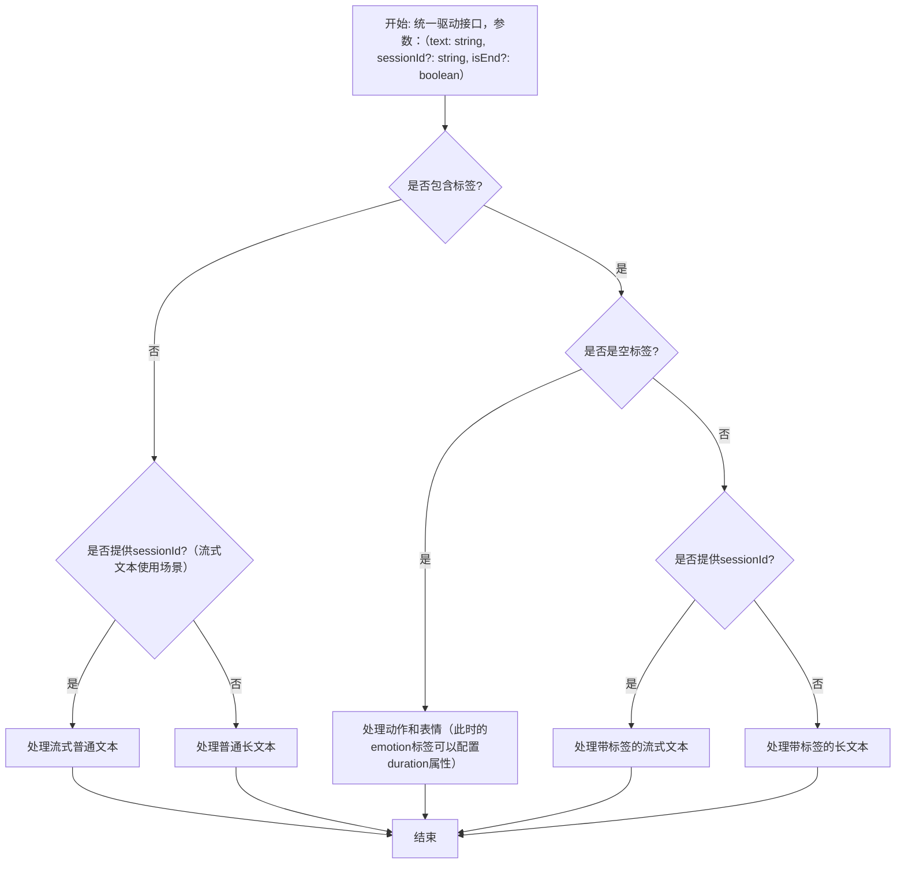

```mermaid
flowchart TD
A[开始: 统一驱动接口，参数：（text: string, sessionId?: string, isEnd?: boolean）] -->D{是否包含标签?}

    D -->|否| E{是否提供sessionId?（流式文本使用场景）}
    E -->|是| F[处理流式普通文本] --> Z[结束]
    E -->|否| G[处理普通长文本] --> Z

    D -->|是| H{是否是空标签?}
    H -->|是| I[处理动作和表情（此时的emotion标签可以配置duration属性）] --> Z
    H -->|否| J{是否提供sessionId?}
    J -->|是| K[处理带标签的流式文本] --> Z
    J -->|否| L[处理带标签的长文本] --> Z
```
